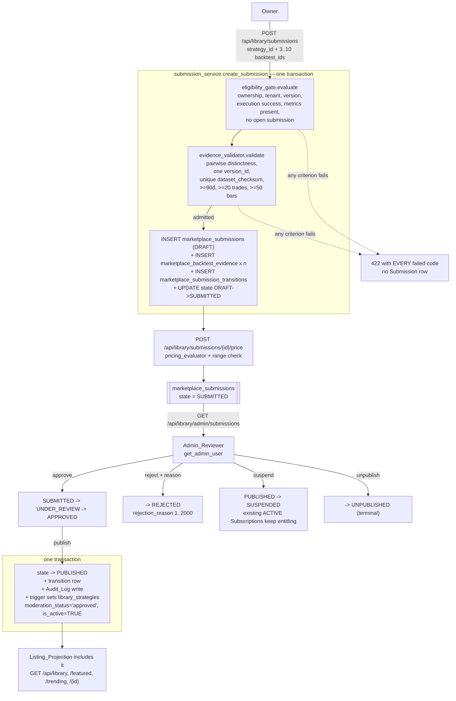
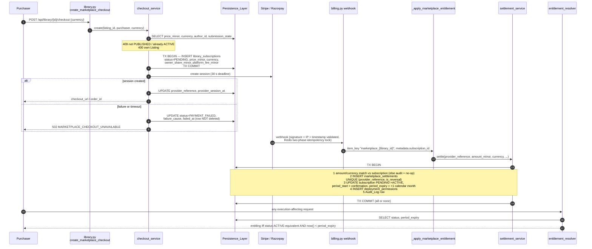
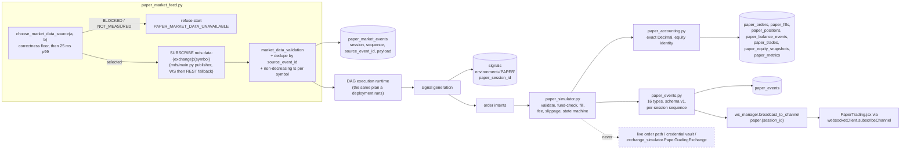

  # Design Document

## Overview

This design corrects the existing Marketplace path in `backend_app/routers/library.py`,
completes the Subscription path through the existing Billing_Integration in
`backend_app/routers/billing.py`, and gives Paper_Session execution durable storage,
a real market feed and a WebSocket channel family. It adds nothing that duplicates a
working component.

The shape of the work is fixed by what the repository already contains:

- **One canonical schema.** `library_strategies` stays the Listing table and
  `library_subscriptions` stays the Subscription table. `marketplace_listings` and
  `strategy_subscriptions` (`backend_app/migrations/001_strategy_architecture.sql`)
  stay in the migration set, dormant and unreferenced.
- **Four defects fixed at the cause, not the symptom.** `create_marketplace_checkout`,
  `renew_subscription`, `creator_analytics` and `get_library_detail` are each rewritten
  around the specific line that is wrong. Section "Root-cause fixes" names the line.
- **Three further defects found while reading the router**, recorded here because the
  non-functional constraints oblige root-cause repair of anything discovered: three
  `GET /api/library/*` endpoints are unreachable because FastAPI matches an earlier
  parameterised route first, and `strategy_backtests` has two divergent `CREATE TABLE`
  definitions in the migration set, neither of which records an executed bar count.
- **Extension, never replacement.** `OwnedChannelFamily` gains one member.
  `_owner_relations()` gains one entry. `signals` gains two additive columns.
  `paper_trading_service.py` keeps its public method names and gains a repository behind
  them. `choose_market_data_source` is called, not reimplemented.

Everything financial is integer Minor_Units. Everything in Paper_Accounting_Engine is
`decimal.Decimal`. No production path in this design performs binary floating-point
arithmetic on money, and no production path reads `random`.

### Terms

This document uses the Glossary of `requirements.md` verbatim — Marketplace, Listing,
Listing_Projection, Protected_Logic, Eligibility_Gate, Backtest_Evidence,
Backtest_Condition, Evidence_Validator, Submission, Submission_State, Admin_Reviewer,
Pricing_Evaluator, Price_Range, Subscription, Subscription_State, Subscription_Period,
Billing_Integration, Minor_Units, Settlement_Record, Settlement_Ledger,
Entitlement_Resolver, Execution_Environment, Paper_Account, Paper_Session,
Paper_Simulator, Paper_Market_Data, Paper_Order_State, Paper_Accounting_Engine,
Paper_Channel, Signal_Trace_Recorder, Persistence_Layer, Marketplace_API,
Paper_Trading_API, Marketplace_UI, Strategies_Page, Paper_Trading_UI, Audit_Log,
Implementation, Operator, Verification_Suite, Order_Lifecycle_State — and introduces no
parallel vocabulary. `Order_Lifecycle_State` is the nine-value enum defined by
`.kiro/specs/trading-lifecycle-integration/design.md` (`GENERATED, PENDING, SUBMITTED,
PARTIALLY_EXECUTED, EXECUTED, CLOSED, FAILED, CANCELLED, REJECTED`) in
`backend_app/backend/order_lifecycle_state.py`. It is consumed, not redefined.

---

## Architecture

### Reuse map

| Component | File | Disposition | Why |
|---|---|---|---|
| Marketplace_API | `backend_app/routers/library.py` | **EXTENDED, four handlers rewritten** | The catalogue, rating, favourite, compare and recommendation paths work. The four EXISTS+BROKEN handlers are rewritten in place. |
| Billing_Integration | `backend_app/routers/billing.py` | **EXTENDED at `_apply_marketplace_entitlement` only** | Signature validation (`_validate_webhook_signature`), IP allow-listing (`_validate_webhook_ip`, `STRIPE_WEBHOOK_IPS`), timestamp validation (`_validate_webhook_timestamp`) and the two-phase Redis idempotency lock in `stripe_webhook`/`razorpay_webhook` are untouched. Requirement 9.1 forbids a second webhook handler, so the settlement transaction is added inside `_apply_marketplace_entitlement`, which both providers already funnel into via `_apply_billing_entitlement`'s `item_key.startswith("marketplace_")` branch. |
| Entitlements | `backend_app/core/entitlement_engine.py`, `core/subscription_dependencies.py` | **REUSED AS-IS** | `FeatureFlag.MARKETPLACE_ACCESS`, `STRATEGY_SHARING`, `STRATEGY_SUBSCRIPTION`; `require_marketplace_access`, `require_marketplace_publish`, `check_marketplace_publish_quota`. |
| Admin authorisation | `backend_app/core/dependencies.py::get_admin_user` | **REUSED AS-IS** | Already reads `app_metadata.role` only. `tests/test_marketplace_pipeline.py::TestGetAdminUserP01Regression` guards it. |
| Audit_Log | `backend_app/core/audit_trail.py` | **EXTENDED** | `StrategyAuditLogger` gains marketplace and paper actions on its existing `StrategyAuditAction` enum and `StrategyAuditRecord` dataclass. No second audit facility. |
| Tenant machinery | `core/tenant.py`, `core/tenant_middleware.py`, `backend/tenant_rls_validator.py` | **REUSED AS-IS** | Every new table follows the RLS pattern of `library_subscriptions` in `migrations/006_reconcile_production_database.sql`. |
| Paper_Trading_API | `backend_app/routers/paper_trading.py` | **EXTENDED additively** | `/account`, `/account/reset`, `/positions`, `/orders`, `/trades`, `/summary` keep their paths and response shapes; session endpoints are added. |
| Paper trading service | `backend_app/backend/paper_trading_service.py` | **REPOINTED, facade preserved** | `get_or_create_account`, `reset_account`, `get_positions`, `get_orders`, `get_trades`, `get_performance_summary`, `place_order`, `cancel_order`, `verify_accounting_invariants` keep their names and return shapes; their bodies delegate to `paper/paper_repository.py`. `self._accounts`/`_positions`/`_orders`/`_trades` are removed. |
| Risk utilisation | `backend_app/routers/risk.py` lines 300–311, 355–360 | **REPOINTED, semantics unchanged** | Both sites call `get_paper_trading_service().get_performance_summary(uid)` / `.get_or_create_account(uid)` / `.get_positions(uid)`. The facade keeps those signatures, so `risk.py` needs no change beyond becoming `await`-aware where the repository is async. |
| Backtest_Engine | `backend/backtesting_engine.py`, `backend/backtest_runtime.py`, `backend/backtest_service.py` | **REUSED; one additive write added** | The 50-bar guard (`backtesting_engine.py` line 189) and the 20-trade significance warning (line 380) are the thresholds Requirement 3.7/3.8 reference. `backtest_runtime.run_backtest` already knows `len(ohlcv_data)`; it starts passing it as `executed_bar_count` into `backtest_service.update_backtest_results`. Nothing else changes. |
| Market data | `backend/market_data_latency.py::choose_market_data_source`, `backend/market_data_contract.py`, `backend/market_data_validation.py`, `mds/main.py`, `backend/data_seeking_engine.py` | **REUSED AS-IS** | The Paper_Session subscribes to the existing `mds:data:{exchange}:{symbol}` Redis channel that `mds/main.py::broadcast_ohlcv` publishes to, including its REST fallback. No new poller. |
| WebSocket layer | `backend/ws_channels.py`, `api_ws/ws_manager.py`, `core/websocket_auth.py` | **EXTENDED by one family** | `PAPER_FAMILY` added to `OWNED_CHANNEL_FAMILIES`; one `_OwnerRelation` added to `_owner_relations()`. Exactly the pattern `SIGNAL_FAMILY` established. |
| Signal_Trace_Recorder | `backend/signal_trace_engine.py`, `routers/signal_trace.py`, `backend/signal_service.py` | **EXTENDED by two additive columns** | `signals.environment` and `signals.paper_session_id`. `SIGNAL_SUMMARY_COLUMNS` / `SIGNAL_TRACE_COLUMNS` in `signal_service.py` are the named extension points. |
| DAG runtime | `backend/strategy_dag/`, `backend/backtest_runtime.py`'s engine wiring | **REUSED AS-IS** | The Paper_Session executes the compiled plan through the same runtime a deployment does. Requirement 17.10 forbids a second evaluation path. |
| Credential vault | `core/exchange_*`, `backend/connection_engine.py` | **NOT READ BY ANY PAPER PATH** | Requirement 13.2. Asserted on collaborators, not on log text. |
| Synthetic simulator | `backend/exchange_simulator.py::PaperTradingExchange` | **EXCLUDED BY GUARD** | `random.gauss` price noise (lines 319, 753) and `random.random() > self.fill_probability` fills (line 369). Reachable from no Paper_Trading_API or Paper_Session path. |
| Frontend API layer | `algo22-terminal/src/api/index.js` + `src/api/modules/*` | **EXTENDED by one module, one module widened** | New `modules/library.js` registered as `api.library`; `modules/paper.js` gains session methods. No second HTTP client. |
| WebSocket client | `algo22-terminal/src/websocketClient.js` | **REUSED AS-IS** | `subscribeChannel(channel, handler)` already ref-counts, resubscribes on reconnect, and delivers `subscription_refused` to the channel's own handlers. |

Layering rule, matching the convention the two sibling specs already follow: the pure
modules (`money.py`, `subscription_period.py`, `submission_state.py`,
`subscription_state.py`, `evidence_validator.py`, `pricing_evaluator.py`,
`listing_projection.py`, `paper_order_state.py`, `paper_accounting.py`,
`execution_environment.py`) import no FastAPI and perform no I/O; the service modules own
transactions; the routers own HTTP and own no arithmetic.

### New module layout

```
backend_app/backend/execution_environment.py        # BACKTEST | PAPER | LIVE + the live-path guard
backend_app/backend/marketplace/
    __init__.py
    money.py                  # Minor_Units integer arithmetic, currency exponents
    submission_state.py       # 8 states, transition table, moderation_status mapping
    subscription_state.py     # 7 states, transition table
    subscription_period.py    # calendar-month arithmetic, UTC, day clamping
    evidence_validator.py     # distinctness + per-condition criteria (pure)
    pricing_evaluator.py      # deterministic statistical Price_Range (pure)
    listing_projection.py     # the single public serialiser + Protected_Logic token set
    eligibility_gate.py       # reads, ordering, all-failures-in-one-response
    entitlement_resolver.py   # "what may this caller execute right now"
    submission_service.py     # transactions for submit / transition / evidence copy
    settlement_service.py     # Settlement_Record writer, idempotent, reversals
    checkout_service.py       # PENDING row -> provider session -> reference recorded
    expiry_sweep.py           # <=60s sweep worker
backend_app/backend/paper/
    __init__.py
    paper_order_state.py      # 6 states, transition table (pure)
    paper_accounting.py       # exact-decimal ledger + invariants (pure)
    paper_simulator.py        # order intents -> accept/reject/fill, fees, slippage
    paper_repository.py       # all paper_* table reads and writes
    paper_market_feed.py      # choose_market_data_source + mds subscription + degrade
    paper_events.py           # 16 event types, schema version, per-session sequence
    paper_session_service.py  # the pipeline of Requirement 17.9
    paper_replay.py           # deterministic replay + the P-31 reference ledger
backend_app/workers/marketplace_expiry_worker.py    # hosts expiry_sweep
```

### Marketplace submission, review and publication



Every arrow out of `A` is executed only if `submission_state.can_transition(current, target)`
holds against the state read inside the transaction, and the database `CHECK` plus the
`trg_submission_transition_guard` trigger reject it independently of the application.

### Subscription purchase, webhook, settlement, entitlement



The expiry sweep is deliberately *not* on this path. `entitlement_resolver` compares
`now()` with `period_expiry` on every call, so a Subscription stops entitling at its
expiry instant whether or not the sweep has run (Requirement 11.7, property P-11).

### Paper_Session data path



### Where BACKTEST, PAPER and LIVE separate

```mermaid
flowchart TB
    PLAN["One compiled plan<br/>strategy_versions.execution_graph<br/>(shared — never duplicated)"]
    PLAN --> B & P & L

    subgraph B["BACKTEST"]
      direction TB
      BH["historical OHLCV<br/>dataset_checksum recorded"]
      --> BE["backtest_runtime + backtesting_engine<br/>VectorBT, 50-bar guard"]
      --> BR[("strategy_backtests<br/>signals.environment='BACKTEST'")]
    end

    subgraph P["PAPER"]
      direction TB
      PF["Paper_Market_Data<br/>choose_market_data_source<br/>paper_market_events recorded"]
      --> PS["paper/paper_simulator.py<br/>+ paper_accounting.py"]
      --> PR[("paper_accounts, paper_orders,<br/>paper_fills, paper_positions<br/>signals.environment='PAPER'<br/>paper_session_id set")]
    end

    subgraph L["LIVE"]
      direction TB
      LF["live feed"] --> LG{{"assert_live_environment(env)<br/>refuses PAPER / BACKTEST / unknown"}}
      LG --> LV["credential vault → ccxt<br/>core/execution_engine.py"]
      --> LR[("exchange orders, execution_records<br/>signals.environment='LIVE'")]
    end

    PR -. "no balance, order, fill, session,<br/>credential or P&L is shared" .- LR
    BR -. "no balance, order, fill, session,<br/>credential or P&L is shared" .- PR
    PS -.->|"blocked by the guard"| LG
    style LG fill:#3b1f1f,stroke:#c33
```



| Concern | `BACKTEST` | `PAPER` | `LIVE` |
|---|---|---|---|
| Trigger | `POST /api/strategies/{id}/backtests/execute` | `POST /api/paper/sessions` | versioned deploy endpoint |
| Runtime | `backtest_runtime.BacktestRuntime` + `backtesting_engine` (VectorBT) | DAG runtime + `paper/paper_simulator.py` | DAG runtime + `core/execution_engine.py` |
| Data | historical OHLCV, `dataset_checksum` recorded | live `Paper_Market_Data`, `paper_market_events` recorded | live feed |
| Money | `strategy_backtests.initial_capital` | `paper_accounts` (simulated) | exchange balances via vault |
| Credentials | none | **none — vault never read** | vault |
| Orders | none | `paper_orders` | exchange orders |
| Signals | `signals.environment='BACKTEST'` | `signals.environment='PAPER'` | `signals.environment='LIVE'` |
| WS channel | none | `paper.{session_id}` | `deployment.{id}`, `execution.{id}`, `signal.{id}` |
| Guard | — | `assert_paper_simulator(...)` refuses `PaperTradingExchange` and the `DEV_MODE` mock interface | `assert_live_environment(env)` refuses `PAPER`/`BACKTEST`/unknown before any exchange call |

`execution_environment.py` is the single place the three values are spelled:

```pascal
STRUCTURE ExecutionEnvironment IS ENUM BACKTEST, PAPER, LIVE END STRUCTURE

FUNCTION assert_live_environment(env) -> None
BEGIN
  IF env IS NULL OR env NOT IN ExecutionEnvironment THEN
    RAISE UnresolvedExecutionEnvironment   // never defaults to LIVE (Req 13.10)
  END IF
  IF env IS NOT LIVE THEN
    audit(EXECUTION_ENVIRONMENT_MISMATCH, env)
    RAISE ExecutionEnvironmentMismatch     // before any exchange call (Req 13.9)
  END IF
END
```

`assert_live_environment` is called at exactly one place — the top of
`core/execution_engine.execute_with_idempotency`, before `_validate_keys` and before any
`ccxt` call — so no live order path can bypass it.

---

## Canonical data model decision

### The decision

`library_strategies` is the only Listing table. `library_subscriptions` is the only
Subscription table. `marketplace_listings` and `strategy_subscriptions` remain in
`backend_app/migrations/001_strategy_architecture.sql` exactly as written — table, columns,
indexes, RLS policies, comments — and are read and written by nothing.

The five tables this design adds to the Marketplace side (`marketplace_submissions`,
`marketplace_submission_transitions`, `marketplace_backtest_evidence`,
`marketplace_price_evaluations`, `marketplace_settlements`) store review-workflow state,
evidence, pricing evaluations and payment splits. None of them stores Listing state or
Subscription state, which is what Requirement 1.1 forbids a third table from doing:

- **Listing state** stays on `library_strategies` (`moderation_status`, `is_active`,
  `is_featured`, `published_at`). `marketplace_submissions.submission_state` is the
  authoritative *review lifecycle* value, and `library_strategies.moderation_status` is
  **derived** from it by the single shared mapping in
  `marketplace/submission_state.py::MODERATION_STATUS_FOR_STATE`, applied by the database
  trigger `trg_submission_projects_moderation_status` rather than by any call site. The
  two cannot drift, because no handler writes `moderation_status` directly.
- **Subscription state** stays on `library_subscriptions.status`.
  `marketplace_settlements` records payments, not subscription state, and carries a
  foreign key to the subscription rather than a copy of its status.

### The mapping (one definition, Requirement 4.12)

```pascal
CONSTANT MODERATION_STATUS_FOR_STATE: Map<SubmissionState, Text> = {
  DRAFT:        'pending',
  SUBMITTED:    'pending',
  UNDER_REVIEW: 'pending',
  APPROVED:     'pending',    // approved but not yet published stays invisible (Req 4.7)
  PUBLISHED:    'approved',
  REJECTED:     'rejected',
  SUSPENDED:    'rejected',   // hidden from the catalogue, existing Subscriptions unaffected
  UNPUBLISHED:  'rejected',
}

CONSTANT IS_ACTIVE_FOR_STATE: Map<SubmissionState, Boolean> = {
  PUBLISHED: TRUE, others: FALSE
}
```

`'featured'` is never produced by this mapping. Featuring stays exactly what it is today —
`library_strategies.is_featured`, set by `admin_moderate_strategy`, read by
`get_featured_strategies` — and is orthogonal to the Submission lifecycle. The
`get_library_detail`, `browse_library`, `clone_strategy` and `create_marketplace_checkout`
predicates `.in_("moderation_status", ["approved", "featured"])` are therefore unchanged in
meaning and keep working; `featured` remains reachable only for a row whose Submission is
`PUBLISHED`, enforced by `chk_ls_featured_requires_published`.

### How `tests/test_schema_as_code_completeness.py` keeps passing

That test compares two hard-coded sets, `app_tables` and `migration_tables`, and fails on
`app_tables - migration_tables - supabase_system_tables`. It does not parse SQL for table
existence and it does not fail on entries present in `migration_tables` but absent from
`app_tables`. Consequences:

1. `marketplace_listings` and `strategy_subscriptions` are in `migration_tables` and not in
   `app_tables`. Leaving them unreferenced keeps the difference empty. **No change needed.**
2. The eleven new tables must be added to **both** sets in the same commit as their
   migrations, or `app_tables - migration_tables` becomes non-empty and the test fails.
   The task list carries that edit explicitly, and it is the only change this design makes
   to that file.
3. `test_migration_files_exist` and `test_migration_syntax_validity` iterate a hard-coded
   list of three `migrations/00{3,4,5}_*.sql` files. The new migrations live in
   `backend_app/migrations/`, which those two tests do not scan, so they are unaffected.
   The new equivalent assertions live in `tests/test_marketplace_paper_schema_contract.py`
   (see Testing Strategy) rather than by widening a test whose scope is another directory.

### Additional guards Requirement 1 asks for

- **Requirement 1.8** — `tests/test_no_dormant_schema_references.py` walks the AST of every
  module reachable from `backend_app/routers/library.py`,
  `backend_app/backend/marketplace/` and `backend_app/backend/paper/`, collects every string
  literal passed to `.table(...)`, `.from_(...)` or `.rpc(...)`, and fails if it contains
  `marketplace_listings` or `strategy_subscriptions`. `*.sql` and
  `tests/test_schema_as_code_completeness.py` are excluded by path.
- **Requirement 1.9 and 24.9** — `tests/test_marketplace_paper_schema_contract.py` collects
  every column name any new or modified handler reads or writes, from a declared per-handler
  manifest in `marketplace/__init__.py::COLUMN_CONTRACT` and `paper/__init__.py::COLUMN_CONTRACT`,
  and asserts each is created by the migration set. The manifest is a data structure, so a
  handler that starts reading a new column and forgets the manifest is caught by a second
  assertion that every `.select("…")` literal in those modules is a subset of its manifest
  entry. This is the mechanism that prevents a repeat of the PostgreSQL `42703` condition
  recorded in the header of `migrations/007_add_marketplace_pricing_columns.sql`.
- **Requirement 1.5 and 1.7** — no Marketplace handler may return a success body containing
  a numeric field it did not read. `marketplace/errors.py` provides
  `MarketplaceError(code, http_status, message)` and the handlers raise it; the bare
  `except: return zeros` shape of `creator_analytics` is removed, and
  `tests/test_marketplace_error_surface.py` asserts that for each of connection failure,
  query timeout, undefined column and permission denial, every Marketplace read endpoint
  answers 500 or 503 with a stable code and no numeric payload.

---

## Root-cause fixes

Each fix names the file, the construct that is wrong, and what replaces it. Each is covered
by a regression test that fails against the current code (Requirement 9.11 generalised by
the non-functional constraints).

### 1. `create_marketplace_checkout` — `library.py` lines 1806–1968

Four separate defects in one handler.

| Cause | Line, as written | Effect | Fix |
|---|---|---|---|
| `.single()` result indexed as a list | `resp = (… .single().execute())` then `strat = resp.data[0]` | `supabase-py`'s `.single()` sets `resp.data` to a **dict**. `dict[0]` raises `KeyError: 0`. The statement sits **outside** the `try`, so it is not the handler's 500 branch — it is an unhandled exception that FastAPI turns into a bare 500. The endpoint has therefore never completed for any Listing. | `strat = resp.data` (dict), with the `if not resp.data` guard kept ahead of it. `.single()` is retained because the `id` predicate is unique. |
| Float→cents | `amount_cents = int(float(strat.get("price", 0)) * 100)` and `amount_paise = int(...)` | `int(float("19.99") * 100) == 1998`. The purchaser is charged one cent less than the Listing price, and nothing records the discrepancy. | The Listing carries `price_minor BIGINT` (new column, Requirement 8.12). `money.py::amount_for_listing` returns that integer unchanged. `float` never appears. The legacy `price NUMERIC(10,2)` column is retained and back-filled from `price_minor` by trigger for the existing catalogue readers. |
| `expires_at` inserted `NULL` | `"expires_at": None` in the `library_subscriptions` insert | Combined with `check_deployment_permission`'s branch `else: # No expiry date means perpetual subscription`, a `PENDING` row that ever reaches `active` grants **permanent** access. This is the mechanism by which the missing expiry becomes a security defect rather than a cosmetic one. | The `PENDING` insert omits `expires_at` entirely; the column stays `NULL` only while `PENDING`. `chk_ls_active_has_period` makes an `ACTIVE` row without a period start and a strictly greater expiry unrepresentable, and `check_deployment_permission` loses its perpetual branch — a `NULL` expiry on an `ACTIVE` row is now impossible, and on a non-`ACTIVE` row it is not entitling. |
| No fee or share recorded | insert lists `price_paid`, `currency`, `status`, `started_at`, `expires_at` only | The 90/10 split exists nowhere at purchase time. | The insert records `price_minor`, `currency`, `owner_share_minor`, `platform_fee_minor`, `owner_id`, computed by `money.split_ninety_ten(price_minor)` inside the same transaction, before the provider is contacted (Requirement 9.3). |

Two further corrections in the same handler:

- The `except Exception` cleanup path currently issues
  `svc.table("library_subscriptions").delete().eq("id", sub_id)` inside a bare `except: pass`.
  Requirement 9.4 forbids deleting the row. It becomes an `UPDATE` to `PAYMENT_FAILED` with
  `failure_cause` and `failed_at`, and the `except` clause is narrowed and logged.
- The provider call gains a 30-second deadline (`asyncio.wait_for`, Requirement 9.13);
  Stripe/Razorpay client construction moves into `checkout_service.py` so the handler stops
  importing `stripe`/`razorpay` inline and stops reading `STRIPE_SECRET_KEY` with a
  `"sk_test_dummy"` default on a production path.

### 2. `renew_subscription` — `library.py` lines 2258–2337

Cause, exactly as written:

```python
update_resp = svc.table("library_subscriptions").update({
    "status": "active",
    "cancelled_at": None,
    "expires_at": None,
}).eq("id", sub_uid).in_("status", ["cancelled", "expired"]).execute()
```

No payment is taken, no provider is contacted, no Settlement_Record is written, and
`expires_at` is set to `NULL` — which, via `check_deployment_permission`'s perpetual branch,
converts a cancelled subscription into unlimited free access. `grant_deployment_permission`
and a `subscriber_count` increment follow.

Fix (Requirement 11.16): the handler is **removed as a state-changing endpoint**. `POST
/api/library/subscriptions/{sub_id}/renew` becomes a checkout-creating endpoint that returns
a provider session for the renewal amount and makes **no** state change of its own. The
transition into `ACTIVE` and the new expiry happen only in `settlement_service.settle`,
which runs from the webhook and requires a matched Settlement_Record. The database enforces
this independently: `trg_subscription_transition_guard` rejects any transition into `ACTIVE`
for which no `marketplace_settlements` row exists whose `subscription_id` matches and whose
`is_reversal` is false and whose `settled_at` is at or after the row's current
`period_expiry` — so even a direct SQL update cannot grant a free month.

`grant_deployment_permission` keeps its signature but is called only from
`settlement_service`, inside the settlement transaction, and its `"expires_at": None` becomes
the subscription's `period_expiry`.

### 3. `creator_analytics` — `library.py` lines 2338–2380

Three compounding causes:

```python
.select("id, name, clone_count, monthly_price, rating_average")   # 2 columns do not exist
mrr = sum(s.get("clone_count", 0) * float(s.get("monthly_price") or 0.0) for s in strats)
creator_mrr = round(mrr * 0.90, 2)
...
except Exception:
    return { "total_earnings_usd": 0.0, ... }   # bare except, all-zero success body
```

1. `monthly_price` and `rating_average` do not exist on `library_strategies`; the real
   columns are `price` and `avg_rating` (`archived_migrations/root_migrations/001_create_library_strategies.sql`,
   `migrations/007_add_marketplace_pricing_columns.sql`). The query fails with PostgreSQL
   `42703` — the identical condition migration 007's header records for `/trending` and
   `/featured`.
2. The bare `except` swallows that failure and returns HTTP 200 with every figure zero, so
   the creator is shown a fabricated number rather than an error (violating Requirements
   1.5, 1.7, 28.2).
3. Even if the columns existed, the arithmetic is wrong twice over: `clone_count` counts
   clones, not payments, and `round(mrr * 0.90, 2)` is binary floating point.
4. **Additionally, the endpoint is unreachable** — see "Route shadowing" below.

Fix: the handler sums persisted `marketplace_settlements` (Requirement 10.6), per currency
(Requirement 10.7), in integer Minor_Units, with reversals subtracted:

```pascal
FUNCTION creator_earnings(owner_id) -> Map<Currency, EarningsTotals>
BEGIN
  rows <- SELECT currency, is_reversal, owner_share_minor, platform_fee_minor, amount_minor
           FROM marketplace_settlements WHERE owner_id = :owner_id          // one round trip
  FOR EACH currency IN rows
    sign  <- -1 IF is_reversal ELSE +1
    owner_total[currency]    += sign * owner_share_minor
    platform_total[currency] += sign * platform_fee_minor
    gross_total[currency]    += sign * amount_minor
  END FOR
  RETURN totals                        // integers, never combined across currencies
END
```

`clone_count` and `subscriber_count` are never multiplied by a price. `avg_rating` is read
from `library_strategies.avg_rating` and reported as absent when `rating_count = 0`
(Requirement 6.9). `payout_schedule: "Monthly auto-transfer (Stripe Connect)"` is deleted —
no payout mechanism exists, and Requirement 28 forbids presenting one.

### 4. `get_library_detail` — `library.py` lines 929–1010

Cause:

```python
.select("*") … .single().execute()
detail = dict(resp.data)
detail["author_alias"] = _get_author_alias(detail.get("author_id", ""))
detail.pop("author_id", None)
return detail
```

Every column of the row reaches the client except `author_id`. That includes
`source_strategy_id`, `moderation_notes`, `moderated_by`, `moderated_at`,
`evaluation_score`, `deployment_requirements`, `version_history`, `equity_curve_snapshot`,
`risk_stop_loss_pct`, `risk_take_profit_pct`, `risk_max_position_size`,
`risk_max_drawdown_pct` and `has_ml_model` — the risk fields and `version_history` are
Protected_Logic under the Glossary, and `source_strategy_id` is the handle by which a
caller could probe the owner's `strategies` row.

Fix: the handler selects the explicit allow-list column list
(`listing_projection.LISTING_SELECT`) rather than `*`, and returns
`listing_projection.project_listing(row, viewer=…)`. `select("*")` on
`library_strategies` is removed from every non-owner path and an AST assertion in
`tests/test_listing_projection.py` keeps it out.

### 5. Route shadowing — three `GET /api/library/*` endpoints are unreachable (newly found)

FastAPI matches routes in registration order. In `library.py` the registration order is:

| Line | Route |
|---|---|
| 624 | `GET /creator/{creator_id}` |
| 929 | `GET /{library_id}` |
| 2338 | `GET /creator/analytics` |
| 2459 | `GET /recommendations` |
| 2669 | `GET /favorites` |

Therefore:

- `GET /api/library/creator/analytics` is matched by `/creator/{creator_id}` and dies in
  `_safe_uuid("analytics", "creator_id")` → **HTTP 422 `Invalid UUID format for creator_id`**.
  This is why the fabricated zeros of defect 3 were never noticed in production.
- `GET /api/library/recommendations` is matched by `/{library_id}` → **HTTP 422**.
- `GET /api/library/favorites` is matched by `/{library_id}` → **HTTP 422**.

`GET /admin/pending` (line 1765) and `GET /subscriber/analytics` (line 2381) are two-segment
paths that no earlier route claims, and are reachable.

Fix: all literal-segment routes are declared before parameterised ones. Concretely, the
admin, creator, subscriber, recommendation, favourite and submission routes move into a
`APIRouter()` declared above `@router.get("/{library_id}")`, and
`tests/test_library_route_resolution.py` asserts, for every literal path the router exposes,
that `app.router.routes` resolves it to the intended endpoint function — so a future
reordering cannot silently shadow another one.

### 6. `strategy_backtests` has two divergent definitions and records no bar count (newly found)

| Definition | File | PK | `version_id` | `final_capital` | `dataset_checksum`/`dag_hash`/`engine_version` | `error_message` | bar count |
|---|---|---|---|---|---|---|---|
| A | `backend_app/migrations/001_strategy_architecture.sql` line 118 | `UUID` | `NOT NULL REFERENCES strategy_versions(id)` | present | **absent** | present | absent |
| B | `migrations/006_reconcile_production_database.sql` line 445 | `TEXT` | **absent** | **absent** | present | `error` (different name) | absent |

Both are `CREATE TABLE IF NOT EXISTS`, so whichever migration ran first decides the shape,
and `backtest_service.create_backtest` writes `engine_version`, `schema_version`, `dag_hash`
and `dataset_checksum` — columns that do not exist under definition A. Requirements 3.3,
3.4, 3.6 and 3.8 need `version_id`, all four reproducibility columns, `final_capital`,
`completed_at`, `error_message` **and** an executed bar count, which nothing in the
repository persists: `backtesting_engine.py` line 189 checks `len(price_data) < 50` and line
332 logs the count, and `backtest_runtime.run_backtest` line 302 knows
`len(ohlcv_data)`, but neither writes it.

Fix — `backend_app/migrations/006_backtest_evidence_columns.sql`, additive and idempotent,
reconciles both shapes:

```sql
ALTER TABLE public.strategy_backtests
    ADD COLUMN IF NOT EXISTS version_id          UUID,
    ADD COLUMN IF NOT EXISTS final_capital       NUMERIC(20, 8),
    ADD COLUMN IF NOT EXISTS executed_bar_count  INTEGER,
    ADD COLUMN IF NOT EXISTS engine_version      TEXT,
    ADD COLUMN IF NOT EXISTS schema_version      TEXT,
    ADD COLUMN IF NOT EXISTS dag_hash            TEXT,
    ADD COLUMN IF NOT EXISTS dataset_checksum    TEXT,
    ADD COLUMN IF NOT EXISTS completed_at        TIMESTAMPTZ,
    ADD COLUMN IF NOT EXISTS error_message       TEXT;
```

with a column-shape assertion block copied from
`backend_app/migrations/005b_signal_lifecycle_and_idempotency.sql` section 1.2 (because
`ADD COLUMN IF NOT EXISTS` is silent about a pre-existing column of a different type), a
`pg_constraint`-guarded `chk_sb_executed_bar_count CHECK (executed_bar_count IS NULL OR
executed_bar_count >= 0)`, and indexes on `(user_id, strategy_id, status)` and
`(version_id)`. `version_id` is added **nullable** here — definition A already has it
`NOT NULL`, and adding a `NOT NULL` column to definition B's existing rows would require a
fabricated value. `evidence_validator` therefore treats a `NULL` `version_id` as a failed
criterion rather than assuming one, which is the correct reading of Requirement 3.4's
"non-null values" obligation.

`backtest_runtime.run_backtest` passes `executed_bar_count=len(ohlcv_data)` into
`backtest_service.update_backtest_results`, which adds it to `update_data`. That is the whole
code change; the 50-bar guard and 20-trade warning are untouched.

---

## Components and Interfaces

### `marketplace/submission_state.py` — the 8-state machine

Pure. No I/O, no FastAPI. Same shape as `backend/strategy_lifecycle.VERSION_TRANSITIONS`,
which is the pattern this codebase already uses for a validated transition table.

```pascal
STRUCTURE SubmissionState IS ENUM
  DRAFT, SUBMITTED, UNDER_REVIEW, APPROVED, PUBLISHED, REJECTED, SUSPENDED, UNPUBLISHED
END STRUCTURE

CONSTANT SUBMISSION_TRANSITIONS: Map<SubmissionState, Tuple<SubmissionState>> = {
  DRAFT:        (SUBMITTED,),
  SUBMITTED:    (UNDER_REVIEW, REJECTED),
  UNDER_REVIEW: (APPROVED, REJECTED),
  APPROVED:     (PUBLISHED,),
  PUBLISHED:    (SUSPENDED, UNPUBLISHED),
  SUSPENDED:    (PUBLISHED, UNPUBLISHED),
  REJECTED:     (DRAFT,),
  UNPUBLISHED:  (),                       // terminal (Req 4.2)
}

CONSTANT PUBLIC_STATES = {PUBLISHED}                                    // Req 4.6, 4.7
CONSTANT OPEN_STATES   = {SUBMITTED, UNDER_REVIEW, APPROVED, PUBLISHED} // Req 2.7, 4.5

FUNCTION can_transition(current, target) -> Boolean
BEGIN RETURN target IN SUBMISSION_TRANSITIONS[current] END
```

No state lists itself as a target, so a same-value transition is rejected by the same rule
that rejects any other illegal one (Requirement 4.2's explicit clause). `UNPUBLISHED` has an
empty target tuple.

### Where the state lives and how the database is the arbiter

`marketplace_submissions.submission_state TEXT NOT NULL`. Three layers enforce Requirement 4:

1. **`chk_submission_state`** — a `CHECK` enumerating the 8 values (Requirements 4.5, 24.2).
   Written behind a `pg_constraint` existence guard, following
   `005b_signal_lifecycle_and_idempotency.sql` section 1.3, because PostgreSQL has no
   `ADD CONSTRAINT IF NOT EXISTS`. The column is `NOT NULL DEFAULT 'DRAFT'`, so unlike
   005b's nullable `order_lifecycle_state` there is no NULL-passes hole.
2. **`uq_submission_open_per_strategy`** — the partial unique index Requirement 4.5 and 2.8
   name, and the final arbiter for concurrent submissions:

   ```sql
   CREATE UNIQUE INDEX IF NOT EXISTS uq_submission_open_per_strategy
       ON public.marketplace_submissions (source_strategy_id)
       WHERE submission_state IN ('SUBMITTED','UNDER_REVIEW','APPROVED','PUBLISHED');
   ```

   Two concurrent `POST /api/library/submissions` for one strategy therefore end with one
   row and one `23505`; `submission_service` translates `23505` on that index name into
   `MARKETPLACE_SUBMISSION_ALREADY_OPEN` (409), creating no row and changing no state
   (Requirement 2.8).
3. **`trg_submission_transition_guard`** — a `BEFORE UPDATE` trigger. This is what makes
   Requirement 4.4's "THE Persistence_Layer SHALL reject the write" true rather than
   aspirational: an illegal transition is refused even by a direct SQL `UPDATE`.

   ```sql
   CREATE OR REPLACE FUNCTION public.marketplace_submission_guard()
   RETURNS TRIGGER LANGUAGE plpgsql AS $$
   BEGIN
       IF NEW.submission_state = OLD.submission_state THEN
           RETURN NEW;                      -- a no-op write is not a transition
       END IF;
       IF NOT EXISTS (
           SELECT 1 FROM public.marketplace_submission_allowed_transitions t
           WHERE t.from_state = OLD.submission_state
             AND t.to_state   = NEW.submission_state
       ) THEN
           RAISE EXCEPTION
             'disallowed Submission_State transition % -> %',
             OLD.submission_state, NEW.submission_state
             USING ERRCODE = '23514';
       END IF;
       IF NEW.submission_state = 'REJECTED'
          AND (NEW.rejection_reason IS NULL
               OR btrim(NEW.rejection_reason) = ''
               OR length(btrim(NEW.rejection_reason)) > 2000) THEN
           RAISE EXCEPTION 'REJECTED requires a rejection reason of 1..2000 characters'
             USING ERRCODE = '23514';
       END IF;
       NEW.updated_at := now();
       RETURN NEW;
   END $$;
   ```

   `marketplace_submission_allowed_transitions` is a two-column seed table holding the same
   eleven pairs as `SUBMISSION_TRANSITIONS`, populated by an idempotent
   `INSERT … ON CONFLICT DO NOTHING`. A table rather than an inline `CASE` because
   `tests/test_submission_state_agreement.py` reads both the table's seed statements and the
   Python constant and asserts they are the same set — the same technique
   `tests/test_version_consumer_agreement.py` already uses for the three spellings of the
   canonical version column. The rejected write records no transition-history row, because
   history is inserted by the application after the `UPDATE` returns, in the same
   transaction (Requirement 4.4).

`trg_submission_projects_moderation_status` is an `AFTER INSERT OR UPDATE` trigger applying
`MODERATION_STATUS_FOR_STATE` and `IS_ACTIVE_FOR_STATE` to the `library_strategies` row —
which is what makes Requirement 4.6's "every public catalogue response served after that
transaction commits includes the Listing" true without a second write from the handler.

`marketplace_submission_transitions` is append-only: `REVOKE UPDATE, DELETE … FROM
authenticated, service_role` plus `trg_submission_transitions_append_only` raising on
`UPDATE`/`DELETE` (Requirement 4.13).

### `marketplace/eligibility_gate.py`

```pascal
STRUCTURE CriterionOutcome IS code: Text, passed: Boolean, message: Text, subjects: List<Text>
STRUCTURE EligibilityVerdict IS admitted: Boolean, outcomes: List<CriterionOutcome>,
                                 version_id: Text?, evaluator_version: Text

ASYNC FUNCTION evaluate(caller, strategy_id, backtest_ids, supabase) -> EligibilityVerdict
BEGIN
  outcomes <- []

  // Reads, in this order, four round trips, all owner-scoped:
  //   1. strategies            id, user_id, tenant_id, archived_at
  //   2. strategy_versions     id, strategy_id, version, blueprint/graph_json, is_draft
  //   3. strategy_backtests    the 20 evidence columns, .in_("id", backtest_ids)
  //   4. marketplace_submissions + library_strategies  open-state probe
  // A failure of ANY read short-circuits to NOT_ADMITTED with code
  // MARKETPLACE_ELIGIBILITY_UNEVALUABLE (Req 2.13) — distinct from a criteria failure.

  APPEND outcomes, check(MP_OWNERSHIP,        strategy EXISTS AND strategy.user_id = caller.id)
  APPEND outcomes, check(MP_TENANT,           strategy.tenant matches caller tenant context)
  APPEND outcomes, check(MP_VERSION_EXISTS,   at least one non-draft Strategy_Version exists)
  APPEND outcomes, check(MP_VERSION_VALID,    strategy_dag.schema validate(version) passes)
  APPEND outcomes, check(MP_EXECUTION_OK,     >=1 referenced run status='completed' AND
                                              NO referenced run has non-empty error_message
                                              or status <> 'completed')
  APPEND outcomes, evidence_validator.validate(backtests, owner_id, strategy_id)  // Req 3
  APPEND outcomes, check(MP_METRICS_COMPLETE, FOR EACH condition, all seven of
                        total_return_pct, sharpe_ratio, max_drawdown, win_rate,
                        profit_factor, total_trades, final_capital are non-null and finite)
  APPEND outcomes, check(MP_SUBMISSION_OPEN,  no Submission in OPEN_STATES for this strategy
                                              AND no library_strategies row PUBLISHED
                                              for this source_strategy_id)

  admitted <- ALL outcomes passed
  audit(MARKETPLACE_ELIGIBILITY_EVALUATED, strategy_id, version_id, caller.id,
        outcomes, evaluator_version, now())            // admitted or not (Req 2.11)
  RETURN EligibilityVerdict(admitted, outcomes, version_id, evaluator_version)
END
```

Every criterion is evaluated; none short-circuits on failure, so
Requirement 2.10's "every criterion that failed rather than only the first failure" is
structural rather than a promise. The `STRATEGY_SHARING` / marketplace-publish check is not
in this function — it is the existing `Depends(require_marketplace_publish)` on the route, so
a caller lacking it gets 403 before any read (Requirement 2.9).

`MP_*` codes are stable and carry no internal threshold, identifier, column name, query text
or stack trace. `errors.py::PUBLIC_MESSAGE_FOR_CODE` is the one place the owner-facing
sentence per code is written, and `tests/test_marketplace_error_surface.py` asserts every
message is free of the substrings `SELECT`, `library_strategies`, `strategy_backtests`,
`Traceback`, `psycopg`, `42703`, `23505` and of any digit sequence appearing in
`evidence_validator.THRESHOLDS` (Requirement 2.10's exclusion list).

The Audit_Log write is a new `StrategyAuditAction.MARKETPLACE_ELIGIBILITY_EVALUATED` on the
existing `StrategyAuditLogger`, so retention matches existing records.

### `marketplace/evidence_validator.py` — distinctness and quality (pure)

```pascal
CONSTANT THRESHOLDS = {
  MIN_CONDITIONS: 3, MAX_CONDITIONS: 10,        // Req 3.1
  MIN_WINDOW_DAYS: 90,                          // Req 3.7
  MIN_TRADES: 20,                               // Req 3.7 — backtesting_engine.py:380
  MIN_BARS: 50,                                 // Req 3.8 — backtesting_engine.py:189
  MAX_OVERLAP_NUMERATOR: 4,                     // Req 3.5 — 25% expressed as x4 <= shorter
}

FUNCTION window_days(c) -> Integer
BEGIN RETURN (c.end_date - c.start_date).days + 1 END          // inclusive calendar days

FUNCTION intersection_days(a, b) -> Integer
BEGIN
  lo <- MAX(a.start_date, b.start_date)
  hi <- MIN(a.end_date,   b.end_date)
  IF hi < lo THEN RETURN 0 END IF                              // no overlap (Req 3.5)
  RETURN (hi - lo).days + 1
END

FUNCTION distinct(a, b) -> Boolean
BEGIN
  IF a.dataset <> b.dataset THEN RETURN TRUE END IF            // Req 3.5(a), P-36
  RETURN intersection_days(a, b) * MAX_OVERLAP_NUMERATOR
         <= MIN(window_days(a), window_days(b))                // Req 3.5(b), no rounding
END
```

`distinct` is symmetric because `intersection_days` and `MIN` are symmetric and `<>` is
symmetric (P-33), and irreflexive because for `c` against itself the datasets are equal and
`window_days(c) * 4 <= window_days(c)` is false for every `window_days(c) >= 1`, which
`MIN_WINDOW_DAYS = 90` guarantees (P-34). Integer arithmetic only — no rounding, per
Requirement 3.5's explicit instruction.

```pascal
FUNCTION validate(conditions, owner_id, strategy_id) -> List<CriterionOutcome>
BEGIN
  out <- []
  APPEND out, check(EV_COUNT,      MIN_CONDITIONS <= |conditions| <= MAX_CONDITIONS)
  FOR EACH c IN conditions
    APPEND out, check(EV_OWNERSHIP, c.user_id = owner_id AND c.strategy_id = strategy_id,
                                    subjects=[c.id])            // Req 3.13, P-40
    APPEND out, check(EV_COMPLETED, c.status = 'completed' AND c.completed_at IS NOT NULL
                                    AND (c.error_message IS NULL OR c.error_message = ''))
    APPEND out, check(EV_PARAMS,    ALL OF c.dataset, c.start_date, c.end_date,
                                    c.initial_capital, c.commission, c.slippage,
                                    c.dataset_checksum, c.dag_hash ARE NOT NULL)
    APPEND out, check(EV_DURATION,  window_days(c) >= MIN_WINDOW_DAYS)
    APPEND out, check(EV_TRADES,    c.total_trades >= MIN_TRADES)
    APPEND out, check(EV_BARS,      c.executed_bar_count IS NOT NULL
                                    AND c.executed_bar_count >= MIN_BARS)   // Req 3.8
  END FOR
  APPEND out, check(EV_ONE_VERSION,  |DISTINCT c.version_id| = 1
                                     AND version_id IS NOT NULL)            // Req 3.3
  APPEND out, check(EV_CHECKSUMS,    |DISTINCT c.dataset_checksum| = |conditions|)  // Req 3.6
  FOR EACH unordered pair (a, b) IN conditions
    APPEND out, check(EV_DISTINCT, distinct(a, b), subjects=[a.id, b.id])    // Req 3.6
  END FOR
  RETURN out
END
```

`validate` is a pure function of the persisted rows, so re-validating unchanged rows yields
the same outcome and the same per-criterion outcomes (Requirement 3.12, P-38). An ownership
failure produces the same `EV_OWNERSHIP` code whether the row belongs to another user or does
not exist, because the gate's `strategy_backtests` read is already scoped
`.eq("user_id", owner_id)` — a row owned by someone else simply is not in the result set,
so the validator cannot distinguish the two and cannot leak the difference (Requirement
3.13, P-43).

**Bar count source.** `strategy_backtests.executed_bar_count`, written by
`backtest_runtime.run_backtest` from `len(ohlcv_data)` — the same value
`backtesting_engine.py` line 189 tests against 50. A `NULL` value fails `EV_BARS`; nothing
is inferred from the equity-curve length or from `total_trades`, because Requirement 3.8
requires a *recorded* count and 3.11 forbids substitution.

**Immutable evidence copy (Requirements 3.9, 3.10, 3.15).** `submission_service.create_submission`
performs, in one transaction: the `marketplace_submissions` insert, then one
`marketplace_backtest_evidence` row per condition carrying `source_backtest_id` and a copy of
`dataset, start_date, end_date, initial_capital, commission, slippage, dataset_checksum,
dag_hash, engine_version, executed_bar_count` plus `total_return_pct, sharpe_ratio,
sortino_ratio, max_drawdown, win_rate, profit_factor, total_trades, final_capital`, then the
`DRAFT → SUBMITTED` update and its transition row. Any failure rolls the whole transaction
back, so no partial evidence and no state change survive. Immutability is enforced by
`trg_evidence_append_only` (raises on `UPDATE` and `DELETE`) and by
`REVOKE UPDATE, DELETE ON public.marketplace_backtest_evidence FROM authenticated`; the API
exposes no mutation route, and an attempt returns `MARKETPLACE_EVIDENCE_IMMUTABLE` (409).

### `marketplace/listing_projection.py` — the one public serialiser

```pascal
CONSTANT PUBLIC_LISTING_FIELDS: FrozenSet<Text> = {
  'listing_id', 'name', 'description', 'category', 'difficulty', 'tags',
  'supported_timeframes', 'symbol', 'exchange_id', 'market_type',
  'performance_summary', 'condition_summaries', 'risk_metrics', 'max_drawdown_pct',
  'condition_count', 'validation_status', 'price_minor', 'price_display', 'currency',
  'subscription_period_days', 'creator_alias', 'published_at', 'subscriber_count',
  'avg_rating', 'rating_count', 'source_cloning_enabled',
}

CONSTANT LISTING_SELECT: Text =
  'id,name,description,category,difficulty,tags,symbol,timeframe,exchange_id,'
  'price,price_minor,currency,subscriber_count,avg_rating,rating_count,published_at,'
  'verification_status,source_cloning_enabled,author_id'

CONSTANT DENIED_LISTING_COLUMNS: FrozenSet<Text> = {
  'author_id', 'source_strategy_id', 'moderated_by', 'moderation_notes', 'moderated_at',
  'deployment_requirements', 'version_history', 'evaluation_score',
  'equity_curve_snapshot', 'has_ml_model', 'node_count',
  'risk_stop_loss_pct', 'risk_take_profit_pct', 'risk_max_position_size',
  'risk_max_drawdown_pct', 'is_active', 'moderation_status', 'updated_at',
}

FUNCTION project_listing(row, evidence_summaries, creator_alias) -> Map
BEGIN
  out <- {}
  out['listing_id']  <- row['id']
  ... one explicit assignment per member of PUBLIC_LISTING_FIELDS ...
  out['creator_alias'] <- creator_alias                          // Req 6.5, never user id
  IF row['rating_count'] = 0 OR row['avg_rating'] IS NULL THEN
      out DOES NOT CONTAIN 'avg_rating' NOR 'rating_count'       // Req 6.9, omit not zero
  END IF
  out['performance_summary']  <- aggregate_of(evidence_summaries) // outcomes only
  out['condition_summaries']  <- [ {label: 'Condition ' + i, ...outcome metrics}
                                   FOR i, e IN enumerate(evidence_summaries) ]
  ASSERT set(out.keys()) SUBSET OF PUBLIC_LISTING_FIELDS          // in-process, always on
  RETURN out
END
```

`project_listing` builds a fresh dict by explicit assignment. It never copies the row and
never deletes from it, so a column added to `library_strategies` in a future migration cannot
leak by default — the opposite of the `select("*")` + `pop("author_id")` shape it replaces.
The closing `ASSERT` is a real runtime assertion, not a comment: it is the cheapest possible
guard against a future edit adding a key that is not on the allow-list.

`condition_summaries` carry `label` (`"Condition 1"`, `"Condition 2"`, …) and outcome metrics
only. They carry no `dataset`, no `start_date`/`end_date`, no `dag_hash`, no
`dataset_checksum`, no `blueprint` and no node, indicator, threshold or model identifier —
which is what Requirement 6.3 means by "Backtest_Condition labels only". `dataset` is
excluded deliberately: a dataset name plus a window is enough to begin reconstructing what
the strategy trades.

**One implementation, shared by every path.** `browse_library`, `get_featured_strategies`,
`get_trending_strategies`, `get_library_detail`, `get_creator_profile`, `compare_strategies`,
`get_recommendations`, `get_user_favorites` and `my_library`'s non-owner view all call
`project_listing`. Three assertions keep it that way:

1. `tests/test_listing_projection.py::test_no_star_select_on_listings` — AST walk of
   `library.py`: no `.select("*")` argument on a `.table("library_strategies")` chain.
2. `::test_every_public_read_projects` — AST walk: every function decorated with a
   `@router.get` whose dependencies do not include an ownership check must contain a call to
   `project_listing` and must not `return` a name bound from a `.execute()` result.
3. `::test_projection_output_is_allow_listed` — Hypothesis-generated `library_strategies`
   rows (including rows carrying every `DENIED_LISTING_COLUMNS` key with non-null values)
   through `project_listing`, asserting `set(result) <= PUBLIC_LISTING_FIELDS`.

**Mechanical Protected_Logic containment (Requirement 6.8, P-47, P-48).** The same module
owns the token set, so the test and the projection cannot disagree about what
Protected_Logic is:

```pascal
FUNCTION protected_logic_tokens(strategy_row, version_row, backtest_rows) -> Set<Text>
BEGIN
  tokens <- {}
  FOR EACH document IN [strategy_row.buy_logic, strategy_row.sell_logic,
                        strategy_row.indicators, strategy_row.risk,
                        strategy_row.ml_model_path, version_row.blueprint,
                        version_row.graph_json, version_row.execution_graph,
                        EACH backtest_rows[i].blueprint,
                        EACH backtest_rows[i].dag_hash,
                        EACH backtest_rows[i].dataset_checksum]
    FOR EACH scalar IN deep_scalars(document)          // every key and every leaf value
      text <- str(scalar)
      IF len(text) >= 3 THEN tokens <- tokens UNION {text} END IF
    END FOR
  END FOR
  RETURN tokens
END

FUNCTION assert_contains_no_protected_logic(response, tokens) -> None
BEGIN
  FOR EACH scalar IN deep_scalars(response)             // any nesting depth, incl. free text
    FOR EACH token IN tokens
      ASSERT token NOT IN str(scalar)                   // substring, not equality
    END FOR
  END FOR
END
```

`len(text) >= 3` excludes tokens so short that they would collide with ordinary prose or
identifiers (`"1"`, `"id"`), which would make the assertion vacuously red rather than
meaningful. The property test seeds strategies whose node ids, indicator names, parameter
names, threshold values and model path segments are all Hypothesis-generated strings of at
least three characters, so nothing real is excluded by that floor. The same helper is applied
to every `paper_events` payload (Requirement 19.7) and to every error and diagnostic body
(Requirement 7.1).

### `marketplace/entitlement_resolver.py` and subscriber execution

```pascal
STRUCTURE Entitlement IS
  entitling: Boolean
  reason:    Text                 // OWNED | SUBSCRIBED | NOT_SUBSCRIBED | EXPIRED |
                                  // LISTING_UNAVAILABLE | SUBSCRIPTION_SUSPENDED
  listing_id, source_strategy_id, version_id, subscription_id, period_expiry

ASYNC FUNCTION resolve(caller, listing_id, supabase, now) -> Entitlement
BEGIN
  // ONE round trip. Identity comes from the authenticated server-side session only;
  // no identifier from body, query, path or WS message participates (Req 7.7, 21.1, P-45).
  row <- SELECT ls.id, ls.author_id, ls.source_strategy_id, ls.source_cloning_enabled,
                sub.submission_state,
                s.id AS subscription_id, s.status, s.period_expiry
         FROM library_strategies ls
         LEFT JOIN marketplace_submissions sub ON sub.listing_id = ls.id
         LEFT JOIN library_subscriptions   s   ON s.library_id = ls.id
                                              AND s.user_id = :caller_id
         WHERE ls.id = :listing_id

  IF row IS NULL THEN RETURN Entitlement(FALSE, LISTING_UNAVAILABLE) END IF
  IF row.author_id = caller.id THEN
      RETURN Entitlement(TRUE, OWNED, version_id=current_version_of(row.source_strategy_id))
  END IF
  IF row.subscription_id IS NULL THEN RETURN Entitlement(FALSE, NOT_SUBSCRIBED) END IF
  IF row.status = 'suspended'   THEN RETURN Entitlement(FALSE, SUBSCRIPTION_SUSPENDED) END IF
  IF row.status NOT IN ('active',) THEN RETURN Entitlement(FALSE, EXPIRED) END IF
  IF row.period_expiry IS NULL OR now >= row.period_expiry THEN
      RETURN Entitlement(FALSE, EXPIRED)         // Req 11.7 — independent of the sweep, P-11
  END IF
  IF row.submission_state NOT IN {PUBLISHED, SUSPENDED, UNPUBLISHED} THEN
      RETURN Entitlement(FALSE, LISTING_UNAVAILABLE)
  END IF
  // SUSPENDED / UNPUBLISHED still entitle an ACTIVE Subscription until its expiry (Req 4.11)
  IF row.source_strategy_id does not resolve to a live strategy row THEN
      RETURN Entitlement(FALSE, LISTING_UNAVAILABLE)   // -> HTTP 409 (Req 7.11)
  END IF
  RETURN Entitlement(TRUE, SUBSCRIBED, subscription_id=…, period_expiry=…,
                     version_id=current_version_of(row.source_strategy_id))
END
```

`NOT_SUBSCRIBED` and `EXPIRED` are distinct codes on the wire (Requirement 7.10);
`LISTING_UNAVAILABLE` maps to 409 and discloses neither Protected_Logic nor owner identity
(Requirement 7.11). `resolve` is the single admission decision for deployment and for
Paper_Session start, so P-16's "the deployment and Paper_Session admission decision equals
the Entitlement_Resolver's decision" holds because there is only one decision.

**Server-side artifact resolution (Requirement 7.5).** `POST /api/paper/sessions` accepts
exactly `{listing_id | strategy_id, symbol, timeframe, initial_capital_minor, currency,
session_options}`. Its Pydantic model is declared `model_config = ConfigDict(extra="forbid")`,
so any additional field — `strategy_definition`, `graph`, `compiled_plan`, `version_id`,
`owner_id`, `tenant_id`, `subscription_id` — is a 422 that starts no session and echoes no
supplied value (Requirement 7.6). The executable artifact is fetched by
`entitlement_resolver` from `library_strategies.source_strategy_id` and the current
`strategy_versions` row, with the service-role client, and never returned to the caller.

Edit, rename, re-version, recompile, export and download of a subscribed strategy are
refused with 403 by a `Depends(require_strategy_owner)` on the existing
`routers/strategies.py` routes — the subscriber's `strategies` row does not exist, so the
ownership predicate already fails; the change is to make the refusal a 403 with a stable code
rather than a 404, per Requirement 12.7, for the specific case where the caller holds an
`ACTIVE` Subscription to the Listing that owns the strategy.

**`clone_strategy` redesign (Requirements 7.2, 7.3, 7.4, P-48).** Today it copies
`buy_logic`, `sell_logic`, `risk`, `indicators`, `ml_model_path` into a row owned by the
caller, gated only on `require_marketplace_access` and `moderation_status`. That is a full
Protected_Logic transfer with no owner consent. The new gate, in order:

1. `library_strategies.source_cloning_enabled BOOLEAN NOT NULL DEFAULT FALSE` — new column,
   defaulted and back-filled to `FALSE` by `ADD COLUMN … NOT NULL DEFAULT FALSE`, which on
   PostgreSQL 11+ back-fills existing rows without a rewrite (Requirement 7.4).
2. If `source_cloning_enabled` is false → **403 `MARKETPLACE_CLONING_DISABLED`**, no
   `strategies` row created, `clone_count` unchanged, Audit_Log entry written
   (Requirements 7.3, 7.12).
3. Else `entitlement_resolver.resolve(...)` must return `entitling` with reason `SUBSCRIBED`
   (Requirement 7.2). Ownership is still self-clone and still 409.
4. The existing idempotency check, ML-model check, `clone_count` increment and
   `library_ratings` verified-clone marker are unchanged.

The owner toggles it through `PATCH /api/library/{library_id}/settings
{source_cloning_enabled}`, owner-scoped, rate-limited, audited.

`deploy_marketplace_strategy` (line 2057) performs the same full copy under
`check_deployment_permission` alone. It is repointed at `entitlement_resolver` and at the
subscriber-safe path: it no longer inserts a `strategies` row carrying the owner's
`buy_logic`/`sell_logic`/`risk`/`indicators`/`ml_model_path` for a subscriber. Instead it
creates a `strategy_deployments` row bound to the **owner's** `version_id` with
`marketplace_listing_id` recorded and `user_id` = the subscriber — the additive
marketplace-sourced deployment source that
`.kiro/specs/trading-lifecycle-integration/design.md` Requirement 27 reserved. The
subscriber therefore executes the owner's version without ever holding a copy of it.

### `marketplace/pricing_evaluator.py`

Statistical, not ML. Requirement 8.6 makes that mandatory while no labelled pricing dataset
satisfies the minimum-data gate `backend/ml_training_policy.py` defines, and no such dataset
exists — there are zero `marketplace_settlements` rows today, so there are zero
(evidence → realised-price) labels. Requirement 8.7 therefore also means this design reports
**no** accuracy, confidence, precision or error figure for a Price_Range, and
`marketplace_price_evaluations` has no column in which one could be stored.

All inputs are `Decimal` read from `marketplace_backtest_evidence`; all outputs are `int`
Minor_Units. `decimal.localcontext(prec=28)` is set explicitly. No `float` appears
(Requirements 8.13, 8.1).

```pascal
CONSTANT EVALUATOR_VERSION = 'pricing-evaluator/1.0.0-statistical'

CONSTANT WEIGHTS = { sharpe: 30, ret: 20, drawdown: 15, winrate: 10,
                     profit_factor: 10, consistency: 10, breadth: 5 }   // sums to 100

CONSTANT ANCHORS: Map<Currency, (base_minor, span_minor)> = {
  'USD': (2_000,   18_000),      //  $20.00 .. $200.00 recommended band
  'INR': (150_000, 1_350_000),   // ₹1500.00 .. ₹15000.00
}
CONSTANT MINIMUM_RATIO_PCT = 60      // minimum = 60% of recommended
CONSTANT MAXIMUM_RATIO_PCT = 250     // maximum = 250% of recommended
CONSTANT ABSOLUTE_MAX_MINOR = 100_000_000                                // Req 8.4

FUNCTION clamp01(x) -> Decimal BEGIN RETURN MAX(0, MIN(1, x)) END
FUNCTION median(xs) -> Decimal  // sorted; for even n the mean of the two middles, exact

FUNCTION quality_score(conditions) -> Integer            // 0..100, deterministic
BEGIN
  n        <- |conditions|
  R        <- [c.total_return_pct FOR c IN conditions]
  R_med    <- median(R)
  sigma_R  <- Decimal.sqrt( sum((r - mean(R))^2 FOR r IN R) / n )   // population sd
  S_med    <- median([c.sharpe_ratio    FOR c])
  So_med   <- median([c.sortino_ratio   FOR c])
  D_max    <- MAX([ABS(c.max_drawdown_pct) FOR c])
  W_med    <- median([c.win_rate_pct    FOR c])
  PF_med   <- median([c.profit_factor   FOR c])
  T_tot    <- sum([c.total_trades       FOR c])
  days_min <- MIN([window_days(c)       FOR c])

  q_sharpe   <- clamp01( (S_med + So_med) / 6 )                * WEIGHTS.sharpe
  q_return   <- clamp01( R_med / 60 )                          * WEIGHTS.ret
  q_drawdown <- clamp01( (30 - D_max) / 30 )                   * WEIGHTS.drawdown
  q_winrate  <- clamp01( (W_med - 40) / 30 )                   * WEIGHTS.winrate
  q_pf       <- clamp01( (PF_med - 1) / Decimal('1.5') )       * WEIGHTS.profit_factor
  consistency<- 1 - clamp01( sigma_R / MAX(ABS(R_med), 1) )
  q_consist  <- consistency                                    * WEIGHTS.consistency
  q_breadth  <- ( clamp01((n - 3) / 7)
                + clamp01((T_tot - 60) / 240)
                + clamp01((days_min - 90) / 275) ) / 3         * WEIGHTS.breadth

  total <- q_sharpe + q_return + q_drawdown + q_winrate + q_pf + q_consist + q_breadth
  RETURN INT( total.quantize(Decimal(1), rounding=ROUND_HALF_EVEN) )    // 0..100
END

FUNCTION price_range(conditions, currency) -> (min_minor, rec_minor, max_minor)
BEGIN
  IF any required input of Req 8.2 is missing FROM any condition THEN
      RAISE MissingEvidenceInputs(list of missing input names)          // Req 8.14
  END IF
  base, span <- ANCHORS[currency]
  Q   <- quality_score(conditions)                                     // integer 0..100
  rec <- base + (span * Q) // 100                                      // integer division
  mn  <- MAX(1,  (rec * MINIMUM_RATIO_PCT) // 100)                     // Req 8.4
  mx  <- MIN(ABSOLUTE_MAX_MINOR, (rec * MAXIMUM_RATIO_PCT) // 100)
  ASSERT 1 <= mn <= rec <= mx <= ABSOLUTE_MAX_MINOR
  RETURN (mn, rec, mx)
END

FUNCTION inputs_digest(conditions) -> Text
BEGIN
  // canonical, order-independent, exact: sorted by source_backtest_id, Decimals as
  // their str() form, dates as ISO-8601, JSON with sorted keys and no whitespace.
  RETURN sha256( canonical_json([
      { 'id': c.source_backtest_id, 'dataset_checksum': c.dataset_checksum,
        'dag_hash': c.dag_hash, 'start': c.start_date.isoformat(),
        'end': c.end_date.isoformat(), 'trades': c.total_trades,
        'bars': c.executed_bar_count, 'ret': str(c.total_return_pct),
        'sharpe': str(c.sharpe_ratio), 'sortino': str(c.sortino_ratio),
        'dd': str(c.max_drawdown_pct), 'win': str(c.win_rate_pct),
        'pf': str(c.profit_factor), 'final': str(c.final_capital) }
      FOR c IN SORTED(conditions BY source_backtest_id) ]) ).hexdigest()
END
```

Every step after `quality_score` is integer arithmetic on Minor_Units, and `quality_score`
quantizes to an integer before it is used, so `price_range` is deterministic across
platforms and Python builds (Requirement 8.3, P-3-style exactness). The digest is
order-independent, so the same evidence set produces the same digest regardless of the
order in which the owner listed the backtest ids.

**Persistence and server-side enforcement (Requirements 8.8, 8.10).**
`POST /api/library/submissions/{id}/price-range` computes, persists a
`marketplace_price_evaluations` row (`submission_id, currency, inputs_digest,
minimum_price_minor, recommended_price_minor, maximum_price_minor, evaluator_version,
created_at`) and returns the triple. Rate limit 30/60s per authenticated caller; a
rate-limited request computes nothing and persists nothing (Requirement 8.15).

`POST /api/library/submissions/{id}/price {price_minor, currency}` is the single enforcement
point:

```pascal
ASYNC FUNCTION set_price(submission_id, caller, price_minor, currency)
BEGIN
  conditions <- SELECT … FROM marketplace_backtest_evidence WHERE submission_id = :id
  digest     <- pricing_evaluator.inputs_digest(conditions)
  ev <- SELECT … FROM marketplace_price_evaluations
        WHERE submission_id = :id AND currency = :currency AND inputs_digest = :digest
        ORDER BY created_at DESC LIMIT 1
  IF ev IS NULL THEN ev <- evaluate_and_persist(conditions, currency, digest) END IF
  IF NOT (ev.minimum_price_minor <= price_minor <= ev.maximum_price_minor) THEN
      RAISE MarketplaceError(MARKETPLACE_PRICE_OUT_OF_RANGE, 400,
                             permitted_range=(ev.minimum_price_minor,
                                              ev.maximum_price_minor))   // Req 8.9
  END IF
  UPDATE library_strategies SET price_minor = :price_minor, currency = :currency,
                                price = to_major(price_minor, currency)
      WHERE id = (SELECT listing_id FROM marketplace_submissions WHERE id = :id)
END
```

The digest comparison is what Requirement 8.8's "when that Price_Range's inputs digest
equals the digest of the Submission's current persisted Backtest_Evidence, SHALL otherwise
recompute" asks for, expressed as a lookup keyed on the digest.

**The four hardcoded price points are deleted.** `publish_strategy` lines 2298–2308 —
`199.99 / 99.99 / 49.99 / 29.99` selected by `eval_score`, together with the `eval_score`
computation (lines 2260–2280) and the `min_score_for_free = 50` / `min_score_for_paid = 70`
gate — are removed from the publication path (Requirement 8.11). `evaluation_score` remains a
column, is never returned by `Listing_Projection` (it is in `DENIED_LISTING_COLUMNS`), and is
written as `NULL` by the new path rather than as a heuristic that no longer decides anything.

**The condition under which ML would be introduced.** When, and only when,
`marketplace_settlements` plus `library_subscriptions` contain enough
(persisted-evidence → realised-price → retention-outcome) labels to satisfy the minimum-data
gate `backend/ml_training_policy.py` defines for the chosen model family, a
`pricing-evaluator/2.0.0-model` variant may be trained. It would then be persisted through
`backend/model_versioning.py` with the artifact checksum, feature schema, hyperparameters and
held-out split metrics that module already records, and selected by a pinned model version so
that identical inputs give identical output (Requirement 8.5). Until that gate is satisfied,
`pricing_evaluator` imports neither `ml_models` nor `model_versioning`, and reports no
accuracy figure (Requirements 8.6, 8.7).

### `marketplace/money.py`

```pascal
CONSTANT MINOR_UNIT_EXPONENT: Map<Currency, Integer> = { 'USD': 2, 'INR': 2 }  // ISO 4217
CONSTANT OWNER_SHARE_PERCENT   = 90
CONSTANT MAX_AMOUNT_MINOR      = 99_999_999_999                       // Req 10.1

FUNCTION split_ninety_ten(amount_minor: Integer) -> (owner_share: Integer, platform_fee: Integer)
BEGIN
  IF NOT isinstance(amount_minor, int) OR isinstance(amount_minor, bool) THEN
      RAISE InvalidAmount('amount must be an integer number of Minor_Units')     // Req 10.7 / P-7
  END IF
  IF amount_minor < 0 OR amount_minor > MAX_AMOUNT_MINOR THEN
      RAISE InvalidAmount('amount out of range')                                 // P-7
  END IF
  owner_share  <- (amount_minor * OWNER_SHARE_PERCENT) // 100      // truncates toward zero
  platform_fee <- amount_minor - owner_share
  RETURN (owner_share, platform_fee)
END
```

`//` on non-negative integers floors, and flooring equals truncation toward zero for
non-negative operands, so `//` is exactly Requirement 10.1's "integer division that truncates
toward zero" within the stated domain. Negative amounts are rejected before the division
rather than relying on the two agreeing there. Conservation is structural: `platform_fee` is
defined as the residual, so `owner_share + platform_fee = amount` for every admissible input
with no unaccounted remainder (Requirement 10.2, P-1). Monotonicity (P-4) follows because
`(a * 90) // 100` is non-decreasing in `a` and `a - (a*90)//100` is likewise non-decreasing
for integer `a >= 0`.

`to_major(amount_minor, currency)` and `from_major_string(text, currency)` convert only at the
presentation and ingestion boundaries, via `Decimal`, never `float`.

### `marketplace/subscription_period.py`

```pascal
FUNCTION add_one_calendar_month(t: datetime) -> datetime      // t MUST be tz-aware UTC
BEGIN
  ASSERT t.tzinfo IS timezone.utc
  year, month <- (t.year, t.month + 1) IF t.month < 12 ELSE (t.year + 1, 1)
  last_day <- calendar.monthrange(year, month)[1]
  day      <- MIN(t.day, last_day)                            // Req 11.4 clamping
  RETURN t.replace(year=year, month=month, day=day)            // clock time preserved
END

FUNCTION period_for_activation(confirmation_instant) -> (start, expiry)
BEGIN RETURN (confirmation_instant, add_one_calendar_month(confirmation_instant)) END   // Req 11.4

FUNCTION period_for_renewal(current_expiry, confirmation_instant) -> expiry
BEGIN RETURN add_one_calendar_month(MAX(current_expiry, confirmation_instant)) END      // Req 11.5
```

`t.replace` preserves hour, minute, second, microsecond and `tzinfo`, so P-12's three claims
(same clock time, month is the following calendar month, day is
`min(day_of_month(t), last_day(target_month))`) hold by construction. `add_one_calendar_month`
is strictly increasing, and `MAX(current_expiry, confirmation_instant) >= current_expiry`, so
a renewal expiry is strictly greater than the previous expiry (P-14).

Storage: `library_subscriptions.period_start TIMESTAMPTZ` and `period_expiry TIMESTAMPTZ` —
new columns. The pre-existing `started_at` and `expires_at` are retained unchanged and
mirrored from them by trigger, so `check_deployment_permission`, `get_subscription_status`
and `subscriber_analytics` keep reading the columns they read today (Requirement 25).

### `marketplace/subscription_state.py`

```pascal
STRUCTURE SubscriptionState IS ENUM
  PENDING, ACTIVE, EXPIRED, CANCELLED, REFUNDED, PAYMENT_FAILED, SUSPENDED
END STRUCTURE

CONSTANT SUBSCRIPTION_TRANSITIONS = {
  PENDING:        (ACTIVE, PAYMENT_FAILED, CANCELLED),
  ACTIVE:         (EXPIRED, CANCELLED, REFUNDED, SUSPENDED),
  EXPIRED:        (ACTIVE,),
  CANCELLED:      (ACTIVE,),
  SUSPENDED:      (ACTIVE, EXPIRED),
  PAYMENT_FAILED: (PENDING,),
  REFUNDED:       (),
}
CONSTANT PAYMENT_REQUIRED_TARGETS = {ACTIVE}          // Req 11.6
```

The persisted `library_subscriptions.status` values are lowercase today (`'pending'`,
`'active'`, `'cancelled'`, `'expired'`) and
`archived_migrations/root_migrations/007_create_library_subscriptions.sql` carries
`CONSTRAINT valid_subscription_status CHECK (status IN ('active','expired','cancelled','pending'))`.
The migration widens that constraint additively to the seven lowercase spellings
(`'refunded'`, `'payment_failed'`, `'suspended'` added) and `subscription_state.py` owns the
one mapping between the enum and the stored text. No existing value is renamed, so
`_apply_marketplace_entitlement`'s `.eq("status", "pending")` predicate and
`check_deployment_permission`'s `.eq("status", "active")` predicate keep working unchanged.

`trg_subscription_transition_guard` mirrors the submission guard: it rejects a transition
absent from `marketplace_subscription_allowed_transitions`, and additionally rejects any
transition into `'active'` for which no qualifying `marketplace_settlements` row exists
(Requirements 11.3, 11.14). `chk_ls_active_has_period CHECK (status <> 'active' OR
(period_start IS NOT NULL AND period_expiry IS NOT NULL AND period_expiry > period_start))`
gives Requirement 11.13 and P-10.

### `marketplace/settlement_service.py`

```pascal
ASYNC FUNCTION settle(provider_reference, provider, amount_minor, currency,
                      subscription_id, confirmation_instant, is_reversal=FALSE)
BEGIN
  BEGIN TRANSACTION
    sub <- SELECT … FROM library_subscriptions WHERE id = :subscription_id FOR UPDATE

    IF sub IS NULL THEN
        audit(MARKETPLACE_SETTLEMENT_UNMATCHED, provider_reference); COMMIT; RETURN  // Req 9.14
    END IF
    IF amount_minor <> sub.price_minor OR currency <> sub.currency THEN
        audit(MARKETPLACE_SETTLEMENT_MISMATCHED, provider_reference,
              expected=(sub.price_minor, sub.currency), got=(amount_minor, currency))
        COMMIT; RETURN                        // no transition, no record, no entitlement
    END IF

    owner_share, platform_fee <- money.split_ninety_ten(amount_minor)
    TRY
        INSERT INTO marketplace_settlements
          (subscription_id, listing_id, owner_id, purchaser_id, amount_minor,
           owner_share_minor, platform_fee_minor, currency, provider, provider_reference,
           is_reversal, settled_at)
        VALUES (…)
    CATCH UniqueViolation ON uq_settlement_reference_reversal
        audit(MARKETPLACE_SETTLEMENT_DUPLICATE_IGNORED, provider_reference)   // Req 10.10
        COMMIT; RETURN                        // same end state as a single delivery (P-6)
    END TRY

    IF is_reversal THEN
        transition(sub, REFUNDED, cause='refund')
    ELSE IF sub.status IN ('pending','expired','cancelled','payment_failed','suspended') THEN
        start, expiry <- (period_for_activation(confirmation_instant) IF sub.period_expiry IS NULL
                          ELSE (sub.period_start,
                                period_for_renewal(sub.period_expiry, confirmation_instant)))
        UPDATE library_subscriptions
           SET status='active', period_start=start, period_expiry=expiry,
               cancelled_at=NULL, started_at=start, expires_at=expiry
         WHERE id = sub.id
        INSERT INTO library_subscription_transitions (…)
        grant_deployment_permission(sub.user_id, sub.library_id, 'subscription', sub.id,
                                    expires_at=expiry)
    END IF

    audit(MARKETPLACE_SETTLEMENT_CREATED, provider_reference, amount_minor,
          owner_share, platform_fee, currency)                              // Req 10.9
  COMMIT                                          // all of it or none of it (Req 9.5)
END
```

Idempotency is delegated to `uq_settlement_reference_reversal UNIQUE (provider_reference,
is_reversal)` (Requirements 9.7, 10.5), so a repeated delivery writes exactly one record and
extends the period exactly once (Requirements 9.6, 10.10, P-6) even if the Redis lock in
`stripe_webhook`/`razorpay_webhook` expired mid-flight. The Redis lock stays as the fast path;
the unique constraint is the correctness path. This is the same division of responsibility
`005b_signal_lifecycle_and_idempotency.sql` documents for `uq_signals_idempotency_key`.

On persistence failure the caller retries up to 5 times within 60 seconds with bounded
backoff; when all attempts fail the ledger is unchanged, the payment enters no earnings
figure, and an Audit_Log entry carries the provider reference for operator reconciliation
(Requirement 10.11). Settlement records are never updated or deleted:
`trg_settlements_append_only` plus `REVOKE UPDATE, DELETE`; a refund is an additional row
with `is_reversal = TRUE` referencing the original `provider_reference` (Requirement 10.8).

Refunds arrive on the paths `billing.py` already has —
`event["type"] == "charge.refunded"` for Stripe and
`payload["event"] in ("refund.processed","refund.failed")` for Razorpay. Those branches
already exist and already call `reverse_referral_commission`; they gain one call to
`settlement_service.settle(..., is_reversal=True)` when the refunded payment's `item_key`
began with `marketplace_`.

### `marketplace/expiry_sweep.py` and its worker

```pascal
ASYNC FUNCTION sweep(now) -> Integer
BEGIN
  // One statement. Idempotent by its own predicate (P-13).
  UPDATE library_subscriptions
     SET status='expired', updated_at=now
   WHERE period_expiry IS NOT NULL AND period_expiry <= now
     AND status IN ('active','suspended')                          // Req 11.8
  RETURNING id, status
  FOR EACH row: INSERT library_subscription_transitions; audit(SUBSCRIPTION_EXPIRED)
  stop_running_sessions_and_deployments(rows)                      // Req 11.15, within 60 s
  RETURN |rows|
END
```

Hosted by `backend_app/workers/marketplace_expiry_worker.py` on a 30-second interval, so the
"no greater than 60 seconds" bound of Requirement 11.8 holds with margin, and supported by
`idx_lib_subs_expiry ON library_subscriptions (period_expiry) WHERE status IN
('active','suspended')` (Requirement 24.4). Running it `n` times produces the same states as
running it once, because after the first run no row satisfies the predicate (P-13).

The sweep is a housekeeping and enforcement mechanism, **not** the authority on entitlement.
`entitlement_resolver.resolve` compares `now` with `period_expiry` directly. If the worker
is dead, access still ends at the expiry instant; only the stored `status` label and the
session-stopping action lag (Requirement 11.7, P-11). `stop_running_sessions_and_deployments`
is what Requirement 11.15 asks for, and it is the sweep's job because it is the only
component that learns *when* an expiry happened without being asked.

### Admin review surface

All six routes are declared **before** `@router.get("/{library_id}")` (see root-cause fix 5)
and all carry `admin: dict = Depends(get_admin_user)` — the existing dependency, no inline
role check, no client-supplied capability (Requirements 5.1, 22.10).

| Method + path | Purpose | Limit |
|---|---|---|
| `GET /api/library/admin/submissions?state=&page=&page_size=` | List, filterable by one or more Submission_State values, all states when unfiltered, ordered `submitted_at DESC, id DESC`, `page_size` 1–100 default 25 clamped to 100, `total` returned with each page (Requirement 5.2) | 120/60s |
| `GET /api/library/admin/submissions/{submission_id}` | Listing metadata, every `marketplace_backtest_evidence` row's parameters and metrics, the aggregate performance summary, the risk metrics, the per-criterion Eligibility_Gate outcome from `marketplace_submissions.eligibility_outcomes JSONB`, and the transition history ascending by timestamp (Requirement 5.3) | 120/60s |
| `POST …/{id}/approve` | `UNDER_REVIEW → APPROVED` (and `SUBMITTED → UNDER_REVIEW` implicitly as a first step when called on a `SUBMITTED` row, recorded as two transitions) | 60/60s |
| `POST …/{id}/reject` | `→ REJECTED` with `reason` trimmed, 1–2000 chars (Requirements 5.5, 5.10) | 60/60s |
| `POST …/{id}/publish` | `APPROVED → PUBLISHED` or `SUSPENDED → PUBLISHED` | 60/60s |
| `POST …/{id}/suspend` | `PUBLISHED → SUSPENDED` | 60/60s |
| `POST …/{id}/unpublish` | `PUBLISHED → UNPUBLISHED` or `SUSPENDED → UNPUBLISHED` | 60/60s |

The detail response is assembled by `submission_service.admin_detail`, which reads
`marketplace_backtest_evidence` — the immutable copy — and never `strategy_backtests.blueprint`,
`strategy_versions.blueprint` or any `strategies` logic column, so no Admin_Reviewer endpoint
can expose Protected_Logic (Requirement 5.8). `tests/test_admin_review_surface.py` applies
`assert_contains_no_protected_logic` to both admin responses.

**The audit write and the state change are one transaction (Requirements 5.6, 5.11).**

```pascal
ASYNC FUNCTION apply_admin_action(admin, submission_id, action, reason) -> Submission
BEGIN
  BEGIN TRANSACTION
    sub <- SELECT … FROM marketplace_submissions WHERE id = :submission_id FOR UPDATE
    IF sub IS NULL THEN
        RAISE MarketplaceError(MARKETPLACE_SUBMISSION_NOT_FOUND, 404)      // Req 5.9
    END IF
    target <- TARGET_STATE_FOR_ACTION[action]
    IF NOT submission_state.can_transition(sub.submission_state, target) THEN
        RAISE MarketplaceError(MARKETPLACE_SUBMISSION_TRANSITION_REJECTED, 409,
                               current=sub.submission_state, rejected=target)   // Req 5.9
    END IF
    IF target = REJECTED THEN validate_reason(reason)                     // Req 5.5, 5.10
    UPDATE marketplace_submissions SET submission_state=target,
           rejection_reason=trimmed_reason, reviewed_by=admin.id, reviewed_at=now()
       WHERE id = :submission_id                     -- trigger re-checks the transition
    INSERT INTO marketplace_submission_transitions
           (submission_id, from_state, to_state, actor_id, reason, transitioned_at)
    audit_row <- StrategyAuditLogger.record(          -- SAME TRANSACTION, same client
           action=MARKETPLACE_ADMIN_ACTION, actor=admin.id, submission_id=…, listing_id=…,
           prior_state=sub.submission_state, new_state=target, reason=trimmed_reason)
    IF audit_row FAILED THEN
        ROLLBACK                                     -- Req 5.11: neither is persisted
        RAISE MarketplaceError(MARKETPLACE_ACTION_NOT_RECORDED, 500)
    END IF
  COMMIT
END
```

`StrategyAuditLogger` today is documented as "Appends; never overwrites, **never raises**".
Requirement 5.11 needs the opposite for this call site, so `StrategyAuditLogger` gains one
method — `record_or_raise(...)` — that shares the whole body of `record` and re-raises instead
of swallowing. `record` keeps its never-raises contract for every existing caller. This is
the minimum change that satisfies 5.11 without altering behaviour anywhere else.

A non-Admin_Reviewer gets HTTP 403 from `get_admin_user` before any read, so the response
cannot reveal whether the named Submission exists (Requirement 5.7).

### Existing `admin_moderate_strategy` (line 1687)

Retained, because `tests/test_marketplace_pipeline.py` tests 04, 05, 17 and 18 assert on it
and because it is the only route that sets `is_featured`. It is narrowed: it may set
`is_featured` and `moderation_notes`, and its `moderation_status` parameter is accepted only
when the value agrees with `MODERATION_STATUS_FOR_STATE[current submission state]` — i.e. it
can no longer change the effective lifecycle behind the state machine's back. Attempting a
disagreeing value returns 409 with `MARKETPLACE_USE_SUBMISSION_ACTIONS`. That update to
`tests/test_marketplace_pipeline.py` is recorded in the Testing Strategy against Requirement
4.2, which mandates it.

### Paper trading: persistence migration strategy

`paper_trading_service.py` currently holds `self._accounts`, `self._positions`,
`self._orders`, `self._trades`, `self._idempotency_cache` and `self._user_locks` in process
memory, behind a module-level singleton `_paper_service_instance`. Three surfaces already
present those figures to users: `routers/risk.py` (lines 300–311 and 355–360),
`algo22-terminal/src/pages/Portfolio.jsx` (lines 111–150) and
`algo22-terminal/src/pages/TradeHistory.jsx` (lines 44–48).

The migration keeps the facade and replaces the storage:

| Current | After |
|---|---|
| `self._accounts[uid]` dict | `paper_repository.get_or_create_account(user_id, currency='USD', session_id=None)` → `paper_accounts` row |
| `self._positions[uid][symbol]` | `paper_positions` rows keyed `(account_id, symbol)` |
| `self._orders[order_id]` | `paper_orders` rows |
| `self._trades[uid]` list | `paper_fills` (every fill) + `paper_trades` (closed round-trips) |
| `self._idempotency_cache[key]` | `paper_orders.idempotency_key` + `uq_paper_order_idem` |
| `self._user_locks[uid]` asyncio.Lock | `SELECT … FOR UPDATE` on `paper_accounts` + `version` optimistic check |
| `self._recalculate_account` | `paper_accounting.recalculate(account, positions, prices)` (pure) |

The **default account** — `paper_accounts` where `session_id IS NULL` — is what
`GET /api/paper/account`, `/positions`, `/orders`, `/trades`, `/summary` serve, so
`risk.py`, `Portfolio.jsx` and `TradeHistory.jsx` see the same fields at the same paths with
the same names and the same string-encoded `Decimal` values they see today. Session-scoped
accounts carry a non-null `session_id` and are reached only through `/api/paper/sessions/*`.
`uq_paper_account_default` (partial unique on `(user_id, currency) WHERE session_id IS NULL`)
and `uq_paper_account_session` (unique on `(session_id, currency)`) keep the two kinds
distinct.

Response-shape compatibility (Requirement 17.12) is asserted mechanically:
`tests/test_paper_api_shape_compatibility.py` holds a frozen snapshot of the current key set
and value types of each of the six existing endpoints — captured from the unmodified service
before the change — and asserts after the change that every frozen key is still present, has
the same type, and that added keys are the only difference. Additive fields:
`execution_environment: "PAPER"` (Requirement 13.6), `is_simulated: true`,
`session_id: null` on default-account responses, `stale: false|true` and
`last_price_at` on figures derived from a market price (Requirement 18.15).

`get_or_create_account`, `get_positions`, `get_orders`, `get_trades` and
`get_performance_summary` are synchronous today and are called synchronously from
`risk.py`. They keep synchronous signatures and use the synchronous `supabase-py` client;
only the write paths (`place_order`, `cancel_order`, `check_limit_orders`) are `async`, as
they already are. That keeps `risk.py` unchanged.

**Migration refusal, not degradation.** Following the convention
`backend/strategy_archive.py` and `backend/strategy_service.py` establish for by-hand
migrations, `paper_repository` probes for the `paper_accounts` relation once per process and
caches the verdict. If `backend_app/migrations/009_paper_trading.sql` is unapplied, every
`/api/paper/*` endpoint answers **503 `PAPER_PERSISTENCE_UNAVAILABLE`** naming that file.
It does not fall back to memory: a paper balance served from process memory after this change
would be exactly the fabricated figure Requirement 28.3 forbids, and Requirement 17.2's
survive-a-restart guarantee would be silently false.

### `paper/paper_order_state.py`

```pascal
STRUCTURE PaperOrderState IS ENUM
  CREATED, ACCEPTED, PARTIALLY_FILLED, FILLED, CANCELLED, REJECTED
END STRUCTURE

CONSTANT PAPER_ORDER_TRANSITIONS = {
  CREATED:          (ACCEPTED, REJECTED),
  ACCEPTED:         (PARTIALLY_FILLED, FILLED, CANCELLED, REJECTED),
  PARTIALLY_FILLED: (PARTIALLY_FILLED, FILLED, CANCELLED),
  FILLED:           (),
  CANCELLED:        (),
  REJECTED:         (),
}
CONSTANT TERMINAL = {FILLED, CANCELLED, REJECTED}      // Req 16.3
```

`PARTIALLY_FILLED → PARTIALLY_FILLED` is the one self-transition Requirement 16.2 permits, so
successive partial fills are representable. Enforced by `chk_paper_order_state`, by
`trg_paper_order_transition_guard` (same shape as the submission guard, reading
`paper_order_allowed_transitions`), and by `paper_simulator` before it writes.

The existing `PaperOrderStatus` enum in `paper_trading_service.py`
(`NEW, OPEN, FILLED, CANCELLED, REJECTED`) is **retained** and mapped: the six new values are
what `paper_orders.order_state` stores, and `paper_orders.legacy_status` carries the old
spelling that `GET /api/paper/orders?status=OPEN` filters on and that
`tests/test_paper_trading_lifecycle.py` asserts. `ACCEPTED` and `PARTIALLY_FILLED` both map to
`OPEN`; `CREATED` maps to `NEW`. One mapping, in `paper_order_state.LEGACY_STATUS_FOR_STATE`,
applied by trigger — the same technique as `MODERATION_STATUS_FOR_STATE`.

### `paper/paper_simulator.py`

Not `exchange_simulator.PaperTradingExchange`. That module's prices come from
`random.gauss` (lines 319, 753) and its fills from `random.random() > self.fill_probability`
(line 369). Two guards keep it out of every request path:

```pascal
CONSTANT FORBIDDEN_SIMULATORS = {
  ('backend_app.backend.exchange_simulator', 'PaperTradingExchange'),
}

FUNCTION assert_paper_simulator(candidate) -> None
BEGIN
  key <- (candidate.__module__, candidate.__qualname__)      // no import of the module
  IF key IN FORBIDDEN_SIMULATORS THEN
      audit(PAPER_SIMULATOR_MISCONFIGURED, key)
      RAISE PaperSimulatorMisconfigured(
        'exchange_simulator.PaperTradingExchange draws prices from random.gauss and '
        'fills from random.random; it is a staging self-test harness')      // Req 13.11
  END IF
END
```

and `tests/test_paper_no_random.py`, which AST-walks every module under
`backend_app/backend/paper/` and asserts no `import random`, no `from random import`, no
`numpy.random` attribute access and no import of `backend_app.backend.exchange_simulator`.

**Session configuration is captured at start and frozen (Requirement 16.12).**
`paper_sessions.config JSONB` holds, written once at start and never updated:

```json
{
  "fee_rate": "0.0010",
  "slippage_rate": "0.0005",
  "participation_rate": "0.10",
  "rounding_mode": "ROUND_HALF_EVEN",
  "cost_basis": "WEIGHTED_AVERAGE",
  "price_precision": 2,
  "quantity_precision": 8,
  "minor_unit_exponent": 2,
  "max_order_quantity": "1000000",
  "supported_order_types": ["market", "limit"],
  "supported_sides": ["buy", "sell"],
  "validated_symbols": ["BTC/USDT"],
  "market_data_source": "mds.watch_ohlcv",
  "simulator": "backend_app.backend.paper.paper_simulator.PaperSimulator",
  "schema_version": "paper.v1"
}
```

`price_precision`, `quantity_precision` and `max_order_quantity` are read from the exchange
market metadata for the session's symbol at start, so Requirement 16.5's precision checks
compare against a recorded value rather than a guess. `trg_paper_session_config_immutable`
raises on any `UPDATE` that changes `config`.

**Order intent handling.**

```pascal
ASYNC FUNCTION submit_intent(session, intent) -> PaperOrder
BEGIN
  FOR attempt IN 1..3                                              // Req 16.10
    TRY
      BEGIN TRANSACTION
        account <- SELECT … FROM paper_accounts
                    WHERE session_id = :session.id FOR UPDATE      // row lock
        // 1. Idempotency, inside the transaction (Req 16.8, 16.15, P-22)
        existing <- SELECT … FROM paper_orders
                     WHERE session_id = :session.id
                       AND idempotency_key = :intent.idempotency_key
        IF existing IS NOT NULL THEN
            IF fingerprint(existing) = fingerprint(intent) THEN
                COMMIT; RETURN existing            // no second order, no balance change
            ELSE
                ROLLBACK
                RAISE IdempotencyKeyConflict()     // Req 16.15
            END IF
        END IF

        // 2. Static validation -> REJECTED from CREATED, no balance change (Req 16.5, P-24)
        failure <- first_of(
            intent.quantity <= 0                                   -> 'QUANTITY_NOT_POSITIVE',
            intent.quantity > config.max_order_quantity            -> 'QUANTITY_ABOVE_MAX',
            decimals(intent.quantity) > config.quantity_precision  -> 'QUANTITY_PRECISION',
            intent.symbol NOT IN config.validated_symbols          -> 'SYMBOL_NOT_VALIDATED',
            intent.order_type NOT IN config.supported_order_types  -> 'ORDER_TYPE_UNSUPPORTED',
            intent.side NOT IN config.supported_sides              -> 'SIDE_UNSUPPORTED',
            intent.limit_price IS NOT NULL AND intent.limit_price <= 0
                                                                   -> 'LIMIT_PRICE_NOT_POSITIVE',
            intent.limit_price IS NOT NULL
              AND decimals(intent.limit_price) > config.price_precision
                                                                   -> 'LIMIT_PRICE_PRECISION')
        IF failure IS NOT NULL THEN
            INSERT paper_orders (order_state='REJECTED', rejection_reason=failure, …)
            emit(paper_order_created); emit(paper_order_rejected)
            COMMIT; RETURN order                   // balances and positions untouched
        END IF

        // 3. Funds, on the balance read inside THIS transaction (Req 16.6)
        ref_price <- intent.limit_price IF NOT NULL
                     ELSE session.last_validated_price[intent.symbol]
        IF ref_price IS NULL THEN
            INSERT paper_orders (order_state='REJECTED',
                                 rejection_reason='NO_VALIDATED_PRICE', …)
            COMMIT; RETURN order                   // never synthesises a price (Req 14.9)
        END IF
        required <- accounting.required_funds(intent, ref_price, config)   // + fee + slippage
        IF intent.side = 'buy' AND required > account.available_balance THEN
            INSERT paper_orders (order_state='REJECTED',
                                 rejection_reason='INSUFFICIENT_FUNDS', …)
            COMMIT; RETURN order                   // locks nothing (Req 16.6)
        END IF

        // 4. Accept
        INSERT paper_orders (order_state='CREATED', …) ; transition -> 'ACCEPTED'
        IF intent.order_type = 'limit' THEN
            accounting.lock(account, required)     // available -= required, locked += required
        END IF
        emit(paper_order_created); emit(paper_order_accepted); emit(paper_balance_updated)
      COMMIT
      IF intent.order_type = 'market' THEN apply_fill(session, order, ref_price, whole) END IF
      RETURN order
    CATCH SerializationFailure OR StaleVersion
      IF attempt = 3 THEN RAISE PaperConcurrencyConflict() END IF        // Req 16.10
      backoff(attempt); CONTINUE
    END TRY
  END FOR
END
```

`fingerprint(intent) = sha256(symbol|side|order_type|quantity|limit_price|
time_in_force)` — a stable string over the order parameters only, so "identical order
parameters" in Requirement 16.8 is a computed fact rather than a judgement.

**Fill model — deterministic, no randomness anywhere.**

| Order type | When it fills | At what price |
|---|---|---|
| `market` | immediately on acceptance | `reference × (1 + slippage_rate)` for `buy`, `reference × (1 - slippage_rate)` for `sell`, where `reference` is the `ask`/`bid` of the latest validated event when the selected source supplies them, otherwise its `close`. Adverse direction only — the same convention `paper_trading_service._execute_fill` already applies. |
| `limit` | on the first validated event where `buy: event.low <= limit` (candle) or `event.last <= limit` (tick); `sell: event.high >= limit` or `event.last >= limit` | exactly `limit`. No favourable slippage on a resting order, because a resting limit is filled *at* its price by definition and any improvement would be an invented one. |

Partial filling is driven by a deterministic participation cap, not by a probability:

```pascal
FUNCTION fillable_quantity(order, event, config) -> Decimal
BEGIN
  remaining <- order.quantity - order.filled_quantity
  IF event.volume IS NULL OR config.participation_rate IS NULL THEN
      RETURN remaining                       // no volume reported -> whole fill
  END IF
  cap <- quantize(event.volume * config.participation_rate, config.quantity_precision)
  RETURN MIN(remaining, cap)
END
```

`apply_fill` is the single write path for every fill:

```pascal
ASYNC FUNCTION apply_fill(session, order, price, quantity, fill_event_id) -> None
BEGIN
  FOR attempt IN 1..3
    TRY
      BEGIN TRANSACTION
        account <- SELECT … FROM paper_accounts WHERE id = :order.account_id FOR UPDATE
        order   <- SELECT … FROM paper_orders   WHERE id = :order.id        FOR UPDATE
        IF order.order_state IN TERMINAL THEN COMMIT; RETURN END IF          // Req 16.3, P-18
        IF EXISTS (SELECT 1 FROM paper_fills
                   WHERE order_id = :order.id AND fill_event_id = :fill_event_id) THEN
            COMMIT; RETURN                    // duplicate fill: no change at all (Req 16.9, P-21)
        END IF
        IF order.filled_quantity + quantity > order.quantity THEN
            ROLLBACK; RAISE PaperOverFill()   // Req 16.7 — nothing changes
        END IF

        fee      <- quantize(quantity * price * config.fee_rate, minor_units)
        slip_amt <- quantize(quantity * ABS(price - order.reference_price), minor_units)
        INSERT paper_fills (order_id, fill_event_id, quantity, price, fee_minor,
                            slippage_minor, filled_at)                       // uq per order
        delta <- accounting.apply_fill(account, positions, order, quantity, price, fee, config)
        UPDATE paper_accounts SET available_balance=…, locked_balance=…,
                                  realized_pnl=…, version = version + 1
        UPSERT paper_positions … ; INSERT paper_balance_events (…)
        new_filled <- order.filled_quantity + quantity
        transition(order, 'FILLED' IF new_filled = order.quantity
                          ELSE 'PARTIALLY_FILLED')                    // Req 16.13, 16.14, P-20
        IF a position reached size 0 THEN INSERT paper_trades (closed round-trip) END IF
        INSERT paper_equity_snapshots (total_equity, taken_at, cause='FILL')  // Req 18.11
        ASSERT accounting.invariants_hold(account, positions, prices)     // Req 18.14, P-25
        emit(paper_order_partially_filled | paper_order_filled)
        emit(paper_position_updated); emit(paper_balance_updated)
        emit(paper_pnl_updated);      emit(paper_drawdown_updated)
      COMMIT
      RETURN
    CATCH SerializationFailure OR StaleVersion
      IF attempt = 3 THEN RAISE PaperConcurrencyConflict() END IF
      backoff(attempt); CONTINUE
    END TRY
  END FOR
END
```

The `ASSERT accounting.invariants_hold` is inside the transaction, so a violation of
Requirement 18.3, 18.4 or 18.5 rolls the whole thing back and leaves the stored balances,
positions, realized PnL and equity series unchanged, and the error names the violated
invariant (Requirement 18.14).

Uniqueness: `uq_paper_order_idem UNIQUE (session_id, idempotency_key)` and
`uq_paper_fill_event UNIQUE (order_id, fill_event_id)` (Requirement 16.11). The idempotency
key is validated as 1–128 characters before it reaches the database.

**Deterministic replay (Requirement 15.4, 15.5, P-31).** `paper_market_events` records every
validated event the session consumed, in order, with its `source_event_id` and payload.
`paper_replay.replay(session_id)` reconstructs the session from
`(paper_sessions.config, paper_market_events, the recorded order intents in paper_orders)`
against a fresh in-memory store and returns the final order states, fills, balances,
positions, realized PnL and equity series. Because `paper_simulator` reads no clock for any
decision (the only timestamps it writes come from the event payload, not from `now()`), reads
no `random`, and takes fees, slippage and participation from the frozen `config`, replay is
byte-identical. `paper_replay.ReferenceLedger` is a second, deliberately naive implementation
of the same rules — no locking, no persistence, no partial-fill caching, one Python dict —
and is the model against which P-31 compares.

### `paper/paper_accounting.py`

Pure. `Decimal` only, with an explicit `localcontext(prec=34)`, `ROUND_HALF_EVEN` taken from
the session config (Requirement 18.2 requires one recorded rounding mode applied to every
computation).

```pascal
FUNCTION quantize_money(x, exponent)   -> Decimal   // e.g. Decimal('0.01') for USD
FUNCTION quantize_qty(x, precision)    -> Decimal

FUNCTION position_market_value(positions, prices) -> Decimal
BEGIN
  total <- 0
  FOR EACH p IN positions WHERE p.size > 0
    px <- prices[p.symbol]
    IF px IS NULL THEN RAISE StalePrice(p.symbol) END IF        // Req 18.15
    IF p.side = 'LONG'  THEN total <- total + p.size * px
    ELSE                     total <- total + p.size * (2 * p.entry_price - px)
    END IF
  END FOR
  RETURN total
END

FUNCTION invariants_hold(account, positions, prices) -> Boolean
BEGIN
  pmv <- position_market_value(positions, prices)
  RETURN account.total_equity == account.available_balance
                              + account.locked_balance + pmv       // exact, zero tolerance
     AND account.available_balance >= 0
     AND account.locked_balance    >= 0
     AND ALL(p.size >= 0 FOR p IN positions)
     AND ALL(p.side IN ('LONG','SHORT') FOR p IN positions)
END
```

The `SHORT` valuation `size * (2 * entry_price - price)` is the convention
`paper_trading_service._recalculate_account` already uses (line 151). It is retained rather
than replaced: it is what makes the equity identity hold for a short position without
introducing a negative position value, and changing it would change every figure
`Portfolio.jsx` currently shows. `total_equity` is stored as the **computed** sum, not as an
independently maintained running total, so the identity of Requirement 18.3 cannot drift; the
existing `verify_accounting_invariants` tolerance of `Decimal("0.05")` (line 188) is replaced
by exact equality, which is what Requirement 18.3's "zero tolerance" demands. That is a
deliberate tightening of `tests/test_paper_trading_lifecycle.py`'s invariant battery, recorded
in the Testing Strategy.

Direction is an explicit `side` value (`'LONG'` / `'SHORT'`) and `size` is always at or above
zero, with a fully closed position set to exactly `Decimal('0')` rather than deleted — the
current code deletes the dict entry when `new_size <= Decimal("0.00000001")`, which both
loses the history and uses a tolerance where Requirement 18.5 wants exactly zero.
`paper_positions` rows persist with `size = 0` and `closed_at` set.

| Quantity | How it is computed |
|---|---|
| Realized PnL | Only from closed quantity at recorded fill prices, using the one cost-basis convention in `config.cost_basis` (`WEIGHTED_AVERAGE`, matching the `((old_size*old_entry)+(qty*fill))/new_size` formula the current service already uses) applied identically to every position in the session (Requirement 18.8) |
| Unrealized PnL | Only from open quantity at the latest validated `Paper_Market_Data` price, with `price_at` recorded alongside (Requirement 18.8) |
| Zero-cost fill | With `fee = 0` and `slippage = 0`, cash moves by `-quantity*price` and position value by `+quantity*price` valued at that fill's price, so `total_equity` changes by exactly zero (Requirement 18.6, P-27) |
| Fee effect | `total_equity` decreases by exactly `sum(paper_fills.fee_minor)`; there is no other cost term, so the residual is exactly zero (Requirement 18.7, P-28) |
| Max drawdown | From `paper_equity_snapshots` ordered by `taken_at` ascending: `max over i of (running_peak(i) - equity(i))`, reported as an exact `Decimal >= 0` and as `that / running_peak_at_trough` in `[0,1]`. Zero while fewer than two snapshots exist (Requirement 18.9, P-29) |
| Win rate | `count(paper_trades WHERE realized_pnl > 0) / count(paper_trades)`, in `[0,1]`; **absent**, not zero, when the closed-trade count is zero (Requirement 18.10, P-30) |
| Margin | Computed and recorded only where the session's market type supports it; otherwise the field is omitted, never zero (Requirement 18.12) |

Equity snapshots are written on session start, each applied fill, each applied fee, each
position revaluation from a validated price, and session stop (Requirement 18.11). A repeated
`fill_event_id` writes no additional snapshot, because `apply_fill` returns before the
snapshot insert (Requirement 18.13).

**Stale handling (Requirement 18.15).** When no validated price exists for an open position's
symbol, or `paper_sessions.feed_state = 'DEGRADED'`, `position_market_value` raises
`StalePrice` and the read path returns `position_market_value`, `unrealized_pnl` and
`total_equity` marked `stale: true` with `last_price_at` set to the timestamp of the last
validated price used. No synthesised, interpolated or zero price is substituted, and the
equity identity is reported against the last validated prices rather than against a fresh
value that does not exist.

### `paper/paper_market_feed.py`

```pascal
ASYNC FUNCTION open_feed(session_config) -> FeedHandle
BEGIN
  // 1. Source selection through the EXISTING rule (Req 14.1)
  decision <- choose_market_data_source(measurement_for(primary), measurement_for(fallback))
  IF decision.outcome = OUTCOME_BLOCKED THEN
      RAISE PaperMarketDataUnavailable(decision.rule, decision.reason)      // Req 14.4
  END IF
  // NOT_MEASURED and FLOOR_METRICS_NOT_MEASURED already fail the floor inside
  // evaluate_correctness_floor, so an unmeasured source cannot be selected here.

  // 2. Refuse the DEV_MODE mock interface (Req 14.8)
  IF connection_for(session_config.exchange_id) was installed by
     connection_engine._apply_mock_interface THEN
      audit(PAPER_FEED_REFUSED_MOCK_INTERFACE, exchange_id)
      RAISE PaperMarketDataUnavailable('DEV_MODE mock interface')
  END IF

  // 3. Subscribe through the EXISTING pipeline — no new poller (Req 14.2)
  PUBLISH {'action':'subscribe','exchange':ex,'symbol':sym} TO 'mds:commands'
  SUBSCRIBE 'mds:data:{ex}:{sym}'          // mds/main.py broadcast_ohlcv, WS then REST
  RECORD session.market_data_source <- decision.selected.source          // Req 14.3
  RETURN handle
END

ASYNC FUNCTION next_validated_event(handle, session) -> MarketEvent | None
BEGIN
  raw <- await handle.queue.get()
  evt <- market_data_contract.normalise(raw)
  IF NOT market_data_validation.validate(evt) THEN
      metric('paper.feed.invalid'); RETURN None
  END IF
  IF evt.source_event_id IN session.seen_event_ids THEN RETURN None END IF   // Req 14.7
  IF evt.timestamp < session.last_timestamp[evt.symbol] THEN
      metric('paper.feed.out_of_order'); RETURN None                        // Req 14.7
  END IF
  session.seen_event_ids.add(evt.source_event_id)   // bounded LRU, 10 000 entries
  session.last_timestamp[evt.symbol] <- evt.timestamp
  INSERT paper_market_events (session_id, sequence, source_event_id, ts, payload) // Req 15.5
  session.feed_state <- 'HEALTHY'
  RECORD latency <- now() - evt.timestamp                                 // Req 14.10
  RETURN evt
END
```

`source_event_id` is `sha256(f"{exchange}|{symbol}|{timeframe}|{timestamp}|{close}|{volume}")`
for the OHLCV payload `mds/main.py` publishes, which carries no id of its own. It is stable
for a repeated publication of the same candle and different for a revised one, which is
exactly the dedupe semantics Requirement 14.7 needs.

**Disconnection (Requirement 14.5).** On a dropped subscription the handle reconnects with
bounded exponential backoff (1s, 2s, 4s, 8s, 16s, then 30s, capped, jitter-free so it stays
replayable), sets `paper_sessions.feed_state = 'DEGRADED'` and emits `paper_error` with
`code: 'FEED_DISCONNECTED'`. **While degraded, no order fills.** `paper_simulator` reads
`session.feed_state` inside its transaction and, when it is not `'HEALTHY'`, neither fills a
resting limit order nor accepts a market order — a pre-disconnection price is never treated as
current. On reconnection the session resumes from the first event that passes validation.

**REST fallback (Requirement 14.6).** `mds/main.py::broadcast_ohlcv` already falls back from
`watch_ohlcv` to `fetch_ohlcv` on `NotSupported` and publishes to the same Redis channel, so
the fallback needs no code here. What is added is observation of it: the session records
`feed_transport: 'WEBSOCKET' | 'REST'` derived from a `transport` field
`mds/main.py`'s payload gains, and `feed_state = 'FALLBACK_REST'`.

### `paper/paper_events.py` and the Paper_Channel

```pascal
CONSTANT PAPER_EVENT_SCHEMA_VERSION = 'paper.v1'

STRUCTURE PaperEvent IS ENUM
  SESSION_STARTED           = 'paper_session_started'
  SESSION_PAUSED            = 'paper_session_paused'
  SESSION_RESUMED           = 'paper_session_resumed'
  SESSION_STOPPED           = 'paper_session_stopped'
  MARKET_TICK               = 'market_tick'
  SIGNAL_GENERATED          = 'signal_generated'
  ORDER_CREATED             = 'paper_order_created'
  ORDER_ACCEPTED            = 'paper_order_accepted'
  ORDER_PARTIALLY_FILLED    = 'paper_order_partially_filled'
  ORDER_FILLED              = 'paper_order_filled'
  ORDER_REJECTED            = 'paper_order_rejected'
  POSITION_UPDATED          = 'paper_position_updated'
  BALANCE_UPDATED           = 'paper_balance_updated'
  PNL_UPDATED               = 'paper_pnl_updated'
  DRAWDOWN_UPDATED          = 'paper_drawdown_updated'
  ERROR                     = 'paper_error'
END STRUCTURE                                        // exactly 16 (Req 19.2)

PAPER_CHANNEL_EVENTS: Set<Text> = {e.value FOR e IN PaperEvent}
```

Registered as one more member of the existing family list in
`backend_app/backend/ws_channels.py`, following `SIGNAL_FAMILY` exactly:

```python
PAPER_FAMILY = OwnedChannelFamily(
    namespace="paper",
    resource="session_id",
    events=frozenset(PAPER_CHANNEL_EVENTS),
)
OWNED_CHANNEL_FAMILIES = tuple(sorted((… , PAPER_FAMILY), key=…))
```

and one entry in `backend_app/core/websocket_auth.py::_owner_relations()`:

```python
_PAPER_SESSIONS_RELATION = _OwnerRelation(
    table="paper_sessions",
    migration="backend_app/migrations/009_paper_trading.sql",
    noun="paper session",
)
relations[PAPER_FAMILY.namespace] = _PAPER_SESSIONS_RELATION
```

That is the entire authorisation change. `authorize_channel_subscription` already parses the
channel through `parse_owned_channel`, resolves `paper_sessions.user_id`, and refuses when it
does not equal the authenticated identity — with the same refusal frame for a session owned by
someone else and for a session that does not exist, because `_unresolved` cannot distinguish
them (Requirements 19.4, 19.5, 21.4, P-43, P-44). The refusal is emitted before any registry
insert, and the existing path answers within its own request handling, well inside
Requirement 19.4's 1 second.

**Envelope (Requirement 19.3).** Every frame carries:

```json
{
  "schema_version": "paper.v1",
  "channel": "paper.{session_id}",
  "session_id": "…",
  "type": "paper_order_filled",
  "sequence": 42,
  "event_id": "…",
  "emitted_at": "2025-01-01T00:00:00.000000Z",
  "payload": { … }
}
```

`sequence` is allocated by `paper_events.next_sequence(session_id)`, implemented as
`UPDATE paper_sessions SET event_sequence = event_sequence + 1 WHERE id = :id RETURNING
event_sequence` inside the emitting transaction. It is therefore 1 for the first event of the
session and increases by exactly 1 thereafter, with no gaps even across instances, because the
row lock serialises the allocation. `event_id` is a UUID unique within the session, enforced by
`uq_paper_event_id UNIQUE (session_id, event_id)`; `uq_paper_event_seq UNIQUE (session_id,
sequence)` makes a duplicated sequence unrepresentable.

Payload schemas, one per type, declared as Pydantic models in `paper_events.py` and asserted
by `tests/test_paper_event_schemas.py`:

| Event | Payload |
|---|---|
| `paper_session_started` | `session_id, strategy_ref, symbol, timeframe, initial_capital_minor, currency, market_data_source, feed_transport, config_digest, started_at, actor_id` |
| `paper_session_paused` / `_resumed` / `_stopped` | `session_id, session_state, at, actor_id` (+ `final_metrics` on stop) |
| `market_tick` | `symbol, timestamp, open, high, low, close, volume, source_event_id, latency_ms, feed_state` |
| `signal_generated` | `signal_id, decision, symbol, side, quantity, price, order_lifecycle_state, generated_at, environment:'PAPER'` — **no** node id, indicator value, feature value or ML detail |
| `paper_order_created` / `_accepted` / `_partially_filled` / `_filled` / `_rejected` | `order_id, symbol, side, order_type, quantity, limit_price, order_state, filled_quantity, avg_fill_price, fee_minor, slippage_minor, rejection_reason, at` |
| `paper_position_updated` | `symbol, side, size, entry_price, current_price, unrealized_pnl, price_at, stale` |
| `paper_balance_updated` | `available_balance, locked_balance, total_equity, currency, stale` |
| `paper_pnl_updated` | `realized_pnl, unrealized_pnl, total_pnl, total_return_pct, price_at, stale` |
| `paper_drawdown_updated` | `max_drawdown_amount, max_drawdown_fraction, peak_equity, snapshot_count` |
| `paper_error` | `code, message, recoverable, at` — codes include `FEED_DISCONNECTED`, `HISTORY_INCOMPLETE`, `CONCURRENCY_CONFLICT`, `SIMULATOR_MISCONFIGURED` |

No payload carries a credential, token or payment reference, and
`assert_contains_no_protected_logic` is applied to all sixteen in the property test
(Requirement 19.7, P-47).

**Replay buffer (Requirements 19.8, 19.9).** `paper_events` is the durable buffer — it retains
every event, so the "at least the most recent 1000 events for at least 5 minutes" floor is met
with margin and survives a restart, which an in-memory ring would not. A reconnecting client
sends `{action:'subscribe', channel:'paper.{id}', last_sequence: n}`. The server replays
`SELECT … FROM paper_events WHERE session_id = :id AND sequence > :n ORDER BY sequence ASC`
capped at 5000 rows per replay. Because `paper_events` retains everything, the
"lower than the lowest retained sequence" condition of Requirement 19.9 can arise only from a
`last_sequence` that is negative or from a session whose events were removed with the session;
in that case the server emits `paper_error{code:'HISTORY_INCOMPLETE'}`, replays nothing
partial, and continues from the current sequence. The client discards an event whose
`event_id` it has already applied.

**Heartbeat, slow consumers, cleanup.** The existing heartbeat of `api_ws/ws_manager.py` is
used unchanged; a connection failing to respond to 2 consecutive heartbeats is classified
stale and closed within 5 seconds, and `unsubscribe` removes it from every registry it was
added to (Requirement 19.10) — `ws_manager.unsubscribe` and `disconnect` already sweep
`_all_connections`, `_user_connections` and every per-channel store. `ws_manager` gains a
per-connection pending-queue depth counter; at more than 1000 pending events the connection is
closed with a `paper_error{code:'CLIENT_FELL_BEHIND'}` and removed, and delivery to every other
connection continues in order (Requirement 19.11) because each connection's send is awaited
independently in `_broadcast`'s existing loop, which already collects failures into `dead`
rather than aborting. Session stop and delete release every subscription for that session
(Requirement 19.12). A raising handler is caught per handler, logged with session id and event
type, and leaves the connection registered with its remaining handlers (Requirement 19.13) —
`websocketClient._deliverToChannel` already does exactly this on the client side.

**Ownership re-verification before each emit (Requirement 21.7).**
`paper_events.broadcast(session_id, frame)` re-reads `paper_sessions.user_id` (from a 5-second
per-session cache keyed on the session id, invalidated on any `paper_sessions` write) and
compares it with the authenticated identity recorded on each subscribed connection. A mismatch
emits nothing further on that subscription and closes it.

### `paper/paper_session_service.py`

The pipeline is written in exactly the order Requirement 17.9 states, and the order is
load-bearing: nothing is created until every validation has passed, so a rejected start leaves
no session, no order, no balance and no market-data subscription (Requirement 17.13).

```pascal
ASYNC FUNCTION start_session(caller, request) -> PaperSession
BEGIN
  // ── validate, before any create ──────────────────────────────────────────
  ent <- entitlement_resolver.resolve(caller, request.listing_id or via strategy_id)
  IF NOT ent.entitling THEN RAISE PaperStartRefused(ent.reason) END IF          // Req 17.4
  assert_paper_simulator(PaperSimulator)                                        // Req 13.11
  version <- resolve_version(ent.source_strategy_id)                            // status check
  IF version IS NULL OR version.lifecycle_state NOT IN DEPLOYABLE THEN
      RAISE PaperStartRefused('STRATEGY_NOT_EXECUTABLE') END IF
  validate_capital(request.initial_capital_minor, request.currency)             // Req 17.5
  market <- exchange_market_metadata(request.exchange_id, request.symbol)
  IF market IS NULL THEN RAISE PaperStartRefused('SYMBOL_NOT_SUPPORTED') END IF
  IF request.timeframe NOT IN SUPPORTED_TIMEFRAMES THEN
      RAISE PaperStartRefused('TIMEFRAME_NOT_SUPPORTED') END IF
  IF NOT plan_supports(version, request.symbol, request.timeframe) THEN
      RAISE PaperStartRefused('STRATEGY_SYMBOL_TIMEFRAME_INCOMPATIBLE') END IF
  IF concurrent_sessions(caller) >= MAX_CONCURRENT_PAPER_SESSIONS_PER_USER THEN
      RAISE PaperStartRefused('PAPER_SESSION_LIMIT_REACHED') END IF             // Req 27.4

  // ── create the isolated session ──────────────────────────────────────────
  BEGIN TRANSACTION
    session <- INSERT paper_sessions (user_id=caller.id, listing_id, source_strategy_id,
        version_id, symbol, timeframe, exchange_id, environment='PAPER',
        session_state='CREATED', config=frozen_config(market, request),
        initial_capital_minor, currency, event_sequence=0, feed_state='PENDING')
    account <- INSERT paper_accounts (user_id=caller.id, session_id=session.id,
        currency, initial_capital=…, available_balance=…, locked_balance=0,
        realized_pnl=0, total_equity=…, version=1)                              // Req 17.6
    INSERT paper_equity_snapshots (session_id, total_equity, cause='SESSION_START')
  COMMIT

  // ── connect the authorised feed, then run ────────────────────────────────
  feed <- paper_market_feed.open_feed(session.config)     // refuses -> session stays CREATED
  transition(session, 'RUNNING')
  emit(paper_session_started)
  spawn session_loop(session, feed)                       // asyncio task, never blocks (Req 27.3)
  RETURN session
END

ASYNC FUNCTION session_loop(session, feed)
BEGIN
  WHILE session.session_state = 'RUNNING'
    evt <- await paper_market_feed.next_validated_event(feed, session)
    IF evt IS NULL THEN CONTINUE END IF
    emit(market_tick, evt)
    outputs <- await run_in_threadpool(dag_runtime.step, session.plan, evt)  // CPU offload
    FOR EACH signal IN signal_generation(outputs)
      signal_trace_recorder.record(signal, environment='PAPER',
                                   paper_session_id=session.id)             // Req 23.1, 23.5
      emit(signal_generated, safe_projection(signal))
      intent <- signal_to_intent(signal, session)
      await paper_simulator.submit_intent(session, intent)
    END FOR
    await paper_simulator.check_resting_orders(session, evt)
    await paper_accounting.revalue(session, evt)          // + equity snapshot + pnl/drawdown
  END WHILE
END
```

`run_in_threadpool` is `starlette.concurrency.run_in_threadpool` — the platform's existing
thread-offload facility. The DAG step and the VectorBT-free indicator computation are the only
CPU-bound parts; everything else is `await`ed I/O, so the session loop never blocks the HTTP
event loop (Requirement 27.3).

**Session state machine (Requirement 17.7).** `CREATED`, `RUNNING`, `PAUSED`, `STOPPED` with
operations `start` from `CREATED`, `pause` from `RUNNING`, `resume` from `PAUSED`, `stop` from
`RUNNING` or `PAUSED`, `reset` from `STOPPED`. Enforced by `chk_paper_session_state`, by
`paper_session_allowed_transitions` + `trg_paper_session_guard`, and recorded in
`paper_events` with the requesting user and the resulting state. An operation from a state that
does not permit it returns 409 naming the current state and the rejected operation, changing
nothing (Requirement 17.14).

**Stop (Requirement 17.8), one transaction then one release.** Final orders, positions,
balances, trades, metrics and the closing equity snapshot are committed; the market-data
subscription is released (`PUBLISH {'action':'unsubscribe',…}` to `mds:commands` plus the local
unsubscribe); the Paper_Channel registration is closed; and only then does the endpoint report
the stop complete. The history stays readable through `/api/paper/sessions/{id}/*` after the
stop and after a restart.

**Reset (Requirement 17.15).** Balances return to `initial_capital_minor`; every open order is
`CANCELLED` and every open position closed to size zero; a new equity series begins, marked by
`paper_equity_snapshots.series_index = previous + 1`; the pre-reset orders, fills, trades,
metrics and snapshots stay readable, because nothing is deleted — the new series is
distinguished by `series_index` rather than by removing the old one.

### Paper_Trading_API additions

All additive; no existing path is removed, renamed or retyped (Requirement 17.12).

| Method + path | Limit | Notes |
|---|---|---|
| `POST /api/paper/sessions` | 10/60s | `extra="forbid"` body; the five accepted parameters only |
| `GET /api/paper/sessions` | 120/60s | caller-scoped in the query |
| `GET /api/paper/sessions/{id}` | 120/60s | includes `feed_state`, `market_data_source`, `event_sequence` |
| `POST /api/paper/sessions/{id}/pause` \| `/resume` \| `/stop` \| `/reset` | 60/60s | idempotent per state machine |
| `GET /api/paper/sessions/{id}/orders` \| `/fills` \| `/positions` \| `/trades` \| `/equity` \| `/metrics` \| `/events` | 120/60s | `/events?since_sequence=` for the replay-equivalent REST path |
| `GET /api/paper/account`, `/positions`, `/orders`, `/trades`, `/summary`, `POST /account/reset`, `POST /orders`, `DELETE /orders/{id}` | unchanged | default account (`session_id IS NULL`) |

### The simulator choice and its rationale (Requirement 15.6, recorded here, not re-litigated)

Three candidates were considered: an exchange sandbox/testnet via CCXT, the existing
`exchange_simulator.PaperTradingExchange`, and an internal platform-owned simulator executing
against real `Paper_Market_Data`. The third is chosen. The reasons below are the whole of the
justification for Requirement 15 Criteria 1 through 4, and implementation does not revisit
them per exchange.

1. **Safety.** An internal simulator issues no exchange order-creation, cancellation,
   amendment, withdrawal or transfer call and reads no credential from the vault. A sandbox is
   reached through the same `ccxt` client, the same `create_order` call and — in this
   codebase — the same credential path as production; the only thing separating a sandbox
   order from a live one is a flag. That is one misconfiguration away from a real order, and
   Requirement 13.2 is not satisfiable while the code path is shared.
2. **No credential requirement.** `core/exchange_certification.py` records sandbox support as a
   per-connection CCXT `has` capability, so a sandbox demands that the user hold exchange
   credentials. Requirement 15.3 requires a Paper_Session to start for a user who holds none.
   An internal simulator has no such precondition.
3. **Exchange independence.** The same file records "No public CCXT sandbox endpoint" for
   `kraken`, and Bitfinex likewise. A sandbox-based design would be unavailable for part of the
   exchange registry and would silently differ in behaviour across the rest — different fee
   schedules, different minimums, different rejection semantics. Requirement 15.2 requires one
   mechanism usable for every listed exchange, including those two.
4. **Determinism and replay.** Requirements 15.4 and 15.5 and property P-31 require the same
   sequence of order states, fills, fees and balances when the same recorded market-data
   events, session configuration and order intents are replayed. A third-party sandbox is a
   remote, stateful, versioned service whose matching behaviour is neither recorded nor
   reproducible; `paper_market_events` plus a frozen `config` plus a simulator that reads no
   clock and no `random` is.
5. **Latency independence.** Sandbox availability and latency are a third party's operational
   concern. A paper session that stalls because someone else's testnet is down is
   indistinguishable to the user from a platform fault, and it would make Requirement 14.10's
   feed-health measurement meaningless — the measured latency would be the sandbox's, not the
   market's.
6. **Testability.** An internal simulator is exercisable in-process by the whole
   property-based suite (P-17 through P-32) with no network, which is what makes Requirement
   29.3's 100-iteration floor affordable. A sandbox would put every property test behind a
   rate-limited remote call.
7. **Per-tenant suitability in a multi-tenant service.** Each Paper_Session gets its own
   isolated order, position and balance set with row-level security scoping every row to its
   owner (Requirements 17.6, 17.11, 21.2). A shared sandbox account has one order book and one
   balance for the whole platform; two tenants' sessions would interfere, and per-tenant
   isolation would be unachievable rather than merely difficult.

`exchange_simulator.PaperTradingExchange` is rejected on a separate ground: its prices are
`random.gauss` noise around a base (lines 319, 753) and its fills are
`random.random() > self.fill_probability` (line 369). It presents invented prices and
probabilistic fills, which Requirements 14.9, 16.12 and 28.3 each independently forbid on a
user-facing path. It remains available to internal staging self-tests and is kept out of the
request path by `assert_paper_simulator` and by `tests/test_paper_no_random.py`.

### Signal Trace extension

`backend_app/migrations/010_signal_environment.sql`, following
`005b_signal_lifecycle_and_idempotency.sql` statement for statement — the same RLS
precondition check, the same column-shape assertion, the same `pg_constraint`-guarded
`ADD CONSTRAINT`, one transaction, no `DROP`, no row deletion:

```sql
-- 1) additive columns
ALTER TABLE public.signals
    ADD COLUMN IF NOT EXISTS environment      TEXT,
    ADD COLUMN IF NOT EXISTS paper_session_id UUID;

-- 2) column shape assertion (ADD COLUMN IF NOT EXISTS is silent about a wrong type)
--    … same DO block as 005b section 1.2 …

-- 3) back-fill existing rows to LIVE, then make the vocabulary total
UPDATE public.signals SET environment = 'LIVE' WHERE environment IS NULL;   -- Req 23.7
ALTER TABLE public.signals ALTER COLUMN environment SET DEFAULT 'LIVE';
ALTER TABLE public.signals ALTER COLUMN environment SET NOT NULL;

-- 4) the check, behind a pg_constraint guard
--    chk_signals_environment CHECK (environment IN ('BACKTEST','PAPER','LIVE'))

-- 5) FK and indexes
--    fk_signals_paper_session REFERENCES public.paper_sessions(id) ON DELETE SET NULL
--    idx_signals_user_environment ON public.signals (user_id, environment, generated_at DESC)
--    idx_signals_paper_session    ON public.signals (paper_session_id)
--        WHERE paper_session_id IS NOT NULL
```

`SET NOT NULL` after the back-fill is a deliberate departure from 005b's nullable
`order_lifecycle_state`. 005b's own header records the hazard it accepted — "A CHECK
CONSTRAINT THAT EVALUATES TO NULL PASSES", leaving Requirement 16.1's "exactly 9 values"
nominal until a later back-fill task. Requirement 23.1 admits no such gap because the back-fill
value is not a judgement: every existing `signals` row was produced by the live path, so
`'LIVE'` is a fact, not a default. Back-filling and constraining in one transaction makes
the three-value vocabulary total from the moment the migration commits. Operator note:
`SET NOT NULL` takes an `ACCESS EXCLUSIVE` lock and scans the table; on a large `signals` table
this migration should be applied in a maintenance window. It is idempotent — a re-run
back-fills nothing and the two `ALTER COLUMN` statements are no-ops.

`paper_sessions` must therefore exist before this migration, so `009_paper_trading.sql`
precedes `010_signal_environment.sql`. Applying 010 alone raises a named error rather than
creating a dangling FK.

**Recording path.** `signal_trace_engine.SignalTraceEngine` and the `signals`/`signal_events`
tables are the only signal store; `PAPER` signals go through the same
`signal_service`/`SignalTraceEngine` write path as `LIVE`, with `environment='PAPER'` and
`paper_session_id` set (Requirement 23.5). `signals.deployment_id` stays `NULL` for a paper
signal — a Paper_Session is not a deployment — and `paper_session_id` is the applicable
identifier Requirement 23.2 asks for. `signals.order_lifecycle_state` carries the
Order_Lifecycle_State value from `backend_app/backend/order_lifecycle_state.py`, unchanged:
a paper intent is `GENERATED` → `PENDING` → `SUBMITTED` → `PARTIALLY_EXECUTED` / `EXECUTED`, or
`REJECTED`. No paper-specific state vocabulary is introduced.

**Read path.** `signal_service.SIGNAL_SUMMARY_COLUMNS` and `SIGNAL_TRACE_COLUMNS` are the
named extension points; `environment` and `paper_session_id` are appended to both,
conditionally on the same migration probe `signal_service` already performs for 005b's
`order_lifecycle_state`. `routers/signal_trace.py` gains an `environment` filter
(Requirement 23.4) and keeps its default of the caller's own signals across all environments,
scoped by the authenticated identity (Requirement 23.6). No aggregate, total or chart series
mixes `PAPER` with `LIVE` without an explicit environment label: the list, detail and export
paths group by `environment` and the frontend renders one series per environment.

**Subscriber-safe projection (Requirements 7.9, 23.3).**
`signal_service.build_signal_trace_detail` gains a viewer-role parameter. When the viewer is
not the strategy owner — determined by comparing the authenticated identity with
`strategies.user_id` for the signal's `strategy_id`, server-side — the response is restricted
to exactly the fields Requirement 23.2 lists and the three JSONB columns `indicators`,
`market_info` and `ml_info` are omitted entirely, along with any risk-rule internals
(`risk_reason`, `drawdown_check`, `exposure`, `expected_loss`, `expected_reward`). The
allow-list lives in `signal_service.SUBSCRIBER_SIGNAL_FIELDS` and
`tests/test_signal_trace_subscriber_projection.py` applies
`assert_contains_no_protected_logic` to the subscriber view.

### Frontend design

**`algo22-terminal/src/api/modules/library.js`** — new, registered in
`src/api/index.js` as `api.library` alongside the existing seventeen modules and imported
through the shared `../../apiClient` (`get`, `post`, `put`, `del`, `publicGet`). Every
`/api/library/*` call moves here:

```javascript
export const libraryApi = {
  browse: (params) => get('/api/library', { params }),
  browsePublic: (params) => publicGet('/api/library', params),
  featured: (limit = 3) => get(`/api/library/featured?limit=${limit}`),
  featuredPublic: (limit = 3) => publicGet(`/api/library/featured?limit=${limit}`),
  trending: (limit = 10) => get(`/api/library/trending?limit=${limit}`),
  trendingPublic: (limit = 10) => publicGet(`/api/library/trending?limit=${limit}`),
  categories: () => get('/api/library/categories'),
  categoriesPublic: () => publicGet('/api/library/categories'),
  detail: (id) => get(`/api/library/${id}`),
  detailPublic: (id) => publicGet(`/api/library/${id}`),
  myStrategies: () => get('/api/library/my-strategies'),
  submissions: { create, get, list, priceRange, setPrice, withdraw },
  admin: { listSubmissions, getSubmission, approve, reject, publish, suspend, unpublish },
  checkout: (id, currency) => post(`/api/library/${id}/checkout`, { currency }),
  subscriptionStatus: (id) => get(`/api/library/${id}/subscribe`),
  cancelSubscription: (subId) => post(`/api/library/subscriptions/${subId}/cancel`),
  renewSubscription: (subId, currency) =>
      post(`/api/library/subscriptions/${subId}/renew`, { currency }),
  clone: (id) => post(`/api/library/${id}/clone`),
  rate: (id, body) => post(`/api/library/${id}/rate`, body),
  settings: (id, body) => put(`/api/library/${id}/settings`, body),
  creatorAnalytics: () => get('/api/library/creator/analytics'),
  subscriberAnalytics: () => get('/api/library/subscriber/analytics'),
};
```

`StrategyMarketplace.jsx` loses `import client, { publicGet } from '../apiClient'` and its
eleven direct `client.get`/`client.post`/`publicGet` calls (lines 41, 44, 58, 61, 75, 78, 98,
101, 131, 134, 150, 164). Its three `alert(...)` calls in `handleClone` (lines 151, 155) and
`handleSubscribe` (lines 170, 176) are replaced by the existing notification mechanism the
rest of the product uses (Requirement 20.10). Owner-supplied `name`, `description`, `tags`,
review text and rejection reason are rendered as React text children — never
`dangerouslySetInnerHTML`, never through a markdown renderer — which is what Requirement 22.8
asks for, and `tests/marketplace.render.test.jsx` asserts by feeding
`` through each field and checking `container.querySelector('img')`
is null.

**`algo22-terminal/src/api/modules/paper.js`** — widened, existing eight methods untouched:

```javascript
  sessions: {
    create:  (body)          => post('/api/paper/sessions', body),
    list:    ()              => get('/api/paper/sessions'),
    get:     (id)            => get(`/api/paper/sessions/${id}`),
    pause:   (id)            => post(`/api/paper/sessions/${id}/pause`),
    resume:  (id)            => post(`/api/paper/sessions/${id}/resume`),
    stop:    (id)            => post(`/api/paper/sessions/${id}/stop`),
    reset:   (id)            => post(`/api/paper/sessions/${id}/reset`),
    orders:  (id)            => get(`/api/paper/sessions/${id}/orders`),
    fills:   (id)            => get(`/api/paper/sessions/${id}/fills`),
    positions: (id)          => get(`/api/paper/sessions/${id}/positions`),
    trades:  (id)            => get(`/api/paper/sessions/${id}/trades`),
    equity:  (id)            => get(`/api/paper/sessions/${id}/equity`),
    metrics: (id)            => get(`/api/paper/sessions/${id}/metrics`),
    events:  (id, since)     => get(`/api/paper/sessions/${id}/events?since_sequence=${since}`),
  },
```

**`algo22-terminal/src/pages/PaperTrading.jsx`** — new, lazy-loaded in `src/App.jsx` beside
the other authenticated pages and routed at `/app/paper-trading` inside the existing
`<AuthGuard>` → `<AppShell>` tree, with a sidebar entry. It uses the existing design system,
`useAppState`, the existing notification mechanism and `api.paper` — it constructs no HTTP
client, no base URL and no host (Requirement 20.2).

Controls: strategy selection (from `api.library.myStrategies()`, so a `SUBSCRIBED` entry can
be started without the subscriber ever holding the definition), initial simulated capital,
symbol, timeframe, and start / pause / resume / stop / reset.

Displays, all sixteen of Requirement 20.4: market-data status (`feed_state`,
`feed_transport`), session status, current price, equity, cash, unrealized PnL, realized PnL,
total return, max drawdown, win rate, trade count, open positions, open orders, completed
trades, the equity curve (drawn from `sessions.equity()` — the persisted
`paper_equity_snapshots`, not from live event state, per Requirement 18.11), the PnL chart, the
drawdown chart, trade markers on the price series, the signal stream, execution events, and
feed latency and health.

State handling (Requirement 20.5): every panel renders one of `loading`, `empty`,
`error-with-retry`, `disabled`, `unauthorised`, `expired-subscription`,
`unavailable-strategy`, `feed-disconnected`, and shows a reconnecting indicator while
`websocketClient` reports a reconnect in progress — `onStatus(listener)` and
`onOpen(listener)` already exist for exactly this. No panel renders a stale or fabricated
value in place of an error state, and every displayed figure carries a simulated label
(Requirement 20.6).

Realtime wiring and cleanup (Requirements 19.8, 20.8, 27.5):

```javascript
useEffect(() => {
  if (!sessionId) return undefined;
  const release = websocketClient.subscribeChannel(`paper.${sessionId}`, onFrame);
  const poll = setInterval(refreshMetrics, 15000);
  return () => { release(); clearInterval(poll); };
}, [sessionId]);
```

`release()` is `subscribeChannel`'s returned ref-counted releaser, which tells the server to
unsubscribe when the last hold goes. `onFrame` discards a frame whose `event_id` is already in
a bounded `Set`, applies frames in `sequence` order, and on reconnect calls
`api.paper.sessions.events(sessionId, lastSequence)` to close the gap. Retained state is
bounded: 500 events, 1000 ticks, 2000 chart points per series, oldest discarded first
(Requirement 27.5).

Responsiveness (Requirement 20.7): a CSS-grid layout with a single-column breakpoint below
768 px, tables switching to stacked cards below 640 px, and charts using a
`ResizeObserver`-driven width, so primary content does not overflow horizontally between
360 px and 1920 px.

**`algo22-terminal/src/pages/Strategies.jsx`** — reads
`GET /api/library/my-strategies`, which returns each entry with a server-derived
`ownership: "OWNED" | "SUBSCRIBED"` label (Requirement 12.2 — no client-side inference), plus
`subscription: {state, period_expiry, renewal_state}` and a server-computed
`allowed_actions: string[]`. The page renders affordances from `allowed_actions`, so the
client cannot offer an action the server would refuse:

| `ownership` | `allowed_actions` may contain | never contains |
|---|---|---|
| `OWNED` | every existing action | — |
| `SUBSCRIBED` | `view_listing`, `run_backtest` (where the Listing permits it), `deploy_live`, `start_paper`, `view_performance`, `view_subscription`, `renew`, `cancel_renewal` | `edit`, `open_in_builder`, `view_graph`, `edit_blocks`, `view_indicator_params`, `edit_indicator_params`, `view_risk_config`, `edit_risk_config`, `export_definition`, `download_definition`, `view_model_params`, `re_version`, `delete` |

An entry whose Subscription does not entitle renders in an explicit expired state with every
execution action disabled and renewal offered (Requirement 12.5), and the page renders the
loading, empty, error-with-retry, unauthorised, expired-subscription and unavailable-strategy
states rather than a stale list (Requirement 12.8). Server-side enforcement of the second
column is independent of the page: each restricted route carries an ownership dependency and
answers 403 (Requirement 12.7), asserted by
`tests/test_subscriber_restricted_operations.py` calling all thirteen with a subscriber token.

**`Portfolio.jsx` and `TradeHistory.jsx`** keep their `api.paper.getSummary()`,
`api.paper.getPositions()` and `api.paper.getTrades(100)` calls and their existing
`environment === "paper"` toggle. The only change is that their PAPER branch renders the
additive `is_simulated` / `execution_environment` fields as a visible simulated indicator
inside the same region as the figures, and never sums a PAPER figure into a LIVE total —
which their existing toggle already prevents structurally, since the two branches never run
together (Requirement 13.6).

---

## Data Models

Eleven new tables plus additive columns on four existing ones. Every new table carries
`id UUID PRIMARY KEY DEFAULT gen_random_uuid()`, `created_at TIMESTAMPTZ NOT NULL DEFAULT
now()`, `updated_at TIMESTAMPTZ NOT NULL DEFAULT now()` with a `BEFORE UPDATE` trigger
(Requirement 24.5), `ENABLE ROW LEVEL SECURITY`, an owner policy `FOR ALL TO authenticated
USING (auth.uid() = <owner column>) WITH CHECK (same)` and a service-role policy `FOR ALL TO
service_role USING (true) WITH CHECK (true)` — the pattern
`migrations/006_reconcile_production_database.sql` applies to `library_subscriptions` and
`deployment_permissions` (Requirements 21.2, 21.3).

### Additive columns on existing tables

| Table | Columns added | Notes |
|---|---|---|
| `library_strategies` | `price_minor BIGINT`, `source_cloning_enabled BOOLEAN NOT NULL DEFAULT FALSE`, `supported_timeframes TEXT[]`, `market_type TEXT`, `condition_count INTEGER` | `price NUMERIC(10,2)` retained and mirrored from `price_minor` by trigger. `chk_ls_price_minor CHECK (price_minor IS NULL OR (price_minor >= 1 AND price_minor <= 100000000))`. `chk_ls_featured_requires_published CHECK (is_featured = FALSE OR moderation_status = 'approved')` |
| `library_subscriptions` | `owner_id UUID`, `price_minor BIGINT`, `owner_share_minor BIGINT`, `platform_fee_minor BIGINT`, `period_start TIMESTAMPTZ`, `period_expiry TIMESTAMPTZ`, `provider TEXT`, `provider_reference TEXT`, `provider_session_at TIMESTAMPTZ`, `failure_cause TEXT`, `failed_at TIMESTAMPTZ`, `renewal_enabled BOOLEAN NOT NULL DEFAULT TRUE` | `started_at`/`expires_at`/`price_paid`/`currency`/`status` retained; `started_at` and `expires_at` mirrored from the period columns by trigger. `valid_subscription_status` widened to the seven lowercase spellings. `chk_ls_active_has_period`. `chk_ls_split_conserved CHECK (price_minor IS NULL OR owner_share_minor + platform_fee_minor = price_minor)`. `idx_lib_subs_expiry ON (period_expiry) WHERE status IN ('active','suspended')` |
| `strategy_backtests` | `version_id UUID`, `final_capital NUMERIC(20,8)`, `executed_bar_count INTEGER`, `engine_version TEXT`, `schema_version TEXT`, `dag_hash TEXT`, `dataset_checksum TEXT`, `completed_at TIMESTAMPTZ`, `error_message TEXT` | Reconciles the two divergent definitions (root-cause fix 6). All nullable; `evidence_validator` treats `NULL` as a failed criterion rather than assuming a value |
| `signals` | `environment TEXT NOT NULL DEFAULT 'LIVE'`, `paper_session_id UUID` | Back-filled to `'LIVE'`, then `SET NOT NULL`; `chk_signals_environment` over the three values |

### `marketplace_submissions`

| Column | Type | Notes |
|---|---|---|
| `id` | `UUID PK` | |
| `listing_id` | `UUID NOT NULL REFERENCES library_strategies(id) ON DELETE CASCADE` | |
| `source_strategy_id` | `UUID NOT NULL` | the strategy the partial unique index keys on |
| `owner_id` | `UUID NOT NULL REFERENCES auth.users(id) ON DELETE CASCADE` | RLS owner column |
| `version_id` | `UUID` | the admitted Strategy_Version (Requirement 2.12) |
| `submission_state` | `TEXT NOT NULL DEFAULT 'DRAFT'` | `chk_submission_state` over the 8 values |
| `eligibility_outcomes` | `JSONB NOT NULL DEFAULT '[]'` | per-criterion outcome, for Requirement 5.3 |
| `evaluator_version` | `TEXT NOT NULL` | |
| `rejection_reason` | `TEXT` | `chk_submission_rejection_reason CHECK (rejection_reason IS NULL OR (btrim(rejection_reason) <> '' AND length(btrim(rejection_reason)) <= 2000))` |
| `reviewed_by` | `UUID REFERENCES auth.users(id) ON DELETE SET NULL` | |
| `submitted_at`, `reviewed_at`, `published_at` | `TIMESTAMPTZ` | |

Indexes: `uq_submission_open_per_strategy` (partial unique, Requirements 2.8, 4.5);
`idx_submissions_state ON (submission_state, submitted_at DESC, id DESC)` (Requirement 24.4,
and the exact ordering of Requirement 5.2); `idx_submissions_owner ON (owner_id)`;
`idx_submissions_listing ON (listing_id)`.

### `marketplace_submission_transitions`

`id`, `submission_id UUID NOT NULL REFERENCES marketplace_submissions(id) ON DELETE CASCADE`,
`owner_id UUID NOT NULL` (RLS), `from_state TEXT NOT NULL`, `to_state TEXT NOT NULL`,
`actor_id UUID`, `reason TEXT`, `transitioned_at TIMESTAMPTZ NOT NULL DEFAULT now()`.
Append-only. `idx_submission_transitions ON (submission_id, transitioned_at ASC)` —
the ascending order Requirement 4.13 and 5.3 ask for.

### `marketplace_backtest_evidence`

`id`, `submission_id UUID NOT NULL REFERENCES marketplace_submissions(id) ON DELETE CASCADE`,
`owner_id UUID NOT NULL`, `source_backtest_id UUID NOT NULL`, `condition_index INTEGER NOT
NULL`, then the immutable copy: `dataset TEXT NOT NULL`, `start_date DATE NOT NULL`,
`end_date DATE NOT NULL`, `initial_capital NUMERIC(20,8) NOT NULL`,
`commission NUMERIC(10,6) NOT NULL`, `slippage NUMERIC(10,6) NOT NULL`,
`dataset_checksum TEXT NOT NULL`, `dag_hash TEXT NOT NULL`, `engine_version TEXT NOT NULL`,
`executed_bar_count INTEGER NOT NULL`, `version_id UUID NOT NULL`, and the metrics
`total_return_pct`, `sharpe_ratio`, `sortino_ratio`, `max_drawdown_pct`, `win_rate_pct`,
`profit_factor`, `total_trades`, `final_capital`, all `NOT NULL`.

Constraints: `uq_evidence_submission_backtest UNIQUE (submission_id, source_backtest_id)`;
`uq_evidence_submission_checksum UNIQUE (submission_id, dataset_checksum)` — Requirement 3.6's
pairwise-different checksums enforced by the database, not only by the validator;
`chk_evidence_window CHECK (end_date - start_date + 1 >= 90)`;
`chk_evidence_trades CHECK (total_trades >= 20)`;
`chk_evidence_bars CHECK (executed_bar_count >= 50)`. Append-only.

### `marketplace_price_evaluations`

`id`, `submission_id`, `owner_id`, `currency TEXT NOT NULL`, `inputs_digest TEXT NOT NULL`,
`minimum_price_minor BIGINT NOT NULL`, `recommended_price_minor BIGINT NOT NULL`,
`maximum_price_minor BIGINT NOT NULL`, `evaluator_version TEXT NOT NULL`.
`chk_price_range_ordered CHECK (minimum_price_minor >= 1 AND minimum_price_minor <=
recommended_price_minor AND recommended_price_minor <= maximum_price_minor AND
maximum_price_minor <= 100000000)` (Requirement 8.4).
`idx_price_eval_lookup ON (submission_id, currency, inputs_digest, created_at DESC)`.
No accuracy, confidence, precision or error column exists (Requirement 8.7).

### `marketplace_settlements`

| Column | Type | Notes |
|---|---|---|
| `id` | `UUID PK` | |
| `subscription_id` | `UUID NOT NULL REFERENCES library_subscriptions(id) ON DELETE RESTRICT` | `RESTRICT`, not `CASCADE`: Requirement 10.8 forbids deleting a Settlement_Record, and 11.11 forbids deleting a Subscription row, so a cascade would be a path to violating both |
| `listing_id` | `UUID NOT NULL REFERENCES library_strategies(id) ON DELETE RESTRICT` | |
| `owner_id` | `UUID NOT NULL` | RLS owner column for the creator's earnings read |
| `purchaser_id` | `UUID NOT NULL` | second RLS policy so the purchaser can read their own payments |
| `amount_minor` | `BIGINT NOT NULL` | |
| `owner_share_minor` | `BIGINT NOT NULL` | |
| `platform_fee_minor` | `BIGINT NOT NULL` | |
| `currency` | `TEXT NOT NULL` | `chk_settlement_currency CHECK (currency IN ('USD','INR'))` |
| `provider` | `TEXT NOT NULL` | `chk_settlement_provider CHECK (provider IN ('stripe','razorpay'))` |
| `provider_reference` | `TEXT NOT NULL` | |
| `is_reversal` | `BOOLEAN NOT NULL DEFAULT FALSE` | |
| `reverses_reference` | `TEXT` | `chk_settlement_reversal_reference CHECK ((is_reversal = FALSE AND reverses_reference IS NULL) OR (is_reversal = TRUE AND reverses_reference IS NOT NULL))` (Requirement 10.8) |
| `settled_at` | `TIMESTAMPTZ NOT NULL` | the confirmation timestamp |

Constraints (Requirement 10.5): `chk_settlement_amounts CHECK (amount_minor >= 0 AND
owner_share_minor >= 0 AND platform_fee_minor >= 0)`;
`chk_settlement_conserved CHECK (owner_share_minor + platform_fee_minor = amount_minor)`;
`uq_settlement_reference_reversal UNIQUE (provider_reference, is_reversal)` (Requirements 9.7,
10.5). Append-only: `trg_settlements_append_only` raises on `UPDATE`/`DELETE` and
`REVOKE UPDATE, DELETE … FROM authenticated, service_role`.
`idx_settlements_owner_currency ON (owner_id, currency, settled_at DESC)` supports the
per-currency earnings sum in one round trip (Requirement 24.4).

### `library_subscription_transitions`

`id`, `subscription_id`, `user_id` (RLS), `from_state TEXT NOT NULL`, `to_state TEXT NOT NULL`,
`cause TEXT NOT NULL`, `actor_id UUID`, `prior_period_expiry TIMESTAMPTZ`,
`new_period_expiry TIMESTAMPTZ`, `transitioned_at TIMESTAMPTZ NOT NULL DEFAULT now()`.
Append-only. This is Requirement 11.12's record of every Subscription_State transition, every
period extension and every entitlement change.

### `paper_sessions`

| Column | Type | Notes |
|---|---|---|
| `id` | `UUID PK` | the Paper_Channel resource id |
| `user_id` | `UUID NOT NULL REFERENCES auth.users(id) ON DELETE CASCADE` | RLS owner; also the column `websocket_auth._PAPER_SESSIONS_RELATION` resolves |
| `listing_id` | `UUID REFERENCES library_strategies(id) ON DELETE SET NULL` | null for an owned strategy |
| `source_strategy_id` | `UUID NOT NULL` | resolved server-side, never client-supplied |
| `version_id` | `UUID NOT NULL` | the immutable version executed |
| `environment` | `TEXT NOT NULL DEFAULT 'PAPER'` | `chk_paper_session_environment CHECK (environment = 'PAPER')` — a paper session cannot be relabelled |
| `session_state` | `TEXT NOT NULL DEFAULT 'CREATED'` | `chk_paper_session_state CHECK (session_state IN ('CREATED','RUNNING','PAUSED','STOPPED'))` |
| `exchange_id`, `symbol`, `timeframe` | `TEXT NOT NULL` | |
| `initial_capital_minor` | `BIGINT NOT NULL` | `chk_paper_capital CHECK (initial_capital_minor > 0)` |
| `currency` | `TEXT NOT NULL` | |
| `config` | `JSONB NOT NULL` | frozen at start; `trg_paper_session_config_immutable` |
| `market_data_source` | `TEXT NOT NULL` | `decision.selected.source` (Requirement 14.3) |
| `feed_state` | `TEXT NOT NULL DEFAULT 'PENDING'` | `PENDING \| HEALTHY \| DEGRADED \| FALLBACK_REST \| CLOSED` |
| `feed_transport` | `TEXT` | `WEBSOCKET \| REST` |
| `event_sequence` | `BIGINT NOT NULL DEFAULT 0` | the per-session monotonic counter |
| `started_at`, `paused_at`, `stopped_at` | `TIMESTAMPTZ` | |

`idx_paper_sessions_user ON (user_id, created_at DESC)` and
`idx_paper_sessions_running ON (user_id) WHERE session_state = 'RUNNING'` — the second supports
the per-user concurrency cap in one round trip (Requirements 24.4, 27.4).

### `paper_accounts`

`id`, `user_id UUID NOT NULL` (RLS), `session_id UUID REFERENCES paper_sessions(id) ON DELETE
CASCADE` (nullable — `NULL` is the default account the existing endpoints serve),
`currency TEXT NOT NULL`, `initial_capital NUMERIC(28,10) NOT NULL`,
`available_balance NUMERIC(28,10) NOT NULL`, `locked_balance NUMERIC(28,10) NOT NULL`,
`realized_pnl NUMERIC(28,10) NOT NULL DEFAULT 0`, `total_equity NUMERIC(28,10) NOT NULL`,
`version BIGINT NOT NULL DEFAULT 1` (optimistic-concurrency check),
`last_price_at TIMESTAMPTZ`, `stale BOOLEAN NOT NULL DEFAULT FALSE`.

`uq_paper_account_default UNIQUE (user_id, currency) WHERE session_id IS NULL`;
`uq_paper_account_session UNIQUE (session_id, currency)`;
`chk_paper_balances_non_negative CHECK (available_balance >= 0 AND locked_balance >= 0)`
(Requirement 18.4, P-26).
`NUMERIC(28,10)` rather than `NUMERIC(20,8)` because quantity precision on crypto pairs
reaches 8 decimals and a notional in a 2-decimal currency needs 18 integral digits of
headroom; `Decimal` values are read and written as strings so no driver-side float conversion
occurs.

### `paper_orders`

`id`, `session_id UUID NOT NULL REFERENCES paper_sessions(id) ON DELETE CASCADE`,
`account_id UUID NOT NULL REFERENCES paper_accounts(id) ON DELETE CASCADE`,
`user_id UUID NOT NULL` (RLS), `symbol TEXT NOT NULL`, `side TEXT NOT NULL`
(`chk_paper_order_side CHECK (side IN ('buy','sell'))`), `order_type TEXT NOT NULL`
(`CHECK (order_type IN ('market','limit'))`), `quantity NUMERIC(28,10) NOT NULL`
(`CHECK (quantity > 0)`), `limit_price NUMERIC(28,10)`
(`CHECK (limit_price IS NULL OR limit_price > 0)`), `reference_price NUMERIC(28,10)`,
`filled_quantity NUMERIC(28,10) NOT NULL DEFAULT 0`, `avg_fill_price NUMERIC(28,10)`,
`fee_minor BIGINT NOT NULL DEFAULT 0`, `slippage_minor BIGINT NOT NULL DEFAULT 0`,
`order_state TEXT NOT NULL DEFAULT 'CREATED'`, `legacy_status TEXT NOT NULL`,
`rejection_reason TEXT`, `idempotency_key TEXT`, `signal_id UUID`,
`fingerprint TEXT NOT NULL`.

`chk_paper_order_state CHECK (order_state IN ('CREATED','ACCEPTED','PARTIALLY_FILLED',
'FILLED','CANCELLED','REJECTED'))`;
`chk_paper_order_fill_bound CHECK (filled_quantity >= 0 AND filled_quantity <= quantity)`
(Requirement 16.7, P-20);
`chk_paper_order_idem_len CHECK (idempotency_key IS NULL OR (length(idempotency_key)
BETWEEN 1 AND 128))` (Requirement 16.8);
`uq_paper_order_idem UNIQUE (session_id, idempotency_key)` (Requirement 16.11).
`idx_paper_orders_session_state ON (session_id, order_state, created_at DESC)`
(Requirement 24.4).

### `paper_fills`

`id`, `order_id UUID NOT NULL REFERENCES paper_orders(id) ON DELETE CASCADE`,
`session_id`, `user_id` (RLS), `fill_event_id TEXT NOT NULL`,
`quantity NUMERIC(28,10) NOT NULL CHECK (quantity > 0)`,
`price NUMERIC(28,10) NOT NULL CHECK (price > 0)`, `fee_minor BIGINT NOT NULL`,
`slippage_minor BIGINT NOT NULL`, `market_event_id TEXT`,
`filled_at TIMESTAMPTZ NOT NULL`.
`uq_paper_fill_event UNIQUE (order_id, fill_event_id)` (Requirement 16.11, P-21).
Append-only.

### `paper_positions`

`id`, `session_id`, `account_id`, `user_id` (RLS), `symbol TEXT NOT NULL`,
`side TEXT NOT NULL CHECK (side IN ('LONG','SHORT'))`,
`size NUMERIC(28,10) NOT NULL CHECK (size >= 0)` (Requirement 18.5, P-26),
`entry_price NUMERIC(28,10) NOT NULL`, `current_price NUMERIC(28,10)`,
`unrealized_pnl NUMERIC(28,10)`, `price_at TIMESTAMPTZ`,
`opened_at TIMESTAMPTZ NOT NULL`, `closed_at TIMESTAMPTZ`,
`version BIGINT NOT NULL DEFAULT 1`.
`uq_paper_position_open UNIQUE (account_id, symbol) WHERE closed_at IS NULL`.

### `paper_balance_events`, `paper_trades`, `paper_equity_snapshots`, `paper_metrics`, `paper_events`, `paper_market_events`

| Table | Key columns | Constraints and indexes |
|---|---|---|
| `paper_balance_events` | `session_id`, `account_id`, `user_id`, `cause TEXT NOT NULL` (`ORDER_LOCK`, `ORDER_UNLOCK`, `FILL`, `FEE`, `RESET`), `available_delta`, `locked_delta`, `realized_delta`, `available_after`, `locked_after`, `realized_after`, `fill_id UUID`, `occurred_at` | append-only; `idx_paper_balance_events ON (session_id, occurred_at ASC)`; Requirement 26.3's per-balance-change record |
| `paper_trades` | `session_id`, `account_id`, `user_id`, `symbol`, `side`, `quantity`, `entry_price`, `exit_price`, `realized_pnl NUMERIC(28,10) NOT NULL`, `fee_minor`, `opened_at`, `closed_at NOT NULL` | append-only; a row exists only when a position reached size zero (Requirement 18.10); `idx_paper_trades ON (session_id, closed_at DESC)` |
| `paper_equity_snapshots` | `session_id`, `user_id`, `series_index INTEGER NOT NULL DEFAULT 0`, `total_equity NUMERIC(28,10) NOT NULL`, `available_balance`, `locked_balance`, `position_market_value`, `stale BOOLEAN NOT NULL DEFAULT FALSE`, `cause TEXT NOT NULL` (`SESSION_START`, `FILL`, `FEE`, `REVALUATION`, `SESSION_STOP`), `taken_at NOT NULL` | append-only; `idx_paper_equity ON (session_id, series_index, taken_at ASC)` — the non-decreasing order Requirement 18.9 computes drawdown from |
| `paper_metrics` | `session_id`, `user_id`, `total_return_pct`, `realized_pnl`, `unrealized_pnl`, `max_drawdown_amount`, `max_drawdown_fraction`, `win_rate NUMERIC(6,5)`, `closed_trade_count`, `order_count`, `fill_count`, `computed_at` | `chk_paper_win_rate CHECK (win_rate IS NULL OR (win_rate >= 0 AND win_rate <= 1))` — nullable so an empty closed-trade set is *absent*, not zero (Requirement 18.10, P-30); `chk_paper_drawdown_fraction CHECK (max_drawdown_fraction IS NULL OR (max_drawdown_fraction >= 0 AND max_drawdown_fraction <= 1))` (P-29) |
| `paper_events` | `session_id`, `user_id`, `sequence BIGINT NOT NULL`, `event_id TEXT NOT NULL`, `event_type TEXT NOT NULL`, `schema_version TEXT NOT NULL`, `payload JSONB NOT NULL`, `emitted_at TIMESTAMPTZ(6) NOT NULL` | `chk_paper_event_type CHECK (event_type IN (…16 values…))`; `chk_paper_event_sequence CHECK (sequence >= 1)`; `uq_paper_event_seq UNIQUE (session_id, sequence)`; `uq_paper_event_id UNIQUE (session_id, event_id)`; `idx_paper_events_replay ON (session_id, sequence ASC)` (Requirements 19.3, 19.8, 24.4); append-only |
| `paper_market_events` | `session_id`, `user_id`, `sequence BIGINT NOT NULL`, `source_event_id TEXT NOT NULL`, `symbol`, `timeframe`, `event_timestamp TIMESTAMPTZ NOT NULL`, `payload JSONB NOT NULL`, `received_at`, `latency_ms NUMERIC(10,3)` | `uq_paper_market_event UNIQUE (session_id, source_event_id)` (Requirement 14.7's dedupe, enforced by the database as well as by the LRU); `idx_paper_market_events ON (session_id, sequence ASC)`; the replay input of Requirements 15.4, 15.5; append-only |

Delete rules (Requirement 24.1): every `paper_*` child cascades from `paper_sessions`, which
cascades from `auth.users`. `marketplace_settlements` uses `RESTRICT` on both its subscription
and listing references, for the reason stated in its table. `marketplace_submissions` cascades
from `library_strategies` and from `auth.users`. `signals.paper_session_id` uses
`ON DELETE SET NULL`, so deleting a session never removes a signal row (Requirement 23.7's
"SHALL NOT delete or rewrite any existing signal row").

---

## Correctness Properties

*A property is a characteristic or behavior that should hold true across all valid executions
of a system — essentially, a formal statement about what the system should do. Properties serve
as the bridge between human-readable specifications and machine-verifiable correctness
guarantees.*

Properties **P-1 through P-48** are the ones `requirements.md` states, and this design does not
restate them: Requirement 29.3 names them, the traceability table references them by number,
and copying them here would create a second definition that could drift. The Testing Strategy
section below maps each of P-1…P-48 to its generators, its oracle and its test module.

The prework analysis surfaced ten obligations that are genuinely universally quantified,
belong to acceptance criteria that P-1…P-48 do not reach, and are not subsumed by any of them.
They are added here as P-49 through P-58, continuing the same numbering so that no number is
used twice across the two documents.

### Property 49: Illegal transitions are refused by the database, not only by the service

For all four state machines *M* in {Submission_State, Subscription_State, Paper_Order_State,
Paper_Session state}, for all ordered pairs of *M*'s values `(s1, s2)` absent from *M*'s
permitted transition set, and for all rows of *M*'s table currently holding `s1`: an `UPDATE`
issued **directly to the Persistence_Layer**, bypassing every service module, leaves the stored
value at `s1`, raises an error naming the rejected transition, records no transition-history
row, and — for Submission_State — leaves the Listing's visibility to the Listing_Projection
unchanged.

**Validates: Requirements 4.4, 11.3, 16.4, 17.14, 24.2**

### Property 50: Listing visibility is exactly the PUBLISHED state

For all Submissions and all eight Submission_State values: the Listing appears in every public
catalogue response and every public detail response if and only if its Submission_State is
`PUBLISHED`; and for a non-owner requesting a Listing in any other state, the response is
identical in status and body to the response for a Listing identifier that exists in no tenant.

**Validates: Requirements 4.6, 4.7, 6.10**

### Property 51: Price_Range is ordered, bounded and integral

For all admissible Backtest_Evidence sets and all supported currencies, the Pricing_Evaluator
produces `minimum_price`, `recommended_price` and `maximum_price` such that
`1 <= minimum_price <= recommended_price <= maximum_price <= 100000000`, all three are Python
`int` values in Minor_Units, and no intermediate value produced anywhere in the computation is
a binary floating-point number.

**Validates: Requirements 8.1, 8.4, 8.12, 8.13**

### Property 52: Price_Range is deterministic, and the accepted price is exactly the range

For all admissible Backtest_Evidence sets, all supported currencies and all repetition counts
`n >= 1`: evaluating `n` times under one evaluator version yields an identical Price_Range and
an identical inputs digest. And for all submitted prices `p`: the server accepts `p` if and
only if `minimum_price <= p <= maximum_price` for that Submission's currency, rejecting
`minimum_price - 1` and `maximum_price + 1` and accepting both boundaries, creating no Listing
price change on rejection.

**Validates: Requirements 8.3, 8.8, 8.9**

### Property 53: Paper_Channel sequence numbers are contiguous from 1

For all Paper_Sessions and all generated emission sequences, including emissions interleaved
from two concurrent producers: the set of `sequence` values emitted for that session is exactly
`{1, 2, …, k}` for some `k`, each value appears once, each `event_id` appears once, and the
events delivered on a subscription arrive in ascending `sequence` order with no gap and no
repetition.

**Validates: Requirements 19.3, 19.8**

### Property 54: Market events are deduplicated and monotonic per symbol

For all generated market-data event streams containing duplicated `source_event_id` values and
out-of-order timestamps: each `source_event_id` is processed at most once for a session, the
sequence of processed event timestamps for one symbol is non-decreasing, and the count of rows
in `paper_market_events` for that session equals the count of distinct processed events.

**Validates: Requirements 14.7, 15.5**

### Property 55: No price is ever synthesised

For all generated Paper_Sessions: every price recorded on a `paper_fills` row, every
`paper_positions.current_price`, every price used in a `paper_equity_snapshots` valuation and
every price in a `market_tick` event payload is derivable by the session's recorded fee and
slippage configuration from a price present in that session's `paper_market_events`, and no
recorded price is drawn from a random source, interpolated between two events, or extrapolated
beyond the last event.

**Validates: Requirements 14.9, 28.3, 16.12**

### Property 56: No order fills at a pre-disconnection price

For all generated market-data event streams and all disconnection points within them: no fill
is applied while the session's feed state is not `HEALTHY`, and every fill applied after a
reconnection uses a price from an event that passed validation after that reconnection.

**Validates: Requirements 14.5, 18.15**

### Property 57: Catalogue and combined-list round trips are independent of row count

For all generated Listing counts from 0 to 50 and all generated combined owned-and-subscribed
entry counts from 0 to 200: the number of Persistence_Layer round trips recorded while serving
one catalogue page is a constant independent of the Listing count, and the number recorded
while serving the Strategies_Page's combined list is a constant independent of the entry count.

**Validates: Requirements 27.1, 27.2**

### Property 58: The migration set is idempotent

For all generated application orders of the migration set consistent with its declared
dependency order, and all repetition counts `n >= 1`: applying the set `n` times to an empty
database yields the same set of tables, columns, column types, constraints, indexes and
policies as applying it once; applying it to a database already at the current production
revision yields that same schema; and no application deletes a row or drops or renames a column
or table.

**Validates: Requirements 24.7, 24.8, 24.9**

---

## Error Handling

### Structured errors

Every Marketplace_API and Paper_Trading_API error is produced by
`marketplace/errors.py::MarketplaceError` or `paper/errors.py::PaperError` and serialised by one
FastAPI exception handler into:

```json
{
  "error": { "code": "MARKETPLACE_PRICE_OUT_OF_RANGE",
             "message": "The submitted price is outside the permitted range for this listing.",
             "details": { "minimum_price_minor": 1200, "maximum_price_minor": 5000 } },
  "request_id": "…"
}
```

`code` is stable and machine-readable. `message` comes from
`errors.PUBLIC_MESSAGE_FOR_CODE` — the single place a client-facing sentence is written. No
error body carries a stack trace, a database error string, a query, an internal filesystem path
or an internal identifier other than the caller's own resources (Requirement 22.9), and
`tests/test_marketplace_error_surface.py` asserts that mechanically over every code by
matching each message against a deny-list of substrings and against the digits of every
threshold in `evidence_validator.THRESHOLDS` and `pricing_evaluator.WEIGHTS`.

`request_id` comes from `asgi_correlation_id.CorrelationIdMiddleware`, which `main.py` already
imports conditionally. The middleware becomes unconditional for these routers via a small
fallback (`uuid4()` per request into `contextvars`) when the package is absent, so Requirement
26.1's "every log record and every error response" holds without a new dependency.

### The error code catalogue

| Code | HTTP | Raised when |
|---|---|---|
| `MARKETPLACE_ELIGIBILITY_FAILED` | 422 | one or more `MP_*` / `EV_*` criteria failed; `details.failures` lists **all** of them |
| `MARKETPLACE_ELIGIBILITY_UNEVALUABLE` | 503 | a read required by Requirement 2.2–2.7 did not complete (Requirement 2.13) |
| `MARKETPLACE_SUBMISSION_ALREADY_OPEN` | 409 | `23505` on `uq_submission_open_per_strategy` (Requirement 2.8) |
| `MARKETPLACE_SUBMISSION_NOT_FOUND` | 404 | unknown Submission, or another owner's Submission (identical body) |
| `MARKETPLACE_SUBMISSION_TRANSITION_REJECTED` | 409 | `can_transition` false, or `23514` from the guard trigger; `details` names current and rejected |
| `MARKETPLACE_REJECTION_REASON_REQUIRED` | 422 | absent, whitespace-only, or >2000 characters after trimming |
| `MARKETPLACE_EVIDENCE_IMMUTABLE` | 409 | a mutation of persisted Backtest_Evidence |
| `MARKETPLACE_EVIDENCE_PERSIST_FAILED` | 500 | evidence copy failed; transaction rolled back (Requirement 3.15) |
| `MARKETPLACE_PRICE_OUT_OF_RANGE` | 400 | submitted price outside the persisted range (Requirement 8.9) |
| `MARKETPLACE_PRICE_EVIDENCE_MISSING` | 422 | a Requirement 8.2 input is absent; `details.missing` names them (Requirement 8.14) |
| `MARKETPLACE_LISTING_NOT_PURCHASABLE` | 409 | not `PUBLISHED`, or already `ACTIVE` (Requirement 9.10) |
| `MARKETPLACE_OWN_LISTING` | 400 | purchaser is the owner (Requirement 9.10) |
| `MARKETPLACE_CHECKOUT_UNAVAILABLE` | 502 | provider session creation failed or exceeded 30 s (Requirements 9.4, 9.13) |
| `MARKETPLACE_CLONING_DISABLED` | 403 | `source_cloning_enabled` is false (Requirement 7.3) |
| `MARKETPLACE_NOT_SUBSCRIBED` / `MARKETPLACE_SUBSCRIPTION_EXPIRED` | 403 | distinct codes for the two cases (Requirement 7.10) |
| `MARKETPLACE_STRATEGY_UNAVAILABLE` | 409 | the executable artifact no longer resolves (Requirement 7.11) |
| `MARKETPLACE_PAYMENT_REQUIRED` | 409 | a transition into `ACTIVE` with no matching Settlement_Record (Requirement 11.14) |
| `MARKETPLACE_OPERATION_NOT_PERMITTED` | 403 | a restricted subscriber operation (Requirement 12.7) |
| `MARKETPLACE_ACTION_NOT_RECORDED` | 500 | the audit write failed; state change rolled back (Requirement 5.11) |
| `MARKETPLACE_RATE_LIMITED` | 429 | any limit in the table below |
| `MARKETPLACE_READ_FAILED` | 500/503 | any read failure; **never** a zero-filled 200 (Requirements 1.5, 1.7) |
| `PAPER_PERSISTENCE_UNAVAILABLE` | 503 | `009_paper_trading.sql` unapplied; names the file |
| `PAPER_MARKET_DATA_UNAVAILABLE` | 409 | correctness floor blocked, unmeasured source, or the `DEV_MODE` mock interface (Requirements 14.4, 14.8) |
| `PAPER_SIMULATOR_MISCONFIGURED` | 500 | the resolved simulator is `exchange_simulator.PaperTradingExchange` (Requirement 13.11) |
| `PAPER_START_REFUSED` | 403 / 409 / 422 | `details.validation` names the failed validation (Requirement 17.13) |
| `PAPER_SESSION_LIMIT_REACHED` | 429 | the per-user concurrent cap (Requirement 27.4) |
| `PAPER_SESSION_OPERATION_REJECTED` | 409 | operation not permitted from the current session state; names both (Requirement 17.14) |
| `PAPER_ORDER_INVALID` | 400 | validation failure; the order is persisted `REJECTED` with the reason (Requirement 16.5) |
| `PAPER_INSUFFICIENT_FUNDS` | 400 | required funds exceed the available balance; nothing locked (Requirement 16.6) |
| `PAPER_OVER_FILL` | 409 | a fill would exceed the order quantity (Requirement 16.7) |
| `PAPER_IDEMPOTENCY_CONFLICT` | 409 | key reused with different parameters (Requirement 16.15) |
| `PAPER_CONCURRENCY_CONFLICT` | 409 | three retries exhausted (Requirement 16.10) |
| `PAPER_INVARIANT_VIOLATION` | 500 | rolled back; `details.invariant` names it (Requirement 18.14) |
| `EXECUTION_ENVIRONMENT_MISMATCH` / `EXECUTION_ENVIRONMENT_UNRESOLVED` | 409 | the live-path guards (Requirements 13.9, 13.10) |
| `NOT_FOUND` | 404 | the single shape used for every cross-tenant reference (Requirement 21.4) |

### Never-swallow rule

Requirements 22.9, 26.5, 28.5 and 30.5 together forbid a bare `except` on a correctness-critical
path. Concretely:

- `creator_analytics`'s `except Exception: return {…zeros…}` is deleted.
- `create_marketplace_checkout`'s `except: pass` around the cleanup delete is deleted.
- `clone_strategy`'s `except Exception` around the `clone_count` increment and the
  verified-clone marker is narrowed to the specific `APIError` and logged at `error`; the clone
  itself has already committed, so the outcome remains defined.
- `get_library_detail`'s `except Exception: pass` around the user-rating enrichment becomes a
  narrowed catch that omits `user_rating` from the response rather than silently setting `None`
  — an omitted field and a null field mean different things (Requirement 28.5).
- `_get_author_alias`'s `except Exception: pass … return "Anonymous"` is replaced: the batched
  alias read either succeeds for a set of ids or the endpoint fails; a fabricated `"Anonymous"`
  for a creator whose profile read failed is exactly the substitution Requirement 28.5 forbids.
- Every new module raises `MarketplaceError`/`PaperError` or re-raises. A lint rule
  (`flake8` `BLE001`-equivalent via a small AST check in
  `tests/test_no_broad_except_on_new_modules.py`) fails on a bare `except` or a bare
  `except Exception` without a `raise` in `backend_app/backend/marketplace/` and
  `backend_app/backend/paper/`.

### Transaction and rollback boundaries

| Operation | Boundary | On failure |
|---|---|---|
| Submission creation (Requirements 3.9, 3.15) | submission insert + n evidence inserts + `DRAFT → SUBMITTED` + transition row | nothing persisted, Submission_State unchanged |
| Admin action (Requirement 5.6, 5.11) | state update + transition row + `record_or_raise` | full rollback; `MARKETPLACE_ACTION_NOT_RECORDED` |
| `PENDING` subscription creation (Requirement 9.3) | one transaction, committed **before** the provider is contacted | provider never called |
| Payment confirmation (Requirements 9.5, 10.4) | settlement insert + subscription transition + period write + transition row + deployment permission + audit | all or none; duplicate reference is a no-op with an audit entry |
| Paper order intent (Requirement 16.10) | `FOR UPDATE` on the account + idempotency probe + order insert + optional lock + events | rollback, up to 3 retries, then `PAPER_CONCURRENCY_CONFLICT` |
| Paper fill (Requirements 16.10, 18.14) | `FOR UPDATE` on account and order + fill insert + balance/position/trade writes + snapshot + invariant assertion | rollback; stored balances, positions, realized PnL and equity series unchanged |
| Paper session stop (Requirement 17.8) | final persistence in one transaction, then subscription and channel release | the stop is not reported complete |

### Degradation posture

| Condition | Behaviour |
|---|---|
| A paper migration is unapplied | 503 naming the file. **No memory fallback** — a fabricated balance is worse than an outage (Requirements 17.2, 28.3) |
| A marketplace migration is unapplied | 503 naming the file for the affected route only; the catalogue keeps working, because `library_strategies` predates this change |
| Redis unavailable | the webhook loses its fast idempotency path but `uq_settlement_reference_reversal` still makes duplicate delivery a no-op; rate limiting behaves as `core/rate_limit.py` already dictates (fatal outside dev/test) |
| Market feed degraded | session marked `DEGRADED`, no fills, `paper_error{FEED_DISCONNECTED}` emitted, figures marked `stale` with `last_price_at` |
| Expiry worker dead | entitlement still ends at `period_expiry` (Property P-11); only the stored label and the session-stopping action lag, and the worker's absence is a health-check failure |

---

## Security design

`backend_app/core/rate_limit_keys.py` adds one helper, because the global limiter's
`key_func=get_remote_address` cannot express a per-authenticated-caller limit:

```pascal
FUNCTION caller_or_address(request) -> Text
BEGIN
  claims <- decode_token_local(request) OR None       // no DB read, no exception escape
  RETURN 'u:' + claims.sub IF claims IS NOT NULL ELSE 'ip:' + get_remote_address(request)
END
```

Each decorated route passes it explicitly: `@limiter.limit("120/minute",
key_func=caller_or_address)`. That gives Requirement 6.7's split of 120/60s per authenticated
caller and 60/60s per source address for an unauthenticated one, applied by declaring the
catalogue routes with two stacked limits whose keys differ.

### Per-endpoint review (Requirement 22.11)

Abbreviations: **A** authentication · **Z** authorisation · **I** IDOR/BOLA · **Inj** injection
· **X** XSS · **C** CSRF · **S** SSRF · **RL** rate limit · **Rp** replay · **D** duplicate
callback/execution · **Rc** race · **P** privilege escalation · **Ad** admin authz · **Sk**
secret exposure · **PL** Protected_Logic leakage · **T** tenant leakage · **Lg** sensitive
logging.

Controls shared by every row, so they are not repeated: **Inj** — every query is built through
the `supabase-py` builder with parameterised predicates and every path parameter passes
`_safe_uuid`, so no caller value is interpolated into query text (Requirement 22.3). **C** —
the API is token-authenticated with no cookie session, so there is no ambient credential to
forge; `Authorization: Bearer` is required and CORS is already restricted in `main.py`
(Requirement 22.7's sibling). **Sk** — no response and no log record carries an API key,
exchange secret, decrypted credential, auth token, provider secret or card data
(Requirements 22.9, 26.4). **Lg** — `observability.redact()` is applied to every structured
log field, deny-listing the same key names.

| Endpoint | A | Z | I / T | X | S | RL | Rp / D | Rc | P / Ad | PL |
|---|---|---|---|---|---|---|---|---|---|---|
| `GET /api/library` (catalogue) | optional | — | projection only; no owner-scoped field | text-rendered | `cover_image` validated against an allow-list of storage prefixes | 120/60s caller, 60/60s address | — | — | — | `project_listing` |
| `GET /api/library/featured` · `/trending` · `/categories` | optional | — | as above | as above | — | as above | — | — | — | `project_listing` |
| `GET /api/library/{id}` | optional | `PUBLISHED` only | non-published → 404 identical to unknown | as above | — | as above | — | — | — | `project_listing`, no `select("*")` |
| `GET /api/library/me` · `/my-strategies` | required | own rows | scoped in the query | text | — | 120/60s | — | — | — | owner sees own logic only |
| `POST /api/library/submissions` | required | `require_marketplace_publish` | `strategy_id` ownership read server-side | — | — | 10/60s | idempotent on `uq_submission_open_per_strategy` | partial unique index is the arbiter | 403 without the entitlement | evidence copy carries no blueprint |
| `GET /api/library/submissions/{id}` | required | own Submission | other owner's → 404 identical | — | — | 120/60s | — | — | — | no blueprint field |
| `POST …/submissions/{id}/price-range` · `/price` | required | own Submission | as above | — | — | 30/60s | recompute is pure and idempotent | digest lookup, no lost update | — | inputs digest is a hash, not the graph |
| `PATCH /api/library/{id}/settings` | required | owner | as above | — | — | 20/60s | idempotent | single-column update | — | — |
| `GET /api/library/admin/submissions` · `/{id}` | required | `get_admin_user` | admin scope is global by design | — | — | 120/60s | — | — | 403 for non-admin, no existence oracle; role from `app_metadata` only | admin view excludes Protected_Logic |
| `POST …/admin/submissions/{id}/{action}` | required | `get_admin_user` | as above | reason rendered as text | — | 60/60s | transition guard makes a repeat a no-op | `FOR UPDATE` + guard trigger | as above | — |
| `POST /api/library/{id}/checkout` | required | `require_marketplace_access` | purchaser derived from the session | — | provider URLs are library-constructed, never caller-supplied | 5/60s | `PENDING` row created before the provider call; provider reference recorded | `uq_library_subscriptions_user_lib` | — | — |
| `POST /api/billing/webhook/{stripe,razorpay}` | provider signature | signature + IP allow-list + timestamp | subscription resolved from the provider reference, never from the body's user id alone | — | — | provider-driven | Redis two-phase lock **and** `uq_settlement_reference_reversal`; timestamp outside the window is refused | `FOR UPDATE` on the subscription | — | — |
| `POST /api/library/subscriptions/{id}/renew` | required | own Subscription | other purchaser's → 404 identical | — | — | 5/60s | creates a checkout only; no state change | no state change to race | — | — |
| `POST /api/library/subscriptions/{id}/cancel` | required | own Subscription | as above | — | — | 10/60s | idempotent (`already_cancelled`) | status-predicated update | — | — |
| `POST /api/library/{id}/clone` | required | `require_marketplace_access` **and** `source_cloning_enabled` **and** an entitling Subscription | as above | — | — | 20/60s | existing per-user idempotency retained | — | 403 when cloning is disabled | this is the **only** path that transfers logic, and only with owner consent |
| `POST /api/library/{id}/deploy` | required | `entitlement_resolver` | as above | — | — | 10/60s | idempotent per `(user, listing)` | — | — | binds the owner's `version_id`; no logic copy |
| `GET /api/library/creator/analytics` · `/subscriber/analytics` | required | own rows | scoped in the query | — | — | 60/60s | — | — | — | figures only |
| `POST /api/paper/sessions` | required | `entitlement_resolver` | `strategy_id`/`listing_id` resolved server-side | — | — | 10/60s | `extra="forbid"`; caller-supplied idempotency key optional | per-user concurrent cap; `uq_paper_account_session` | — | body accepts no definition, graph, plan or version id |
| `GET /api/paper/sessions` · `/{id}` and its seven sub-resources | required | own session | `user_id` in the query and in RLS; other user's → 404 identical | — | — | 120/60s | — | — | — | no plan or node field |
| `POST /api/paper/sessions/{id}/{pause,resume,stop,reset}` | required | own session | as above | — | — | 60/60s | idempotent per state machine | `FOR UPDATE` + guard trigger | — | — |
| `POST /api/paper/orders` | required | own account | as above | — | — | 60/60s | `uq_paper_order_idem`; `uq_paper_fill_event` for fills | `FOR UPDATE` + `version` check + 3 retries | — | — |
| `DELETE /api/paper/orders/{id}` | required | own order | as above | — | — | 60/60s | idempotent on an already-cancelled order | `FOR UPDATE` | — | — |
| `GET /api/paper/account` · `/positions` · `/orders` · `/trades` · `/summary` | required | own default account | as above | — | — | 120/60s (unchanged) | — | — | — | — |
| `GET /api/signal-trace/*` | required | own signals; subscriber projection for a non-owner | scoped by authenticated identity | — | — | existing | — | — | — | `SUBSCRIBER_SIGNAL_FIELDS`; `indicators`/`market_info`/`ml_info` omitted |

### Per-WebSocket-event review

| Event | A | Z | I / T | Rp / D | PL | Sk |
|---|---|---|---|---|---|---|
| `subscribe paper.{session_id}` | existing WebSocket authentication path; no valid session → refused before any data access (Requirement 21.6) | `authorize_channel_subscription` → `_PAPER_SESSIONS_RELATION.user_id`; ownership re-verified at subscribe time, never trusted from the subscribe message (Requirement 19.5) | refusal frame is identical for another user's session and a non-existent one (Requirements 19.4, 21.4) | resubscribing is answered per connection; a refusal is re-evaluated on reconnect | — | — |
| all 16 `paper_*` / `market_tick` / `signal_generated` frames | delivered only on an authenticated subscription | owner re-derived before each emit; a mismatch closes the subscription (Requirement 21.7) | delivered only to connections owned by the session's owner (Requirement 19.6) | `sequence` + `event_id` let the client discard a repeat; replay is bounded to `sequence > last_received` | `assert_contains_no_protected_logic` over all 16 payload schemas (Requirement 19.7) | no credential, token or payment reference in any payload (Requirement 19.7) |
| `paper_error` | as above | as above | as above | — | `code` and a safe `message` only | — |

Two rows deserve their own note.

**Duplicate payment callback.** Two independent mechanisms, deliberately. The Redis two-phase
lock in `stripe_webhook`/`razorpay_webhook` is the fast path and is unchanged. The correctness
path is `uq_settlement_reference_reversal`; `settlement_service` translates its `23505` into a
no-op plus an audit entry. If Redis is flushed or a key expires mid-flight, the constraint still
guarantees one Settlement_Record and one period extension per provider reference
(Requirements 9.6, 10.10, P-6).

**Duplicate order execution.** `uq_paper_order_idem UNIQUE (session_id, idempotency_key)` and
`uq_paper_fill_event UNIQUE (order_id, fill_event_id)`, both probed inside the same transaction
that would write, so a duplicate is a return-the-existing-row rather than a second order or a
second balance movement (Requirements 16.8, 16.9, 22.5, P-21, P-22).

### SSRF and cover images (Requirement 22.7)

No Marketplace_API handler fetches a caller-supplied URL. `library_strategies.cover_image` is
validated at write time by `marketplace/media.py::validate_cover_reference`, which accepts only
a reference whose host or storage prefix is in `ALLOWED_COVER_PREFIXES` — the project's Supabase
storage bucket prefix and the CDN origin — and rejects everything else with 422. The frontend
renders it in an ``; nothing server-side dereferences it.

---

## Migration plan

Additive-only, idempotent, applying cleanly from an empty database and from the current
production revision (Requirements 24.7, 24.8, P-58). No `DROP TABLE`, no `DROP COLUMN`, no
`ALTER … RENAME`, no `DELETE`, no `TRUNCATE` anywhere in the set.

| File (in `backend_app/migrations/`) | Contents | Depends on |
|---|---|---|
| `006_backtest_evidence_columns.sql` | the nine additive `strategy_backtests` columns, column-shape assertion, `chk_sb_executed_bar_count`, two indexes | `strategy_backtests` from either existing definition |
| `007_marketplace_submissions.sql` | `marketplace_submissions`, `marketplace_submission_transitions`, `marketplace_backtest_evidence`, `marketplace_price_evaluations`, `marketplace_submission_allowed_transitions` + seed, the two triggers, the additive `library_strategies` columns and constraints, RLS + policies, indexes | `library_strategies`, `006` |
| `008_marketplace_settlement.sql` | `marketplace_settlements`, `library_subscription_transitions`, `marketplace_subscription_allowed_transitions` + seed, the additive `library_subscriptions` columns, the widened `valid_subscription_status`, `chk_ls_active_has_period`, `chk_ls_split_conserved`, the transition guard, `idx_lib_subs_expiry`, RLS + policies | `library_subscriptions`, `007` |
| `009_paper_trading.sql` | the eleven `paper_*` tables, `paper_order_allowed_transitions` and `paper_session_allowed_transitions` + seeds, the guard and immutability triggers, every constraint and index above, RLS + policies | `auth.users`, `library_strategies`, `strategy_versions` |
| `010_signal_environment.sql` | `signals.environment` + `paper_session_id`, column-shape assertion, back-fill to `'LIVE'`, `SET DEFAULT`/`SET NOT NULL`, `chk_signals_environment`, the FK and two indexes | `009` (for the FK), RLS present on `signals` |

Idempotency techniques, all copied from patterns already in this repository rather than invented:

- `CREATE TABLE IF NOT EXISTS`, `ADD COLUMN IF NOT EXISTS`, `CREATE INDEX IF NOT EXISTS`,
  `CREATE OR REPLACE FUNCTION`, `DROP POLICY IF EXISTS` then `CREATE POLICY` — as
  `migrations/006_reconcile_production_database.sql` does.
- Every `ADD CONSTRAINT` behind a `pg_constraint` existence guard — as
  `backend_app/migrations/005b_signal_lifecycle_and_idempotency.sql` section 1.3 does, because
  PostgreSQL has no `ADD CONSTRAINT IF NOT EXISTS` and a `DROP`-then-`ADD` would both break the
  no-`DROP` rule and open an unenforced window inside the transaction.
- A column-shape assertion `DO` block after each `ADD COLUMN` group — as 005b section 1.2 does,
  because `ADD COLUMN IF NOT EXISTS` is silent about a pre-existing column of a different type.
- Seed tables populated with `INSERT … ON CONFLICT DO NOTHING`.
- One transaction per file, so a partially applied file is impossible.
- An RLS precondition check that raises a named error rather than adding columns to a table
  whose row-level isolation is off — as 005b does for `public.signals`.

**Migrations are applied by hand.** `.github/workflows/03-deploy.yml` has no migration step;
`backend/strategy_archive.py`, `backend/strategy_service.py` and
`backend/strategy_lifecycle.py` all document that consequence and all degrade with a warning
naming the file. This design follows the convention for reads and departs from it for paper
persistence: `PAPER_PERSISTENCE_UNAVAILABLE` (503, naming
`backend_app/migrations/009_paper_trading.sql`) rather than a memory fallback, for the reason
given under Degradation posture.

**Rollback posture.** Because the set is additive, rolling back the *application* requires no
schema change: the previous code does not read the new columns or tables, and the new columns
are nullable or defaulted. Rolling back the *schema* is deliberately not scripted — a
`DROP TABLE marketplace_settlements` would destroy financial records that Requirements 10.8 and
11.11 forbid deleting. If a new table must be retired, the correct operation is to stop writing
to it and leave it, which is exactly the disposition `marketplace_listings` and
`strategy_subscriptions` already have.

**Schema-contract check (Requirements 24.9, 24.10).**
`tests/test_marketplace_paper_schema_contract.py`:

1. Parses `CREATE TABLE`, `ALTER TABLE … ADD COLUMN`, `CREATE INDEX`, `ADD CONSTRAINT` and
   `CREATE POLICY` statements from every file in `migrations/` and `backend_app/migrations/`
   into an in-memory schema model.
2. Asserts every `(table, column)` pair in `marketplace.COLUMN_CONTRACT` and
   `paper.COLUMN_CONTRACT` exists in that model.
3. Asserts every `.select("…")` string literal in the new and modified modules names only
   columns in that module's manifest entry — so a handler that starts reading a new column
   without declaring it fails here rather than with `42703` in production.
4. Asserts every constraint, index and policy this design names is present.
5. Asserts no file in the set contains `DROP TABLE`, `DROP COLUMN`, `RENAME`, `DELETE FROM` or
   `TRUNCATE` (Requirement 24.7).
6. Applies the parsed set twice and asserts the resulting schema model is identical (P-58).

---

## Testing Strategy

### Dual approach

Unit tests cover specific examples, integration points, edge cases and error conditions.
Property tests cover universal properties across generated inputs. Both are required;
neither substitutes for the other. Unit tests stay deliberately few where a property test
already covers the input space — the prework's reflection removed thirteen per-column
projection assertions in favour of two properties, and eleven paired state-machine assertions in
favour of one reachability property per machine.

### Property-based testing configuration

- Library: `hypothesis==6.165.10`, already pinned in `requirements-dev.txt`, with `.hypothesis/`
  present. Nothing new is added and nothing is implemented from scratch.
- **Minimum 100 examples per property test**, set by
  `@settings(max_examples=100, deadline=None, suppress_health_check=[HealthCheck.too_slow])`
  on every property test, with `derandomize=False` so the database of failing examples keeps
  accumulating.
- Every property test carries a tag comment naming its design property, in exactly this form:

  ```python
  # Feature: marketplace-subscriptions-paper-trading, Property 25: For all generated event
  # sequences applied to a Paper_Account: total_equity == available_balance + locked_balance
  # + position_market_value after every event.
  ```

- **One property, one property-based test.** No test asserts two properties, and no property is
  split across two tests.
- Shared generators live in `tests/strategies/marketplace_generators.py` and
  `tests/strategies/paper_generators.py` so a generator is defined once:
  `minor_amounts()` (0…99,999,999,999 with the boundaries 0, 1, 99, 100, 101 and the maximum
  explicitly in the pool), `backtest_conditions()`, `evidence_sets()`, `utc_instants()` (with
  31 Jan, 28/29 Feb, 30 Apr, 30 Nov, 31 Dec and leap years in the pool),
  `market_event_streams()` (with duplicates, reorderings and gaps),
  `order_intents()`, `fill_sequences()`, `equity_series()`, `listing_rows()` (every denied
  column populated), `protected_logic_strategies()`, `tenant_pairs()`.

### Property-to-test mapping

| Properties | Module | Generators | Oracle |
|---|---|---|---|
| P-1 … P-4 | `tests/property/test_money_split.py` | `minor_amounts()`, ordered pairs | pure arithmetic restated independently: `owner_share == (a*90)//100` checked against `a*90 - 100*owner_share` in `[0,100)` |
| P-5, P-7 | `tests/property/test_settlement_ledger.py` | payment sequences with mixed currencies and reversals | independent per-currency accumulation over the generated sequence |
| P-6 | `tests/property/test_settlement_idempotence.py` | confirmations × repetition counts 1…8 | the single-delivery end state |
| P-8 … P-10, P-15 | `tests/property/test_subscription_state_machine.py` | operation sequences over the 7 states | `SUBSCRIPTION_TRANSITIONS` reachability closure |
| P-11 | `tests/property/test_entitlement_expiry_boundary.py` | `(expiry, instant)` pairs incl. `instant == expiry` exactly, and sweep-run flag | `instant < expiry` |
| P-12, P-14 | `tests/property/test_subscription_period.py` | `utc_instants()` | `dateutil.relativedelta(months=+1)` as an independent second implementation |
| P-13 | `tests/property/test_expiry_sweep_idempotence.py` | subscription sets × repetition counts | the single-run state set |
| P-16 | `tests/property/test_access_agreement.py` | subscriptions × instants | one call to `entitlement_resolver.resolve` compared against both admission gates |
| P-17 … P-20, P-24 | `tests/property/test_paper_order_lifecycle.py` | `order_intents()`, `market_event_streams()`, cancellations | `PAPER_ORDER_TRANSITIONS` closure; the fill-sum bound recomputed from `paper_fills` |
| P-21, P-22 | `tests/property/test_paper_idempotence.py` | fills and intents × repetition counts | the single-application state |
| P-23 | `tests/property/test_paper_confluence.py` | sets of distinct concurrent intents | every sequential permutation, asserting one common result |
| P-25 … P-30 | `tests/property/test_paper_accounting.py` | `fill_sequences()`, `equity_series()` | `paper_replay.ReferenceLedger` for balances; an independent running-peak scan for drawdown |
| P-31 | `tests/property/test_paper_replay_model.py` | `market_event_streams()` × `order_intents()` | `paper_replay.ReferenceLedger` — the deliberately naive second implementation |
| P-32 | `tests/property/test_paper_persistence_roundtrip.py` | session states | write-then-read equality as exact `Decimal`, with every in-process cache cleared between |
| P-33 … P-40 | `tests/property/test_evidence_distinctness.py` | `backtest_conditions()`, `evidence_sets()` | an ordinal-day-set implementation of the intersection, deliberately slower and obviously correct |
| P-41 … P-46 | `tests/property/test_tenant_isolation_matrix.py` | `tenant_pairs()` × the endpoint registry | the non-existent-record response captured from a fresh random UUID |
| P-47, P-48 | `tests/property/test_protected_logic_containment.py` | `protected_logic_strategies()` | `listing_projection.protected_logic_tokens` + `assert_contains_no_protected_logic` |
| P-49 | `tests/property/test_db_transition_guards.py` | all ordered pairs per machine | the four Python transition tables |
| P-50 | `tests/property/test_listing_visibility.py` | all 8 states × catalogue and detail paths | `submission_state.PUBLIC_STATES` |
| P-51, P-52 | `tests/property/test_pricing_evaluator.py` | `evidence_sets()` × currencies × repetition counts | the ordering invariant; a second call for determinism; boundary prices for enforcement |
| P-53 | `tests/property/test_paper_channel_sequence.py` | emission sequences, two concurrent producers | `{1..k}` set equality |
| P-54 | `tests/property/test_market_event_dedupe.py` | `market_event_streams()` with duplicates and reorderings | the distinct-and-sorted projection of the stream |
| P-55 | `tests/property/test_no_synthesised_price.py` | full sessions | the set of prices in `paper_market_events`, closed under the config's fee/slippage transform |
| P-56 | `tests/property/test_no_stale_fill.py` | streams × disconnection points | the post-reconnection validated-event set |
| P-57 | `tests/property/test_fixed_round_trips.py` | row counts 0…50 and 0…200 | a counting `FakeDB` wrapper; assert the count is constant across all generated sizes |
| P-58 | `tests/test_marketplace_paper_schema_contract.py` | migration application orders × repetition counts | the parsed schema model |

Because the ranges above group properties by module, the per-property test function is named
individually here so that "one property, one property-based test" is checkable rather than
implied. `tests/property/test_property_coverage.py` collects every function whose name matches
`test_p(\d+)_` across `tests/property/` and fails if any of P-1…P-58 has no function or has more
than one.

| Property | Test function |
|---|---|
| P-1 | `test_p1_conservation` |
| P-2 | `test_p2_share_bounds` |
| P-3 | `test_p3_largest_whole_unit_not_exceeding_ninety_percent` |
| P-4 | `test_p4_split_is_monotonic` |
| P-5 | `test_p5_reported_totals_equal_ledger_sums` |
| P-6 | `test_p6_duplicate_confirmation_is_idempotent` |
| P-7 | `test_p7_invalid_amounts_are_refused` |
| P-8 | `test_p8_every_subscription_state_is_reachable_from_pending` |
| P-9 | `test_p9_illegal_subscription_transition_leaves_state` |
| P-10 | `test_p10_active_subscription_period_is_well_formed` |
| P-11 | `test_p11_entitlement_is_decided_by_the_expiry_instant` |
| P-12 | `test_p12_calendar_month_clamps_day_and_preserves_clock_time` |
| P-13 | `test_p13_expiry_sweep_is_idempotent` |
| P-14 | `test_p14_renewal_expiry_is_strictly_increasing` |
| P-15 | `test_p15_subscription_and_settlement_history_never_shrinks` |
| P-16 | `test_p16_admission_agrees_with_the_resolver` |
| P-17 | `test_p17_every_paper_order_state_is_reachable_from_created` |
| P-18 | `test_p18_terminal_paper_order_states_are_final` |
| P-19 | `test_p19_illegal_paper_order_transition_leaves_state` |
| P-20 | `test_p20_fill_sum_is_bounded_and_filled_iff_equal` |
| P-21 | `test_p21_duplicate_fill_event_changes_nothing` |
| P-22 | `test_p22_duplicate_order_intent_yields_one_order` |
| P-23 | `test_p23_concurrent_intents_match_a_sequential_order` |
| P-24 | `test_p24_invalid_intents_are_rejected_without_side_effects` |
| P-25 | `test_p25_equity_identity_holds_after_every_event` |
| P-26 | `test_p26_balances_and_position_sizes_are_non_negative` |
| P-27 | `test_p27_zero_cost_fill_conserves_equity` |
| P-28 | `test_p28_equity_decrease_equals_recorded_fees` |
| P-29 | `test_p29_drawdown_bounds_and_peak_append_invariance` |
| P-30 | `test_p30_win_rate_range_and_absent_when_no_closed_trades` |
| P-31 | `test_p31_simulator_agrees_with_the_reference_ledger` |
| P-32 | `test_p32_session_state_round_trips_without_precision_loss` |
| P-33 | `test_p33_distinct_is_symmetric` |
| P-34 | `test_p34_distinct_is_irreflexive` |
| P-35 | `test_p35_overlap_threshold_and_shrink_preserves_distinctness` |
| P-36 | `test_p36_differing_datasets_are_always_distinct` |
| P-37 | `test_p37_evidence_set_admission_iff_every_criterion` |
| P-38 | `test_p38_revalidation_is_idempotent` |
| P-39 | `test_p39_missing_metric_rejects_and_nothing_is_substituted` |
| P-40 | `test_p40_foreign_owned_reference_is_indistinguishable_from_absent` |
| P-41 | `test_p41_cross_tenant_read_returns_no_field` |
| P-42 | `test_p42_cross_tenant_write_leaves_rows_byte_identical` |
| P-43 | `test_p43_foreign_and_absent_responses_are_indistinguishable` |
| P-44 | `test_p44_paper_channel_refuses_foreign_sessions` |
| P-45 | `test_p45_supplied_identity_does_not_change_the_decision` |
| P-46 | `test_p46_every_listed_row_is_owned_by_the_caller` |
| P-47 | `test_p47_no_response_or_event_contains_protected_logic` |
| P-48 | `test_p48_clone_is_refused_when_source_cloning_is_disabled` |
| P-49 | `test_p49_database_refuses_illegal_transitions` |
| P-50 | `test_p50_listing_visible_iff_published` |
| P-51 | `test_p51_price_range_is_ordered_bounded_and_integral` |
| P-52 | `test_p52_price_range_is_deterministic_and_enforced` |
| P-53 | `test_p53_channel_sequence_is_contiguous_from_one` |
| P-54 | `test_p54_market_events_are_deduplicated_and_monotonic` |
| P-55 | `test_p55_no_price_is_synthesised` |
| P-56 | `test_p56_no_fill_at_a_pre_disconnection_price` |
| P-57 | `test_p57_round_trips_are_independent_of_row_count` |
| P-58 | `test_p58_migration_set_is_idempotent` |

### Code-quality gates (Requirement 30)

These are gates rather than tests, and they run in `.github/workflows/01-pr-check.yml`'s
existing `validate-code` job, which is not weakened:

- **Typing (Requirement 30.1)** — every function this design introduces declares parameter and
  return annotations, and every persisted schema is declared as a Pydantic model or a
  `TypedDict` in the module that owns the table. The frontend modules carry JSDoc
  `@param`/`@returns` annotations matching the convention already used in
  `algo22-terminal/src/api/modules/paper.js`.
- **One responsibility per module (Requirement 30.2)** — `tests/test_no_duplicate_services.py`
  asserts that no new module re-implements a function whose name already exists in
  `core/entitlement_engine.py`, `routers/billing.py`, `backend/backtest_service.py`,
  `backend/market_data_*`, `api_ws/ws_manager.py` or `src/api/modules/*`.
- **Idempotency under retry (Requirement 30.3)** — every state-changing operation this design
  introduces is keyed on a stable identifier: `uq_submission_open_per_strategy`,
  `uq_settlement_reference_reversal`, `uq_paper_order_idem`, `uq_paper_fill_event`,
  `uq_paper_event_id`, `uq_paper_market_event`, and the state-machine guards which make a
  repeated transition a no-op. Properties P-6, P-13, P-21, P-22 and P-38 are the evidence.
- **Formatting and lint (Requirement 30.4)** — `black --check backend_app`,
  `isort --check-only backend_app` and `flake8 backend_app --select=E9,F63,F7,F82` are the
  existing gates and the new modules pass them unmodified.
- **No broad except on a correctness path (Requirement 30.5)** —
  `tests/test_no_broad_except_on_new_modules.py`, described under Error Handling.
- **Single-responsibility functions (Requirement 30.6)** — enforced by review against the module
  layout above: the pure modules contain no I/O, the service modules own transactions, and the
  routers own no arithmetic. Where a function's purpose would need a conjunction to state, the
  design already extracts the helper — `eligibility_gate.evaluate` delegates distinctness to
  `evidence_validator.validate`, `settlement_service.settle` delegates arithmetic to
  `money.split_ninety_ten` and dates to `subscription_period`, and `paper_simulator` delegates
  every ledger movement to `paper_accounting`.

### Tenant-isolation matrix (Requirement 21.8)

`tests/property/test_tenant_isolation_matrix.py` builds the attempt matrix from a registry
rather than a hand-written list, so an endpoint added later without a matrix entry fails the
completeness assertion:

- **Rows** — every endpoint and every WebSocket channel introduced or modified by this design,
  collected from `app.router.routes` filtered by path prefix and from
  `OWNED_CHANNEL_FAMILIES`.
- **Columns** — the ten resource kinds Requirement 21.8 names: strategy, submission,
  listing-private record, subscription, settlement record, paper account, paper session, paper
  order, paper position, user.
- **Each cell** — authenticate as `u1`, reference `u2`'s identifier, then assert three things:
  the response equals the non-existent-record response in status and body; no row in any table
  introduced by this design changed (a full before/after snapshot comparison); and no field
  value belonging to `u2` appears anywhere in the response at any nesting depth.
- **Completeness** — the test fails if any row×column cell is unattempted, and reports an
  overall failure if any single attempt fails any of the three assertions.

Genuine PostgreSQL row-level-security behaviour cannot be demonstrated in this environment —
there is no PostgreSQL in CI, and `tests/security/test_builder_tenant_isolation.py` already
records that limitation for migrations 004–004e. The matrix therefore verifies the
**application-layer** guarantee, and `tests/test_marketplace_paper_schema_contract.py` verifies
that each new table carries `ENABLE ROW LEVEL SECURITY` and both policies in the migration
text. This design states that gap rather than implying the matrix proves RLS.

### Concurrency tests

| Scenario | Assertion |
|---|---|
| N concurrent `POST /api/library/submissions` for one strategy | exactly one `marketplace_submissions` row; N−1 `MARKETPLACE_SUBMISSION_ALREADY_OPEN`; the winner's state unchanged by the losers (Requirement 2.8) |
| N duplicate webhook deliveries for one provider reference | exactly one `marketplace_settlements` row; one period extension; N−1 audit entries recording a duplicate (Requirements 9.6, 10.10) |
| Concurrent `renew` checkout + `cancel` on one subscription | one final state reachable by the transition table; no free `ACTIVE` |
| N concurrent order intents against one Paper_Account | P-23's confluence; no intent applied twice or lost; the equity identity holds after every one |
| N concurrent fills with the same `fill_event_id` | exactly one `paper_fills` row; one balance movement; one equity snapshot |
| Two concurrent Paper_Sessions of one user on the same strategy, symbol and timeframe | no write to one changes any row of the other (Requirement 17.6) |
| Two instances allocating `paper_events.sequence` | P-53's contiguity |
| Concurrent expiry sweep + entitlement check at the expiry instant | the resolver's answer is `instant < expiry` regardless of sweep interleaving (P-11) |

`tests/test_marketplace_concurrency.py` already holds five such batteries against the current
behaviour and is extended rather than replaced.

### Migration tests

`tests/test_marketplace_paper_migrations.py`: apply from empty; apply from a simulated current
production revision built by applying `migrations/00[1-7]*` and `backend_app/migrations/00[1-5]*`
first; apply twice and compare the schema model (P-58); assert the destructive-statement
deny-list; assert dependency order by applying `010` alone and expecting the named
missing-`paper_sessions` error; assert the `signals` back-fill sets every pre-existing row to
`'LIVE'` and changes no other column (Requirement 23.7).

### Regression baseline (Requirement 25)

`tests/regression/capture_baseline.py` runs against the **unmodified** system and writes
`tests/regression/baseline/*.json`, one file per named path and surface. The capture is a task
that must complete before any implementation task, because after the change the baseline cannot
be taken. Captured individually, as Requirement 25.7 requires:

| Baseline | Contents |
|---|---|
| `live_order_path.json` | `execute_with_idempotency` collaborator call sequence and result shape for a representative intent |
| `credential_vault.json` | the read/decrypt call sequence for a connection fetch |
| `live_runtime.json`, `signal_generation.json`, `signal_trace_live.json` | the recorded signal row shape and `signal_events` sequence for a live signal |
| `billing_plan_checkout.json`, `billing_entitlements.json`, `billing_invoices.json`, `billing_payment_methods.json`, `billing_currency.json`, `billing_portal.json`, `billing_cancel.json`, `billing_resume.json` | response key sets and types per Requirement 25.2 |
| `auth_register.json`, `auth_signin.json`, `auth_token.json`, `auth_2fa.json`, `auth_admin_role.json` | per Requirement 25.3 |
| one file per surface in Requirement 25.4 | the response key set and type map of every API call the surface makes |
| `risk_utilisation.json` | the exact numeric semantics of `routers/risk.py` lines 300–311 and 355–360 against a known paper account |
| `paper_api_shape.json` | the six existing `/api/paper/*` endpoints' key sets and value types (Requirement 17.12) |

`tests/regression/test_baseline_unchanged.py` re-runs each capture after the change and asserts
per-file equality, allowing only added keys where this design declares an additive field.

### Existing tests that must be updated, and why

| Test | Change | Mandated by |
|---|---|---|
| `tests/test_schema_as_code_completeness.py` | add the eleven new tables to both `app_tables` and `migration_tables` | Requirement 1.2 — the test must keep passing, and it fails on `app_tables - migration_tables` |
| `tests/test_marketplace_pipeline.py` tests 01, 14, 15, 16 | `publish_strategy` no longer accepts a strategy on the strength of one `strategies.backtest_result` blob, no longer computes `eval_score`, and no longer returns `suggested_price`; the publish path becomes `POST /api/library/submissions` with three backtest ids | Requirements 1.6, 2.5, 3.1, 8.11 |
| `tests/test_marketplace_pipeline.py` tests 04, 05, 17, 18 | `admin_moderate_strategy` is narrowed to `is_featured` and `moderation_notes`; lifecycle changes move to the submission actions | Requirement 4.2, 4.12 |
| `tests/test_marketplace_pipeline.py` test 07 | cloning now additionally requires `source_cloning_enabled` and an entitling Subscription; the fixture sets both | Requirements 7.2, 7.3, 7.4 |
| `tests/test_marketplace_concurrency.py::TestConcurrentRenewal` | asserts today that two concurrent renewals are idempotent *and grant access*; renewal no longer grants access without a payment, so it asserts instead that two concurrent renewal requests create at most one provider session and no state change | Requirement 11.16 |
| `tests/test_library_schema_contract.py` | `REQUIRED_LIBRARY_COLUMNS` gains `price_minor`, `source_cloning_enabled`, `supported_timeframes`, `market_type`, `condition_count` | Requirement 24.9 |
| `tests/test_paper_trading_lifecycle.py` invariant battery | `verify_accounting_invariants`' `Decimal("0.05")` tolerance becomes exact equality | Requirement 18.3's "zero tolerance" |
| `tests/test_paper_trading_lifecycle.py` position-close assertions | a fully closed position persists with `size = 0` and `closed_at` set instead of the dict entry being deleted | Requirement 18.5 |
| `tests/test_paper_trading_lifecycle.py` fixtures | `paper_service` is constructed against a repository double rather than in-process dicts | Requirement 17.1 |
| `tests/test_billing_e2e.py` | `_apply_marketplace_entitlement` now also writes a Settlement_Record and a period; the marketplace assertions extend accordingly, and the plan-checkout assertions are untouched | Requirements 9.5, 10.4, 25.2 |
| `tests/test_tenant_isolation_*`, `tests/sandbox_lifecycle/` | extended with the new endpoints and channel; no existing assertion weakened | Requirement 21.8 |

Every one of these updates is recorded against the requirement that mandates it, which is what
Requirement 25.8 asks for. No test is skipped, marked expected-to-fail, or excluded by selector
(Requirement 29.9).

### Frontend tests (Requirement 29.2)

`algo22-terminal` gains a `vitest` + `@testing-library/react` suite, run with `--run` (single
execution, never watch mode):

- `PaperTrading.test.jsx` — renders each of the eight states of Requirement 20.5; asserts the
  equity curve is drawn from `sessions.equity()` and not from event state; asserts that on
  unmount the `subscribeChannel` releaser and every `clearInterval` are called
  (Requirement 20.8); asserts retained events, ticks and chart points are capped
  (Requirement 27.5); asserts every figure carries a simulated label (Requirement 20.6).
- `StrategyMarketplace.test.jsx` — asserts no `alert` is called on any path
  (`vi.spyOn(window, 'alert')` with zero calls), that every call goes through `api.library`,
  that owner-supplied text containing `` renders no element, and that the
  `BACKTEST`/`PAPER`/`LIVE` sections are separated, omitted when empty, and that the
  `BACKTEST` section carries the historical-results statement (Requirements 6.6, 20.9, 20.10,
  22.8).
- `Strategies.test.jsx` — asserts `OWNED` and `SUBSCRIBED` labels come from the response,
  that a `SUBSCRIBED` entry offers exactly the eight permitted actions and none of the thirteen
  forbidden ones, and that a non-entitling entry renders the expired state with execution
  disabled and renewal offered (Requirements 12.2–12.5, 12.8).
- `libraryApi.test.js`, `paperApi.test.js` — assert every method calls the shared `apiClient`
  and constructs no base URL or host (Requirement 20.2).

`.github/workflows/01-pr-check.yml` gains one job, `frontend-tests`, running
`npm ci && npm run build && npx vitest --run` under `algo22-terminal/`, triggered for changes
under that directory (Requirement 29.8). No existing job is removed or made non-blocking
(Requirement 29.9).

### End-to-end journey (Requirement 29.4)

`tests/e2e/test_marketplace_paper_journey.py`, one test executing the twenty-four steps in
order: register and sign in; create and save a strategy; run three backtests satisfying
Requirement 3; verify three distinct Backtest_Conditions; submit a Listing; administrative
review; approval and publication; public catalogue visibility; a second account viewing the
Listing; subscribing; verifying the 90/10 split in the Settlement_Ledger to the Minor_Unit; the
Subscription becoming `ACTIVE` with a one-calendar-month expiry; the strategy appearing on the
subscriber's Strategies_Page as `SUBSCRIBED`; confirming Protected_Logic is unreachable by the
subscriber via `assert_contains_no_protected_logic` over every response the subscriber can
reach; starting a Paper_Session; receiving real market data; generating signals; producing
simulated orders and fills; updating positions, PnL and drawdown; rendering the charts (asserted
through the frontend suite against the same fixtures); stopping the session; confirming
persistence across a simulated restart; confirming `signals.environment = 'PAPER'`; expiring the
Subscription; confirming access becomes non-entitling; and confirming a renewal payment restores
access.

### Browser verification (Requirement 29.5)

Against the deployed application, on the Marketplace, Listing detail, Strategies, Paper Trading,
Signal Trace and Billing surfaces, recording zero of each: uncaught exceptions, unhandled
promise rejections, application error dialogs, unexpected console warnings, failed API
requests, unexpected 4xx or 5xx responses, mixed-content requests, cross-origin errors,
WebSocket errors, and requests to a `localhost` address. Recorded as evidence, not asserted
without measurement.

---

## Observability

### Request identity

`asgi_correlation_id.CorrelationIdMiddleware` where installed, otherwise a `contextvars`
fallback in `backend_app/core/observability.py`. Every log record emitted by a Marketplace or
paper module and every error body carries `request_id` (Requirement 26.1). For a Paper_Session
the per-event key is `(session_id, sequence)` (Requirement 26.3), which is what lets an operator
line up a log record with the exact WebSocket frame the client received.

### Audit records (Requirements 26.2, 26.3)

Written through `backend_app/core/audit_trail.py`'s `StrategyAuditLogger` on new members of the
existing `StrategyAuditAction` enum — no second audit facility:

| Requirement 26.2 obligation | Action |
|---|---|
| Submission creation | `MARKETPLACE_SUBMISSION_CREATED` |
| each Submission_State transition | `MARKETPLACE_SUBMISSION_TRANSITIONED` |
| each Admin_Reviewer action | `MARKETPLACE_ADMIN_ACTION` (via `record_or_raise`) |
| Price_Range evaluation | `MARKETPLACE_PRICE_EVALUATED` |
| checkout creation | `MARKETPLACE_CHECKOUT_CREATED` |
| payment confirmation | `MARKETPLACE_PAYMENT_CONFIRMED` |
| Settlement_Record creation | `MARKETPLACE_SETTLEMENT_CREATED` (also for reversals, Requirement 10.9) |
| Subscription_State transition | `MARKETPLACE_SUBSCRIPTION_TRANSITIONED` |
| period extension | `MARKETPLACE_PERIOD_EXTENDED` |
| entitlement grant / revocation | `MARKETPLACE_ENTITLEMENT_GRANTED` / `_REVOKED` |

Plus the refusal and safety records this design owes elsewhere:
`MARKETPLACE_ELIGIBILITY_EVALUATED` (Requirement 2.11),
`MARKETPLACE_ACCESS_REFUSED` (Requirement 7.12),
`MARKETPLACE_CROSS_TENANT_ATTEMPT` (Requirement 21.4),
`MARKETPLACE_SETTLEMENT_UNMATCHED` / `_MISMATCHED` / `_DUPLICATE_IGNORED` / `_PERSIST_FAILED`
(Requirements 9.14, 10.10, 10.11),
`EXECUTION_ENVIRONMENT_MISMATCH` (Requirement 13.9),
`PAPER_SIMULATOR_MISCONFIGURED` (Requirement 13.11),
`PAPER_FEED_REFUSED_MOCK_INTERFACE` (Requirement 14.8).

Requirement 26.3's Paper_Session records — each lifecycle operation, each order state
transition, each fill, each balance change, each session error — are the `paper_events`,
`paper_orders`, `paper_fills` and `paper_balance_events` rows themselves, each keyed by session
identifier and sequence. They are the durable structured record; the log line is a projection
of it, not a second source.

### Metrics (Requirement 26.6)

Emitted through the existing `routers/metrics.py` collector. Latency and error rate for:

| Subject | Metric names |
|---|---|
| each API endpoint introduced or modified | `marketplace.http.{route}.latency_ms`, `.errors`; `paper.http.{route}.latency_ms`, `.errors` |
| each WebSocket event type | `paper.ws.{event_type}.emitted`, `.latency_ms`, `.errors`, `paper.ws.queue_depth`, `paper.ws.slow_consumer_disconnects` |
| market-data delivery | `paper.feed.latency_ms` (event timestamp to processing), `paper.feed.events`, `.invalid`, `.duplicate`, `.out_of_order`, `.reconnects`, `paper.feed.state{HEALTHY,DEGRADED,FALLBACK_REST}` |
| signal generation | `paper.signal.latency_ms`, `paper.signal.generated`, `.errors` |
| paper order execution | `paper.order.submit_latency_ms`, `paper.fill.apply_latency_ms`, `paper.order.rejected{reason}`, `paper.order.concurrency_conflicts`, `paper.order.retries` |
| database operations | `marketplace.db.{operation}.latency_ms`, `.errors`, `.round_trips`; `paper.db.{operation}.…` — `round_trips` is what P-57 asserts against |
| the expiry sweep | `marketplace.expiry_sweep.duration_ms`, `.transitions`, `.errors`, `.last_run_at` (a health-check input) |

Requirement 27.6 is satisfied by these being *measured and recorded*, not asserted: the
performance section below states designs, and the recorded metrics are the evidence.

### Redaction (Requirement 26.4)

`observability.redact(record)` is applied to every structured log field before emission and
deny-lists, by key name and by value pattern: `api_key`, `apiKey`, `secret`, `api_secret`,
`password`, `passphrase`, `token`, `access_token`, `refresh_token`, `authorization`,
`stripe_signature`, `x_razorpay_signature`, `card`, `pan`, `cvv`, `client_secret`,
`encrypted_api_key`, `encrypted_secret_key`, `encrypted_password`, plus every key in
`listing_projection.DENIED_LISTING_COLUMNS` and every Protected_Logic document key
(`buy_logic`, `sell_logic`, `indicators`, `risk`, `ml_model_path`, `blueprint`, `graph_json`,
`execution_graph`, `compiled_plan`). Another user's identifiers are excluded structurally: a
log record's identity fields are populated from the authenticated context only, never from a
request-supplied identifier. `tests/test_log_redaction.py` drives every new log call site with a
record containing each deny-listed key and asserts the emitted text contains none of the values.

---

## Performance

### Fixed round trips

| Response | Round trips | How |
|---|---|---|
| Catalogue page of ≤50 Listings | **2** | (1) one `library_strategies` select with `count="exact"`, the `LISTING_SELECT` projection, the ordering and filter predicates, and `.range(offset, offset+limit-1)`; (2) one batched `profiles.select("id,display_name").in_("id", author_ids)` for the creator aliases |
| Listing detail | **3** | (1) the listing row; (2) `marketplace_backtest_evidence` for the condition summaries; (3) the batched alias read — plus, for an authenticated caller, the same request's embedded `library_ratings` filtered to the caller |
| Strategies_Page combined list | **3** | (1) `strategies` where `user_id = caller` and `archived_at IS NULL`; (2) `library_subscriptions` with an embedded PostgREST resource on `library_strategies` (`select("…,library_strategies!inner(…)")`) so the Listing projection fields arrive in the same request; (3) `paper_sessions` running-count grouped by strategy for the caller |
| Creator earnings | **1** | `marketplace_settlements` where `owner_id = caller`, accumulated in Python per currency |
| Admin submission list | **1** | `marketplace_submissions` with `count="exact"` and the state filter |
| Paper session snapshot | **1 per sub-resource**, none per row | each sub-resource endpoint is one select scoped by `session_id` |

**The N+1 being removed.** `_get_author_alias(user_id)` (line 234) issues one
`profiles.select(...).eq("id", user_id).single()` per call, and `browse_library`,
`get_featured_strategies`, `get_trending_strategies` and `get_creator_profile` call it once per
row. A 50-Listing page therefore performs 51 round trips today. `listing_projection` takes a
pre-resolved `alias_by_author_id` map, and `marketplace/aliases.py::resolve_aliases(author_ids)`
is the single batched read. P-57 asserts the constant, by counting round trips through a
counting `FakeDB` wrapper across generated row counts — which is the only way to test an N+1's
absence rather than its current absence.

Supporting indexes (Requirement 24.4), all in the migration set:

| Purpose | Index |
|---|---|
| catalogue browse ordering and filtering | existing `idx_library_strategies_active_approved`, `_category`, `_sharpe`, `_return`, `_clones`, `_rating`, `_featured`, `_published_at`, `_tags` (GIN), `_price`, `_subscriber_count`, `_evaluation_score` — all already present from `001_create_library_strategies.sql` and `007_add_marketplace_pricing_columns.sql` |
| Submission lookup by state | `idx_submissions_state (submission_state, submitted_at DESC, id DESC)` |
| Subscription lookup by purchaser | existing `idx_lib_subs_user` |
| Subscription lookup by Listing | existing `idx_lib_subs_lib` |
| Subscription expiry sweep | `idx_lib_subs_expiry (period_expiry) WHERE status IN ('active','suspended')` |
| Settlement lookup by owner | `idx_settlements_owner_currency (owner_id, currency, settled_at DESC)` |
| Paper_Session lookup by user | `idx_paper_sessions_user (user_id, created_at DESC)`, `idx_paper_sessions_running (user_id) WHERE session_state='RUNNING'` |
| paper order lookup by session and state | `idx_paper_orders_session_state (session_id, order_state, created_at DESC)` |
| paper event lookup by session and sequence | `idx_paper_events_replay (session_id, sequence ASC)` |

### Non-blocking session execution (Requirement 27.3)

The session loop is an `asyncio` task, not a thread and not a process. Every I/O step is
`await`ed. The one CPU-bound step — the DAG evaluation and indicator computation for a bar — is
offloaded with `starlette.concurrency.run_in_threadpool`, the platform's existing facility, so a
slow indicator cannot stall the HTTP event loop. Database work uses the same
`supabase-py`-over-thread pattern the rest of the codebase uses. Nothing in the loop calls
`time.sleep`, and the reconnection backoff uses `asyncio.sleep`.

### Bounds

| Bound | Value | Where |
|---|---|---|
| Concurrent Paper_Sessions per user | `MAX_CONCURRENT_PAPER_SESSIONS_PER_USER`, default 3, configurable 1–20 | checked in one round trip against `idx_paper_sessions_running`; refusal is `PAPER_SESSION_LIMIT_REACHED` with a clear reason (Requirement 27.4) |
| Per-session initial capital | default maximum 1,000,000 major units in Minor_Units, configurable 1–1,000,000,000 major units | Requirement 17.5 |
| Feed dedupe memory | 10,000-entry LRU of `source_event_id` per session | bounded; the database's `uq_paper_market_event` is the durable guarantee |
| Outbound WebSocket queue | 1000 pending events per connection, then disconnect | Requirement 19.11 |
| Replay page | 5000 events per replay request | keeps a resume from becoming an unbounded read |
| UI retained events / ticks / chart points | 500 / 1000 / 2000 per session, oldest discarded | Requirement 27.5, asserted by P-57's sibling frontend test |
| Catalogue page size | existing 1–50, default 20 | Requirement 27.1 |
| Admin page size | 1–100, default 25, clamped at 100 | Requirement 5.2 |

---

## Deferred / out of scope

| Item | Why, and what happens instead |
|---|---|
| **Creator payout execution** | No payout mechanism exists in this repository — `referral_payouts` / `referral_wallets` serve the referral programme only, and no Stripe Connect account, transfer or KYC flow exists. This design builds the Settlement_Ledger that a payout would be computed from, and reports per-currency owner totals. It does **not** move money to a creator, and the fabricated `payout_schedule: "Monthly auto-transfer (Stripe Connect)"` string is deleted rather than made true. |
| **Recurring card-on-file renewal** | Requirement 11.6 requires a confirmed payment before every transition into `ACTIVE`, and this design implements renewal as an explicit purchaser-initiated checkout. Automatic recurring billing would need Stripe Subscriptions / Razorpay Subscriptions objects and a mandate flow; `library_subscriptions.renewal_enabled` and `auto_renew` are carried so it can be added additively later. |
| **Partial refunds and proration** | Requirement 10.8 defines a reversal Settlement_Record whose magnitudes equal the refunded portion, and the schema supports a partial reversal. No proration policy is specified for a mid-period cancellation, and Requirement 11.9 explicitly keeps entitlement to the unchanged expiry, so none is invented. |
| **Multi-currency conversion between a Listing and a purchaser** | Requirement 10.7 forbids combining currencies in a total and this design never does. A purchaser pays in the Listing's currency. The existing `FXService` is not brought into the marketplace path. |
| **ML-based pricing** | Requirement 8.6 forbids it while no labelled dataset satisfies `ml_training_policy`'s minimum-data gate. The condition under which it would be introduced is stated in the Pricing_Evaluator section. |
| **Paper trading for margin and derivative market types** | `paper_accounting` computes and records margin usage only where the session's market type supports it and reports no margin figure otherwise (Requirement 18.12). Perpetual funding, liquidation and cross-margin are not modelled. |
| **Order types beyond market and limit** | `config.supported_order_types` is `["market","limit"]`, matching what `paper_trading_service` supports today. Stop, stop-limit, trailing and OCO are additive to that list and to the fill model, and are not designed here. |
| **A second Listing artifact format** | Requirement 1.1 forbids a third schema and the non-functional constraints forbid a second strategy representation. `marketplace_listings` and `strategy_subscriptions` stay dormant; no packaging or export format is introduced. |
| **PostgreSQL-level RLS verification in CI** | No PostgreSQL runs in CI, as `tests/security/test_builder_tenant_isolation.py` already records. The migration text is asserted; the runtime behaviour is verified in the production verification of Requirement 29.6, not in the unit suite. |
| **Retiring `ws_manager.broadcast_marketplace`** | It is called today on publish and on rating. It keeps exactly the controls it has. Moving marketplace notifications onto an owned channel family is a separate change with its own authorisation question. |
| **Frontend visual-regression testing** | Requirement 20.7's responsiveness is asserted structurally (no horizontal overflow of primary content at the named widths) rather than by pixel comparison; no visual-regression infrastructure exists to extend. |

## Open questions

None that block implementation. Three decisions were made here that an Operator may wish to
override by configuration rather than by code, and each is exposed as a setting with the default
stated: `MAX_CONCURRENT_PAPER_SESSIONS_PER_USER` (default 3), the Pricing_Evaluator's per-currency
`ANCHORS` (`USD (2000, 18000)`, `INR (150000, 1350000)`), and the per-session maximum simulated
capital (default 1,000,000 major units). The Pricing_Evaluator's anchors are the only figures in
this design that are a commercial judgement rather than a derivation from the requirements or
from the repository; they are isolated in one constant, versioned by `EVALUATOR_VERSION`, and
changing them is a new evaluator version rather than an edit, so every persisted
`marketplace_price_evaluations` row stays interpretable.
