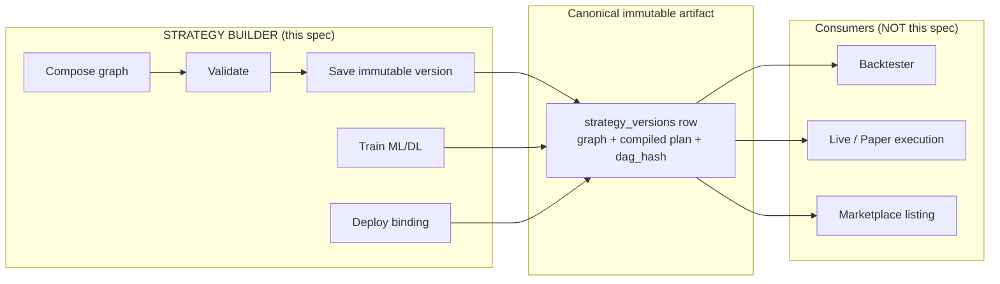
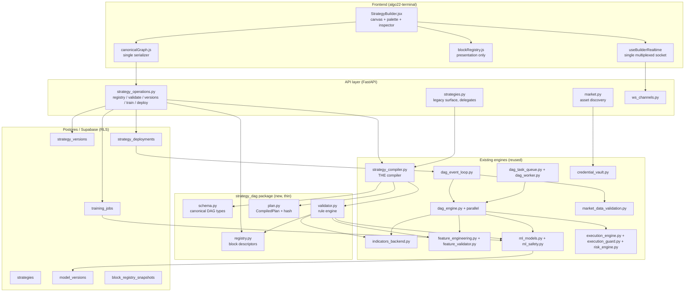
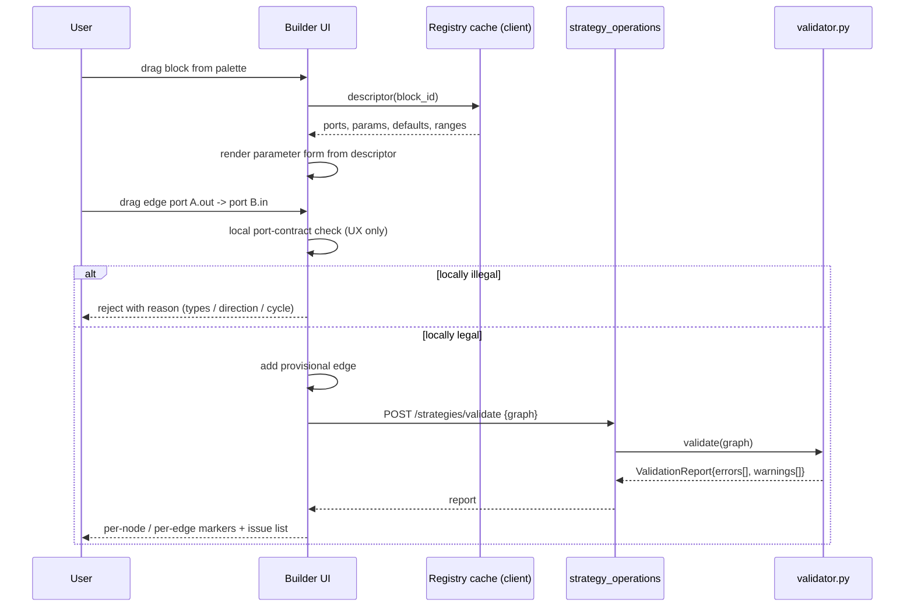
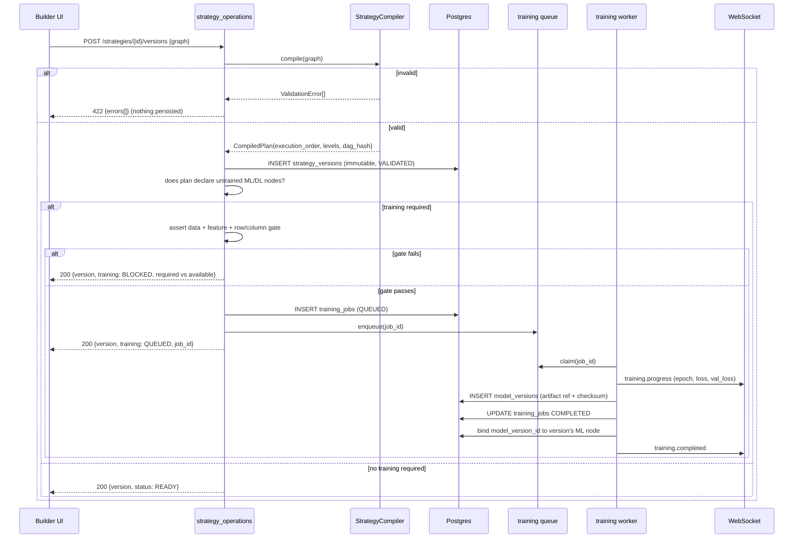
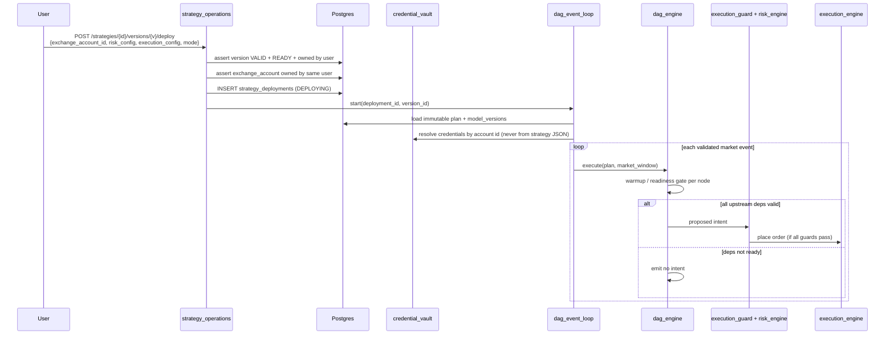
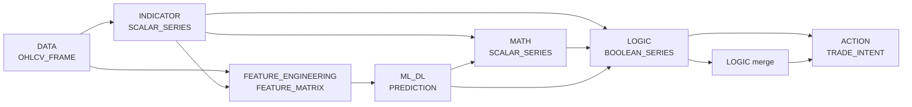
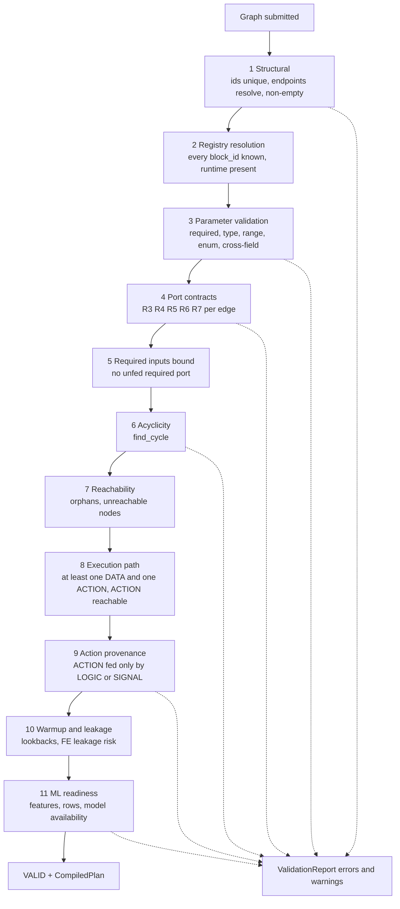
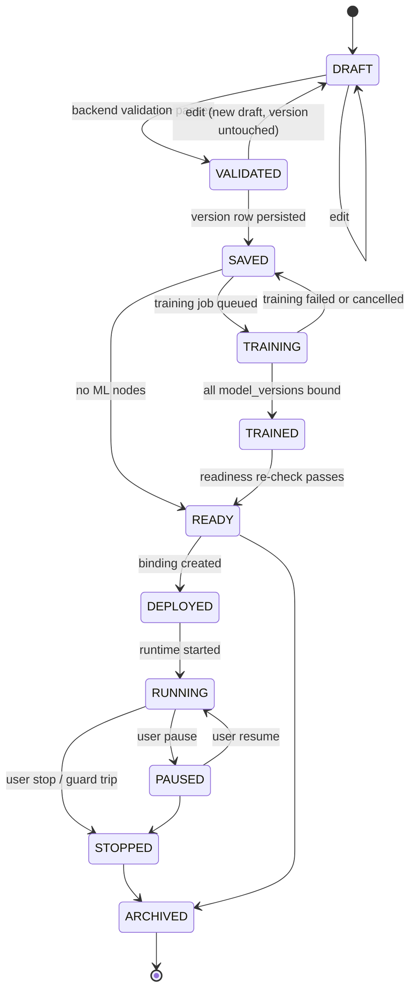

# Design Document: Strategy Builder (VyomQuant)

## Overview

The Strategy Builder is the visual authoring surface where a user composes a trading
strategy from typed blocks, validates it, saves it as an immutable version, trains any
ML/DL components it declares, and hands that version to a separate consumer (Backtester
or Live Deployment) for execution. The strategy definition itself is exchange-agnostic:
the exchange, the account credentials, the risk profile and the execution configuration
are bound at **deployment** time, never inside the saved strategy.

This is a **consolidation design, not a greenfield build**. Phase 0 discovery
(`reports/strategy_builder_architecture_inventory.md`) established that roughly 400 KB of
production DAG, execution, ML, market-data and validation code already exists and works.
The dominant problem is not missing engines — it is the absence of a single canonical
DAG/block model, which lets the frontend, two separate backend compilers and the runtime
disagree about what a strategy *is*. Every component in this design is either reused
as-is, extended, or (in three narrow cases) replaced with an explicit technical
justification.

The design resolves the four confirmed Phase 0 defects (SB-01 … SB-04) plus two further
defects discovered while grounding this design in the code (SB-05, SB-06), then defines
the canonical schema, the backend-authoritative block registry, the single compiler, the
runtime contract, the persistence model, the API and realtime surface, the UX contract,
and the acceptance gate that must pass before Backtester or Marketplace work resumes.

---

## Notation conventions

* Architecture and flows: Mermaid diagrams.
* Algorithms, type contracts and interfaces: structured pseudocode in `pascal` blocks
  (no programming language was specified for this design, so the design stays
  language-neutral; the target implementation is Python on the backend and
  JavaScript/React on the frontend, matching the existing codebase).
* Wire/persistence shapes: JSON (these are contracts, not implementations).
* Database changes: SQL DDL, because migrations are themselves the deliverable.
* File paths are relative to the repository root.

---

## Scope boundary (read this before anything else)



Hard rules:

1. **Save is not backtest.** `POST /strategies/{id}/versions` must never trigger a
   backtest, and the Builder UI must not import or call Backtester execution code. The
   current `handleSaveStrategy` in `StrategyBuilder.jsx` already avoids this; the design
   keeps that boundary and adds a lint/architecture test to enforce it.
2. **Both consumers read the same artifact.** Backtester and Live Deployment load the
   same `strategy_versions` row and the same `compiled_plan`. There is exactly one
   compiler, so a strategy that backtests is structurally the same strategy that trades.
3. **Builder expresses intent only.** It cannot bypass `execution_guard.py`,
   `risk_engine.py`, `order_state_engine.py`, kill switches, idempotency or balance
   checks. Those remain authoritative at execution time.

---

## Component disposition

Every existing component relevant to the Strategy Builder, with its disposition. "Extended"
means additive change with the existing public surface preserved. "Replaced" requires a
concrete technical reason.

| Component | File | Disposition | Reason |
|---|---|---|---|
| DAG engine | `backend_app/backend/dag_engine.py` | **EXTENDED** | Executors exist for indicator/ML/logic/action/market-data plus tracing and event buffering. Add `FeatureExecutor` and `MathExecutor`, make `IndicatorExecutor` delegate to `indicators_backend` instead of its private `_calculate_*` duplicates, and teach `execute_node` to read the port-addressed inputs of the canonical schema. No replacement — the tracer, event buffer and replay paths are production behaviour we must not lose. |
| DAG event loop | `backend_app/backend/dag_event_loop.py` | **REUSED AS-IS** | Live tick-driven evaluation loop. Consumes a compiled plan; unaffected by schema consolidation beyond the plan shape. |
| DAG task queue | `backend_app/core/dag_task_queue.py` | **REUSED AS-IS** | Tenant-scoped, priority-ordered, retry-aware task queue with heartbeats. Used for compile/validate offload where needed. |
| DAG worker | `backend_app/backend/dag_worker.py` | **REUSED AS-IS** | Executes queued DAG tasks. |
| DAG parallel engine | `backend_app/backend/dag_engine_parallel.py` | **REUSED AS-IS** | Level-parallel execution of independent branches; the canonical plan already emits execution levels it can consume. |
| DAG risk integration | `backend_app/backend/dag_risk_integration.py` | **REUSED AS-IS** | Keeps risk checks on the action path. Builder must not weaken it. |
| Strategy compiler (service) | `backend_app/backend/strategy_compiler.py` | **EXTENDED → canonical** | Becomes the single compiler. Gains the validation rules that currently only exist in the router copy (type compatibility, connectivity, orphan detection, action-input provenance, hashing, schema versioning) plus port-level checks. |
| Router-embedded `DAGCompiler` / `CompiledDAG` | `backend_app/routers/strategies.py` | **REPLACED (deleted)** | A compiler defined inside a FastAPI router cannot be imported by `dag_worker`, the backtester or a training job without pulling in FastAPI, rate limiting and auth dependencies; it is not unit-testable in isolation; and it is the direct cause of SB-01 and SB-02. Its unique rules are migrated, then the class is deleted and call sites re-pointed. |
| Strategy service | `backend_app/backend/strategy_service.py` | **EXTENDED** | Add version creation, validation-state persistence and deployment-binding helpers. |
| Strategy builder module | `backend_app/backend/strategy_builder.py` | **EXTENDED** | Becomes the orchestration seam between API and the new `strategy_dag` package. |
| Strategy operations router | `backend_app/routers/strategy_operations.py` | **EXTENDED** | Already owns create/compile/versions/deploy/pause/resume/backtests. Add registry, asset discovery, training and validation endpoints here rather than growing a second surface. |
| Strategies router | `backend_app/routers/strategies.py` | **EXTENDED** | Keeps its endpoints but delegates all compilation/validation to the canonical compiler; `GET /blocks` is superseded by the registry endpoint and becomes a thin alias for one release. |
| Execution engine | `backend_app/core/execution_engine.py` | **REUSED AS-IS** | Order placement authority. Action blocks must be defined by what it supports, not the reverse. |
| Execution guard | `backend_app/backend/execution_guard.py` | **REUSED AS-IS** | Financial safety authority. Untouched. |
| Exchange executor | `backend_app/backend/exchange_executor.py` | **REUSED AS-IS** | Source of truth for supported order types (`market`, `limit`, `stop_market`, `stop_limit`, `take_profit_market`, `take_profit_limit`) and for market metadata via `load_markets`. |
| Connection engine | `backend_app/backend/connection_engine.py` | **REUSED AS-IS** | CCXT connection with retrying `load_markets`; the asset-discovery service reads its market map. |
| Indicators | `backend_app/backend/indicators_backend.py` | **EXTENDED** | Keeps all 33 implementations. Add a machine-readable descriptor per indicator (params, ranges, warmup, output ports and types) so the registry stops guessing. `AVAILABLE_INDICATORS` becomes derived from the descriptors, not a parallel list. |
| Feature engineering | `backend_app/backend/feature_engineering.py` | **EXTENDED** | `FeatureEngine` already implements lags, rolling stats, returns, volatility, momentum and volume features leak-safely. Expose each as an individually addressable registry block instead of only the monolithic `create_feature_matrix`. |
| Feature validator | `backend_app/backend/feature_validator.py` | **REUSED AS-IS** | `FeatureSchema` + `FeatureSchemaRegistry` + `check_model_compatibility` already enforce model/feature contracts; the ML gate calls it. |
| ML/DL models | `backend_app/backend/ml_models.py` | **EXTENDED** | Keeps model blocks and fixes ML-1…ML-7. Add a descriptor per model (min features, min rows, sequence length, hyperparameters, max safe epochs, serialization) so the registry can never advertise an unrunnable model. |
| ML safety | `backend_app/core/ml_safety.py` | **REUSED AS-IS** | `TrainingIsolator`, `MemoryMonitor`, `InferenceTimeoutGuard`, `SafeModelLoader`, `DeterministicEnforcer` provide isolation, caps and checksum-verified loading. The training policy layer configures them; it does not reimplement them. |
| Market data validation | `backend_app/backend/market_data_validation.py` | **REUSED AS-IS** | `StructuralValidator`, `CandleIntegrityValidator`, `OutlierDetector`, `GapHandler`, `MarketDataValidator`, `ValidatedDataFeed` already cover OHLC relationships, duplicates, gaps, monotonicity and quality scoring. Feed-state reporting reads its `DataQualityReport`. |
| Data seeking engine | `backend_app/backend/data_seeking_engine.py` | **REUSED AS-IS** | Historical OHLCV fetch for warmup and training datasets. |
| Exchange websocket listener | `backend_app/backend/exchange_websocket_listener.py` | **REUSED AS-IS** | Candidate A in the latency measurement plan. |
| WebSocket manager / channels | `backend_app/backend/websocket_manager.py`, `ws_channels.py` | **EXTENDED** | Add builder channels (validation, training, strategy status) to the existing multiplexed connection. Do not open a second socket. |
| Credential vault | `backend_app/backend/api_key_vault.py`, `backend_app/core/credential_vault.py` | **REUSED AS-IS** | Exchange credentials stay here and are referenced by id from deployment bindings only. |
| `strategy_versions` / `strategy_deployments` / `strategy_backtests` | `backend_app/migrations/001_strategy_architecture.sql` | **REUSED + EXTENDED** | Immutable-version and deployment tables already exist with RLS. Add graph/plan/hash/validation columns and the missing training/model tables rather than inventing a parallel schema. |
| Builder page | `algo22-terminal/src/pages/StrategyBuilder.jsx` | **EXTENDED** | Canvas, palette sections, undo/redo, validation context and inspector are kept. Its inline duplicate serializer is deleted and its palette is re-pointed at the backend registry. |
| Block registry (frontend) | `algo22-terminal/src/lib/blockRegistry.js` | **REPLACED (reduced to presentation)** | It is a hardcoded second source of truth and the direct cause of SB-03 and SB-04 (zero feature-engineering blocks; missing `wma`, `hma`, `catboost`, `autoencoder`). Block *definitions* are deleted; the file keeps only category → icon/colour presentation mapping and the `StreamTypes` re-export generated from the backend port-type vocabulary. |
| DAG serializer (util) | `algo22-terminal/src/utils/dagSerializer.js` | **REPLACED** | It infers node semantics from display labels, drops every node whose type is not one of five legacy types (so DATA, MATH and FEATURE nodes vanish silently), and discards port handles — it cannot express the canonical schema. Replaced by `src/lib/canonicalGraph.js`. |
| Inline serializer in builder page | `StrategyBuilder.jsx` (~line 521) | **REPLACED (deleted)** | A third serialization format shadowing the util (SB-05). |

Nothing else in the inventory changes.

---

## Confirmed defects and their resolution

### SB-01 — Two competing DAG compilers, no canonical model

Evidence: `backend_app/routers/strategies.py` defines `CompiledDAG` + `DAGCompiler`
(10-step validation, own topological sort, `compute_hash`, `SCHEMA_VERSION`) and is used
by `POST /strategies/validate`, `POST /strategies` and the clone path.
`backend_app/backend/strategy_compiler.py` defines `StrategyCompiler` → `ExecutionGraph`
→ `StrategyPackage` with its own `_generate_execution_order` (Kahn) and its own rule set,
and is used by `POST /strategy-operations/strategies/compile`, which is what the Builder
UI actually calls on save. The two rule sets differ materially: the router rejects orphan
nodes, unreachable nodes, action nodes not fed by a signal/logic node, and unknown node
types from a 12-value set; the service requires at least one edge and at least one input
node, validates node-kind-specific fields, and accepts a 5-value `NodeType` enum. A graph
can therefore compile on one path and fail on the other.

Resolution:

* Introduce `backend_app/backend/strategy_dag/` with `schema.py`, `registry.py`,
  `validator.py`, `plan.py`.
* `StrategyCompiler` in `strategy_compiler.py` becomes the single entry point and
  delegates validation to `validator.py`. It absorbs the router's unique rules.
* `CompiledDAG` and the router-local `DAGCompiler` are deleted. Migration path for
  callers is specified in "Compiler migration path" below.
* `NodeType` in `backend_app/core/models/pydantic_models.py` is widened from 5 values to
  the canonical 7 categories, with the old values kept as aliases for one release so
  persisted rows keep deserializing.

### SB-02 — Clone silently loses `dag_hash` and `execution_order`

Evidence: the clone endpoint calls `DAGCompiler.compile(nodes, edges)` and then
`compiled.get("dag_hash")` / `compiled.get("execution_order")`. `compile()` returns a
`CompiledDAG` object with `compute_hash()` and `.execution_order` — no `.get()`. The
`AttributeError` is caught by `except Exception` and downgraded to a warning, so every
clone is persisted with `dag_hash` unset while the in-code comment claims the opposite.

Resolution (three independent parts, so the fix cannot regress the same way):

1. `compile()` returns a single `CompiledPlan` with an explicit `to_dict()` and a
   `dag_hash` **field** (not a method). Callers stop mixing object and dict access.
2. The clone path no longer swallows failures. A clone whose recompile fails is persisted
   with `validation_state = 'INVALID'` and the structured errors attached, and the
   response carries `warnings[]`. It is never persisted as if it were valid, and it can
   never be deployed (the deploy gate requires `validation_state = 'VALID'` and a
   non-null `dag_hash`).
3. A DB constraint makes the silent-loss state unrepresentable:
   `CHECK (validation_state <> 'VALID' OR (dag_hash IS NOT NULL AND execution_order IS NOT NULL))`.

### SB-03 — Feature Engineering unreachable from the UI

Evidence: `BlockCategories.FEATURE_ENGINEERING` is declared in `blockRegistry.js` and
`StrategyBuilder.jsx` renders a palette section from
`getDynamicBlocksByCategory(BlockCategories.FEATURE_ENGINEERING)`, but a full sweep of
`category: BlockCategories.*` in `blockRegistry.js` returns zero entries for that
category. The section is always empty even though `feature_engineering.py` and
`feature_validator.py` exist.

Resolution: feature blocks are registered in the backend registry from
`FeatureEngine`'s real capabilities and served through the same registry endpoint as
every other category. Because the palette is then registry-driven end to end, the
category populates without any frontend block authoring. Resolved together with SB-04.

### SB-04 — Dual source of truth for the palette

Evidence: `getDynamicBlocksByCategory` maps only `INDICATORS`, `ML` and `DL` to
`backendBlocks`; `DATA`, `FEATURE_ENGINEERING`, `MATH`, `LOGIC` and `ACTION` fall through
to `getBlocksByCategory(...)` on the hardcoded frontend list. Measured drift: backend
exposes 33 indicators including `wma` and `hma`, frontend registers 6; backend exposes
`catboost`, frontend registers 3 ML models; backend exposes `autoencoder`, frontend
registers 3 DL models.

Resolution: one endpoint, `GET /api/strategy-operations/registry/blocks`, returns every
category. `blockRegistry.js` loses all block definitions. The frontend **fails closed**:
if the registry request fails, the palette renders an error state with retry — it does
not fall back to a stale local list, because that fallback is precisely the drift
mechanism. The registry response is versioned and cacheable (`registry_version` +
`ETag`), so the failure mode is rare and recoverable rather than silently wrong.

### SB-05 — Three frontend graph formats, two of them lossy (discovered in this design)

Evidence: `src/utils/dagSerializer.js` maps display labels to node semantics
(`baseNode.indicator = n.data.label.toLowerCase()`), infers `action` from
`label.includes("buy")`, and ends with
`.filter(n => ["input","indicator","logic","ml","action"].includes(n.type))` — every
DATA, MATH or FEATURE node is silently discarded before the graph ever leaves the
browser. `StrategyBuilder.jsx` additionally declares its own
`serializeReactFlowToDAG` (~line 521) which shadows the import and emits a third shape
(`{id, type, label, params, position}`). Neither serializer emits `sourceHandle` /
`targetHandle`, so port identity — the basis of the whole type system — is lost.

Resolution: a single `src/lib/canonicalGraph.js` with `toCanonical(nodes, edges)` and
`fromCanonical(graph)`, port handles preserved, `block_id` carried explicitly, and zero
label-derived semantics. Both existing serializers are deleted. A round-trip property
test (`fromCanonical(toCanonical(g)) ≡ g`) guards it.

### SB-06 — Exchange and market identity hardcoded into the saved strategy (discovered in this design)

Evidence: `handleSaveStrategy` builds
`const pair = sourceNode?.params?.symbol || "BTC/USDT"`,
`timeframe || "15m"`, and sends `exchange: "binance"` in the persisted payload. The
`sourceNode` lookup is `serNodes.find(n => n.type === "ccxt_asset_feed")`, which cannot
match either serializer's output type vocabulary — so the fallbacks fire in normal
operation and a strategy is silently saved against BTC/USDT on Binance regardless of what
the user configured. `POST /strategies/{id}/train` similarly hardcodes
`ConnectionEngine("binance", ...)` while accepting an `exchange_id` body field.

Resolution: `exchange` is removed from the strategy payload entirely (it exists only on
deployment bindings and on training-dataset provenance). `symbol` and `timeframe` are
read from the DATA node's validated parameters; if a DATA node is missing or
unparameterised, save fails with a structured validation error instead of substituting a
default. Training resolves its data source from the deployment-independent
`training_config.data_source`, and `ConnectionEngine` is constructed from that resolved
value, not a literal.

---

## Architecture



Layering rule: the API layer never contains graph logic; `strategy_dag` never performs
I/O; the engines never re-derive the schema. `strategy_dag` is deliberately small — it is
a schema plus a rule engine, not a new execution stack.

---

## Sequence diagrams

### Compose, connect and validate



Frontend validation is UX latency only. The backend report is authoritative and always
runs before save, version creation, training and deployment.

### Save, compile, version, train



### Deploy and execute (exchange bound here, not before)



---

## Components and Interfaces

This section is the index of the component set: which components exist and what happens to
each, the package boundary that holds the new logic, and the interface each layer exposes to
the next. Descriptor contracts, endpoint semantics and algorithms are defined in the
sections named below and are not restated here.

### Component inventory and disposition

Every existing component relevant to the Builder is enumerated in **Component disposition**
with its disposition and the reason for it. Three dispositions are used:

| Disposition | Meaning | Examples |
|---|---|---|
| **REUSED AS-IS** | No change. The component is already the authority for its concern. | `dag_event_loop.py`, `execution_guard.py`, `exchange_executor.py`, `ml_safety.py`, `market_data_validation.py`, `credential_vault.py` |
| **EXTENDED** | Additive change, existing public surface preserved. | `dag_engine.py` (adds `FeatureExecutor`, `MathExecutor`), `strategy_compiler.py` (becomes canonical), `indicators_backend.py` (adds descriptors), `feature_engineering.py` (per-feature blocks), `ml_models.py` (adds descriptors), `strategy_operations.py` (new endpoints) |
| **REPLACED** | Deleted, with a concrete technical reason recorded in the table. | router-embedded `DAGCompiler`/`CompiledDAG` (cause of SB-01/SB-02), `dagSerializer.js`, the inline serializer in `StrategyBuilder.jsx` (SB-05), block *definitions* in `blockRegistry.js` (SB-03/SB-04) |

See **Component disposition** for the full table, and **Confirmed defects and their
resolution** for the SB-01 … SB-06 reasoning behind each replacement.

### Layer boundaries

The architecture graph in **Architecture** shows the wiring. The rule that graph encodes:

| Layer | Modules | Owns | Must not |
|---|---|---|---|
| Frontend | `StrategyBuilder.jsx`, `canonicalGraph.js`, `blockRegistry.js` (presentation only), `useBuilderRealtime` | Canvas interaction, one serializer, presentation mapping | Define blocks, infer semantics from labels, open a second socket |
| API | `strategy_operations.py`, `strategies.py`, `market.py`, `ws_channels.py` | Auth, entitlements, rate limits, transport, persistence calls | Contain graph logic |
| `strategy_dag` (new, thin) | `schema.py`, `registry.py`, `validator.py`, `plan.py` | The canonical schema and the rule engine over it | Perform I/O |
| Engines (existing) | compiler, DAG engine/parallel/event loop, indicators, feature engine, ML, market-data validation, execution/guard/risk | Execution, computation, safety | Re-derive the schema |
| Storage | Postgres/Supabase with RLS, object store for artifacts | Durable state, ownership enforcement | Hold model blobs in JSONB |

Stated as the invariant from **Architecture**: the API layer never contains graph logic;
`strategy_dag` never performs I/O; the engines never re-derive the schema. `strategy_dag`
is deliberately small — a schema plus a rule engine, not a new execution stack.

### The `strategy_dag` package

| Module | Exposes | Defined in |
|---|---|---|
| `schema.py` | `PortType`, `BlockCategory`, `Port`, `NodeSpec`, `EdgeSpec`, `StrategyGraph`; `load_graph`, `migrate_v1_to_v2`, `compute_dag_hash` | **Canonical DAG model** |
| `registry.py` | `ParamSpec`, `BlockDescriptor`, `build_registry()`, `get(block_id)`, `registry_version` | **Block type registry (backend-authoritative)** |
| `validator.py` | Rule engine over a graph + registry, returning `ValidationReport`; port-legality decisions | **Validation pipeline**, **Port type system and connection legality** |
| `plan.py` | `CompiledPlan` (including `dag_hash` as a **field**, not a method — SB-02) and its single `to_dict()` serialization path | **Canonical DAG model**, **The single compiler** |

Pure in, pure out: every entry point takes a graph (and registry) and returns a value. No
database handle, no HTTP client, no FastAPI import — which is precisely what made the
router-embedded compiler unusable from `dag_worker`, the backtester and training jobs.

### Registry interface

The registry is the single source of truth for what a block *is*. `BlockDescriptor` carries
ports, `ParamSpec` list, allowed predecessor/successor categories, execution semantics,
`warmup_fn`, `runtime_ref`, serialization mode, leakage risk and capability flags; the full
contract and the assembly algorithm are in **Block type registry (backend-authoritative)**.

Two consumers, one definition: the UI form generator and the backend validator both read
the same `ParamSpec`, so a form cannot offer a value the backend rejects, and the backend
never assumes the form checked. `build_registry()` asserts every `runtime_ref` resolves to a
callable and that no category is empty, so startup fails rather than advertising a block
that cannot run.

### Compiler and validator interface

`strategy_compiler.py` is **the** compiler; the router copy is deleted and its unique rules
migrated first. Its surface is a graph in, a `ValidationReport` or `CompiledPlan` out, with
the caller migration path documented in **The single compiler**. The validation stages and
their ordering are in **Validation pipeline**.

### Runtime executor interface

`execute_plan` (see **DAG runtime contract**) dispatches per node through a single seam:

```pascal
outputs ← executor_for(node.category).execute(node, inputs, window)
```

One executor per `BlockCategory`. `inputs` is a map keyed by input port name, resolved from
`plan.inbound`; `outputs` is a map keyed by output port name, each series validated against
its port descriptor before it enters the value map. Adding a category means registering an
executor, not editing the loop. `FeatureExecutor` and `MathExecutor` are the two new
implementations; `IndicatorExecutor` is re-pointed at `indicators_backend` instead of its
private `_calculate_*` duplicates.

### API and realtime interfaces

The HTTP surface is enumerated in **API surface** — registry projections, asset discovery,
validate/compile, version create/read/clone, training job lifecycle, model listing, deploy
and lifecycle transitions, plus data quality. Conventions: `strategy_operations.py` owns the
Builder surface, new endpoints are additive, `422` carries the full validation report, `409`
signals lifecycle conflict, `403` ownership, `429` from the existing limiter.

The realtime surface is enumerated in **WebSocket / realtime** — `market.*`,
`builder.validation.*`, `training.*`, `strategy.*`, `deployment.*` and `execution.*`
channels multiplexed over the one existing connection per browser session.

---

## Canonical DAG model

One schema, shared by frontend serializer, API contract, validator, compiler, runtime,
backtester and database. Wire format is JSON; the same field names are used at every
layer so no layer needs a translation table.

### Graph envelope

```json
{
  "schema_version": 2,
  "strategy_id": "8f2b...",
  "version": "v3",
  "name": "EMA + XGB confirmation",
  "nodes": [ /* NodeSpec[] */ ],
  "edges": [ /* EdgeSpec[] */ ],
  "metadata": {
    "created_by": "user-uuid",
    "created_at": "2026-08-19T13:01:00Z",
    "editor_layout_version": 1
  },
  "validation_state": "VALID",
  "compiled": {
    "dag_hash": "9c4a1f7be2d05a83",
    "execution_order": ["n_data_1", "n_ema_1", "n_feat_1", "n_ml_1", "n_logic_1", "n_action_1"],
    "execution_levels": [["n_data_1"], ["n_ema_1"], ["n_feat_1"], ["n_ml_1"], ["n_logic_1"], ["n_action_1"]],
    "warmup_bars": 226,
    "compiler_version": "2.0.0"
  }
}
```

There is deliberately **no `exchange` field** anywhere in the graph (SB-06).

### NodeSpec

```json
{
  "id": "n_ema_1",
  "block_id": "ema",
  "category": "INDICATOR",
  "params": { "window": 21, "source": "close" },
  "inputs":  [{ "port": "series", "type": "PRICE_SERIES", "required": true }],
  "outputs": [{ "port": "value",  "type": "SCALAR_SERIES" }],
  "ui": { "position": { "x": 320, "y": 180 }, "label": "EMA 21", "collapsed": false }
}
```

* `id` is a stable identifier minted once on node creation (`n_` + ULID) and never
  reused or renumbered — edges, execution order, training bindings, traces and audit
  records all key on it.
* `block_id` + `category` come from the registry descriptor. The frontend copies them;
  it never invents them, and it never derives them from the display label (SB-05).
* `ui` is presentation-only and excluded from `dag_hash`, so moving a node on the canvas
  does not change strategy identity.
* `inputs` / `outputs` are the *resolved* port list. For fixed-arity blocks they equal
  the descriptor; for variadic blocks (e.g. an `AND` gate with three inputs) they are the
  instantiated ports. The validator re-derives them from the descriptor and rejects any
  mismatch, so a tampered client cannot widen its own contract.

### EdgeSpec

```json
{
  "id": "e_7",
  "source": "n_ema_1",
  "source_port": "value",
  "target": "n_logic_1",
  "target_port": "left",
  "type": "SCALAR_SERIES"
}
```

Every edge is port-addressed on both ends. `type` is advisory (recomputed at validation
from the source port descriptor); it exists so error messages and the UI can explain a
rejection without a registry lookup.

### Canonical types

```pascal
STRUCTURE PortType IS ENUM
  OHLCV_FRAME        // full candle frame: symbol, ts, o,h,l,c,v
  PRICE_SERIES       // a single price-derived series (close, hl2, ...)
  SCALAR_SERIES      // numeric series in arbitrary units (indicator output)
  BOOLEAN_SERIES     // per-bar truth series
  FEATURE_MATRIX     // aligned 2-D matrix + column names + warmup offset
  PREDICTION         // model output series + confidence
  SIGNAL             // normalised trade intent strength in [-1, 1]
  TRADE_INTENT       // action payload accepted by execution layer
  SCALAR             // single constant value
END STRUCTURE

STRUCTURE BlockCategory IS ENUM
  DATA, INDICATOR, MATH, LOGIC, FEATURE_ENGINEERING, ML_DL, ACTION
END STRUCTURE

STRUCTURE Port
  name: String
  type: PortType
  required: Boolean
  variadic: Boolean            // AND/OR/SUM accept 2..N
  description: String
END STRUCTURE

STRUCTURE NodeSpec
  id: String                   // stable, never reused
  block_id: String
  category: BlockCategory
  params: Map<String, Any>
  inputs: List<Port>
  outputs: List<Port>
  ui: Map<String, Any>         // excluded from hash
END STRUCTURE

STRUCTURE EdgeSpec
  id: String
  source: String
  source_port: String
  target: String
  target_port: String
  type: PortType               // advisory; recomputed on validate
END STRUCTURE

STRUCTURE StrategyGraph
  schema_version: Integer
  strategy_id: String
  version: String
  name: String
  nodes: List<NodeSpec>
  edges: List<EdgeSpec>
  metadata: Map<String, Any>
  validation_state: ENUM(UNVALIDATED, VALID, INVALID)
END STRUCTURE

STRUCTURE CompiledPlan
  dag_hash: String             // FIELD, not a method (SB-02)
  schema_version: Integer
  compiler_version: String
  execution_order: List<String>
  execution_levels: List<List<String>>   // for dag_engine_parallel
  node_index: Map<String, NodeSpec>
  inbound: Map<String, List<EdgeSpec>>   // target_port -> resolved edge
  data_nodes: List<String>
  action_nodes: List<String>
  ml_nodes: List<String>
  feature_pipeline: List<String>         // ordered FE node ids
  warmup_bars: Integer
  required_models: List<ModelRequirement>
  dependencies: Map<String, List<String>>

  FUNCTION to_dict(): Map<String, Any>   // the ONLY serialization path
END STRUCTURE
```

### `dag_hash` definition

Identity must be stable under cosmetic edits and sensitive to every semantic one.

```pascal
ALGORITHM compute_dag_hash(graph)
INPUT: graph of type StrategyGraph
OUTPUT: hash of type String (16 hex chars)

BEGIN
  canonical_nodes ← EMPTY LIST
  FOR each n IN sort(graph.nodes BY n.id) DO
    canonical_nodes.append({
      id: n.id,
      block_id: n.block_id,
      category: n.category,
      params: canonicalize(n.params)        // key-sorted, numerics normalised
    })                                      // n.ui deliberately EXCLUDED
  END FOR

  canonical_edges ← EMPTY LIST
  FOR each e IN sort(graph.edges BY (e.source, e.source_port, e.target, e.target_port)) DO
    canonical_edges.append(e.source + "." + e.source_port + "->" +
                           e.target + "." + e.target_port)
  END FOR

  payload ← json_dumps({
    schema_version: graph.schema_version,
    nodes: canonical_nodes,
    edges: canonical_edges
  }, sort_keys := TRUE)

  RETURN first_16(sha256_hex(payload))
END
```

**Preconditions:** graph passed structural validation (unique node ids, all edge
endpoints resolve).
**Postconditions:** hash is deterministic across processes and platforms; identical for
graphs differing only in `ui`; different for any change to node set, block ids, params,
categories, port wiring or schema version.
**Loop invariants:** iteration is over a total order, so the accumulated list is
independent of input ordering.

Note the deliberate difference from the deleted `CompiledDAG.compute_hash`, which hashed
only node ids, `source->target` strings and schema version — it was blind to parameter
changes and to port rewiring, so two materially different strategies could share a hash.

### Schema versioning and migration

`schema_version = 2` is this design. Version 1 is everything currently persisted
(`buy_logic._nodes` / `_edges`, five-value `NodeType`, no ports).

```pascal
ALGORITHM load_graph(row)
BEGIN
  raw ← row.graph_json OR legacy_extract(row.buy_logic)
  IF raw.schema_version IS NULL OR raw.schema_version = 1 THEN
    RETURN migrate_v1_to_v2(raw)     // read-time, non-destructive
  ELSE IF raw.schema_version = 2 THEN
    RETURN parse_v2(raw)
  ELSE
    RAISE UnsupportedSchemaVersion(raw.schema_version)
  END IF
END

ALGORITHM migrate_v1_to_v2(raw)
BEGIN
  FOR each n IN raw.nodes DO
    n.category  ← map_legacy_type(n.type)      // input->DATA, ml->ML_DL, ...
    n.block_id  ← n.indicator OR n.model_id OR n.action OR n.operator OR "ohlcv_feed"
    n.params    ← merge(n.params, legacy_scalar_fields(n))
    descriptor  ← registry.get(n.block_id)
    IF descriptor IS NULL THEN
      mark_unresolved(n)                        // becomes a VALIDATION error, not a crash
    ELSE
      n.inputs  ← descriptor.inputs
      n.outputs ← descriptor.outputs
    END IF
  END FOR
  FOR each e IN raw.edges DO
    e.source_port ← sole_output_port(e.source)  // v1 nodes were single-port
    e.target_port ← next_free_input_port(e.target)
  END FOR
  raw.schema_version ← 2
  RETURN raw
END
```

**Preconditions:** `raw` deserializes as JSON with `nodes` and `edges` lists.
**Postconditions:** result is a v2 `StrategyGraph`; unresolvable blocks are marked, never
guessed; migration is read-only — the v1 row is rewritten only when the user saves a new
version, so a rollback loses nothing.
**Loop invariants:** each processed node either carries a registry-resolved port set or is
marked unresolved; no node silently reaches the compiler with an invented contract.

---

## Block type registry (backend-authoritative)

One registry, in the backend, built from the engines' real capabilities. It is the single
source of truth for what a block *is*, and it is the mechanism that closes SB-03 and
SB-04 simultaneously.

### Descriptor contract

```pascal
STRUCTURE ParamSpec
  key: String
  label: String
  type: ENUM(NUMBER, INTEGER, TEXT, SELECT, MULTISELECT, BOOLEAN, DATE, SYMBOL, TIMEFRAME)
  required: Boolean
  default: Any                     // NULL when there is no safe default
  min: Number | NULL
  max: Number | NULL
  step: Number | NULL
  options: List<Any> | NULL        // for SELECT/MULTISELECT
  unit: String | NULL              // "bars", "%", "quote currency"
  example: Any
  help: String
  depends_on: List<String>         // e.g. slow_period depends on fast_period
  affects_warmup: Boolean
END STRUCTURE

STRUCTURE BlockDescriptor
  block_id: String                 // stable, lowercase snake_case
  display_name: String
  category: BlockCategory
  description: String
  inputs: List<Port>
  outputs: List<Port>
  params: List<ParamSpec>
  allowed_predecessor_categories: Set<BlockCategory>
  allowed_successor_categories: Set<BlockCategory>
  execution_semantics: ENUM(SERIES_MAP, WINDOWED, STATEFUL, TERMINAL)
  warmup_fn: Function(params) -> Integer
  runtime_ref: String              // "indicators_backend.ema", "FeatureEngine.compute_lag_features"
  serialization: ENUM(NONE, JOBLIB, KERAS, TORCH)
  leakage_risk: ENUM(NONE, LOW, REVIEW_REQUIRED)   // FEATURE_ENGINEERING only
  version: String
  capability_flags: Set<String>    // "trainable", "predicts", "needs_model", "streaming"
END STRUCTURE
```

`param_validation` is expressed declaratively in `ParamSpec` (required/type/min/max/
options/depends_on) plus an optional per-block `validate(params) -> List[Issue]` hook for
cross-field rules that ranges cannot express (e.g. MACD `fast < slow`). Both the UI form
generator and the backend validator read the same `ParamSpec`, so a form can never offer
a value the backend rejects, and the backend never depends on the form having checked.

### Registry assembly

```pascal
ALGORITHM build_registry()
OUTPUT: registry of type Map<String, BlockDescriptor>

BEGIN
  registry ← EMPTY MAP

  // DATA — exchange-agnostic, no exchange param (SB-06)
  register(registry, ohlcv_feed_descriptor())
  register(registry, live_ticker_descriptor())
  register(registry, orderbook_imbalance_descriptor())

  // INDICATOR — derived from indicators_backend descriptors, never a parallel list
  FOR each spec IN indicators_backend.INDICATOR_SPECS DO
    ASSERT callable_exists(spec.runtime_ref)     // never advertise what we cannot run
    register(registry, descriptor_from_indicator_spec(spec))
  END FOR

  // MATH and LOGIC — declared in registry, executed by MathExecutor / LogicExecutor
  FOR each spec IN MATH_SPECS   DO register(registry, spec) END FOR
  FOR each spec IN LOGIC_SPECS  DO register(registry, spec) END FOR

  // FEATURE_ENGINEERING — closes SB-03
  FOR each spec IN feature_engineering.FEATURE_SPECS DO
    ASSERT callable_exists(spec.runtime_ref)
    register(registry, descriptor_from_feature_spec(spec))
  END FOR

  // ML_DL — from ml_models descriptors, gated on the library actually importing
  FOR each spec IN ml_models.MODEL_SPECS DO
    IF NOT spec.backend_available THEN
      CONTINUE                                   // omit, do not offer a broken block
    END IF
    register(registry, descriptor_from_model_spec(spec))
  END FOR

  // ACTION — order types read from exchange_executor.OrderType, never invented
  FOR each order_type IN exchange_executor.OrderType DO
    register(registry, action_descriptors_for(order_type))
  END FOR

  ASSERT every_category_non_empty(registry)      // fails startup if a palette section would be empty
  RETURN registry
END
```

**Preconditions:** engine modules import successfully.
**Postconditions:** every descriptor's `runtime_ref` resolves to a callable; no category
is empty; `registry_version` is the hash of the assembled descriptor set.
**Loop invariants:** after each registration the registry contains only descriptors whose
runtime is present, so an advertised block is always a runnable block.

`assert every_category_non_empty` is the structural guard against SB-03 recurring: an
empty FEATURE_ENGINEERING category becomes a startup failure and a failing test, not a
silently blank palette panel.

### Registry response shape

```json
{
  "registry_version": "r_4f19c2a8",
  "port_types": ["OHLCV_FRAME", "PRICE_SERIES", "SCALAR_SERIES", "BOOLEAN_SERIES",
                 "FEATURE_MATRIX", "PREDICTION", "SIGNAL", "TRADE_INTENT", "SCALAR"],
  "categories": [
    { "id": "DATA", "display_name": "Market Data", "order": 1 },
    { "id": "INDICATOR", "display_name": "Indicators", "order": 2 },
    { "id": "MATH", "display_name": "Math", "order": 3 },
    { "id": "LOGIC", "display_name": "Logic", "order": 4 },
    { "id": "FEATURE_ENGINEERING", "display_name": "Feature Engineering", "order": 5 },
    { "id": "ML_DL", "display_name": "ML / DL Models", "order": 6 },
    { "id": "ACTION", "display_name": "Actions", "order": 7 }
  ],
  "blocks": [ /* BlockDescriptor[] */ ],
  "compatibility_matrix": {
    "OHLCV_FRAME": ["OHLCV_FRAME", "PRICE_SERIES"],
    "PRICE_SERIES": ["PRICE_SERIES", "SCALAR_SERIES"],
    "SCALAR_SERIES": ["SCALAR_SERIES"],
    "BOOLEAN_SERIES": ["BOOLEAN_SERIES", "SIGNAL"],
    "FEATURE_MATRIX": ["FEATURE_MATRIX"],
    "PREDICTION": ["PREDICTION", "SCALAR_SERIES"],
    "SIGNAL": ["SIGNAL", "TRADE_INTENT"],
    "SCALAR": ["SCALAR", "SCALAR_SERIES"]
  }
}
```

The `compatibility_matrix` is shipped to the client so local connect-time checks use the
identical rule the backend enforces — one rule, two enforcement points, no divergence.

---

## Port type system and connection legality

Validity is decided by port contracts, not by a hardcoded category sequence. The
*preferred* shape DATA → INDICATOR/MATH/LOGIC → FEATURE_ENGINEERING → ML_DL →
LOGIC/MATH → ACTION emerges naturally from the port types; branching and merging are
first-class.



### Legality rules

An edge is legal only if **all** of these hold:

```pascal
ALGORITHM is_edge_legal(graph, edge, registry)
INPUT: graph, edge of type EdgeSpec, registry
OUTPUT: result of type ENUM(LEGAL) | Issue

BEGIN
  // R1 endpoints resolve
  src ← graph.node_by_id(edge.source)
  dst ← graph.node_by_id(edge.target)
  IF src IS NULL OR dst IS NULL THEN
    RETURN Issue("EDGE_ENDPOINT_UNKNOWN", edge.id)
  END IF

  // R2 no self loop
  IF src.id = dst.id THEN
    RETURN Issue("SELF_LOOP", edge.id, "A block cannot feed itself.")
  END IF

  // R3 ports exist and face the right way
  out_port ← registry.output_port(src.block_id, edge.source_port)
  in_port  ← registry.input_port(dst.block_id, edge.target_port)
  IF out_port IS NULL THEN RETURN Issue("UNKNOWN_SOURCE_PORT", edge.id) END IF
  IF in_port  IS NULL THEN RETURN Issue("UNKNOWN_TARGET_PORT", edge.id) END IF

  // R4 type compatibility via the shared matrix
  IF NOT compatible(out_port.type, in_port.type) THEN
    RETURN Issue("TYPE_MISMATCH", edge.id,
      out_port.type + " cannot feed " + in_port.type +
      ". Insert a converting block or pick a different port.")
  END IF

  // R5 category adjacency from the descriptors
  IF dst.category NOT IN registry.get(src.block_id).allowed_successor_categories THEN
    RETURN Issue("ILLEGAL_CATEGORY_FLOW", edge.id,
      src.category + " cannot feed " + dst.category + ".")
  END IF

  // R6 terminal blocks have no outputs
  IF registry.get(src.block_id).execution_semantics = TERMINAL THEN
    RETURN Issue("TERMINAL_HAS_NO_OUTPUT", edge.id,
      "Action blocks are terminal; they cannot feed other blocks.")
  END IF

  // R7 single-arity input already occupied
  IF NOT in_port.variadic AND graph.has_inbound(dst.id, edge.target_port) THEN
    RETURN Issue("PORT_ALREADY_CONNECTED", edge.id,
      dst.id + "." + edge.target_port + " accepts one connection.")
  END IF

  // R8 adding the edge must not create a cycle
  IF creates_cycle(graph, edge) THEN
    RETURN Issue("CYCLE", edge.id, "Connection would create a loop: " +
      join(cycle_path(graph, edge), " -> "))
  END IF

  RETURN LEGAL
END
```

**Preconditions:** `registry` is loaded; `graph` is internally consistent (node ids
unique).
**Postconditions:** returns `LEGAL` or exactly one `Issue` with a machine code and a
user-actionable message; the graph is not mutated.

R5 + R6 make the explicitly forbidden connections structurally impossible rather than
special-cased: ACTION is `TERMINAL` with `allowed_successor_categories = {}`, so
ACTION→DATA, ACTION→INDICATOR and ACTION→ML_DL are all rejected by R6. DATA is absent from
every block's `allowed_successor_categories`, so ML_DL→DATA is rejected by R5 (a DATA
block is a source and has no inputs at all, which R3 also catches).

### Cycle detection

Detection runs at seven gates, all calling the same function, so no path can skip it:

| Gate | Trigger | Behaviour on cycle |
|---|---|---|
| Connect (client) | user drops an edge | edge refused, tooltip names the loop |
| Edit (client) | node/edge deletion or re-parenting | affected edges flagged |
| Save / version | `POST .../versions` | 422, nothing persisted |
| Backend validate | `POST /strategies/validate` | `errors[]` with cycle path |
| Compile | `StrategyCompiler.compile` | `ValidationError`, no plan emitted |
| Deploy | `POST .../deploy` | 409, deployment refused |
| Execute | plan load in `dag_event_loop` | plan rejected; deployment marked FAILED |

```pascal
ALGORITHM find_cycle(nodes, edges)
INPUT: nodes, edges
OUTPUT: path of type List<String> (empty when acyclic)

BEGIN
  adjacency ← build_adjacency(edges)      // source -> [targets]
  state     ← MAP each node.id TO WHITE
  stack     ← EMPTY LIST

  FUNCTION dfs(id)
  BEGIN
    state[id] ← GREY
    stack.push(id)
    FOR each next IN adjacency[id] DO
      IF state[next] = GREY THEN
        RETURN slice_from(stack, next) + [next]    // the actual cycle, in order
      ELSE IF state[next] = WHITE THEN
        found ← dfs(next)
        IF found IS NOT EMPTY THEN RETURN found END IF
      END IF
    END FOR
    stack.pop()
    state[id] ← BLACK
    RETURN EMPTY LIST
  END

  FOR each n IN nodes DO
    IF state[n.id] = WHITE THEN
      found ← dfs(n.id)
      IF found IS NOT EMPTY THEN RETURN found END IF
    END IF
  END FOR
  RETURN EMPTY LIST
END
```

**Preconditions:** every edge endpoint exists in `nodes`.
**Postconditions:** returns a non-empty node sequence forming a real cycle, or empty for a
DAG. Errors name the cycle nodes **and** the offending edge, because the caller knows which
edge it was about to add.
**Loop invariants:** a node coloured BLACK participates in no cycle reachable from it; the
`stack` always holds the current GREY path root-to-tip, which is why the reported path is
the true cycle rather than an arbitrary visited set. Iterative (explicit-stack) form is
used in the implementation to avoid recursion limits on large graphs — the existing
`_has_cycle` in `strategy_compiler.py` is recursive and is replaced by this.

---

## Validation pipeline



Stages 1–9 are inherited from the union of the two existing compilers (the router copy
contributed 7–9; the service copy contributed 3 and its node-kind checks). Stages 4, 10
and 11 are new. All stages are **collect-all**, not fail-fast: the user gets every problem
in one pass, which is the difference between a usable builder and a guessing game.

### Structured error contract

```json
{
  "valid": false,
  "dag_hash": null,
  "errors": [
    {
      "code": "PARAM_OUT_OF_RANGE",
      "severity": "error",
      "node_id": "n_rsi_1",
      "edge_id": null,
      "field": "window",
      "message": "RSI period must be between 2 and 500. Got 0.",
      "expected": { "min": 2, "max": 500 },
      "actual": 0,
      "fix_hint": "Set period to 14 for the standard RSI."
    },
    {
      "code": "REQUIRED_INPUT_MISSING",
      "severity": "error",
      "node_id": "n_ema_1",
      "field": "series",
      "message": "EMA has no price source. Connect a Market Data block to its 'series' input.",
      "fix_hint": "Drag from OHLCV Feed -> close to EMA -> series."
    }
  ],
  "warnings": [
    {
      "code": "WARMUP_EXCEEDS_HISTORY",
      "severity": "warning",
      "node_id": "n_ema_200",
      "message": "This strategy needs 226 warmup bars. The selected range provides 180.",
      "expected": 226,
      "actual": 180
    }
  ],
  "summary": { "node_count": 7, "edge_count": 7, "warmup_bars": 226 }
}
```

Errors block; warnings do not. Every error carries a code (for tests and telemetry), a
target (`node_id` / `edge_id` / `field`) so the UI can point at it, and a `fix_hint` in
plain language.

### Frontend advisory vs backend authority

```pascal
PROCEDURE on_connect_attempt(graph, candidate_edge)
BEGIN
  // Local check: identical rules, shipped via compatibility_matrix + descriptors.
  // Purpose is instant feedback, NOT security.
  verdict ← is_edge_legal(graph, candidate_edge, client_registry)
  IF verdict IS Issue THEN
    show_inline_rejection(verdict.message)
    RETURN                                  // edge never added locally
  END IF

  add_edge(graph, candidate_edge)
  mark_graph_state(UNVALIDATED)
  schedule_backend_validation(debounce := 400ms)   // authority
END
```

The backend re-runs every rule on every mutating request. It never trusts client-supplied
`inputs`, `outputs`, `edge.type`, `validation_state`, `dag_hash` or `execution_order` —
those are all recomputed server-side. A hand-crafted request cannot widen its own
contract.

---

## The single compiler

### Migration path for callers (SB-01)

| Call site | Today | After |
|---|---|---|
| `POST /api/strategies/validate` | router `DAGCompiler.compile` in a try/except | `strategy_dag.validator.validate(graph)`; returns `ValidationReport` |
| `POST /api/strategies` (create) | router `DAGCompiler.compile` | `StrategyCompiler.compile(graph)`; 422 on invalid |
| `POST /api/strategies/{id}/clone` | `compiled.get("dag_hash")` → AttributeError | `plan = StrategyCompiler.compile(graph)`; `plan.dag_hash`; failures surfaced (SB-02) |
| `POST /api/strategy-operations/strategies/compile` | service `StrategyCompiler.compile(DAGConfig,...)` | same entry point, canonical `StrategyGraph` input |
| `dag_worker` / `dag_event_loop` | receive loose dicts | receive `CompiledPlan.to_dict()` from persisted `compiled_plan` |
| Backtester (`backtest_runtime.py`) | reconstructs from `blueprint` | loads persisted `compiled_plan` for the version, recompiling only if `dag_hash` mismatches |

Deprecation sequence: (1) land `strategy_dag` and the extended `StrategyCompiler` behind
no flag (pure addition); (2) re-point all six call sites in one commit and delete
`CompiledDAG` + `DAGCompiler` in the same commit, so there is never a window with two
active compilers; (3) keep `GET /api/strategies/blocks` as a thin alias to the registry
endpoint for one release, marked deprecated in the response, then remove it.

### Compile algorithm

```pascal
ALGORITHM compile(graph, registry)
INPUT:  graph of type StrategyGraph, registry
OUTPUT: plan of type CompiledPlan
RAISES: ValidationError(report) when the graph is not executable

BEGIN
  report ← validate(graph, registry)          // all 11 stages, collect-all
  IF report.has_errors THEN
    RAISE ValidationError(report)             // never emit a plan from an invalid graph
  END IF

  node_index ← MAP n.id -> n FOR n IN graph.nodes
  inbound    ← MAP node_id -> MAP port -> edge

  // Kahn with a deterministic tie-break so the order is reproducible
  in_degree ← MAP n.id -> 0
  adjacency ← build_adjacency(graph.edges)
  FOR each e IN graph.edges DO
    in_degree[e.target] ← in_degree[e.target] + 1
    inbound[e.target][e.target_port] ← e
  END FOR

  ready ← sorted([id WHERE in_degree[id] = 0])   // sorted => deterministic
  order ← EMPTY LIST
  levels ← EMPTY LIST

  WHILE ready IS NOT EMPTY DO
    ASSERT no_id_appears_twice(order)
    level ← sorted(ready)
    levels.append(level)
    next_ready ← EMPTY SET
    FOR each id IN level DO
      order.append(id)
      FOR each target IN adjacency[id] DO
        in_degree[target] ← in_degree[target] - 1
        IF in_degree[target] = 0 THEN next_ready.add(target) END IF
      END FOR
    END FOR
    ready ← sorted(next_ready)
  END WHILE

  IF length(order) <> length(graph.nodes) THEN
    RAISE ValidationError(cycle_report(find_cycle(graph.nodes, graph.edges)))
  END IF

  plan ← CompiledPlan{
    dag_hash          : compute_dag_hash(graph),
    schema_version    : graph.schema_version,
    compiler_version  : COMPILER_VERSION,
    execution_order   : order,
    execution_levels  : levels,
    node_index        : node_index,
    inbound           : inbound,
    data_nodes        : ids_where(category = DATA),
    action_nodes      : ids_where(category = ACTION),
    ml_nodes          : ids_where(category = ML_DL),
    feature_pipeline  : filter(order, category = FEATURE_ENGINEERING),
    warmup_bars       : compute_warmup(graph, registry),
    required_models   : collect_model_requirements(graph, registry),
    dependencies      : extract_dependencies(graph)
  }

  ASSERT plan.action_nodes IS NOT EMPTY
  ASSERT plan.data_nodes IS NOT EMPTY
  ASSERT every_node_in(plan.execution_order) = every_node_in(graph.nodes)
  RETURN plan
END
```

**Preconditions:** `graph` parses as a v2 `StrategyGraph`; `registry` loaded.
**Postconditions:** either a `CompiledPlan` whose `execution_order` is a valid topological
order containing every node exactly once and whose `dag_hash` matches
`compute_dag_hash(graph)`, or a raised `ValidationError` carrying the full report and **no
partial persistence**.
**Loop invariants:** at the top of each `WHILE` iteration, every id already in `order` has
all its predecessors in `order`; `in_degree[x] > 0` for every unemitted `x` with an
unemitted predecessor; `ready` contains only nodes with zero unemitted predecessors.
Determinism holds because `ready` is sorted at every step, so the same graph always
produces byte-identical `execution_order` — required for `dag_hash` stability and for
reproducible backtests.

### Warmup computation

```pascal
ALGORITHM compute_warmup(graph, registry)
OUTPUT: bars of type Integer

BEGIN
  memo ← EMPTY MAP
  FUNCTION warmup_of(node_id)
  BEGIN
    IF node_id IN memo THEN RETURN memo[node_id] END IF
    node ← graph.node_by_id(node_id)
    own  ← registry.get(node.block_id).warmup_fn(node.params)
    upstream_max ← 0
    FOR each pred IN predecessors(graph, node_id) DO
      upstream_max ← max(upstream_max, warmup_of(pred))
    END FOR
    memo[node_id] ← own + upstream_max        // warmups compose along a path
    RETURN memo[node_id]
  END

  total ← 0
  FOR each a IN action_nodes(graph) DO
    total ← max(total, warmup_of(a))
  END FOR
  RETURN total
END
```

**Preconditions:** graph is acyclic (guaranteed by stage 6 running first).
**Postconditions:** `bars` is the minimum leading bars that must be discarded before any
node on any action path produces a trustworthy value.
**Loop invariants:** `memo[x]` once written is final, because the graph is acyclic and
`warmup_of` is evaluated bottom-up along a topological order.

Warmup composes rather than maxing because an EMA(200) feeding a rolling-std(20) feeding a
lag(3) needs 200 + 20 + 3 bars before the last value is real. Taking only the max would
silently ship NaN-contaminated features into a model — the exact class of bug that looks
like a working strategy in a backtest and loses money live.

---

## DATA blocks and exchange-agnostic asset discovery

### Descriptor

```pascal
DESCRIPTOR ohlcv_feed
  block_id      : "ohlcv_feed"
  category      : DATA
  inputs        : []                       // source block
  outputs       : [ Port("frame", OHLCV_FRAME),
                    Port("open",  PRICE_SERIES), Port("high",   PRICE_SERIES),
                    Port("low",   PRICE_SERIES), Port("close",  PRICE_SERIES),
                    Port("volume", SCALAR_SERIES) ]
  params        : [
      ParamSpec(key := "symbol",        type := SYMBOL,    required := TRUE,  default := NULL),
      ParamSpec(key := "timeframe",     type := TIMEFRAME, required := TRUE,  default := NULL),
      ParamSpec(key := "market_type",   type := SELECT,    required := TRUE,  default := "spot",
                options := ["spot", "swap", "future"]),
      ParamSpec(key := "mode",          type := SELECT,    required := TRUE,  default := "streaming",
                options := ["streaming", "historical"]),
      ParamSpec(key := "warmup_bars",   type := INTEGER,   required := FALSE, default := NULL,
                unit := "bars", help := "Blank = use the compiler's computed warmup."),
      ParamSpec(key := "history_start", type := DATE,      required := FALSE, default := NULL),
      ParamSpec(key := "history_end",   type := DATE,      required := FALSE, default := NULL)
  ]
  // NOTE: there is deliberately no "exchange" param. Ever.
  allowed_successor_categories : { INDICATOR, MATH, LOGIC, FEATURE_ENGINEERING, ML_DL }
  execution_semantics : SERIES_MAP
END DESCRIPTOR
```

`symbol` has **no default** (`required := TRUE, default := NULL`). Save fails if it is
unset — this is the structural fix for SB-06's silent `"BTC/USDT"` fallback.

### Asset universe discovery

Current state: `GET /api/market/symbols` calls `ccxt.binance().load_markets()`
synchronously inside the request, filters to `/USDT`, truncates to the first 50
alphabetically, and falls back to a 10-symbol hardcoded list. That is a hardcoded
universe in all but name and it blocks the event loop.

Design:

```pascal
ALGORITHM discover_assets(query)
INPUT: query { search, base, quote, market_type, active_only, limit, cursor }
OUTPUT: page of type { assets: List<AssetRef>, total: Integer, next_cursor, source_meta }

BEGIN
  // Universe is the union of markets from every exchange the platform supports,
  // refreshed on a schedule - NOT fetched inside the request path.
  universe ← asset_cache.get()                      // Redis, TTL 6h, warmed at startup
  IF universe IS STALE OR universe IS EMPTY THEN
    universe ← asset_cache.refresh_async()          // returns last-known-good immediately
    IF universe IS EMPTY THEN
      RETURN error("ASSET_UNIVERSE_UNAVAILABLE")    // fail loudly; no hardcoded fallback
    END IF
  END IF

  results ← universe
  IF query.active_only THEN  results ← filter(results, m.active = TRUE)          END IF
  IF query.market_type THEN  results ← filter(results, m.type = query.market_type) END IF
  IF query.base THEN         results ← filter(results, m.base = query.base)      END IF
  IF query.quote THEN        results ← filter(results, m.quote = query.quote)    END IF
  IF query.search THEN
    results ← filter(results, fuzzy_match(query.search, [m.symbol, m.base, m.quote]))
  END IF

  results ← sort(results, BY liquidity_rank DESC, symbol ASC)
  RETURN paginate(results, query.limit, query.cursor) WITH source_meta(universe)
END
```

**Preconditions:** at least one exchange adapter is reachable, or a warm cache exists.
**Postconditions:** returns a page of real, tradeable markets with precision/limits
metadata attached; **never** substitutes a hardcoded list; never truncates silently.
**Loop invariants:** each filter narrows monotonically, so the result is always a subset
of the live universe.

```pascal
STRUCTURE AssetRef
  symbol: String            // canonical "BTC/USDT"
  base: String
  quote: String
  market_type: ENUM(spot, swap, future)
  active: Boolean
  price_precision: Integer
  amount_precision: Integer
  min_notional: Decimal
  min_amount: Decimal
  available_on: List<String>   // exchange ids where this market exists (informational)
END STRUCTURE
```

`available_on` is informational metadata used by the deploy-time compatibility check
("this strategy trades SOL/USDT; your Kraken account does not list it"). It is not part of
the strategy definition and is excluded from `dag_hash`.

Timeframes come from `GET /registry/timeframes`, derived from the intersection of
timeframes the platform's data pipeline supports, so the UI cannot offer `3m` to an
exchange family that lacks it.

---

## Market data: canonical objects, validation, and the latency decision

### Canonical objects

```pascal
STRUCTURE Candle
  symbol: String
  timeframe: String
  open_time: Timestamp             // UTC, ms, bar OPEN, exclusive of next bar
  open: Decimal
  high: Decimal
  low: Decimal
  close: Decimal
  volume: Decimal
  is_closed: Boolean               // partial bars never feed indicators
  exchange_timestamp: Timestamp
  received_timestamp: Timestamp
  source: String                   // adapter id, for provenance only
END STRUCTURE

STRUCTURE Tick
  symbol: String
  bid: Decimal | NULL
  ask: Decimal | NULL
  last: Decimal
  trade_id: String | NULL
  exchange_timestamp: Timestamp
  received_timestamp: Timestamp
  source: String
END STRUCTURE
```

`is_closed` matters: the DAG must never compute an indicator on a forming bar and then
recompute a different value for the same bar, because that produces two contradictory
signals for one timestamp.

### Validation (reuses `market_data_validation.py`)

| Check | Existing implementation | Action on failure |
|---|---|---|
| Required columns / dtypes | `StructuralValidator` | reject batch |
| `high >= max(open, close)`, `low <= min(open, close)`, `high >= low` | `CandleIntegrityValidator` | drop candle, quality issue |
| Negative or zero price | `CandleIntegrityValidator` | drop candle |
| Negative volume | `CandleIntegrityValidator` | drop candle |
| Duplicate timestamps | `MarketDataValidator` | keep first, count duplicate |
| Non-monotonic / out-of-order | `MarketDataValidator` | re-sort historical; for live, drop late events older than the last closed bar and count them |
| Missing candles (gaps) | `GapHandler` | strategy per config; **`SYNTHETIC` fill is forbidden for live trading paths** |
| Outliers | `OutlierDetector` (z-score / IQR / % change) | flag, optionally drop |
| Insufficient rows | `_validate_row_count` | block training / block deployment |

The only change needed: the Builder's data-quality panel and the deploy gate read
`DataQualityReport.quality_score` / `quality_level` from the existing validator instead of
computing anything of their own. Gap strategy is pinned per environment —
`FORWARD_FILL` allowed for backtests with disclosure, never `SYNTHETIC_FILL` on a live
deployment, because a synthetic candle is an invented price and invented prices reach the
order router.

### Latency measurement plan

Two candidate sources already exist. Choose empirically; correctness is never traded for
latency.

* **Candidate A — direct CCXT stream:** `exchange_websocket_listener.py` +
  `connection_engine.py`, ticks/candles straight from the exchange socket.
* **Candidate B — backend OHLCV pipeline:** `data_seeking_engine.py` →
  `market_data_validation.ValidatedDataFeed` → `dag_event_loop`, validated and normalised.

Harness: `tests/perf/test_market_data_latency.py`, run as a scripted experiment (not in
CI's default lane) against a fixed symbol set (`BTC/USDT`, `ETH/USDT`, one thin
alt), three timeframes (`1m`, `15m`, `1h`), for 24 h continuous plus a 1 h forced-churn
window with induced disconnects.

| Metric | Definition | Instrumentation |
|---|---|---|
| End-to-end latency | `dag_input_timestamp - exchange_timestamp`, p50/p95/p99/max | timestamps already on `Candle` |
| Ingest latency | `received_timestamp - exchange_timestamp` | adapter |
| Pipeline latency | `dag_input_timestamp - received_timestamp` | engine hook |
| CPU | mean and p95 process CPU % under fixed event rate | `metrics.py` |
| Memory | RSS growth over 24 h (leak signal) | `metrics.py` |
| Throughput | max sustained events/s before queue growth | `backpressure.py` counters |
| Reconnect | count, mean/max recovery time, events lost per reconnect | adapter counters |
| Completeness | received bars ÷ expected bars per window | `GapHandler` |
| Timestamp quality | monotonic violations per 10k events; clock skew vs exchange | validator counters |
| Duplication | duplicate `(symbol, open_time)` per 10k | validator counters |
| Ordering | out-of-order arrivals per 10k | validator counters |
| Reliability | uptime %, error rate, silent-stall episodes (>3 expected intervals with no data) | watchdog |

Decision rule, applied in order:

```pascal
ALGORITHM choose_market_data_source(result_a, result_b)
BEGIN
  FOR each r IN [result_a, result_b] DO
    r.correct ← (r.completeness >= 0.9999)
            AND (r.monotonic_violations = 0)
            AND (r.duplicates_delivered = 0)
            AND (r.invalid_ohlc_delivered = 0)
            AND (r.synthetic_candles_delivered = 0)
  END FOR

  candidates ← filter([result_a, result_b], r.correct = TRUE)

  IF candidates IS EMPTY THEN
    RETURN BLOCK("No source meets correctness floor. Fix correctness before choosing.")
  END IF
  IF length(candidates) = 1 THEN
    RETURN candidates[0].source          // correctness decides, latency does not vote
  END IF

  // both correct: prefer lower p99 end-to-end latency, but require a material margin
  best  ← min_by(candidates, r.p99_latency_ms)
  other ← the_other(candidates, best)
  IF (other.p99_latency_ms - best.p99_latency_ms) < 25 THEN
    RETURN other.source IF other.has_validation_layer ELSE best.source
  END IF
  RETURN best.source
END
```

**Postconditions:** the selected source satisfies the correctness floor unconditionally; a
sub-25 ms p99 advantage does not justify dropping the validation layer, because 25 ms of
latency is worth far less than one invented candle. The chosen source and the measured
numbers are recorded in `reports/market_data_latency_decision.md` and referenced by the
deployment runbook.

Expected outcome (hypothesis to be confirmed, not assumed): Candidate B costs a small
constant validation overhead and wins on correctness; the right answer is likely B with
the validator's hot path optimised, not A.

---

## Indicator blocks

All 33 implementations in `indicators_backend.py` are exposed; there are no
frontend-only indicators. The change is that each indicator gains a machine-readable
spec, and `AVAILABLE_INDICATORS` becomes derived from those specs rather than a
hand-maintained parallel list (the current arrangement is how `wma` and `hma` ended up
runnable but unselectable).

```pascal
STRUCTURE IndicatorSpec
  block_id: String
  display_name: String
  runtime_ref: String                    // resolved callable, asserted at startup
  inputs: List<Port>                     // e.g. close only, or high+low+close
  outputs: List<Port>                    // multi-output declared explicitly
  params: List<ParamSpec>
  warmup_fn: Function(params) -> Integer
END STRUCTURE
```

Representative specs (the parameter shape differs per indicator — this is the point;
today the registry endpoint emits a single generic `{"window": 14, min 1, max 500}` form
for all 33, which is wrong for most of them):

| block_id | inputs | outputs | params | warmup |
|---|---|---|---|---|
| `sma`, `ema`, `wma`, `hma` | `series: PRICE_SERIES` | `value: SCALAR_SERIES` | `window` (int, 2..1000), `source` (enum open/high/low/close/hl2/hlc3/ohlc4) | `window` (`ema`: `3*window` for convergence) |
| `rsi` | `series` | `value: SCALAR_SERIES` (0..100) | `window` (2..500) | `window + 1` |
| `macd` | `series` | `macd`, `signal`, `histogram` — three `SCALAR_SERIES` ports | `fast` (2..200), `slow` (3..500), `signal` (2..100); cross-field `fast < slow` | `slow + signal` |
| `bollinger_bands` | `series` | `upper`, `middle`, `lower` | `window`, `std_dev` (0.1..5.0) | `window` |
| `atr`, `adx`, `cci`, `williams_r` | `high`, `low`, `close` | `value` | `window` | `window + 1` |
| `stochastic` | `high`, `low`, `close` | `k`, `d` | `k_period`, `d_period`, `smooth` | `k_period + d_period` |
| `supertrend` | `high`, `low`, `close` | `trend: SCALAR_SERIES`, `direction: BOOLEAN_SERIES` | `window`, `multiplier` | `window` |
| `obv`, `mfi`, `cmf`, `rolling_vwap` | `high`/`low`/`close` as needed + `volume` | `value` | per indicator | per indicator |
| `ichimoku_cloud` | `high`, `low`, `close` | `tenkan`, `kijun`, `senkou_a`, `senkou_b`, `chikou` | `tenkan`, `kijun`, `senkou_b` | `max(params) + kijun` |
| `psar` | `high`, `low` | `value`, `direction: BOOLEAN_SERIES` | `step`, `max_step` | 2 |
| `donchian_channel`, `keltner_channels` | `high`, `low`, `close` | `upper`, `middle`, `lower` | `window` (+ `multiplier`) | `window` |
| `pivot_standard`, `pivot_camarilla`, `fibonacci_rolling` | `high`, `low`, `close` | named level ports | `window` / `anchor` | `window` |

`chikou` (Ichimoku's lagging span) is a forward-shifted series and is therefore marked
`leakage_risk = REVIEW_REQUIRED`: it is legal in a chart, and a validation **error** when
it feeds a FEATURE_ENGINEERING or ML_DL node, because a lagging span read at bar `t`
encodes bar `t+26`.

Parameter validation covers required, type, range, enum, cross-field dependency
(`depends_on`) and warmup feasibility. An indicator with an unconnected required source
port fails stage 5 (`REQUIRED_INPUT_MISSING`) and therefore cannot compile, cannot save as
VALIDATED, and cannot deploy.

Multi-output indicators expose one port per output rather than a magic index. Today
`dag_engine.IndicatorExecutor._calculate_macd` returns only the histogram and
`_calculate_bollinger` returns only the upper band — the other outputs are unreachable.
Delegating to `indicators_backend` and declaring the ports fixes that as a side effect.

---

## Math blocks

```pascal
CONSTANT MATH_SPECS = [
  // arity 2
  spec("add",      "+",   inputs := [a: SCALAR_SERIES, b: SCALAR_SERIES], variadic := TRUE),
  spec("subtract", "-",   inputs := [a, b]),
  spec("multiply", "*",   inputs := [a, b], variadic := TRUE),
  spec("divide",   "/",   inputs := [numerator, denominator]),
  spec("modulo",   "%",   inputs := [a, b]),
  spec("min",      "min", inputs := [a, b], variadic := TRUE),
  spec("max",      "max", inputs := [a, b], variadic := TRUE),
  // arity 1
  spec("abs"), spec("round", params := [decimals 0..8]),
  spec("floor"), spec("ceil"), spec("sqrt"), spec("log", params := [base]), spec("exp"),
  spec("negate"), spec("clamp", params := [lower, upper]),
  // constants and shifts
  spec("constant", inputs := [], outputs := [value: SCALAR], params := [value]),
  spec("shift",    params := [bars 1..500])       // BACKWARD ONLY - see leakage section
]
```

All math outputs are `SCALAR_SERIES`. Numeric safety is enforced at the executor, not
hoped for:

```pascal
ALGORITHM safe_math_apply(op, operands, node_id)
INPUT:  op, operands as List<Series>, node_id
OUTPUT: result of type Series

BEGIN
  ASSERT all_same_length(operands)
  ASSERT all_aligned_on_timestamp(operands)

  result ← allocate_series(length(operands[0]))

  FOR i FROM 0 TO length(result) - 1 DO
    ASSERT no_finite_value_written_before_i_is_nonfinite(result)   // invariant

    IF any_is_nan(operands, i) THEN
      result[i] ← NaN                      // NaN propagates within the series
      CONTINUE                             // it must NOT propagate to an order
    END IF

    CASE op OF
      DIVIDE:
        IF abs(operands[1][i]) < EPSILON THEN
          result[i] ← NaN
          record_issue(node_id, "DIVISION_BY_ZERO", bar := i)
        ELSE
          result[i] ← operands[0][i] / operands[1][i]
        END IF
      MODULO:
        IF abs(operands[1][i]) < EPSILON THEN result[i] ← NaN
        ELSE result[i] ← fmod(operands[0][i], operands[1][i]) END IF
      SQRT:
        IF operands[0][i] < 0 THEN result[i] ← NaN
        ELSE result[i] ← sqrt(operands[0][i]) END IF
      LOG:
        IF operands[0][i] <= 0 THEN result[i] ← NaN
        ELSE result[i] ← log(operands[0][i]) END IF
      EXP:
        candidate ← exp(operands[0][i])
        result[i] ← NaN IF is_infinite(candidate) ELSE candidate
      OTHERWISE:
        candidate ← apply(op, values_at(operands, i))
        result[i] ← NaN IF NOT is_finite(candidate) ELSE candidate
    END CASE
  END FOR

  ASSERT no_infinity_in(result)
  RETURN result
END
```

**Preconditions:** operand series are equal-length and timestamp-aligned (the runtime
guarantees this; misalignment is a compile-time error).
**Postconditions:** the result contains only finite values or `NaN` — never `+Inf`,
`-Inf` or an overflowed value. Division by zero, negative roots and non-positive
logarithms yield `NaN` with a recorded issue rather than an exception or a poisoned number.
**Loop invariants:** at bar `i`, every already-written bar is finite-or-NaN; the invariant
is what lets the terminal assertion be a cheap check rather than a full re-scan.

The non-finite firewall sits at the action boundary, so no arithmetic block can move money
on a bad number:

```pascal
PROCEDURE assert_execution_safe(intent, node_id)
BEGIN
  FOR each field IN [intent.quantity, intent.price, intent.trigger_price, intent.notional] DO
    IF field IS NOT NULL AND (is_nan(field) OR is_infinite(field)) THEN
      RAISE ExecutionBlocked(node_id, "NON_FINITE_ORDER_FIELD")   // no order is sent
    END IF
  END FOR
  IF intent.quantity IS NOT NULL AND intent.quantity <= 0 THEN
    RAISE ExecutionBlocked(node_id, "NON_POSITIVE_QUANTITY")
  END IF
END
```

---

## Logic blocks

```pascal
CONSTANT LOGIC_SPECS = [
  spec("and", inputs := [a: BOOLEAN_SERIES, b: BOOLEAN_SERIES], variadic := TRUE,
       outputs := [out: BOOLEAN_SERIES]),
  spec("or",  inputs := [a: BOOLEAN_SERIES, b: BOOLEAN_SERIES], variadic := TRUE),
  spec("not", inputs := [a: BOOLEAN_SERIES]),

  spec("gt",  inputs := [left: SCALAR_SERIES, right: SCALAR_SERIES], outputs := [out: BOOLEAN_SERIES]),
  spec("lt"), spec("gte"), spec("lte"), spec("eq"), spec("neq"),   // same port shape

  spec("cross_above", inputs := [fast: SCALAR_SERIES, slow: SCALAR_SERIES],
       outputs := [out: BOOLEAN_SERIES]),
  spec("cross_below", inputs := [fast, slow]),
  spec("between", inputs := [value: SCALAR_SERIES, lower: SCALAR_SERIES, upper: SCALAR_SERIES],
       params := [inclusive: BOOLEAN default TRUE]),

  spec("if_then_else",
       inputs := [condition: BOOLEAN_SERIES, then_value: SCALAR_SERIES, else_value: SCALAR_SERIES],
       outputs := [out: SCALAR_SERIES]),

  spec("to_signal", inputs := [condition: BOOLEAN_SERIES],
       outputs := [out: SIGNAL], params := [direction: SELECT(long, short), strength 0..1])
]
```

Type enforcement falls out of the port types, with no special-casing:

* `EMA > SMA` — both `SCALAR_SERIES` into `gt.left` / `gt.right`. Legal.
* `PRICE > boolean` — `BOOLEAN_SERIES` into `gt.right` which expects `SCALAR_SERIES`.
  Rejected by R4 with `TYPE_MISMATCH: BOOLEAN_SERIES cannot feed SCALAR_SERIES`.
* `AND(rsi_value, macd_hist)` — `SCALAR_SERIES` into `and.a` which expects
  `BOOLEAN_SERIES`. Rejected, with the hint "compare it first, e.g. RSI > 70".
* Comparators emit `BOOLEAN_SERIES`, and `BOOLEAN_SERIES` is compatible with `SIGNAL` in
  the matrix, so a comparator can feed an ACTION's signal port directly — which is what
  makes the common two-block strategy possible without ceremony.

Cross detection is defined on closed bars only:

```pascal
ALGORITHM cross_above(fast, slow)
BEGIN
  out ← allocate_boolean_series(length(fast))
  out[0] ← FALSE                             // no previous bar to compare
  FOR i FROM 1 TO length(fast) - 1 DO
    ASSERT out[j] IS DEFINED FOR ALL j < i
    IF is_nan(fast[i]) OR is_nan(slow[i]) OR
       is_nan(fast[i-1]) OR is_nan(slow[i-1]) THEN
      out[i] ← FALSE                         // warmup region never signals
    ELSE
      out[i] ← (fast[i-1] <= slow[i-1]) AND (fast[i] > slow[i])
    END IF
  END FOR
  RETURN out
END
```

**Postconditions:** `out[i]` is TRUE only when the relation strictly flipped between
`i-1` and `i` on two defined values; the warmup region is silent, so a strategy never
fires a trade on the first bar merely because an indicator was NaN before it.

---

## Feature engineering

This is the layer between raw/indicator data and ML/DL, and it is the layer that is
currently unreachable (SB-03). `FeatureEngine` already implements the hard parts
leak-safely; the work is exposing each capability as an individually addressable,
registry-declared block.

### Feature block specs

| block_id | inputs | outputs | params | lookback / warmup | leakage risk |
|---|---|---|---|---|---|
| `feat_lag` | `series: SCALAR_SERIES` | `matrix: FEATURE_MATRIX` | `lags` (multiselect 1..100) | `max(lags)` | NONE (past only) |
| `feat_returns` | `series` | `matrix` | `periods` | `max(periods)` | NONE |
| `feat_log_returns` | `series` | `matrix` | — | 1 | NONE |
| `feat_rolling_mean` | `series` | `matrix` | `window` (2..500) | `window` | NONE |
| `feat_rolling_std` | `series` | `matrix` | `window`, `ddof` | `window` | NONE |
| `feat_volatility` | `series` (returns) | `matrix` | `window`, `annualize` | `window + 1` | NONE |
| `feat_momentum` | `series` | `matrix` | `windows` (multiselect) | `max(windows)` | NONE |
| `feat_zscore` | `series` | `matrix` | `window`, `mode` (rolling \| expanding) | `window` | LOW — rolling only; **global** z-score is rejected |
| `feat_normalize` | `series` | `matrix` | `window`, `method` (minmax \| robust) | `window` | LOW — rolling window only |
| `feat_standardize` | `matrix` | `matrix` | `fit_on` (train_split only) | 0 | REVIEW_REQUIRED — scaler must be fit on train split only |
| `feat_time` | `frame: OHLCV_FRAME` | `matrix` | `parts` (hour, dow, dom, month, session) | 0 | NONE |
| `feat_volume` | `volume: SCALAR_SERIES` | `matrix` | `window` | `window` | NONE |
| `feat_price_transform` | `frame` | `matrix` | `transform` (hl2, hlc3, ohlc4, typical, log) | 0 | NONE |
| `feat_concat` | `matrix` (variadic 2..N) | `matrix` | — | max of inputs | NONE |
| `feat_select` | `matrix` | `matrix` | `columns` (multiselect) | 0 | NONE |

`FEATURE_MATRIX` carries its column names, per-column warmup offset and the timestamp
index, so `feat_concat` can align by timestamp rather than by position — the alignment bug
class that silently shifts a feature by one bar relative to its label.

```pascal
STRUCTURE FeatureMatrix
  index: List<Timestamp>          // strictly increasing, one entry per row
  columns: List<String>           // unique, stable names
  values: Matrix<Float>           // shape (len(index), len(columns))
  warmup_offset: Integer          // rows before this are not trustworthy
  provenance: Map<String, String> // column -> producing node_id
END STRUCTURE
```

### Data leakage protection (mandatory)

Leakage is enforced by three independent mechanisms, because any single one can be
sidestepped.

**1. Structural: no forward-looking operator can reach a model.**

```pascal
ALGORITHM validate_no_lookahead(graph, registry)
OUTPUT: issues of type List<Issue>

BEGIN
  issues ← EMPTY LIST
  ml_reachable ← nodes_that_reach_category(graph, ML_DL)   // reverse reachability

  FOR each n IN graph.nodes DO
    descriptor ← registry.get(n.block_id)

    // (a) explicit forward shift
    IF n.block_id = "shift" AND n.params.bars < 0 THEN
      issues.append(Issue("LOOKAHEAD_SHIFT", n.id,
        "Negative shift reads future bars. Only positive (backward) shifts are allowed."))
    END IF

    // (b) blocks whose output encodes the future
    IF descriptor.leakage_risk = REVIEW_REQUIRED AND n.id IN ml_reachable THEN
      issues.append(Issue("LEAKY_FEATURE_INTO_MODEL", n.id,
        descriptor.display_name + " encodes future information and cannot feed a model."))
    END IF

    // (c) whole-series statistics
    IF n.block_id IN ["feat_zscore", "feat_normalize"] AND n.params.mode = "global" THEN
      issues.append(Issue("GLOBAL_STATISTIC_LEAK", n.id,
        "Global statistics leak test-set information. Use a rolling window."))
    END IF
  END FOR
  RETURN issues
END
```

**Preconditions:** graph is acyclic and registry-resolved.
**Postconditions:** every returned issue names a node and a concrete reason; a graph with
zero issues contains no block that reads a bar later than the current one on any path into
a model.
**Loop invariants:** `ml_reachable` is computed once before the loop, so each node is
classified against the same reachability set — no ordering dependence.

**2. Temporal: splits are chronological and gapped.**

```pascal
ALGORITHM make_temporal_splits(index, val_fraction, test_fraction, embargo_bars)
INPUT:  index (strictly increasing timestamps), fractions, embargo_bars
OUTPUT: splits { train, val, test } as index ranges

BEGIN
  ASSERT is_strictly_increasing(index)
  ASSERT val_fraction + test_fraction < 1.0
  ASSERT embargo_bars >= max_feature_lookback + label_horizon

  n ← length(index)
  test_start  ← n - floor(n * test_fraction)
  val_start   ← test_start - floor(n * val_fraction)

  train ← [0, val_start - embargo_bars)
  val   ← [val_start, test_start - embargo_bars)
  test  ← [test_start, n)

  ASSERT train.end < val.start          // no overlap
  ASSERT val.end   < test.start
  ASSERT (val.start - train.end) >= embargo_bars   // gap absorbs lookback + horizon
  ASSERT length(train) > 0 AND length(val) > 0 AND length(test) > 0
  RETURN { train, val, test }
END
```

**Postconditions:** the three ranges are disjoint, chronologically ordered, and separated
by an embargo at least as large as the longest feature lookback plus the label horizon —
so no training row's feature window overlaps a validation row's label window. Shuffling is
structurally impossible: the function returns *ranges*, not index permutations, and the
training entry point takes ranges only.

**3. Target construction: labels are strictly forward, features strictly backward.**

```pascal
ALGORITHM build_supervised_dataset(features, prices, horizon)
INPUT:  features of type FeatureMatrix, prices, horizon >= 1
OUTPUT: dataset { X, y, index }

BEGIN
  ASSERT horizon >= 1
  ASSERT features.index EQUALS timestamps_of(prices)

  usable_start ← features.warmup_offset
  usable_end   ← length(features.index) - horizon      // last horizon rows have no label

  ASSERT usable_end > usable_start

  X ← features.values[usable_start .. usable_end - 1]
  y ← EMPTY LIST
  FOR i FROM usable_start TO usable_end - 1 DO
    ASSERT i + horizon < length(prices)                 // label exists, invariant
    y.append(label_from(prices[i], prices[i + horizon]))
  END FOR

  ASSERT rows(X) = length(y)                            // fixes ML-1 (off-by-one)
  RETURN { X, y, index: features.index[usable_start .. usable_end - 1] }
END
```

**Preconditions:** feature index and price index are the same timestamps; `horizon >= 1`.
**Postconditions:** `rows(X) = length(y)`; row `i` uses only data at or before its own
timestamp for `X` and only data strictly after it for `y`; the final `horizon` rows are
dropped rather than labelled with a fabricated future. This is the fix for the recorded
ML-1 defect ("DL `_generate_target` returned len=n, not n-1") expressed as an invariant
instead of a patch.
**Loop invariants:** at every iteration `i + horizon` is a valid index, guaranteed by
`usable_end`; `length(y) = i - usable_start + 1`.

Required tests: `tests/ml/test_no_leakage.py` asserts that (a) a model trained on
shuffled-in-time data scores materially worse on the chronological test split than one
trained correctly — catching accidental shuffling; (b) inserting a future-shifted column
raises `LOOKAHEAD_SHIFT` at validation; (c) split ranges never overlap under random
fractions (property test); (d) `rows(X) == len(y)` under random horizons and warmups
(property test).

---

## ML/DL model registry

### Descriptor

```pascal
STRUCTURE ModelSpec
  block_id: String                     // xgboost, lightgbm, random_forest, catboost,
                                       // lstm, gru, transformer, autoencoder
  display_name: String
  model_family: ENUM(TREE, SEQUENCE, AUTOENCODER)
  inputs: List<Port>                   // [features: FEATURE_MATRIX]
  outputs: List<Port>                  // [prediction: PREDICTION, confidence: SCALAR_SERIES]
  min_feature_columns: Integer         // >= 5 platform floor
  min_training_rows: Integer
  sequence_length: Integer | NULL      // SEQUENCE family only
  hyperparameters: List<ParamSpec>
  recommended_epochs: Integer
  max_safe_epochs: Integer
  default_batch_size: Integer
  validation_requirements: { val_fraction, test_fraction, embargo_bars, metric }
  can_train: Boolean
  can_predict: Boolean
  serialization: ENUM(JOBLIB, KERAS, TORCH)
  backend_available: Boolean           // library actually imported
  version: String
END STRUCTURE
```

| block_id | family | min cols | min rows | seq len | recommended epochs | max safe epochs | serialization |
|---|---|---|---|---|---|---|---|
| `xgboost` | TREE | 5 | 2 000 | — | 200 rounds | 2 000 rounds | JOBLIB |
| `lightgbm` | TREE | 5 | 2 000 | — | 200 rounds | 2 000 rounds | JOBLIB |
| `random_forest` | TREE | 5 | 2 000 | — | n/a (n_estimators 100) | 1 000 estimators | JOBLIB |
| `catboost` | TREE | 5 | 2 000 | — | 300 iterations | 3 000 iterations | JOBLIB |
| `lstm` | SEQUENCE | 5 | 5 000 | 60 | 30 | 200 | KERAS |
| `gru` | SEQUENCE | 5 | 5 000 | 60 | 30 | 200 | KERAS |
| `transformer` | SEQUENCE | 5 | 10 000 | 120 | 40 | 200 | KERAS |
| `autoencoder` | AUTOENCODER | 5 | 5 000 | 60 | 50 | 300 | KERAS |

`backend_available` is checked at registry assembly: if `catboost` or the DL framework
cannot import in the running image, the block is omitted from the registry rather than
offered and then failing at train time. `catboost` and `autoencoder` — both currently
runnable-but-unselectable (SB-04) — appear the moment the registry becomes the single
source.

### Minimum-data gate

```pascal
ALGORITHM check_ml_data_requirements(plan, dataset_stats, model_spec, validation_cfg)
OUTPUT: verdict { ok: Boolean, issues: List<Issue>, required: Map, available: Map }

BEGIN
  issues ← EMPTY LIST

  // 1 feature columns: platform floor AND model floor
  available_columns ← dataset_stats.usable_feature_columns
  required_columns  ← max(5, model_spec.min_feature_columns)
  IF available_columns < required_columns THEN
    issues.append(Issue("INSUFFICIENT_FEATURE_COLUMNS", plan.ml_nodes[0],
      "Training cannot start. Required: " + required_columns +
      " feature columns. Available: " + available_columns + "."))
  END IF

  // 2 usable rows: after warmup trim and label horizon, before splits
  usable_rows ← dataset_stats.total_rows
              - plan.warmup_bars
              - validation_cfg.label_horizon

  reserved ← validation_cfg.val_fraction + validation_cfg.test_fraction
  ASSERT reserved < 1.0

  IF model_spec.model_family = SEQUENCE THEN
    // every training sample consumes sequence_length rows
    min_core ← model_spec.sequence_length + model_spec.min_training_rows
  ELSE
    min_core ← model_spec.min_training_rows
  END IF

  required_rows ← ceil( (min_core + 2 * validation_cfg.embargo_bars) / (1.0 - reserved) )

  IF usable_rows < required_rows THEN
    issues.append(Issue("INSUFFICIENT_ROWS", plan.ml_nodes[0],
      "Training cannot start. Required: " + format_thousands(required_rows) +
      " usable rows. Available: " + format_thousands(usable_rows) + "."))
  END IF

  // 3 sequence models need a full window even after splitting
  IF model_spec.model_family = SEQUENCE THEN
    train_rows ← floor(usable_rows * (1.0 - reserved))
    IF train_rows < model_spec.sequence_length + model_spec.min_training_rows THEN
      issues.append(Issue("INSUFFICIENT_SEQUENCE_ROWS", plan.ml_nodes[0],
        "Sequence length " + model_spec.sequence_length +
        " leaves only " + train_rows + " training rows."))
    END IF
  END IF

  // 4 model must be runnable and the feature schema must match
  IF NOT model_spec.can_train THEN
    issues.append(Issue("MODEL_NOT_TRAINABLE", plan.ml_nodes[0], ...))
  END IF

  RETURN {
    ok        : issues IS EMPTY,
    issues    : issues,
    required  : { columns: required_columns, rows: required_rows },
    available : { columns: available_columns, rows: usable_rows }
  }
END
```

**Preconditions:** `plan` compiled; `dataset_stats` measured from real fetched data (never
estimated); `reserved < 1.0`.
**Postconditions:** when `ok = FALSE` **no training job is created**, and the response
carries required-vs-available for both dimensions so the UI can render the exact message
the requirements demand. When `ok = TRUE`, every split is non-empty and every sequence
sample has a complete window.

The mandated message shape falls straight out of `required` / `available`:

> Training cannot start. Required: 5 feature columns and 5,000 usable rows.
> Available: 3 feature columns and 1,240 rows.

### Resource caps (backend-enforced)

Frontend caps are display only. Enforcement lives in
`backend_app/backend/ml_training_policy.py`, evaluated inside the job creation path and
again inside the worker before the first epoch, so a request that bypasses the API still
hits the wall.

```pascal
STRUCTURE MLTrainingCaps
  max_epochs: Integer                 // min(model_spec.max_safe_epochs, plan_tier_cap)
  max_rows: Integer
  max_feature_columns: Integer
  max_concurrent_jobs_per_user: Integer
  max_concurrent_jobs_global: Integer
  max_duration_seconds: Integer
  max_memory_mb: Integer              // via ml_safety.MemoryMonitor
  max_model_size_mb: Integer
END STRUCTURE

ALGORITHM enforce_caps(request, caps, user)
BEGIN
  IF request.epochs > caps.max_epochs THEN
    RAISE CapExceeded("MAX_EPOCHS", requested := request.epochs, allowed := caps.max_epochs)
  END IF
  IF request.rows > caps.max_rows THEN
    RAISE CapExceeded("MAX_ROWS", ...)
  END IF
  IF request.feature_columns > caps.max_feature_columns THEN
    RAISE CapExceeded("MAX_FEATURES", ...)
  END IF

  running ← count_jobs(user_id := user.id, status IN [QUEUED, RUNNING])
  IF running >= caps.max_concurrent_jobs_per_user THEN
    RAISE CapExceeded("MAX_CONCURRENT_USER", ...)
  END IF
  IF count_jobs(status := RUNNING) >= caps.max_concurrent_jobs_global THEN
    RETURN DEFER                      // queue rather than reject; queue is fair-shared
  END IF

  estimated ← estimate_memory_mb(request)
  IF estimated > caps.max_memory_mb THEN
    RAISE CapExceeded("MAX_MEMORY", ...)
  END IF
  RETURN ADMIT
END
```

Caps are resolved per user from the existing entitlement layer
(`core/entitlement_engine.py`, `core/hard_quota_enforcer.py`) intersected with the model's
`max_safe_epochs` — a paid tier can raise a limit but can never exceed what the model spec
declares safe. Existing `require_ml_training` and `check_ml_quota` dependencies stay in
place; caps are additive to them, not a replacement.

Runtime enforcement uses what already exists: `ml_safety.TrainingIsolator` for process
isolation and wall-clock kill, `MemoryMonitor` for tensor/batch validation and cache
eviction, `DeterministicEnforcer` for reproducible runs.

### Training workflow

```pascal
PROCEDURE create_version_and_maybe_train(user, strategy_id, graph, training_cfg)
BEGIN
  // 1 DAG validation
  plan ← StrategyCompiler.compile(graph)              // raises on invalid

  // 2 data validation - real fetch, real numbers
  dataset ← fetch_training_dataset(training_cfg.data_source, plan.warmup_bars)
  quality ← market_data_validator.validate(dataset)
  IF quality.level IN [UNUSABLE, POOR] THEN
    RETURN blocked("DATA_QUALITY", quality.to_dict())
  END IF

  // 3 feature validation
  features ← run_feature_pipeline(plan, dataset)       // executes FE nodes only
  feature_issues ← feature_validator.validate_features(features, expected_schema(plan))
  IF feature_issues IS NOT EMPTY THEN
    RETURN blocked("FEATURES", feature_issues)
  END IF

  // 4 ML requirement gate
  FOR each ml_node IN plan.ml_nodes DO
    verdict ← check_ml_data_requirements(plan, stats(features), spec_of(ml_node), training_cfg)
    IF NOT verdict.ok THEN
      RETURN blocked("ML_REQUIREMENTS", verdict)       // no job created
    END IF
  END FOR

  // 5 immutable version - created BEFORE training so the model binds to a fixed graph
  version ← insert_strategy_version(strategy_id, graph, plan, state := VALIDATED)

  IF plan.ml_nodes IS EMPTY THEN
    set_state(version, READY)
    RETURN { version, training: NOT_REQUIRED }
  END IF

  // 6 caps, then job creation
  admission ← enforce_caps(training_request_from(training_cfg, plan), caps_for(user), user)

  // 7 persist training config with the version, so a run is reproducible
  job ← insert_training_job(
          version_id      := version.id,
          user_id         := user.id,
          config          := training_cfg,      // symbol, timeframe, range, splits, seed,
                                                // epochs, batch, embargo, horizon
          dataset_fingerprint := fingerprint(dataset),
          status          := QUEUED)

  set_state(version, TRAINING)
  enqueue(job.id)                                // returns immediately; never blocks HTTP
  publish_ws(user.id, "training.queued", job)
  RETURN { version, training: QUEUED, job_id: job.id }
END
```

**Preconditions:** caller authenticated; `strategy_id` owned by `user`.
**Postconditions:** either (a) nothing is persisted and a structured block reason is
returned, or (b) an immutable version exists and, if the graph declares ML nodes, exactly
one `training_jobs` row exists in `QUEUED`. A version that requires training is never
`READY` until a `model_versions` row is bound to each ML node.
**Loop invariant (step 4):** each ML node is gated independently; the first failure blocks
the whole request, because a partially trained strategy is not a strategy.

Worker side:

```pascal
PROCEDURE run_training_job(job_id)
BEGIN
  job ← claim(job_id)                          // atomic; sets RUNNING + heartbeat
  IF job IS NULL THEN RETURN END IF            // already claimed or cancelled

  TRY
    enforce_caps(job.config, caps_for(job.user_id), job.user)   // re-check at execution
    deterministic_context(seed := job.config.seed)

    dataset  ← refetch(job.config, expect_fingerprint := job.dataset_fingerprint)
    features ← run_feature_pipeline(job.plan, dataset)
    splits   ← make_temporal_splits(features.index,
                 job.config.val_fraction, job.config.test_fraction, job.config.embargo_bars)
    data     ← build_supervised_dataset(features, prices_of(dataset), job.config.label_horizon)

    FOR each epoch FROM 1 TO job.config.epochs DO
      IF cancellation_requested(job_id) THEN
        set_status(job, CANCELLED)
        publish_ws(job.user_id, "training.cancelled", job)
        RETURN
      END IF
      IF elapsed(job) > caps.max_duration_seconds THEN
        set_status(job, FAILED, reason := "MAX_DURATION_EXCEEDED")
        RETURN
      END IF

      metrics ← train_one_epoch(model, data, splits.train, splits.val)
      persist_epoch_metrics(job, epoch, metrics)
      publish_ws(job.user_id, "training.progress", {
        epoch, total_epochs: job.config.epochs,
        loss: metrics.loss, val_loss: metrics.val_loss,
        eta_seconds: reliable_eta(job, epoch)      // NULL until >= 3 epochs measured
      })
    END FOR

    test_metrics ← evaluate(model, data, splits.test)
    artifact ← persist_artifact(model, job)        // object store; checksum recorded
    model_version ← insert_model_version(job, artifact, test_metrics, feature_schema(features))
    bind_model_to_version_node(job.version_id, job.ml_node_id, model_version.id)

    set_status(job, COMPLETED)
    IF all_ml_nodes_bound(job.version_id) THEN set_state(job.version, READY) END IF
    publish_ws(job.user_id, "training.completed", { job, model_version, test_metrics })

  CATCH error
    set_status(job, FAILED, reason := classify(error))   // real reason, never a generic string
    set_state(job.version, VALIDATED)                    // stays un-deployable
    publish_ws(job.user_id, "training.failed", { job, reason: classify(error) })
  END TRY
END
```

**Postconditions:** on success a checksum-verified artifact exists, a `model_versions` row
records the feature schema used, and the ML node of that immutable strategy version is
bound to that model version. On cancellation or failure no partial artifact is bound and
the version cannot be deployed.

Reliable-ETA rule: `eta_seconds` is `NULL` until at least three epochs have completed and
their durations have a coefficient of variation below 0.35. Otherwise the UI shows
"estimating…". Fabricated progress is forbidden: `progress` is derived from completed
epochs only, never from a timer.

Status surface (`GET /training/jobs/{id}`) exposes: `status` ∈
`QUEUED | RUNNING | COMPLETED | FAILED | CANCELLED`, `dataset_rows`, `usable_rows`,
`feature_columns`, `feature_names`, `split_sizes`, `model`, `epochs_total`,
`epoch_current`, `loss`, `val_loss`, `progress`, `eta_seconds` (nullable),
`failure_reason`, `cancellable`. The user is always told when training was started; there
is no implicit background training triggered by save without an explicit response field
saying so.

---

## Action blocks

Action blocks are generated from `exchange_executor.OrderType`, so an unsupported order
type cannot appear in the palette.

| block_id | order type | required params | optional params |
|---|---|---|---|
| `action_buy_market` | `market` | `signal` port, `quantity_type`, `quantity` | `time_in_force`, `reduce_only`, `client_tag` |
| `action_sell_market` | `market` | same | same |
| `action_buy_limit` | `limit` | + `price_mode` (`absolute` \| `offset_bps`), `price` | `time_in_force` (`GTC`/`IOC`/`FOK`/`PO`), `post_only` |
| `action_sell_limit` | `limit` | same | same |
| `action_stop_market` | `stop_market` | + `trigger_price_mode`, `trigger_price` | `reduce_only` |
| `action_stop_limit` | `stop_limit` | + `trigger_price`, `limit_price` | `time_in_force` |
| `action_take_profit_market` | `take_profit_market` | + `trigger_price` | `reduce_only` |
| `action_take_profit_limit` | `take_profit_limit` | + `trigger_price`, `limit_price` | `time_in_force` |
| `action_close_position` | `market` + `reduce_only` | `signal` port | `portion_pct` |

Sizing params, all explicit with units — no hidden defaults that change trading behaviour:

```pascal
ParamSpec(key := "quantity_type", type := SELECT, required := TRUE, default := NULL,
          options := ["base_amount", "quote_notional", "percent_of_equity",
                      "percent_of_free_balance", "fixed_notional"],
          help := "How the order size is expressed.")
ParamSpec(key := "quantity", type := NUMBER, required := TRUE, default := NULL,
          min := 0, unit := "depends on quantity_type", example := 0.25)
```

Notes:

* `asset` is **not** an action parameter. The traded symbol comes from the DATA node the
  action path descends from; the compiler resolves it and rejects a graph where an action
  path reaches two different symbols without an explicit portfolio block.
* `quantity_type` and `quantity` have no defaults. A silent default position size is a
  financial-safety defect, so the builder refuses to save without them.
* Every action block's `signal` input accepts `SIGNAL` or `BOOLEAN_SERIES` only — stage 9
  (`ACTION_INPUT_PROVENANCE`) rejects an action fed directly by an indicator or a model,
  preserving the rule inherited from the deleted router compiler.
* Actions are `TERMINAL`: no outputs, so nothing can be chained after them.
* Order params are advisory intent. `execution_engine` + `execution_guard` re-validate
  quantity, notional, precision, balance, position limits, risk limits, idempotency and
  duplicate suppression at execution time and can refuse any intent.

---

## Exchange-agnostic deployment binding

```pascal
STRUCTURE DeploymentBinding
  id: UUID
  user_id: UUID                        // must equal owner of everything below
  strategy_id: UUID
  version_id: UUID                     // immutable version
  exchange_account_id: UUID            // reference into credential vault - NOT a credential
  mode: ENUM(paper, live)
  symbol_override: String | NULL       // only if the version's DATA node allows it
  risk_config_id: UUID
  execution_config: {
      max_order_notional, max_open_positions, slippage_tolerance_bps,
      order_timeout_seconds, retry_policy
  }
  status: ENUM(DEPLOYING, RUNNING, PAUSED, STOPPED, FAILED)
  created_at, started_at, stopped_at
END STRUCTURE
```

The strategy JSON contains no exchange id, no API key, no secret, no passphrase and no
account reference. Credentials are resolved at runtime by
`credential_vault.load_decrypted_keys(user_id, exchange_account_id)` inside the execution
process only.

```pascal
PROCEDURE deploy(user, strategy_id, version_ref, binding_request)
BEGIN
  version ← load_version(strategy_id, version_ref)
  ASSERT version.user_id = user.id                      // ownership
  ASSERT version.validation_state = 'VALID'
  ASSERT version.dag_hash IS NOT NULL                   // SB-02 gate
  ASSERT version.lifecycle_state = READY                // all ML nodes bound

  account ← load_exchange_account(binding_request.exchange_account_id)
  ASSERT account.user_id = user.id                      // cross-tenant guard

  // Market compatibility is checked at bind time, not discovered mid-trade
  FOR each symbol IN symbols_of(version.compiled_plan) DO
    IF NOT market_exists(account.exchange_id, symbol, market_type_of(version)) THEN
      RAISE DeployRejected("SYMBOL_NOT_AVAILABLE", symbol, account.exchange_id)
    END IF
    ASSERT timeframe_supported(account.exchange_id, timeframe_of(version))
  END FOR

  ASSERT risk_config_owned_by(binding_request.risk_config_id, user.id)

  binding ← insert_deployment(status := DEPLOYING, ...)
  start_runtime(binding)                                 // dag_event_loop
  RETURN binding
END
```

**Postconditions:** a running deployment always references an immutable VALID version, an
account owned by the same user, and a symbol/timeframe the target exchange actually
supports. A binding is refused rather than started with a mismatch.

### Lifecycle



Transition rules: only forward transitions listed above are legal; each is recorded in the
audit trail with actor, timestamp and reason. `DEPLOYED`/`RUNNING`/`PAUSED` versions are
read-only — an edit clones the graph into a new `DRAFT` and eventually a new version. A
guard trip or kill-switch moves `RUNNING → STOPPED` with the reason preserved.

### Versioning and immutability

```pascal
PROCEDURE edit_deployed_strategy(user, strategy_id, new_graph)
BEGIN
  current ← current_version(strategy_id)
  IF current.lifecycle_state IN [DEPLOYED, RUNNING, PAUSED] THEN
    // never mutate in place
    draft ← create_draft(strategy_id, base := current.id, graph := new_graph)
    RETURN draft                                   // user must validate + save again
  END IF
  RETURN update_draft(current, new_graph)
END
```

Enforcement is not only procedural. `strategy_versions` rows are immutable once
`is_read_only = TRUE`, guarded by a `BEFORE UPDATE` trigger that rejects changes to
`graph_json`, `compiled_plan`, `dag_hash` and `schema_version`. Execution always
references `version_id`, never `strategy_id` alone, so a later edit cannot retroactively
change what a running deployment is doing.

---

## DAG runtime contract

`dag_engine.py` + `dag_engine_parallel.py` + `dag_event_loop.py` remain the runtime. The
contract they receive changes from loose dicts to a `CompiledPlan`, and node readiness
becomes explicit.

```pascal
ALGORITHM execute_plan(plan, window, state)
INPUT:  plan of type CompiledPlan, window (validated market data), state (per-node cache)
OUTPUT: intents of type List<TradeIntent>

BEGIN
  ASSERT window.is_validated                     // market_data_validation ran
  ASSERT window.bars >= plan.warmup_bars OR mode = WARMING

  values ← EMPTY MAP                             // node_id.port -> series
  ready  ← EMPTY SET

  FOR each level IN plan.execution_levels DO     // levels enable safe parallelism
    ASSERT all_predecessors_evaluated(level, values)     // invariant

    FOR each node_id IN level DO                 // independent within a level
      node ← plan.node_index[node_id]
      inputs ← EMPTY MAP
      missing ← EMPTY LIST

      FOR each port IN node.inputs DO
        edge ← plan.inbound[node_id][port.name]
        IF edge IS NULL THEN
          IF port.required THEN missing.append(port.name) END IF
        ELSE
          key ← edge.source + "." + edge.source_port
          IF key NOT IN values THEN missing.append(port.name)
          ELSE inputs[port.name] ← values[key] END IF
        END IF
      END FOR

      IF missing IS NOT EMPTY THEN
        mark_node(state, node_id, NOT_READY, missing)
        CONTINUE                                  // downstream simply never becomes ready
      END IF

      IF node.category = ML_DL AND NOT model_ready(node, state) THEN
        mark_node(state, node_id, AWAITING_MODEL)
        CONTINUE
      END IF

      outputs ← executor_for(node.category).execute(node, inputs, window)

      FOR each port IN node.outputs DO
        series ← outputs[port.name]
        validate_node_output(series, node_id, port)      // existing dag_engine helper
        values[node_id + "." + port.name] ← series
      END FOR

      IF warmup_satisfied(node, window, plan) THEN
        ready.add(node_id)
        mark_node(state, node_id, READY)
      ELSE
        mark_node(state, node_id, WARMING)
      END IF
    END FOR
  END FOR

  intents ← EMPTY LIST
  FOR each action_id IN plan.action_nodes DO
    IF NOT all_upstream_ready(action_id, plan, ready) THEN
      CONTINUE                                    // hard gate: no action on partial data
    END IF
    intent ← build_intent(plan.node_index[action_id], values, window)
    IF intent.triggered THEN
      assert_execution_safe(intent, action_id)    // NaN / Inf / non-positive firewall
      intents.append(intent)
    END IF
  END FOR

  RETURN intents
END
```

**Preconditions:** `window` passed `market_data_validation`; `plan` compiled from a VALID
graph; models for all ML nodes loaded or explicitly not-ready.
**Postconditions:** an intent is emitted only when every node on its upstream closure is
`READY` (warmup satisfied, inputs present, model loaded) and every numeric field is
finite and positive. Otherwise no intent is emitted — the runtime is silent, not
approximate.
**Loop invariants:** entering level `k`, every node in levels `0..k-1` has either produced
outputs or been marked not-ready; `values` only ever contains validated series; `ready` is
monotonically growing within a single evaluation.

Runtime handling of imperfect reality:

| Condition | Behaviour |
|---|---|
| Missing candle | `GapHandler` policy for the environment; live never synthesises. Nodes needing the missing bar stay `WARMING`. |
| Late data (older than last closed bar) | dropped, counted, feed marked `DELAYED` if sustained |
| Duplicate candle | first wins; duplicate counted |
| Out-of-order event | dropped for live; re-sorted for historical |
| Invalid OHLC / negative volume | candle dropped by validator before the engine sees it |
| Indicator warmup unmet | node `WARMING`; downstream never ready; no intent |
| Feature warmup unmet | same, using `FeatureMatrix.warmup_offset` |
| Model not loaded / checksum mismatch | node `AWAITING_MODEL`; `SafeModelLoader` refuses a mismatched artifact |
| Branch that never becomes ready | its actions stay dormant; other branches still trade |
| Merge point with one ready and one warming input | not ready; merge is all-or-nothing |

---

## Data Models

Index of every data model in this design, where it is defined in full, and where it is
persisted. The types themselves are not redefined here.

### Canonical graph types

Defined in **Canonical DAG model**. One schema shared by the frontend serializer, API
contract, validator, compiler, runtime, backtester and database — the same field names at
every layer, so no layer needs a translation table.

| Type | Purpose | Notes |
|---|---|---|
| `PortType` | Port vocabulary: `OHLCV_FRAME`, `PRICE_SERIES`, `SCALAR_SERIES`, `BOOLEAN_SERIES`, `FEATURE_MATRIX`, `PREDICTION`, `SIGNAL`, `TRADE_INTENT`, `SCALAR` | Connection legality is decided by these, not by a hardcoded category sequence (**Port type system and connection legality**) |
| `BlockCategory` | `DATA`, `INDICATOR`, `MATH`, `LOGIC`, `FEATURE_ENGINEERING`, `ML_DL`, `ACTION` | Selects the runtime executor |
| `Port` | `name`, `type`, `required`, `variadic`, `description` | `variadic` covers 2..N inputs (AND/OR/SUM) |
| `NodeSpec` | Node instance: stable `id`, `block_id`, `category`, `params`, resolved `inputs`/`outputs`, `ui` | `ui` is presentation-only and excluded from `dag_hash`; ports are re-derived from the descriptor on validation so a tampered client cannot widen its own contract |
| `EdgeSpec` | Port-addressed connection: `source`/`source_port` → `target`/`target_port`, plus advisory `type` | `type` is recomputed at validation from the source port descriptor |
| `StrategyGraph` | Envelope: `schema_version`, identity, `nodes`, `edges`, `metadata`, `validation_state` | `schema_version = 2` is this design; v1 is migrated at read time |
| `CompiledPlan` | Execution artifact: `dag_hash`, `execution_order`, `execution_levels`, `node_index`, `inbound`, category node lists, `feature_pipeline`, `warmup_bars`, `required_models`, `dependencies` | `dag_hash` is a **field**, not a method (SB-02); `to_dict()` is the only serialization path |

There is deliberately **no `exchange` field** anywhere in the graph (SB-06) — exchange
selection lives in the deployment binding.

### Domain objects

| Model | Concern | Defined in |
|---|---|---|
| `ParamSpec`, `BlockDescriptor` | What a block is: params with ranges/options/dependencies, ports, categories, warmup, runtime ref, capability flags | **Block type registry (backend-authoritative)** |
| `AssetRef` | Exchange-agnostic asset identity: canonical `symbol`, `base`, `quote`, market type, precision/limits | **DATA blocks and exchange-agnostic asset discovery** |
| `Candle`, `Tick` | Canonical market objects consumed by every DATA block | **Market data: canonical objects, validation, and the latency decision** |
| `IndicatorSpec` | Machine-readable descriptor per indicator (params, ranges, warmup, output ports and types) so the registry stops guessing | **Indicator blocks** |
| `FeatureMatrix` | Aligned 2-D matrix: strictly increasing `index`, unique stable `columns`, warmup offset | **Feature engineering** |
| `ModelSpec` | Per-model descriptor: min features, min rows, sequence length, hyperparameters, max safe epochs, serialization, `backend_available` | **ML/DL model registry** |
| `MLTrainingCaps` | Effective training bounds: `max_epochs`, `max_rows` and the rest, derived from model spec ∧ plan tier | **ML/DL model registry** |
| `DeploymentBinding` | Version + exchange account + risk config + execution config + mode, all owned by the same user | **Exchange-agnostic deployment binding** |

### Wire shapes

The JSON wire format for the graph envelope, `NodeSpec` and `EdgeSpec` is given field by
field in **Canonical DAG model** (Graph envelope / NodeSpec / EdgeSpec). Points that bind the
layers together:

* The wire shape *is* the schema — no per-layer DTOs.
* `id` is minted once on node creation (`n_` + ULID) and never reused or renumbered; edges,
  execution order, training bindings, traces and audit records all key on it.
* `block_id` and `category` are copied from the registry descriptor, never derived from the
  display label (SB-05).
* Every edge is port-addressed on both ends.

### Persistence model

Bounded documents live in JSONB; unbounded data does not. Artifacts go to object storage
addressed by `artifact_uri` + `artifact_checksum`, market data stays in the existing
time-series path, and per-epoch metrics store scalars only. The DDL, constraints, indexes,
immutability trigger and RLS policies are in **Database**, migration
`004_strategy_builder_canonical.sql`.

| Model | Storage | Added by migration 004 |
|---|---|---|
| `StrategyGraph` | `strategy_versions.graph_json` (JSONB) | ✔ with `schema_version`, `registry_version` |
| `CompiledPlan` | `strategy_versions.compiled_plan`, `dag_hash`, `compiler_version`, `warmup_bars` | ✔ `CHECK (validation_state <> 'VALID' OR (dag_hash IS NOT NULL AND compiled_plan IS NOT NULL))` makes SB-02 unrepresentable |
| `ValidationReport` + lifecycle | `strategy_versions.validation_state`, `validation_report`, `lifecycle_state` | ✔ with `CHECK` constraints on both state vocabularies |
| Training run | `training_jobs` — config, dataset fingerprint/rows, feature names, split sizes, epoch progress, metrics history, worker heartbeat | ✔ new table; unique partial index gives one live job per (version, node) |
| Trained model | `model_versions` — monotonic `model_version`, `artifact_uri`, `artifact_checksum`, `feature_schema`, hyperparameters, train/val/test metrics | ✔ new table; unique partial index gives exactly one active model per (version, node) |
| `DeploymentBinding` | `strategy_deployments` — `exchange_account_id`, `risk_config_id`, `execution_config`, `mode`, `dag_hash` | ✔ additive columns; `CHECK (mode <> 'live' OR exchange_account_id IS NOT NULL)` |
| `BlockDescriptor` set | `block_registry_snapshots` keyed by `registry_version` | ✔ new table; records what the user was actually offered |

Existing rows are migrated at read time by `migrate_v1_to_v2` and rewritten only when the
user saves a new version, so a rollback loses nothing.

---

## Database

Existing production schema is reused. `strategy_versions`, `strategy_deployments`,
`strategy_backtests`, `marketplace_listings`, `strategy_subscriptions` and
`strategy_research_reports` already exist with indexes, `updated_at` triggers and RLS
(`backend_app/migrations/001_strategy_architecture.sql`). `strategies` already gained
`dag_hash`, `dag_version`, `dag_schema_version`, `execution_order`
(`migrations/add_billing_currency_and_dag_hash.sql`). No table is recreated.

Gaps to close: the canonical graph has nowhere to live except a JSONB blob under
`buy_logic._nodes`; there is no validation-state column; there is no training-job or
model-version table (today `ml_model_path` is a single string column on `strategies`, which
cannot express versioning, checksums, feature schemas or per-node binding); and the
`strategy_deployments` table binds an `exchange_id` but not a risk config or execution
config.

### Migration `004_strategy_builder_canonical.sql`

```sql
-- ── 1. Canonical graph + plan on the immutable version ────────────────────
ALTER TABLE strategy_versions
  ADD COLUMN IF NOT EXISTS graph_json        JSONB,
  ADD COLUMN IF NOT EXISTS compiled_plan     JSONB,
  ADD COLUMN IF NOT EXISTS dag_hash          TEXT,
  ADD COLUMN IF NOT EXISTS schema_version    INTEGER NOT NULL DEFAULT 2,
  ADD COLUMN IF NOT EXISTS compiler_version  TEXT,
  ADD COLUMN IF NOT EXISTS validation_state  TEXT NOT NULL DEFAULT 'UNVALIDATED',
  ADD COLUMN IF NOT EXISTS validation_report JSONB,
  ADD COLUMN IF NOT EXISTS lifecycle_state   TEXT NOT NULL DEFAULT 'DRAFT',
  ADD COLUMN IF NOT EXISTS warmup_bars       INTEGER,
  ADD COLUMN IF NOT EXISTS registry_version  TEXT;

ALTER TABLE strategy_versions
  ADD CONSTRAINT chk_validation_state
    CHECK (validation_state IN ('UNVALIDATED','VALID','INVALID')),
  ADD CONSTRAINT chk_lifecycle_state
    CHECK (lifecycle_state IN ('DRAFT','VALIDATED','SAVED','TRAINING','TRAINED',
                               'READY','DEPLOYED','RUNNING','PAUSED','STOPPED','ARCHIVED')),
  -- SB-02 made unrepresentable: a VALID version cannot lack hash or order
  ADD CONSTRAINT chk_valid_requires_hash
    CHECK (validation_state <> 'VALID'
           OR (dag_hash IS NOT NULL AND compiled_plan IS NOT NULL)),
  -- never store a graph we cannot parse
  ADD CONSTRAINT chk_graph_shape
    CHECK (graph_json IS NULL
           OR (jsonb_typeof(graph_json->'nodes') = 'array'
               AND jsonb_typeof(graph_json->'edges') = 'array'));

CREATE INDEX IF NOT EXISTS idx_sv_dag_hash   ON strategy_versions(dag_hash)
  WHERE dag_hash IS NOT NULL;
CREATE INDEX IF NOT EXISTS idx_sv_lifecycle  ON strategy_versions(lifecycle_state);
CREATE INDEX IF NOT EXISTS idx_sv_validation ON strategy_versions(validation_state);

-- Immutability of a read-only version (versioning requirement)
CREATE OR REPLACE FUNCTION reject_immutable_version_update()
RETURNS TRIGGER AS $$
BEGIN
  IF OLD.is_read_only THEN
    IF NEW.graph_json     IS DISTINCT FROM OLD.graph_json
    OR NEW.compiled_plan  IS DISTINCT FROM OLD.compiled_plan
    OR NEW.dag_hash       IS DISTINCT FROM OLD.dag_hash
    OR NEW.schema_version IS DISTINCT FROM OLD.schema_version THEN
      RAISE EXCEPTION 'strategy_versions %: immutable version cannot be modified', OLD.id;
    END IF;
  END IF;
  RETURN NEW;
END;
$$ LANGUAGE plpgsql;

CREATE TRIGGER trg_sv_immutable
  BEFORE UPDATE ON strategy_versions
  FOR EACH ROW EXECUTE FUNCTION reject_immutable_version_update();

-- ── 2. Training jobs ──────────────────────────────────────────────────────
CREATE TABLE IF NOT EXISTS training_jobs (
    id                   UUID PRIMARY KEY DEFAULT gen_random_uuid(),
    user_id              UUID NOT NULL REFERENCES auth.users(id) ON DELETE CASCADE,
    strategy_id          UUID NOT NULL REFERENCES strategies(id) ON DELETE CASCADE,
    version_id           UUID NOT NULL REFERENCES strategy_versions(id) ON DELETE CASCADE,
    node_id              TEXT NOT NULL,                 -- canonical ML node id
    block_id             TEXT NOT NULL,                 -- xgboost, lstm, ...

    status               TEXT NOT NULL DEFAULT 'QUEUED',
    cancel_requested     BOOLEAN NOT NULL DEFAULT FALSE,

    config               JSONB NOT NULL,                -- symbol, timeframe, range, splits,
                                                        -- epochs, batch, seed, horizon, embargo
    dataset_fingerprint  TEXT,                          -- reproducibility
    dataset_rows         INTEGER,
    usable_rows          INTEGER,
    feature_columns      INTEGER,
    feature_names        JSONB,
    split_sizes          JSONB,

    epochs_total         INTEGER,
    epoch_current        INTEGER NOT NULL DEFAULT 0,
    loss                 DOUBLE PRECISION,
    val_loss             DOUBLE PRECISION,
    metrics_history      JSONB,
    progress             DOUBLE PRECISION NOT NULL DEFAULT 0,
    failure_reason       TEXT,

    worker_id            TEXT,
    last_heartbeat       TIMESTAMPTZ,
    created_at           TIMESTAMPTZ NOT NULL DEFAULT NOW(),
    started_at           TIMESTAMPTZ,
    completed_at         TIMESTAMPTZ,
    updated_at           TIMESTAMPTZ NOT NULL DEFAULT NOW(),

    CONSTRAINT chk_tj_status CHECK (status IN ('QUEUED','RUNNING','COMPLETED','FAILED','CANCELLED')),
    CONSTRAINT chk_tj_progress CHECK (progress >= 0 AND progress <= 1),
    CONSTRAINT chk_tj_failed_has_reason CHECK (status <> 'FAILED' OR failure_reason IS NOT NULL)
);

-- one live job per (version, node): prevents duplicate training on double-click
CREATE UNIQUE INDEX IF NOT EXISTS uq_tj_active_per_node
  ON training_jobs(version_id, node_id)
  WHERE status IN ('QUEUED','RUNNING');

CREATE INDEX IF NOT EXISTS idx_tj_user_status ON training_jobs(user_id, status);
CREATE INDEX IF NOT EXISTS idx_tj_version     ON training_jobs(version_id);
CREATE INDEX IF NOT EXISTS idx_tj_created     ON training_jobs(created_at DESC);

-- ── 3. Model versions ─────────────────────────────────────────────────────
CREATE TABLE IF NOT EXISTS model_versions (
    id                UUID PRIMARY KEY DEFAULT gen_random_uuid(),
    user_id           UUID NOT NULL REFERENCES auth.users(id) ON DELETE CASCADE,
    training_job_id   UUID NOT NULL REFERENCES training_jobs(id) ON DELETE CASCADE,
    strategy_id       UUID NOT NULL REFERENCES strategies(id) ON DELETE CASCADE,
    version_id        UUID NOT NULL REFERENCES strategy_versions(id) ON DELETE CASCADE,
    node_id           TEXT NOT NULL,

    block_id          TEXT NOT NULL,
    model_version     INTEGER NOT NULL,                 -- monotonic per (version_id, node_id)
    artifact_uri      TEXT NOT NULL,                    -- object store reference, NOT the blob
    artifact_checksum TEXT NOT NULL,                    -- verified by SafeModelLoader
    artifact_bytes    BIGINT NOT NULL,
    serialization     TEXT NOT NULL,

    feature_schema    JSONB NOT NULL,                   -- names + order + scaler params
    hyperparameters   JSONB NOT NULL,
    train_metrics     JSONB,
    val_metrics       JSONB,
    test_metrics      JSONB,

    is_active         BOOLEAN NOT NULL DEFAULT TRUE,
    created_at        TIMESTAMPTZ NOT NULL DEFAULT NOW(),

    CONSTRAINT uq_mv_version_node UNIQUE (version_id, node_id, model_version)
);

-- exactly one active model per node of a version (fixes ML-3 retrain-overwrite class)
CREATE UNIQUE INDEX IF NOT EXISTS uq_mv_active_per_node
  ON model_versions(version_id, node_id) WHERE is_active;

CREATE INDEX IF NOT EXISTS idx_mv_strategy ON model_versions(strategy_id);
CREATE INDEX IF NOT EXISTS idx_mv_user     ON model_versions(user_id);

-- ── 4. Deployment binding completeness ────────────────────────────────────
ALTER TABLE strategy_deployments
  ADD COLUMN IF NOT EXISTS exchange_account_id UUID,
  ADD COLUMN IF NOT EXISTS risk_config_id      UUID,
  ADD COLUMN IF NOT EXISTS execution_config    JSONB NOT NULL DEFAULT '{}'::JSONB,
  ADD COLUMN IF NOT EXISTS mode                TEXT NOT NULL DEFAULT 'paper',
  ADD COLUMN IF NOT EXISTS dag_hash            TEXT;

ALTER TABLE strategy_deployments
  ADD CONSTRAINT chk_sd_mode CHECK (mode IN ('paper','live')),
  ADD CONSTRAINT chk_sd_live_needs_account
    CHECK (mode <> 'live' OR exchange_account_id IS NOT NULL);

-- ── 5. Registry snapshots (reproducibility of what the user was offered) ──
CREATE TABLE IF NOT EXISTS block_registry_snapshots (
    registry_version TEXT PRIMARY KEY,
    descriptors      JSONB NOT NULL,
    created_at       TIMESTAMPTZ NOT NULL DEFAULT NOW()
);

-- ── 6. RLS ────────────────────────────────────────────────────────────────
ALTER TABLE training_jobs   ENABLE ROW LEVEL SECURITY;
ALTER TABLE model_versions  ENABLE ROW LEVEL SECURITY;

CREATE POLICY tj_owner_select ON training_jobs  FOR SELECT USING (user_id = auth.uid());
CREATE POLICY tj_owner_insert ON training_jobs  FOR INSERT WITH CHECK (user_id = auth.uid());
CREATE POLICY tj_owner_update ON training_jobs  FOR UPDATE USING (user_id = auth.uid());
CREATE POLICY mv_owner_select ON model_versions FOR SELECT USING (user_id = auth.uid());
CREATE POLICY mv_owner_insert ON model_versions FOR INSERT WITH CHECK (user_id = auth.uid());
```

Storage architecture: `graph_json` and `compiled_plan` are bounded documents (node/edge
counts are capped — see Performance) and belong in JSONB. Model artifacts, training
datasets, feature matrices and OHLCV history do **not**: artifacts go to object storage
addressed by `artifact_uri` + checksum, market data stays in the existing time-series
path, and `training_jobs.metrics_history` stores per-epoch scalars only (bounded by
`max_epochs`), never predictions or feature values.

Backfill for existing rows is read-time (`migrate_v1_to_v2`) and written only when the user
saves. A one-shot backfill script populates `graph_json` from `buy_logic._nodes` for
analytics, marking rows whose blocks no longer resolve as `validation_state='INVALID'`
rather than guessing.

---

## API surface

Existing conventions kept: `strategy_operations.py` owns the Builder surface, with
`slowapi` rate limits, `Depends(get_current_user)`, and entitlement dependencies where
relevant. New endpoints are additive.

| Method | Path | Purpose | Notes |
|---|---|---|---|
| GET | `/api/strategy-operations/registry/blocks` | Full block registry, all 7 categories | `ETag` + `registry_version`; 200/304; resolves SB-03 + SB-04 |
| GET | `/api/strategy-operations/registry/indicators` | Indicator descriptors only | convenience projection of the same source |
| GET | `/api/strategy-operations/registry/features` | Feature descriptors only | |
| GET | `/api/strategy-operations/registry/models` | ML/DL descriptors incl. caps and minimums | `backend_available` filtered |
| GET | `/api/strategy-operations/registry/timeframes` | Supported timeframes | |
| GET | `/api/strategy-operations/assets` | Asset discovery: `search`, `base`, `quote`, `market_type`, `active_only`, `limit`, `cursor` | cached universe; no hardcoded fallback |
| POST | `/api/strategy-operations/strategies/validate` | Validate a graph, no persistence | returns `ValidationReport` |
| POST | `/api/strategy-operations/strategies/compile` | Compile to plan, no persistence | existing endpoint, canonical input |
| POST | `/api/strategy-operations/strategies` | Create strategy shell | existing |
| POST | `/api/strategy-operations/strategies/{id}/versions` | Validate → compile → persist immutable version → maybe queue training | the single save path |
| GET | `/api/strategy-operations/strategies/{id}/versions` | Version history | existing |
| GET | `/api/strategy-operations/strategies/{id}/versions/{v}` | One version incl. graph + plan + validation report | |
| POST | `/api/strategy-operations/strategies/{id}/clone` | Clone with recompile | SB-02 fixed; returns `warnings[]` |
| POST | `/api/strategy-operations/training/jobs` | Create a training job explicitly | idempotent per (version, node) |
| GET | `/api/strategy-operations/training/jobs/{job_id}` | Status incl. required-vs-available and honest ETA | |
| GET | `/api/strategy-operations/training/jobs?version_id=` | Jobs for a version | |
| POST | `/api/strategy-operations/training/jobs/{job_id}/cancel` | Cooperative cancel | sets `cancel_requested`; worker honours it |
| GET | `/api/strategy-operations/models?version_id=` | Bound model versions incl. feature schema | |
| POST | `/api/strategy-operations/strategies/{id}/versions/{v}/deploy` | Bind version + account + risk + execution config | existing path, extended body |
| POST | `/api/strategy-operations/deployments/{id}/pause` | Pause | existing |
| POST | `/api/strategy-operations/deployments/{id}/resume` | Resume | existing |
| POST | `/api/strategy-operations/deployments/{id}/stop` | Stop | existing |
| GET | `/api/strategy-operations/strategies/{id}/data-quality` | Feed state + quality report for the version's data config | reads `DataQualityReport` |

Deprecated for one release, then removed: `GET /api/strategies/blocks` (alias, response
includes `"deprecated": true` and `"replacement"`).

Status codes: `422` for validation failures with the full report in `detail`; `409` for
lifecycle conflicts (deploying a non-READY version, editing a deployed version, duplicate
training job); `403` for ownership violations; `429` from the existing limiter.

---

## WebSocket / realtime

One connection per browser session, multiplexed over the existing
`websocket_manager.py` / `ws_channels.py`. No polling loops.

| Channel | Payload | Producer |
|---|---|---|
| `market.{symbol}.{timeframe}` | validated candle / tick + `feed_state` | data pipeline |
| `builder.validation.{strategy_id}` | `ValidationReport` after async validation | validator |
| `training.{job_id}` | `queued`, `progress`, `completed`, `failed`, `cancelled` | training worker |
| `strategy.{strategy_id}` | lifecycle transitions | strategy service |
| `deployment.{deployment_id}` | `DEPLOYING → RUNNING → PAUSED → STOPPED`, guard trips | dag_event_loop |
| `execution.{deployment_id}` | intents, orders, fills, rejections | execution engine |

```pascal
PROCEDURE use_builder_realtime(strategy_id, subscriptions)
BEGIN
  // exactly one intended connection per session
  socket ← shared_socket_singleton()            // ref-counted, created once

  ON MOUNT DO
    socket.acquire()
    FOR each channel IN subscriptions DO socket.subscribe(channel) END FOR
  END

  ON AUTH_TOKEN_REFRESHED DO
    socket.reauthenticate(new_token)            // no reconnect storm
  END

  ON DISCONNECT DO
    delay ← min(30s, 2 ^ attempt * 500ms) + jitter(0..250ms)
    schedule_reconnect(delay)
    set_feed_state(DISCONNECTED)                // UI tells the truth immediately
  END

  ON RECONNECT DO
    resubscribe(subscriptions)
    request_snapshot(subscriptions)              // close the gap; never assume continuity
  END

  ON UNMOUNT DO
    FOR each channel IN subscriptions DO socket.unsubscribe(channel) END FOR
    socket.release()                             // closes only when refcount hits zero
  END
END
```

**Postconditions:** subscriptions are always torn down on unmount; a token refresh never
causes a reconnect; reconnect backoff is bounded and jittered so a backend restart does not
produce a thundering herd; after any reconnect the client requests a snapshot rather than
assuming it missed nothing. Training progress is pushed, never polled; the only fallback
poll is a 30 s safety poll that activates solely while the socket is `DISCONNECTED`.

---

## Builder UX contract

Layout: left palette (searchable, category-grouped, collapsible), centre canvas (zoom, pan,
minimap once node count > 15, snap-to-grid, multi-select, undo/redo — all existing), right
inspector (parameter form + node status + issues), bottom status strip (validation summary,
feed state, save state, training state).

### Palette

* Rendered entirely from the registry response, grouped by `categories[].order`, so all
  seven categories including FEATURE_ENGINEERING always populate (SB-03/SB-04).
* Search matches `display_name`, `block_id`, `description` and category, across every
  category — not just the three the frontend currently searches.
* Each entry shows its input/output port types as small chips, so a user can see what
  connects to what before dragging.
* Registry fetch failure renders an explicit error panel with a retry button. There is no
  hardcoded fallback list.

### Parameter forms

Generated from `ParamSpec`: correct control per `type`, `label`, `unit`, `min`/`max`/`step`
enforced in the control, `options` for selects, `example` as placeholder, `help` as
tooltip, required fields marked, optional fields grouped under "Advanced", and inline
validation messages using the backend's `fix_hint` text so the two never disagree.

Rules that follow from the requirements:

* Every required parameter is visible; nothing required is hidden behind a collapsed
  section.
* Parameters that materially change trading behaviour (`quantity`, `quantity_type`,
  `price`, `trigger_price`, `confidence_threshold`, `symbol`, `timeframe`) have **no
  silent defaults** — they render empty and blocked until set.
* Parameters with benign defaults (indicator periods, feature windows) show the default
  value explicitly with a "default" affordance, never an invisible fallback.

### Visual states

| State | Node | Edge | Meaning |
|---|---|---|---|
| Valid | neutral border | solid | passes validation |
| Invalid | red border + badge with issue count | red dashed | blocking error |
| Warning | amber border | amber | non-blocking (e.g. warmup exceeds history) |
| Unvalidated | dotted border | dotted | edited since last backend validation |
| Warming | pulsing outline + "warmup n/m" | — | runtime warmup unmet |
| Training | progress ring + epoch counter | — | ML node has a running job |
| Ready | check affordance | — | model bound / warmup satisfied |
| Deployed | lock affordance, read-only canvas | — | version is immutable and live |
| Illegal drop target | port dimmed during drag | rejection cursor | type/category/cycle incompatible |

During an edge drag, incompatible target ports are dimmed *before* the drop using the
shipped `compatibility_matrix`, so the common case never produces an error at all.

### Data preview and honesty

A per-node preview shows the last N computed values (or feature column names and a sample
matrix for FE nodes; class distribution for a supervised dataset). Preview computation runs
on a bounded historical window through the same executors, so previews cannot disagree with
runtime.

Feed state is reported literally:

| State | Condition |
|---|---|
| `LIVE` | socket connected and last event within 1.5 × expected interval |
| `DELAYED` | connected but last event older than 1.5 × interval (shows the actual age) |
| `STALE` | last event older than 3 × interval |
| `DISCONNECTED` | socket down |
| `INSUFFICIENT_DATA` | fewer bars than `plan.warmup_bars` |

Stale data is never labelled `LIVE`, and the panel shows the concrete age ("last candle
4m 12s ago, expected every 1m") rather than a colour alone.

### Quantified warnings

All blocking messages carry numbers from the same `required` / `available` structures the
API returns:

* `Training cannot start. Required: 5 feature columns and 5,000 usable rows. Available: 3 feature columns and 1,240 rows.`
* `This strategy needs 226 warmup bars. The selected range provides 180. Extend the range or reduce the EMA period.`
* `RSI period must be between 2 and 500. Got 0.`
* `Connection refused: BOOLEAN_SERIES cannot feed SCALAR_SERIES. Compare it first, e.g. RSI > 70.`
* `Cannot deploy: SOL/USDT is not listed on the selected Kraken account.`

---

## Security

| Surface | Control |
|---|---|
| Strategy read/write | `user_id = auth.uid()` RLS on `strategies`; every API handler additionally filters `.eq("user_id", user["id"])` (defence in depth, matching current practice) |
| Version read/write | existing RLS on `strategy_versions` via the parent strategy; immutability trigger |
| Training job | new RLS on `training_jobs`; worker claims scoped by `job.user_id`; WS `training.{job_id}` subscription authorised against `job.user_id` |
| Model version + artifact | new RLS on `model_versions`; `artifact_uri` is server-side only and never returned raw to the client; download goes through a signed, ownership-checked endpoint; filenames sanitised (`_safe_filename` in `ml_models.py`, fixing ML-5 path traversal) |
| Deployment | ownership asserted on `version_id`, `exchange_account_id` and `risk_config_id` in the same transaction as insert |
| Exchange credentials | remain in `credential_vault` / `api_key_vault`; resolved only inside the execution process by account id; never in `graph_json`, `compiled_plan`, `training_jobs.config`, API responses, WS payloads or logs |
| WebSocket | existing `core/websocket_auth.py`; every channel subscription authorised against the resource owner; a subscription to another user's `training.{job_id}` is refused, not silently ignored |
| Registry endpoint | authenticated (block availability reflects entitlements) and rate-limited |
| Asset discovery | authenticated and rate-limited; cache is global and contains no user data |
| Audit | every lifecycle transition, deploy, training create/cancel and version creation recorded via `core/audit_trail.py` with actor, resource, before/after state |

Explicit non-goals: no control is weakened. No RLS policy is dropped or loosened, no
handler-level ownership filter is removed in favour of "RLS covers it", and no new endpoint
is unauthenticated. A cross-tenant test suite (`tests/security/test_builder_tenant_isolation.py`)
asserts that user B receives 403/404 — never data — for every new endpoint against user A's
strategy, version, training job, model version, deployment and exchange account.

---

## Financial safety

The Builder expresses intent. It cannot and must not weaken execution.

| Invariant | Enforcement |
|---|---|
| No order from an invalid DAG | deploy gate requires `validation_state='VALID'` + non-null `dag_hash` |
| No order from partial data | runtime readiness gate (`all_upstream_ready`) |
| No order from a non-finite number | `assert_execution_safe` before intent emission |
| No order with non-positive quantity | same firewall, plus `execution_engine` validation |
| Risk limits, position limits, balance checks | `risk_engine.py`, `execution_guard.py`, `dag_risk_integration.py` — unchanged and still authoritative |
| Exchange/order/quantity/precision validation | `exchange_executor.py` + `exchange_validation/` — unchanged |
| Kill switch | `core/global_safety.py` — unchanged; a kill switch moves deployments `RUNNING → STOPPED` |
| Idempotency and duplicate-order prevention | `core/distributed_idempotency.py`, `fill_deduplication_manager.py`, `cancellation_idempotency_manager.py` — unchanged |
| Synthetic market data never reaches live | `GapHandlingStrategy.SYNTHETIC` rejected for `mode='live'` at deploy time |
| Immutability of what is trading | version immutability trigger + `version_id` referenced by the runtime |

An architecture test asserts that no module under `strategy_dag/` imports
`execution_engine`, `exchange_executor` or the vault — the Builder cannot place an order
even by accident.

---

## Correctness properties

Universally quantified statements the implementation must satisfy. Each maps to a test in
the testing strategy.

1. ∀ graphs g: `compile(g)` either returns a plan or raises `ValidationError`; it never
   returns a partially built plan, and it never persists anything on the failure path.
2. ∀ valid graphs g: `execution_order` is a permutation of `nodes(g)` and, ∀ edges
   (u → v) ∈ g, `index(u) < index(v)`.
3. ∀ valid graphs g: `compile(g).execution_order` is byte-identical across repeated
   compilations and across processes (determinism).
4. ∀ graphs g, ∀ layout changes ℓ: `dag_hash(g) = dag_hash(ℓ(g))` — cosmetic moves do not
   change identity.
5. ∀ graphs g, ∀ semantic changes s (node set, block id, params, port wiring, category,
   schema version): `dag_hash(g) ≠ dag_hash(s(g))`.
6. ∀ graphs g: `fromCanonical(toCanonical(g)) ≡ g` (frontend round-trip, no node or port
   dropped) — the property SB-05 violated.
7. ∀ cloned strategies c: `c.dag_hash ≠ NULL` ∧ `c.compiled_plan ≠ NULL`, or
   `c.validation_state = 'INVALID'` with a non-empty report. There is no third outcome
   (SB-02).
8. ∀ blocks b advertised by the registry: `resolve(b.runtime_ref)` is callable, and every
   `ParamSpec` the UI can satisfy is accepted by the backend validator.
9. ∀ categories c ∈ BlockCategory: `|blocks(c)| ≥ 1` (SB-03 guard).
10. ∀ indicators i in `indicators_backend`: `i ∈ registry` (no runnable-but-unselectable
    block — SB-04 guard).
11. ∀ edges e accepted by the client: the backend also accepts e, and vice versa
    (single rule, two enforcement points).
12. ∀ graphs g containing a cycle: every one of the seven gates rejects g.
13. ∀ math operations m, ∀ inputs x: `m(x)` contains no `±Inf` and no overflowed value;
    division by zero, `sqrt(<0)` and `log(≤0)` yield `NaN`.
14. ∀ trade intents t emitted by the runtime: every numeric field of t is finite, and
    quantity > 0.
15. ∀ nodes n on the upstream closure of an emitted intent: `state(n) = READY`.
16. ∀ datasets d, ∀ horizons h ≥ 1: `rows(X) = len(y)` in
    `build_supervised_dataset(d, h)` (ML-1 class).
17. ∀ split configurations: train, val and test ranges are disjoint, chronologically
    ordered, and separated by ≥ `embargo_bars`.
18. ∀ feature nodes f on a path into an ML node: `f` reads no bar with timestamp >
    the row's own timestamp.
19. ∀ training requests r: if `usable_feature_columns < 5` ∨ `usable_rows < required_rows`
    then no `training_jobs` row is created and the response states required vs available.
20. ∀ training requests r: `r.epochs ≤ min(model.max_safe_epochs, tier_cap)` after
    admission, enforced server-side even when the client sends more.
21. ∀ deployed versions v: v is immutable — any UPDATE to `graph_json`, `compiled_plan`,
    `dag_hash` or `schema_version` fails.
22. ∀ users a, b with a ≠ b: b cannot read or reference a's strategy, version, training
    job, model version, deployment or exchange account.
23. ∀ persisted strategy artifacts: no exchange id, api key, secret or passphrase appears
    in `graph_json`, `compiled_plan` or `training_jobs.config`.
24. ∀ save operations: no backtest is executed as a side effect.
25. ∀ versions v consumed by the Backtester and by live execution: both load the same
    `compiled_plan` and observe the same `dag_hash`.
26. ∀ feed states reported as `LIVE`: the last event age < 1.5 × expected interval.

---

## Error handling

| Scenario | Condition | Response | Recovery |
|---|---|---|---|
| Invalid graph on save | any stage 1–11 error | `422` with full `ValidationReport`; nothing persisted | UI highlights nodes/edges; user fixes and resubmits |
| Registry unavailable at startup | a `runtime_ref` fails to resolve or a category is empty | process fails to start with the offending block named | fix the descriptor or the engine; this is a deploy-blocking bug, not a runtime degradation |
| Registry unavailable to client | fetch fails | palette error panel + retry; canvas remains usable read-only | retry, or reload after backend recovers |
| Asset universe unavailable | cache empty and refresh fails | `503 ASSET_UNIVERSE_UNAVAILABLE` | scheduled refresh retries with backoff; no hardcoded fallback is substituted |
| Clone of an invalid graph | recompile fails | `200` with `warnings[]`; clone persisted `INVALID` and un-deployable | user opens clone, sees the errors, fixes, saves a new version (SB-02) |
| Legacy graph with unknown block | `migrate_v1_to_v2` cannot resolve `block_id` | version loads with `validation_state='INVALID'` and `UNRESOLVED_BLOCK` errors | user replaces the block; the old row is never silently rewritten |
| Data quality too poor to train | `quality_level ∈ {POOR, UNUSABLE}` | training blocked with the quality report | widen the range, change symbol/timeframe, or accept a different source |
| Insufficient rows/columns | minimum-data gate | training blocked with required vs available | extend range, add features, reduce sequence length |
| Cap exceeded | `enforce_caps` | `422 CapExceeded` with requested vs allowed | reduce epochs/rows/features, or upgrade tier |
| Global concurrency saturated | admission returns `DEFER` | job stays `QUEUED` with a position estimate | fair-share queue drains |
| Training worker crash | heartbeat stale beyond threshold | job marked `FAILED` with `WORKER_LOST`; version returns to `SAVED` | user retries; no partial model bound |
| Cancellation | `cancel_requested` set | worker stops at the next epoch boundary, marks `CANCELLED` | user restarts with different config |
| Model artifact checksum mismatch | `SafeModelLoader` verification fails | ML node `AWAITING_MODEL`; deployment refuses to reach `RUNNING` | retrain; the corrupt artifact is never loaded |
| Model/feature schema drift | `feature_validator.check_model_compatibility` fails | deployment refused with expected vs actual columns | retrain against the current graph |
| Symbol not on target exchange | deploy-time market check | `409 SYMBOL_NOT_AVAILABLE` | pick a different account or symbol |
| Deploying a non-READY version | lifecycle guard | `409` naming the current state and what is missing | finish training / fix validation |
| Editing a deployed version | immutability guard | new draft returned instead of a mutation | validate and save a new version |
| Market feed gap during live run | `GapHandler` + watchdog | affected nodes `WARMING`; feed state `DELAYED`/`STALE`; no intents | resumes automatically when data returns |
| Non-finite value reaching an action | `assert_execution_safe` | `ExecutionBlocked`; no order sent; incident logged and surfaced on the deployment channel | investigate the offending math/feature node |
| Guard or kill-switch trip | existing safety layer | deployment `STOPPED` with the reason preserved | operator action |
| WebSocket disconnect | socket down | feed state `DISCONNECTED`; bounded jittered reconnect; snapshot on resume | automatic |

Cross-cutting rules: no bare `except Exception` on a correctness-critical path (that
pattern is what hid SB-02); every failure carries a machine-readable code plus a
human-readable message; a swallowed exception on a persistence path is a review-blocking
defect.

---

## Testing strategy

### Unit

* `strategy_dag/schema.py`: parse/serialise round-trips, v1→v2 migration including
  unresolvable blocks, `dag_hash` stability and sensitivity (properties 4, 5).
* `strategy_dag/validator.py`: one test per error code, both the rejecting and the
  accepting case. Legality matrix table-driven over the full cartesian product of port
  types (property 11) and category pairs.
* `strategy_dag/plan.py`: topological order correctness and determinism (properties 2, 3);
  warmup composition.
* Cycle detection: hand-built cycles (self-loop, 2-cycle, long cycle, cycle in one branch
  of a diamond) plus a random-graph property test asserting `find_cycle` is empty exactly
  when Kahn consumes every node.
* Math executor: division by zero, `sqrt(<0)`, `log(≤0)`, `exp` overflow, NaN propagation
  (property 13).
* Logic executor: `cross_above`/`cross_below` on synthetic series including NaN warmup
  regions; type rejection cases.
* Feature blocks: each block's output length, warmup offset and column naming; leakage
  detector on each `REVIEW_REQUIRED` block.
* ML gate: minimum-data arithmetic across tree and sequence families, boundary values at
  exactly required and required−1.
* Caps: each cap independently, plus a request that satisfies the API but is re-checked and
  rejected in the worker.

### Property-based

Library: **Hypothesis** (Python, already the ecosystem standard for this codebase's test
layout) and **fast-check** for the frontend serializer.

| Property | Generator |
|---|---|
| 2, 3 | random DAGs (random layered graphs, guaranteed acyclic) |
| 4, 5 | random graphs + random layout mutations vs random semantic mutations |
| 6 | random canonical graphs → JS round-trip (fast-check) |
| 12 | random graphs with an injected back-edge |
| 13 | random float series including NaN, ±Inf, extremes |
| 16 | random `(rows, warmup, horizon)` triples |
| 17 | random `(n, val_fraction, test_fraction, embargo)` tuples |
| 19 | random `(rows, columns, model_family, sequence_length)` tuples |

### Integration

* Save path: canonical graph → `POST /versions` → row asserted with hash, plan,
  validation state; invalid graph asserted to persist nothing.
* Clone path: a regression test that reproduces SB-02 exactly — clone a valid strategy and
  assert `dag_hash IS NOT NULL`; then clone an invalid one and assert
  `validation_state='INVALID'` plus `warnings[]`. Also a DB-level test that the
  `chk_valid_requires_hash` constraint rejects the bad state directly.
* Registry parity: `AVAILABLE_INDICATORS` ⊆ registry (property 10);
  `AVAILABLE_ML_MODELS ∪ AVAILABLE_DL_MODELS` ⊆ registry, so `catboost` and `autoencoder`
  are asserted present; every category non-empty (property 9), which fails if
  FEATURE_ENGINEERING regresses to zero blocks.
* Compiler singularity: an architecture test asserting `DAGCompiler` and `CompiledDAG` no
  longer exist anywhere under `backend_app/routers/`, and that `strategy_compiler` is the
  only module defining a `compile` entry point for graphs.
* Training lifecycle: queue → progress events → model version bound → version `READY`;
  cancel mid-run; worker-loss recovery.
* Deployment: refuse non-READY, refuse cross-tenant account, refuse unsupported symbol,
  succeed on the happy path, assert credentials never appear in any response payload.
* Runtime: golden-file test where a fixed graph over fixed candles produces a fixed intent
  sequence — this is the contract that keeps Backtester and live execution in agreement
  (property 25).

### Security

* `tests/security/test_builder_tenant_isolation.py`: matrix of (endpoint × resource type)
  asserting 403/404 for a non-owner, for every new endpoint.
* Secret-leak scan: assert no response body, WS frame or log line from the Builder
  surface matches credential patterns (property 23).

### Frontend

* Serializer round-trip property test (property 6).
* Palette renders all seven categories from a mocked registry; renders an error panel when
  the registry 500s and asserts **no** block list appears (the anti-fallback test).
* Connect-time rejection tests mirroring the backend legality matrix (property 11).
* Feed-state labelling test: injected stale timestamps must never render `LIVE`
  (property 26).
* Architecture test: `StrategyBuilder.jsx` imports nothing from the Backtester module tree
  (property 24).

### Performance

* Compile latency for graphs of 10 / 50 / 100 / 200 nodes.
* Validation latency under the debounce path.
* Registry response size and cache-hit ratio.
* Market-data latency harness (see the measurement plan) — run as a scripted experiment,
  not in the default CI lane.

---

## Observability

| Signal | Type | Purpose |
|---|---|---|
| `builder.validation.duration_ms` | histogram | keeps interactive validation under budget |
| `builder.validation.errors` | counter by `code` | which errors users actually hit; drives UX fixes |
| `builder.compile.duration_ms` | histogram by node count | compile scaling |
| `builder.compile.failures` | counter by `code` | |
| `builder.registry.requests` / `.cache_hits` | counters | cache effectiveness |
| `builder.assets.universe_age_seconds` | gauge | staleness of the asset cache |
| `training.jobs.by_status` | gauge | queue health |
| `training.job.duration_seconds` | histogram by `block_id` | capacity planning |
| `training.jobs.cap_rejections` | counter by cap | which cap bites, and whether it is right |
| `training.jobs.blocked_insufficient_data` | counter | how often users lack data — a product signal |
| `market_data.latency_ms` | histogram by source | continuous validation of the source decision |
| `market_data.quality_score` | gauge by symbol/timeframe | feed health |
| `market_data.feed_state` | gauge by state | honest availability reporting |
| `dag.node.execution_ms` | histogram by category | hot-node identification |
| `dag.node.not_ready` | counter by reason | silent-strategy diagnosis |
| `dag.intents.blocked_non_finite` | counter | must stay at zero; alert on any increment |
| `deployment.state_transitions` | counter | lifecycle correctness |

Tracing: `dag_engine.ExecutionTracer` already records per-node inputs, outputs, duration
and failures, and `signal_trace_engine.py` records signal provenance. Both are reused; the
Builder surfaces the trace for the selected node in the inspector, which is what makes
"why did nothing happen?" answerable. Alerts: any `dag.intents.blocked_non_finite`
increment, `market_data.feed_state = STALE` sustained beyond 3 intervals on a live
deployment, training queue depth beyond threshold, and asset-universe age beyond 12 h.

---

## Performance

Bounds, chosen to keep interactive latency predictable and to make the JSONB storage
decision safe:

| Limit | Value | Rationale |
|---|---|---|
| Max nodes per strategy | 200 | keeps compile < 50 ms and `graph_json` well under 1 MB |
| Max edges per strategy | 400 | |
| Max ML nodes per strategy | 4 | training cost and readiness complexity |
| Max FE nodes per strategy | 40 | feature-matrix width control |
| Max feature columns | 200 | model input sanity and memory |
| Max fan-in per variadic port | 16 | |
| Compile budget | p95 < 50 ms at 200 nodes | pure in-memory work, no I/O |
| Validation budget | p95 < 120 ms server-side | collect-all over 11 stages |
| Client validation debounce | 400 ms | avoids a request per keystroke |
| Registry payload | < 250 KB gzipped, cached by `ETag` | fetched once per session |
| Asset universe cache | Redis, 6 h TTL, refreshed off the request path | discovery must never block a request |

Optimisations that matter: `execution_levels` lets `dag_engine_parallel` evaluate
independent branches concurrently; per-node memoisation keyed on
`(node_id, params_hash, window_end)` avoids recomputing an indicator shared by several
branches; the existing `redis_manager` caches warm indicator series for preview requests.
Compile is deliberately I/O-free so it can run inline in a request; only training and
backtests go through the queue.

---

## Dependencies

No new runtime dependency is required. Existing ones this design relies on:

| Dependency | Used for |
|---|---|
| FastAPI + slowapi | API surface and rate limits |
| Pydantic | canonical schema validation at the boundary |
| NumPy / pandas | indicator, math, feature computation |
| ccxt | market universe discovery, OHLCV, order routing |
| Supabase / PostgreSQL | persistence, RLS |
| Redis | asset cache, task queue, preview cache, WS fan-out |
| joblib | tree-model serialisation |
| TensorFlow/Keras or Torch (as installed) | sequence models; gated by `backend_available` |
| xgboost, lightgbm, catboost | tree models; gated by `backend_available` |
| Hypothesis, pytest | property and unit tests |
| React, React Flow, lucide-react | builder canvas and palette |
| fast-check | frontend property tests (dev dependency, new) |

`fast-check` is the only addition, dev-only, pinned exactly. It exists to guard the
serializer round-trip property that SB-05 violated.

---

## Phased implementation sequence

Ordering follows the Phase 0 recommendation. Each phase is independently shippable and
leaves the system working.

### Phase 1 — Canonical DAG + block schema (foundation)

* Add `backend_app/backend/strategy_dag/` with `schema.py`, `registry.py`, `validator.py`,
  `plan.py`.
* Add descriptor specs to `indicators_backend.py`, `feature_engineering.py`,
  `ml_models.py`; derive `AVAILABLE_*` from them.
* Widen `NodeType` to the seven canonical categories with legacy aliases.
* Implement `migrate_v1_to_v2` (read-time).
* Pure addition — nothing is re-pointed yet.
* Exit: unit + property tests for schema, hash, legality, cycles, warmup all green;
  registry assembles with every category non-empty.

### Phase 2 — Collapse the two compilers (SB-01)

* Extend `StrategyCompiler` to delegate to `validator.py` and return `CompiledPlan`.
* Re-point all six call sites and delete `CompiledDAG` + `DAGCompiler` in the same commit.
* Persist `graph_json`, `compiled_plan`, `dag_hash`, `validation_state` (migration part 1).
* Exit: architecture test proves one compiler; golden-file runtime test unchanged;
  determinism property green.

### Phase 3 — Backend-authoritative registry end to end (SB-03 + SB-04)

* Ship `GET /registry/blocks` and the projections.
* Add `canonicalGraph.js`; delete `dagSerializer.js` and the inline serializer (SB-05).
* Re-point the palette; strip block definitions from `blockRegistry.js`; implement
  fail-closed behaviour.
* Registry-driven parameter forms.
* Remove `exchange` from the save payload; require `symbol`/`timeframe` from the DATA node
  (SB-06).
* Exit: FEATURE_ENGINEERING populates; `wma`, `hma`, `catboost`, `autoencoder` selectable;
  registry-parity and round-trip properties green; anti-fallback test green.

### Phase 4 — Clone correctness (SB-02)

* `plan.dag_hash` as a field; clone recompiles; typed exception handling; `warnings[]`.
* Migration constraint `chk_valid_requires_hash` + immutability trigger.
* Exit: the SB-02 regression test fails on the pre-fix commit and passes after; DB rejects
  the bad state directly.

Phase 4 is deliberately last of the four defect phases and independently testable, exactly
as the Phase 0 recommendation specified — it depends on Phase 2's single return type but
nothing else.

### Phase 5 — Feature engineering UX and leakage protection

* Feature blocks in the palette with previews; `FeatureMatrix` plumbing through
  `dag_engine`; `validate_no_lookahead`; temporal splits; supervised-dataset builder.
* Exit: leakage test suite green, including the shuffled-training-scores-worse check.

### Phase 6 — Training pipeline, caps, model versioning

* `training_jobs` + `model_versions` tables; `ml_training_policy.py`; worker with
  cancellation and heartbeats; per-node model binding; WS progress; honest ETA.
* Exit: minimum-data gate and cap properties green; cancel and worker-loss paths covered;
  no fabricated progress (asserted by inspecting emitted frames).

### Phase 7 — Asset discovery, market data source decision, feed honesty

* Cached multi-exchange universe with search/filter; timeframe registry; run the latency
  harness and record the decision; feed-state reporting.
* Exit: `reports/market_data_latency_decision.md` published; no hardcoded symbol list
  remains in the Builder path; stale-never-LIVE test green.

### Phase 8 — Deployment binding and lifecycle

* Deployment-binding columns; deploy gate (state, ownership, market compatibility);
  lifecycle state machine and audit records; pause/resume/stop wired to the canonical
  version.
* Exit: cross-tenant matrix green; immutability of deployed versions enforced at the DB
  level; credential-leak scan green.

### Phase 9 — Observability, performance, hardening

* Metrics, alerts, trace surfacing in the inspector; graph-size limits; memoisation;
  registry caching.
* Exit: performance budgets met at 200 nodes; alerts firing in a staging drill.

---

## Acceptance criteria (gate before Backtester / Marketplace work)

Every item is binary and verifiable. Backtester and Marketplace work does not resume until
all pass.

**Canonical model**

1. Exactly one graph schema exists; `strategy_dag.schema` is the only definition, and an
   architecture test proves `DAGCompiler`/`CompiledDAG` no longer exist in any router.
2. Exactly one compiler entry point exists and is used by save, validate, clone, worker,
   runtime and backtester load.
3. Frontend, backend, DB and runtime all read the same field names; no translation layer
   exists between them.
4. Every edge carries source node, source port, target node and target port; no persisted
   v2 edge lacks port identity.
5. `dag_hash` is stable under layout change and changes under any semantic change
   (properties 4, 5 green).

**Registry and palette**

6. All seven categories are served from the backend and render populated in the UI.
7. FEATURE_ENGINEERING contains at least the 15 specified feature blocks.
8. `wma`, `hma`, `catboost` and `autoencoder` are selectable in the UI.
9. Every backend indicator is present in the registry; the parity test is green.
10. `blockRegistry.js` contains zero block definitions.
11. With the registry endpoint failing, the palette shows an error state and **no** block
    list.

**Validation**

12. All eleven validation stages are implemented and collect-all.
13. ACTION→DATA, ACTION→INDICATOR, ACTION→ML/DL, ML/DL→DATA, type mismatches, missing
    required ports and cycles are all rejected before the edge enters the graph, with a
    named reason.
14. Cycle detection is enforced at all seven gates and names the cycle nodes and the
    offending connection.
15. Client and server accept exactly the same edge set (property 11 green).
16. Branching and merging graphs (diamond, multi-action, multi-symbol-with-portfolio) all
    compile; no linear-chain assumption exists anywhere.

**Clone / persistence**

17. Cloning a valid strategy yields a non-null `dag_hash` and `compiled_plan`.
18. Cloning an invalid strategy yields `validation_state='INVALID'` plus warnings, never a
    silently degraded row.
19. The DB rejects `validation_state='VALID'` with a null hash or plan.
20. A read-only version cannot be updated; the trigger raises.

**Exchange agnosticism**

21. No exchange identifier appears in `graph_json`, `compiled_plan` or
    `training_jobs.config` for any strategy, verified by a scan over all rows.
22. The DATA block has no exchange parameter, and save fails when `symbol` or `timeframe`
    is unset — no `"BTC/USDT"`/`"15m"`/`"binance"` fallback exists in the save path.
23. Asset discovery returns the live CCXT universe with search/filter, and no hardcoded
    symbol list remains reachable from the Builder.
24. Deployment binds version + user + exchange account + risk config + execution config,
    and refuses a symbol the target account cannot trade.
25. No credential or exchange secret appears in any strategy artifact, API response, WS
    frame or log line.

**ML/DL**

26. The registry never advertises a model whose library is unavailable.
27. Training is blocked with exact required-vs-available numbers when fewer than 5 usable
    feature columns or fewer than the computed row minimum are available.
28. Sequence models additionally require `sequence_length + warmup + minimum` usable rows
    post-split, and are blocked otherwise.
29. Every cap (epochs, rows, features, per-user concurrency, global concurrency, duration,
    memory) is enforced server-side and re-checked in the worker.
30. Training never blocks an API request, is cancellable, and exposes
    QUEUED/RUNNING/COMPLETED/FAILED/CANCELLED.
31. Training status reports dataset rows, feature count, splits, model, epochs, current
    epoch, loss, val loss, progress and failure reason; ETA is null until reliable.
32. A model version is bound to a specific immutable strategy version and node; retraining
    creates a new `model_versions` row and never overwrites the artifact a running
    deployment uses.
33. The leakage suite is green, including the shuffle-detection test and the split-disjointness
    property.

**Runtime and safety**

34. No intent is emitted while any upstream node is warming, missing an input or awaiting a
    model.
35. `dag.intents.blocked_non_finite` is zero across the full integration suite, and the
    firewall test proves a NaN quantity is blocked.
36. No existing risk, guard, idempotency, RLS or auth control was weakened; the security
    and financial-safety suites are green and unchanged in coverage.

**Separation**

37. Saving a strategy performs no backtest, proven by an architecture test and by asserting
    no backtest row or job is created.
38. Backtester and live execution both load the same `compiled_plan` for a version and
    produce the same intent sequence on identical data (property 25 green).

**Quality of experience**

39. Every block exposes all required configuration with units, ranges, examples and
    tooltips; no required value is hidden and no behaviour-changing default is invisible.
40. All blocking messages are quantified with required-vs-available numbers.
41. Feed state is one of LIVE/DELAYED/DISCONNECTED/STALE/INSUFFICIENT_DATA and never
    reports stale data as LIVE.
42. Compile p95 < 50 ms and validation p95 < 120 ms at 200 nodes.

---

## Open questions

These do not block Phase 1–4 but need decisions before Phase 7–8 completes.

1. **Multi-exchange asset universe scope.** Union of all supported exchanges, or only
   exchanges the user has connected? Union gives better discovery but allows building a
   strategy the user cannot yet deploy. Recommendation: union, with a deploy-time
   compatibility check (already designed) and a soft hint in the picker.
2. **Multi-symbol strategies.** The schema supports several DATA nodes. Do we allow
   multiple symbols in one strategy at launch, or require one symbol per strategy until a
   portfolio block exists? Recommendation: one symbol per strategy for launch; the
   compiler already rejects an action path reaching two symbols without a portfolio block.
3. **Preview compute budget.** Node previews run real executors over a bounded window.
   Where does that run — inline, or on the existing task queue for large windows?
4. **Registry entitlement shaping.** Should the registry omit blocks a user's tier cannot
   use, or show them disabled with an upgrade affordance? Omission is simpler; disabled-
   with-reason is better product. Needs a product decision.
5. **Retention.** How long are training artifacts and per-epoch metrics retained for
   non-deployed versions? Affects object-store cost and the `model_versions` cleanup job.
