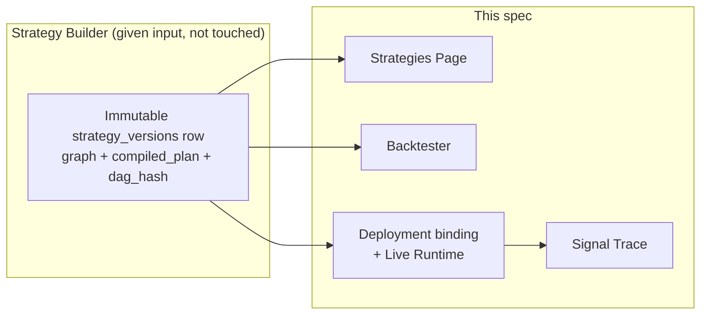
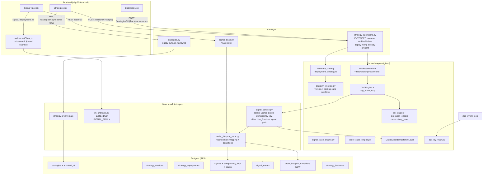

# Design Document: Trading Lifecycle Integration

## Overview

This design closes the gap between an immutable Strategy_Version produced by the
Strategy Builder (`.kiro/specs/strategy-builder/`) and that version's remaining
production life: appearing on the Strategies_Page, being backtested, being deployed
live, generating signals, and being inspected on the Signal_Trace_Page.

Investigation confirmed the requirements document's own finding: **the engines already
exist**. `BacktestRuntime` (`backend_app/backend/backtest_runtime.py`) already loads a
version's persisted `compiled_plan` and runs it through the real VectorBT engine.
`evaluate_binding` (`backend_app/backend/deployment_binding.py`) already gates a
deployment on lifecycle readiness, ownership, market compatibility, mode rules and
model-artifact verification, and is already wired to a real endpoint —
`POST /api/strategy-operations/strategies/{id}/versions/{version}/deploy`. The version
lifecycle and deployment-binding state machines already exist in
`strategy_lifecycle.py`, complete with legal-transition tables, audit hooks and a
kill-switch integration. `OwnedChannelFamily` already exists in `ws_channels.py` for
four resource families. `DistributedIdempotencyLayer` already exists with an
atomic-lock Lua script. None of this is rebuilt.

What is missing is narrower than the requirements' broad framing suggests, and this
design is precise about which of the two:

1. **The frontend calls the wrong endpoint.** `Strategies.jsx`'s deploy modal calls
   `POST /api/strategies/{id}/deploy` (`deploy_bot` in `routers/strategies.py`) — a
   pre-version-model path with no lifecycle gate, no market check, no model
   verification. The version-aware, fully-gated endpoint already exists one router
   over. `Backtester.jsx` calls the legacy `POST /api/strategies/backtest` job-queue
   endpoint, not `BacktestRuntime`. This is Requirements 5 and 11's core ask, and it is
   a rewire, not new backend code. `Strategies.jsx` also calls
   `PUT /api/strategies/{id}/rename`, which **does not exist anywhere in the backend** —
   confirmed by a full-repository grep. This is a defect, not a design gap, and this
   design specifies the missing endpoint.
2. **Three status vocabularies need one reconciliation layer.** `OrderState` (9
   values), `signals.status` (7 values, DB-unenforced), and `TraceStatus` (6 values) all
   describe the same underlying concept and disagree. Requirement 16 needs a fourth,
   canonical, 9-value vocabulary and a mapping *from* the other three — not a fourth
   independent column to keep in sync.
3. **`strategies` has no soft-delete column.** `DELETE /api/strategies/{id}` performs a
   real `DELETE` today. Requirement 3 needs an `archived_at` column and a rewritten
   delete handler.
4. **No Owned_Channel exists for signal trace.** The four existing families
   (`training`, `builder.validation`, `strategy`, `deployment`) do not cover signals;
   the legacy `ChannelType.SIGNAL_TRACE` is a flat, unauthorized broadcast channel.
5. **No durable idempotency key exists for the signal→order path.**
   `DistributedIdempotencyLayer` is a well-built Redis lock with a 1-hour result TTL —
   sized for a synchronous request, not for a signal's full lifecycle, and it has no
   database-level backstop should Redis be flushed or expire the key while an order is
   still open.
6. **The deployment gate is fail-fast, not collect-all.** Requirement 13.2 asks every
   failed condition to be reported at once; `evaluate_binding` raises on the *first*
   failing gate. This is a genuine behavioural gap this design closes.

Everything else this document touches — `BacktestRuntime`, `evaluate_binding`,
`strategy_lifecycle`, `signal_trace_engine`, `order_state_engine`, `ws_channels`,
`api_key_vault`, `DistributedIdempotencyLayer` — is reused as-is or extended. None of
it is duplicated. Per the requirements document's own non-functional constraint, no
existing authentication, RLS, risk, execution-guard or idempotency control is weakened
anywhere in this design.

---

## Scope boundary



Out of scope, per the requirements document: Marketplace listing/subscription and
Paper Trading as a distinct mode (Requirement 27 — extension points preserved, not
implemented). Not rebuilt: the canonical DAG schema, compiler, registry, or training
pipeline (all `.kiro/specs/strategy-builder/`).

---

## Architecture



Layering rule, matching the Strategy Builder design's own convention: the API layer
contains no reconciliation or gating logic of its own; `order_lifecycle_state.py` and
`signal_service.py` perform no I/O framework work (no FastAPI import); the reused
engines are not re-derived.

---

## Components and Interfaces

### Component disposition

| Component | File | Disposition | Reason |
|---|---|---|---|
| Backtest runtime | `backend_app/backend/backtest_runtime.py` | **REUSED AS-IS** | `run_version_backtest` / `load_version_plan` already load the persisted `compiled_plan` and reuse the hash-recompile pattern. Nothing here needs to change; the frontend needs to call it (Requirement 5). |
| Backtest execute endpoint | `routers/strategy_operations.py::execute_backtest` | **EXTENDED** | Already calls `BacktestRuntime.run_backtest`. Extended to resolve the exchange instance from the version's own market (public feed) instead of a hardcoded `ccxt.binance()`, and to accept a version reference rather than requiring the caller to reconstruct an `ExecutionGraph`. |
| Legacy backtest job queue | `routers/strategies.py::backtest` / `backtest_internal` | **RETAINED, NOT EXTENDED** | Kept for any external caller still using it. `Backtester.jsx` is re-pointed off it (Requirement 5.1). Not deleted: deleting a live route is a larger blast radius than this spec needs, and nothing in the requirements asks for its removal. |
| Deployment gate | `backend_app/backend/deployment_binding.py::evaluate_binding` | **EXTENDED** | Every gate function is reused unchanged. `evaluate_binding` itself is extended to *collect* every gate's verdict rather than raising on the first (Requirement 13.2) — see "Collect-all deployment validation" below. |
| Versioned deploy endpoint | `routers/strategy_operations.py::deploy_version` | **REUSED AS-IS** | Already the canonical `POST /strategies/{id}/versions/{version}/deploy`, already calls `evaluate_binding` through `StrategyService.deploy_version`. This *is* Requirement 11.5's gate; the frontend is what is re-pointed. |
| Legacy deploy endpoint | `routers/strategies.py::deploy_bot` | **RETAINED, NOT EXTENDED, FRONTEND STOPS CALLING IT** | `Strategies.jsx`'s Deploy Live action stops calling this. Kept for any other caller; not deleted for the same reason as the legacy backtest queue. |
| Lifecycle state machines | `backend_app/backend/strategy_lifecycle.py` | **REUSED AS-IS** | Version and binding transition tables, `apply_version_state`, `stop_deployments_for_reason`, kill-switch integration — all consumed unchanged. |
| Signal trace engine | `backend_app/backend/signal_trace_engine.py` | **REUSED AS-IS** | `SignalTraceEngine`, `SignalTraceRecord`, `TraceStatus` remain the DAG-observability record. This spec reads it (for `Order_Lifecycle_State` reconciliation) and writes to it exactly as today; its buffering/retention/cleanup loop is untouched. |
| Order state engine | `backend_app/core/order_state_engine.py` | **REUSED AS-IS** | `OrderState`, `OrderLifecycle`, fill/cancel/timeout handling untouched. Read by the reconciliation layer. |
| WebSocket channel families | `backend_app/backend/ws_channels.py` | **EXTENDED** | One new `OwnedChannelFamily` (`SIGNAL_FAMILY`) added to `OWNED_CHANNEL_FAMILIES`, following the exact pattern `EXECUTION_FAMILY` already establishes. Nothing existing is changed. |
| Credential vault | `backend_app/backend/api_key_vault.py` | **REUSED AS-IS** | Untouched. Continues to be the only place a key is decrypted. |
| Idempotency layer | `backend_app/core/distributed_idempotency.py` | **EXTENDED** | `execute_with_idempotency`'s locking algorithm is reused unchanged. Extended with a signal-scoped key-derivation helper and a longer, configurable result TTL for the trading path specifically (the existing default stays default for every other caller) — see "Idempotency key scheme" below. |
| `strategies` table | given, not created by any migration in this repo | **EXTENDED** | Add `archived_at TIMESTAMPTZ NULL` (migration 005a). |
| `signals` table | `002_signal_trace.sql` / `003_signal_trace_restoration.sql` | **EXTENDED** | Add `idempotency_key TEXT`, a `UNIQUE` constraint on it, a `CHECK` on `status` against the new 9-value vocabulary, and backfill mapping (migration 005b). |
| `signal_events` table | `002_signal_trace.sql` | **REUSED, CLARIFIED** | `002` creates it; `003`'s header claims it is unneeded. This spec settles the disagreement: Requirement 21.1 requires it, so it is treated as authoritative and is the store for `Order_Lifecycle_State` transition history (Requirement 16.7), not an in-memory reconstruction. |
| Strategies page (frontend) | `algo22-terminal/src/pages/Strategies.jsx` | **EXTENDED** | Deploy modal re-pointed to the versioned deploy endpoint; rename wired to the new endpoint; delete re-pointed to the archive endpoint; health/backtest/deployment fields read from real data only. |
| Backtester page (frontend) | `algo22-terminal/src/pages/Backtester.jsx` | **EXTENDED** | Run button re-pointed to `POST /strategies/{id}/backtests/execute`; save-result flow simplified to match (the endpoint now returns a persisted result directly). |
| Signal Trace page (frontend) | `algo22-terminal/src/pages/SignalTrace.jsx` | **EXTENDED** | Realtime wiring moved from the optional embedded visualization panel to the primary signal list/detail view, subscribed to the new Owned_Channel. |

### New module: `order_lifecycle_state.py`

Pure, no I/O — same convention as `strategy_dag/schema.py`. Owns the canonical
vocabulary, the reconciliation mapping, and the transition table.

```pascal
STRUCTURE OrderLifecycleState IS ENUM
  GENERATED, PENDING, SUBMITTED, PARTIALLY_EXECUTED, EXECUTED, CLOSED,
  FAILED, CANCELLED, REJECTED
END STRUCTURE

CONSTANT TERMINAL_STATES = {CLOSED, FAILED, CANCELLED, REJECTED}
CONSTANT NON_TERMINAL_STATES = {GENERATED, PENDING, SUBMITTED, PARTIALLY_EXECUTED, EXECUTED}
```

### New module: `signal_service.py`

Owns Signal persistence, idempotency-key derivation, and the wiring between the
Live_Runtime's ACTION-node output and the risk/execution path. Exposed functions:

- `generate_signal(deployment, node_output) -> Signal` — mints the signal id, persists
  a `GENERATED` row, returns the `Signal`.
- `idempotency_key_for(signal) -> str` — deterministic, pure function (see "Idempotency
  key scheme").
- `submit_signal(signal) -> OrderLifecycleState` — routes through
  `execute_with_idempotency`, `risk_engine`, `execution_engine`; writes every
  transition through `order_lifecycle_state.record_transition`.

### New router: `signal_trace.py`

Owns `/api/signal-trace/*` (the paths `SignalTrace.jsx` already calls), reading through
`order_lifecycle_state.py` and `signal_trace_engine.py`, writing nothing on the read
paths. Deploy-scoped write paths (cancel not applicable — signals are not cancellable
by the trace viewer) are not added; this surface is read-only per Requirement 17.

---

## Data Models

### Canonical status vocabulary and its reconciliation (Requirement 16)

The three existing vocabularies, exactly as found:

| Source | Values |
|---|---|
| `OrderState` (`core/order_state_engine.py`) | `created, submitted, open, partial, filled, cancelling, cancelled, failed, timed_out` |
| `signals.status` (`002_signal_trace.sql`, DB-unenforced) | `pending, accepted, rejected, executed, failed, cancelled, expired` |
| `TraceStatus` (`signal_trace_engine.py`) | `pending, running, completed, failed, blocked, timeout` |

Canonical `Order_Lifecycle_State` (Requirement 16.1):

```
GENERATED, PENDING, SUBMITTED, PARTIALLY_EXECUTED, EXECUTED, CLOSED,
FAILED, CANCELLED, REJECTED
```

**The reconciliation mapping is total and one-directional**, exactly the shape
Requirement 16.3 asks for. Expressed as three lookup tables, one per source, each
covering every member of its source enum plus the internal pre-submission sub-states
Requirement 16.3 names (all of which map to `PENDING`):

```pascal
CONSTANT ORDER_STATE_MAP: Map<OrderState, OrderLifecycleState> = {
  created:    PENDING,          // not yet sent to the exchange
  submitted:  SUBMITTED,
  open:       SUBMITTED,        // confirmed open, no fill yet
  partial:    PARTIALLY_EXECUTED,
  filled:     EXECUTED,
  cancelling: PENDING,          // cancel requested, not yet confirmed
  cancelled:  CANCELLED,
  failed:     FAILED,
  timed_out:  FAILED,
}

CONSTANT SIGNALS_STATUS_MAP: Map<String, OrderLifecycleState> = {
  pending:   PENDING,
  accepted:  SUBMITTED,
  rejected:  REJECTED,
  executed:  EXECUTED,
  failed:    FAILED,
  cancelled: CANCELLED,
  expired:   CANCELLED,         // an expired signal never became an order
}

CONSTANT TRACE_STATUS_MAP: Map<TraceStatus, OrderLifecycleState> = {
  pending:   PENDING,
  running:   PENDING,           // mid-DAG-evaluation, no order yet
  completed: EXECUTED,          // decision reached EXECUTE and it settled
  failed:    FAILED,
  blocked:   REJECTED,          // risk validation blocked it
  timeout:   FAILED,
}

// Requirement 16.3's internal-only pre-submission sub-states (risk-check-pending,
// approved-pending-submission) are not enum members anywhere in this codebase; they
// exist only as intermediate booleans on RiskValidationTrace. Both map to PENDING.
```

`CLOSED` is reached only through the canonical machine's own transition
(`EXECUTED -> CLOSED`, meaning the position this order opened/closed was fully
reconciled) — no source vocabulary has an equivalent state, because none of the three
existing systems models "closed" as distinct from "filled". This is why the
reconciliation table is one-directional: a source value maps forward onto the
canonical vocabulary, but the canonical vocabulary has states (`CLOSED`) with no
source-side equivalent, and computing `CLOSED` requires cross-referencing
`fill_deduplication_manager` / position-close data that none of the three sources
carries alone.

**Conflict resolution (Requirement 16.5).** When the three sources disagree for the
same signal/order pair at the same instant, the resolver applies fixed priority
`OrderState > signals.status > TraceStatus` and returns exactly one value:

```pascal
FUNCTION resolve_order_lifecycle_state(order_state, signals_status, trace_status) -> OrderLifecycleState
BEGIN
  IF order_state IS NOT NULL THEN RETURN ORDER_STATE_MAP[order_state] END IF
  IF signals_status IS NOT NULL THEN RETURN SIGNALS_STATUS_MAP[signals_status] END IF
  IF trace_status IS NOT NULL THEN RETURN TRACE_STATUS_MAP[trace_status] END IF
  RETURN GENERATED  // nothing reported yet; the signal was just minted
END
```

**Transition table (Requirement 16.4).** Enforced by the new `order_lifecycle_state.py`,
following exactly the pattern `strategy_lifecycle.VERSION_TRANSITIONS` already
establishes in this codebase:

```pascal
CONSTANT ORDER_LIFECYCLE_TRANSITIONS: Map<OrderLifecycleState, Tuple<OrderLifecycleState>> = {
  GENERATED:          (PENDING, REJECTED, FAILED, CANCELLED),
  PENDING:            (SUBMITTED, REJECTED, FAILED, CANCELLED),
  SUBMITTED:          (PARTIALLY_EXECUTED, EXECUTED, REJECTED, FAILED, CANCELLED),
  PARTIALLY_EXECUTED: (PARTIALLY_EXECUTED, EXECUTED, FAILED, CANCELLED),
  EXECUTED:           (CLOSED, FAILED),
  CLOSED:             (),
  FAILED:             (),
  CANCELLED:          (),
  REJECTED:           (),
}
```

This is a strict reading of Requirement 16.4's grammar
(`GENERATED -> PENDING -> SUBMITTED -> PARTIALLY_EXECUTED -> EXECUTED -> CLOSED`, plus
the `PARTIALLY_EXECUTED` self-loop, plus failure branches "reachable from any
non-terminal state that the underlying OrderState machine's own transition rules
permit"). Cross-checked against `OrderStateEngine`'s own ad-hoc guards (no explicit
transition table exists there — confirmed by direct reading of
`core/order_state_engine.py`): `OrderState` permits cancel/fail from every non-terminal
state, which is exactly what the canonical table above allows.

**Persistence layer rejection (Requirement 16.6).** The `strategy_deployments`-pattern
convention already established by `004c_immutable_versions.sql` is followed:
`order_lifecycle_transitions` (new table, see Data Models below) has no unreachable
value to reject at the *table* level because it is an append-only log of transitions
that already passed `order_lifecycle_state.assert_transition_legal` before the write —
the same order the Strategy Builder's `strategy_lifecycle.apply_version_state` uses
(gate, then write, then audit). `signals.status` itself gets a `CHECK` constraint
against the 9-value vocabulary (so a write outside the vocabulary is a 23514, not a
silent write of an invalid label), but transition legality is enforced in application
code before the write, exactly as `strategy_lifecycle.py` does today for lifecycle
states — the requirement's "Persistence_Layer SHALL reject the write" is satisfied by
the same architecture already proven in this codebase for the sibling problem.

### Collect-all deployment validation (Requirement 13.2)

`evaluate_binding` today raises `DeployRejected` on the **first** gate that fails
(lifecycle → market → mode → model → ownership → symbol → timeframe, in that exact
order, confirmed by direct reading). Requirement 13.2 asks for every failed condition
in one response. The fix does not change any gate function — every `assert_*` function
in `deployment_binding.py` is reused verbatim — it changes only the calling
convention:

```pascal
ALGORITHM evaluate_binding_collect_all(sb, user, version_row, strategy_id, version, request)
OUTPUT: ValidationSummary { passed: List<Condition>, failed: List<DeployRejected>, pending: List<Condition> }

BEGIN
  results ← EMPTY LIST

  FOR each gate IN [
    assert_version_ready, resolve_binding_market, normalise_mode_and_13_6,
    assert_models_verified, load_owned_exchange_account_and_risk_config,
    assert_symbol_available, assert_timeframe_supported
  ] DO
    TRY
      outcome ← gate(...)                 // unchanged gate function
      results.append(Condition(gate.name, PASSED, outcome))
    CATCH DeployRejected AS e
      results.append(Condition(gate.name, FAILED, e))
      // a later gate that depends on this one's output (e.g. symbol availability
      // depends on the resolved account) is marked PENDING, not silently skipped,
      // so the summary is honest about what could not yet be checked
      mark_dependents_pending(gate.name, results)
    END TRY
  END FOR

  RETURN ValidationSummary(results)
END
```

This is additive: `evaluate_binding` (the function existing callers use) is kept for
callers that want fail-fast (the actual `POST .../deploy` write path, which should
still refuse atomically on the first real problem rather than doing extra ownership
reads after a lifecycle failure). A new `evaluate_binding_summary` is what the
pre-deployment validation summary (Requirement 13.3) and the Deploy-button
enable/disable logic (Requirement 13.4/13.5) call — a **read-only, side-effect-free**
call the frontend can poll while the deployment configuration workflow is open,
distinct from the write path that actually creates the binding.

### `strategies` archival (Requirement 3)

```sql
-- migration 005a_strategy_archive.sql
ALTER TABLE strategies
  ADD COLUMN IF NOT EXISTS archived_at TIMESTAMPTZ NULL;

CREATE INDEX IF NOT EXISTS idx_strategies_archived_at ON strategies(archived_at)
  WHERE archived_at IS NULL;   -- partial index speeds the default (non-archived) list
```

`archived_at IS NULL` means active; a timestamp means archived and *when*. No `CHECK`
constraint is needed — a nullable timestamp is its own two-state vocabulary and there
is nothing to validate beyond "is it set". Archiving never cascades: no `ON DELETE`
behaviour changes, and no existing FK (`strategy_versions.strategy_id`,
`strategy_backtests.strategy_id`, `strategy_deployments.strategy_id`,
`signals.strategy_id`) is touched, satisfying Requirement 3.5 and Requirement 21.6 by
construction — there is nothing to cascade because archiving is an `UPDATE`, never a
`DELETE`.

```pascal
ALGORITHM archive_strategy(sb, user, strategy_id)
BEGIN
  strategy ← load_owned_strategy(sb, user_id, strategy_id)   // 404 if not owned, per Req 20.2
  IF strategy IS NULL THEN RAISE NotFound END IF
  IF strategy.archived_at IS NOT NULL THEN
    RETURN { status: "already_archived", strategy_id }      // Requirement 3.6, idempotent
  END IF

  blocking ← load_deployments(sb, strategy_id)
             .filter(d -> binding_state(d) IN STOPPABLE_BINDING_STATES)
  IF blocking IS NOT EMPTY THEN
    RAISE ArchiveRejected("STRATEGY_HAS_ACTIVE_DEPLOYMENTS", {
      blocking_deployments: [ {id, binding_state} for d in blocking ]
    })                                                        // Requirement 3.1
  END IF

  UPDATE strategies SET archived_at = now() WHERE id = strategy_id AND user_id = user.id
  record_audit(StrategyAuditAction.ARCHIVED, ...)
  RETURN { status: "archived", strategy_id, archived_at }
END
```

`STOPPABLE_BINDING_STATES` is imported from `strategy_lifecycle.py` unchanged — the
same set (`DEPLOYING`, `RUNNING`, `PAUSED`) that module already uses to decide which
deployments a kill switch stops. Reusing it here means "does this strategy have an
active deployment" cannot answer differently in the archive gate than it does in the
kill-switch path.

### Signals table extensions (Requirements 16, 19, 21)

```sql
-- migration 005b_signal_lifecycle_and_idempotency.sql

-- ── Canonical status, backed by a CHECK, backfilled from the existing column ──
ALTER TABLE signals
  ADD COLUMN IF NOT EXISTS idempotency_key TEXT,
  ADD COLUMN IF NOT EXISTS order_lifecycle_state TEXT;

-- Backfill: map every existing legacy status value through SIGNALS_STATUS_MAP.
-- Application code performs the backfill (one UPDATE per legacy value, not a
-- server-side function), so the mapping lives in exactly one place
-- (order_lifecycle_state.py) rather than being restated in SQL.

ALTER TABLE signals
  ADD CONSTRAINT chk_signals_order_lifecycle_state
    CHECK (order_lifecycle_state IN (
      'GENERATED','PENDING','SUBMITTED','PARTIALLY_EXECUTED','EXECUTED',
      'CLOSED','FAILED','CANCELLED','REJECTED'
    ));

-- Requirement 21.2: unique idempotency key per order submission. Partial index so a
-- NULL key (a signal that never reached submission) never collides with another NULL.
CREATE UNIQUE INDEX IF NOT EXISTS uq_signals_idempotency_key
  ON signals(idempotency_key) WHERE idempotency_key IS NOT NULL;

CREATE INDEX IF NOT EXISTS idx_signals_lifecycle_state ON signals(order_lifecycle_state);

-- ── Requirement 16.7's transition history ──
CREATE TABLE IF NOT EXISTS order_lifecycle_transitions (
    id            UUID PRIMARY KEY DEFAULT gen_random_uuid(),
    signal_id     UUID NOT NULL REFERENCES signals(id) ON DELETE CASCADE,
    user_id       UUID NOT NULL REFERENCES auth.users(id) ON DELETE CASCADE,
    from_state    TEXT,                       -- NULL for the first transition
    to_state      TEXT NOT NULL,
    reason        TEXT,
    occurred_at   TIMESTAMPTZ NOT NULL DEFAULT NOW(),
    CONSTRAINT chk_olt_to_state CHECK (to_state IN (
      'GENERATED','PENDING','SUBMITTED','PARTIALLY_EXECUTED','EXECUTED',
      'CLOSED','FAILED','CANCELLED','REJECTED'
    ))
);

CREATE INDEX IF NOT EXISTS idx_olt_signal_time ON order_lifecycle_transitions(signal_id, occurred_at);
CREATE INDEX IF NOT EXISTS idx_olt_user ON order_lifecycle_transitions(user_id);

ALTER TABLE order_lifecycle_transitions ENABLE ROW LEVEL SECURITY;
CREATE POLICY olt_owner_select ON order_lifecycle_transitions
  FOR SELECT USING (user_id = auth.uid());
CREATE POLICY olt_owner_insert ON order_lifecycle_transitions
  FOR INSERT WITH CHECK (user_id = auth.uid());
-- No UPDATE, no DELETE policy: a transition log is append-only, matching the existing
-- convention on signal_events (002_signal_trace.sql grants SELECT + INSERT only).
```

### Idempotency key scheme (Requirement 19)

`DistributedIdempotencyLayer.execute_with_idempotency` is reused unchanged — its
atomic Lua-script lock, its owner-token compare-and-delete release, and its
fail-closed-in-production posture on a Redis error are exactly the guarantees
Requirement 19.1/19.5 ask for. Two things are new, both additive:

**1. Deterministic key derivation.** The key is a pure function of the Signal's own
identity, never a value the caller invents per attempt:

```pascal
FUNCTION idempotency_key_for(signal: Signal) -> String
BEGIN
  // signal.id is minted once, at generation (Requirement 15.1), and never reused.
  // Deriving the key from it — rather than from an order-attempt counter or a
  // timestamp — is what makes a network retry, a WebSocket reconnect, and a worker
  // restart submitting for the SAME signal all compute the SAME key.
  RETURN "signal:" + signal.id
END
```

This is called as the `client_order_id` argument to
`DistributedIdempotencyLayer.execute_with_idempotency(tenant_id=user_id,
client_order_id=idempotency_key_for(signal), operation=submit_to_exchange, ...)` — no
new locking code, the existing atomic check-and-set is reused verbatim.

**2. A TTL long enough for a signal's real lifetime, plus a durable backstop.**
`DistributedIdempotencyLayer.RESULT_TTL = 3600` (one hour) is correct for the
layer's original purpose (a synchronous HTTP request retry) and is **not** widened
globally — every existing caller keeps the 1-hour default. The trading path calls
`execute_with_idempotency` with an explicit `result_ttl` override (a new optional
keyword argument, defaulting to the existing `RESULT_TTL` so no other caller's
behaviour changes) sized to the platform's own order-timeout ceiling
(`OrderStateEngine.default_timeout_seconds`, currently 30s, multiplied by
`MAX_RETRY_ATTEMPTS` plus headroom — configured, not hardcoded, at
`SIGNAL_IDEMPOTENCY_RESULT_TTL_SECONDS`, default 6 hours). Redis TTL expiry is not the
only guarantee, by design: the `uq_signals_idempotency_key` unique index above is the
**durable backstop** — even if Redis is flushed or a key expires mid-flight, a second
`INSERT` attempt with the same `idempotency_key` fails at the database, and the
existing crash-recovery convention (querying the exchange by client order id,
Requirement 19.2) is what resolves the ambiguity, not a second Redis lock.

```pascal
ALGORITHM submit_signal(signal, user)
BEGIN
  key ← idempotency_key_for(signal)
  TRY
    outcome ← idempotency_layer.execute_with_idempotency(
      tenant_id := user.id,
      client_order_id := key,
      result_ttl := SIGNAL_IDEMPOTENCY_RESULT_TTL_SECONDS,
      operation := lambda: route_through_risk_and_execution(signal)
    )
  CATCH DuplicateOrderError
    // Someone else's concurrent attempt is in flight or already resolved; this is
    // NOT a failure, it is Requirement 19.1's "at most one order" holding.
    RETURN load_current_order_lifecycle_state(signal)
  CATCH RuntimeError AS e   // Redis unreachable, fail-closed in production
    record_transition(signal, to := PENDING, reason := "idempotency store unavailable")
    RETURN PENDING          // Requirement 19.5: withheld, not submitted unguarded
  END TRY
  RETURN outcome
END
```

---

## API surface

Additive to `strategy_operations.py` and `strategies.py`, per Requirement 22.1's
convention (extend the existing routers; a new router is used only for the genuinely
new resource, signal trace, which has no existing router home).

| Method | Path | Purpose | Notes |
|---|---|---|---|
| PUT | `/api/strategies/{id}/rename` | Rename a strategy | **New — closes the confirmed-missing endpoint the frontend already calls.** Validates 1-100 chars trimmed (Requirement 2.6); touches only `strategies.name`. |
| DELETE | `/api/strategies/{id}` | Archive a strategy | **Rewired**, not renamed: same path and method the frontend already calls, now performs `archive_strategy` (soft) instead of a hard row delete. Refuses with 409 naming blocking deployments (Requirement 3.1). |
| GET | `/api/strategies?include_archived=` | List strategies | Extended: default excludes archived (Requirement 3.3); `include_archived=true` for history/audit views. |
| POST | `/api/strategy-operations/strategies/{id}/versions/{version}/deploy` | Deploy | **Reused as-is.** The frontend is what changes (see Frontend design). |
| GET | `/api/strategy-operations/strategies/{id}/versions/{version}/deploy/preflight` | Pre-deployment validation summary | **New.** Calls `evaluate_binding_summary` (collect-all, read-only). Response shape below. |
| POST | `/api/strategy-operations/strategies/{id}/backtests/execute` | Run a backtest through `BacktestRuntime` | **Extended**: accepts `{version_id}` and resolves symbol/exchange from the version's own DATA node via the public feed (`ConnectionEngine` with no account, same pattern `preview_node` already uses for market previews), rather than requiring the caller to reconstruct an `ExecutionGraph` and rather than hardcoding `ccxt.binance()`. |
| GET | `/api/signal-trace/signals` | List signals, filtered | **New router.** Query params: `strategy_id, strategy_version, deployment_id, symbol, side, order_lifecycle_state[], date_from, date_to, limit(<=100), offset`. Multi-value filters combine AND-across-categories / OR-within-category (Requirement 17.2). |
| GET | `/api/signal-trace/signals/{signal_id}` | One signal's full trace | **New.** DAG node trace + ML inference + risk validation + execution outcome, read from `signal_trace_engine` joined with the persisted `signals` row. |
| GET | `/api/signal-trace/signals/export` | CSV/JSON export | **New**, matches the export call `SignalTrace.jsx` already makes. |

**Preflight response shape** (Requirement 13.3):

```json
{
  "deployable": false,
  "conditions": [
    {"name": "version_ready", "status": "passed"},
    {"name": "exchange_account", "status": "passed", "detail": {"exchange_id": "kraken"}},
    {"name": "account_balance", "status": "failed", "code": "INSUFFICIENT_BALANCE",
     "message": "Available balance $412.00 is less than the required $500.00 (notional + fees)."},
    {"name": "symbol_available", "status": "pending", "reason": "blocked by account_balance"}
  ]
}
```

Status codes follow the existing convention throughout: `422` for a validation
failure with the full report, `409` for a lifecycle conflict, `404` for a resource not
owned by the caller (never `403` — the established convention in
`deployment_binding.py` and `strategy_operations.py`), `429` from the existing
`slowapi` limiter.

---

## WebSocket design (Requirements 18, 23, 24)

### New Owned_Channel family

```pascal
SIGNAL_FAMILY = OwnedChannelFamily(
  namespace := "signal",
  resource  := "deployment_id",       // same resource identity as EXECUTION_FAMILY
  events    := SignalEvent            // NEW enum: GENERATED, STATUS_CHANGED, SNAPSHOT
)
```

Scoped to `deployment_id`, matching `EXECUTION_FAMILY`'s own resource choice rather
than inventing a new owner-resolution path: a deployment already resolves
unambiguously to one user (`strategy_deployments.user_id`), and
`core/websocket_auth.authorize_channel_subscription` already knows how to check
ownership of a `deployment_id` for the `EXECUTION_FAMILY` and `DEPLOYMENT_FAMILY`
channels — the same lookup is reused for `SIGNAL_FAMILY`, not re-implemented.

A Signal_Trace_Page filtered by **strategy** (Requirement 17.4's entry path from
Strategies_Page) subscribes to the channel of every deployment that strategy currently
has (a strategy has at most a handful of concurrent deployments; the client fetches
the strategy's deployment list once and holds one channel per active deployment,
releasing each through `websocketClient.unsubscribeChannel` on deployment stop). This
reuses the ref-counted, resubscribe-on-reconnect mechanism `websocketClient.js` already
implements for the Builder's channels (confirmed present: `acquire`/`release`,
`subscribeChannel`/`unsubscribeChannel`, resubscribe-then-snapshot on `onOpen`,
jittered exponential backoff, `reauthenticate` without reconnect) — nothing new is
built in the client for connection management, only a new channel name pattern is
subscribed to.

`Live_Runtime` and `signal_trace_engine` stop publishing to the legacy, unauthorized
`ChannelType.SIGNAL_TRACE` broadcast for the Signal_Trace_Page's traffic
(Requirement 23.7); that legacy channel is left in place for any other consumer not
covered by this spec, unchanged.

### Sequencing, dedup, ordering, backpressure

`websocketClient.js` already implements a general sequence-number gap-detection and
replay-request mechanism (`expectedSequence`, `messageBuffer`, `requestMessageReplay`)
at the connection level. The signal-trace frames ride this existing mechanism; nothing
new is added to the client. What is new is on the **server** side: every frame
published to a `signal.{deployment_id}` channel carries a monotonically increasing
`seq` scoped to that channel (Requirement 23.6), assigned by a single counter per
deployment (`ws_channels.next_signal_sequence(deployment_id)`, an in-process counter
seeded from the deployment's own row on subscribe — no new persistent sequence table,
because the sequence only needs to be monotonic for the lifetime of one connection's
subscription, which is exactly what the existing client-side gap detector already
assumes for the Builder's channels).

Dedup by stable identity (Requirement 18.4) is enforced twice, deliberately: the
`seq` mechanism catches network-level duplication and reordering; a **content-level**
key (`f"{signal_id}:{order_lifecycle_state}"`) is additionally carried on every frame
so a replayed snapshot after reconnect (which necessarily reuses lower sequence
numbers on the new connection) cannot re-apply a state change the client already has.
The Signal_Trace_Page's reducer discards a frame whose content key it has already
applied, independent of `seq`.

### Reconnect and snapshot

Unchanged mechanism, new snapshot content: `onOpen`'s existing "resubscribe, then
request a snapshot" order (`websocketClient.js`, confirmed present) fires
`GET /api/signal-trace/signals?deployment_id=...&since=<last_known_seq>` — a plain REST
call, not a new WebSocket message type — closing the gap the same way the Builder's
own reconnect contract does (`design.md`'s "request a snapshot rather than assuming no
updates were missed").

---

## Frontend design

### Strategies Page

- **List and health**: `GET /api/strategies` populated the list already; health is now
  computed client-side purely from the strategy's own `most_recent_deployment.status`
  and `most_recent_backtest.outcome` fields the list endpoint already returns —
  `undetermined` when both are absent (Requirement 1.9, Property P1 below).
- **Deploy Live**: `handleOpenDeployModal` / `handleConfirmDeploy` are re-pointed from
  `endpoints.strategies.deploy(id, {...})` (→ `POST /api/strategies/{id}/deploy`,
  legacy) to `POST /api/strategy-operations/strategies/{id}/versions/{version}/deploy`
  with the `DeploymentBindingRequest` body shape (`mode`, `exchange_account_id`,
  `risk_config_id`, `execution_config`). The modal's account selector is unchanged (it
  already lists connected accounts via `endpoints.exchange.list()`); what changes is
  which endpoint receives the selection. The Deploy button's enabled state is now
  driven by polling `GET .../deploy/preflight` while the modal is open, exactly
  matching Requirement 13.4/13.5/13.6.
- **Rename**: re-pointed from a raw `fetch` against the non-existent
  `PUT /api/strategies/{id}/rename` to the same path, now real. No other change —
  the frontend code was already correct about which endpoint *should* exist; the
  backend catches up.
- **Delete**: `DELETE /api/strategies/{id}` is unchanged at the call site; the
  confirmation dialog text changes from "delete" to "archive" language, and a 409
  response (blocking deployments) is rendered as the specific error Requirement 2.10
  asks for, naming each blocking deployment.
- **Backtest / Trace navigation**: unchanged — both already just `navigate()` to the
  other two pages with a query param.

### Backtester

- **Run**: re-pointed from `endpoints.strategies.backtest(payload)`
  (→ `POST /api/strategies/backtest`, the legacy job-queue path building a bespoke
  `dag` payload) to `POST /api/strategy-operations/strategies/{id}/backtests/execute`
  with `{version_id, start_date, end_date, initial_capital, ...}`. The
  `toCanonical()` serialization step the page already performs is no longer needed on
  this path (the backend loads the version's own persisted canonical graph), so it is
  removed from `runBacktest`'s call chain, and the response is consumed directly
  rather than polled by job id (the extended endpoint runs synchronously, matching
  what `execute_backtest`'s docstring already describes as its behaviour).
- **Save result**: the two-step `create_backtest` + `update_backtest_results` flow
  collapses to one, because the extended execute endpoint persists its own
  `strategy_backtests` row (via `BacktestService.create_backtest` +
  `update_backtest_results`, called server-side, matching what `BacktestRuntime.
  run_backtest` already does internally) — `handleSaveBacktest`'s client-side glue is
  removed; the "Save Backtest Run" button becomes unnecessary and is removed from the
  UI, replaced by the result simply appearing in "Saved Backtest History" on
  completion.
- **Data validation**: the existing pre-run call to
  `POST /api/strategy-operations/backtests/validate-data` is unchanged.

### Deployment configuration workflow

New, small: a panel inside the existing deploy modal rendering the preflight
conditions list (Requirement 13.3) with per-condition pass/fail/pending status, backed
by a 2-second poll of `GET .../deploy/preflight` while the modal is open, following
the general "keep in sync" contract of Requirement 24.

### Signal Trace Page

- **List/detail fetch**: unchanged REST calls (`GET /api/signal-trace/signals`,
  `GET /api/signal-trace/signals/{id}`) — the router did not exist; this design adds
  it under the paths the frontend already calls.
- **Realtime**: the connection-status indicator (Requirement 18.9) and the
  subscribe-per-deployment logic described above are added to the main list view,
  not only to the optional `SignalTraceVisualization` panel. `showLivePipeline`'s
  panel stays as an additional, opt-in detailed view; it is not the only realtime path
  any more.

### Shared state (Requirement 24)

All four surfaces already use one `api` client module and one `websocketClient`
singleton (confirmed present) — no new data-fetching abstraction is introduced. The
existing `endpoints.strategies.*` wrapper functions are extended with the new
endpoints above rather than bypassed with raw `fetch` calls (closing the inconsistency
already visible in `Strategies.jsx`'s clone/rename handlers, which used raw `fetch`
where every other action used the `endpoints` module).

---

## Error handling

| Scenario | Condition | Response | Recovery |
|---|---|---|---|
| Deploy attempted on non-READY version | lifecycle gate fails | `409`, names state + outstanding prerequisite (existing `outstanding_prerequisite` helper, reused) | finish training / re-save version |
| Deploy preflight, multiple conditions failing | collect-all summary | `200` with `deployable: false` and every failed condition named | fix each in turn, poll again |
| Archive with active deployment | `strategy_has_active_deployments` | `409` naming each blocking deployment id + state | stop deployments first |
| Archive an already-archived strategy | idempotent | `200 {"status":"already_archived"}` | none needed |
| Rename with invalid length | empty after trim, or >100 chars | `422` naming the reason | resubmit |
| Signal submission while idempotency store down | Redis unreachable | signal held at `PENDING`; retried under the same key once Redis recovers | automatic |
| Duplicate signal submission (retry, reconnect, worker restart) | idempotency key collision | `DuplicateOrderError` caught, current state returned, no second order | none needed — at-most-one already holds |
| Signal generated while feed stale/gapped | feed_state not LIVE beyond threshold | generation suspended for that deployment, state marked accordingly | resumes automatically once feed recovers |
| Order_Lifecycle_State write outside legal transition | `assert_transition_legal` fails before write | `409`, names current state and legal next states | investigate; state is not corrupted, because the illegal write never landed |
| Non-owner references a strategy/signal/deployment | ownership mismatch | `404`, identical to non-existence | none — this is the deliberate answer |
| WebSocket subscription to a channel not owned | ownership check fails | subscription refused, no existence-confirming detail | client shows a generic "channel unavailable" state |
| Cross-tenant subscription probe | same as above | refusal is identical whether the resource exists or not | — |

Cross-cutting: no bare `except Exception` on a path that would otherwise silently
report a deployment as bound, a signal as submitted, or a transition as recorded when
it was not — matching the standard the Strategy Builder design already set and that
`deployment_binding.py` / `strategy_lifecycle.py` already demonstrate throughout.

---

## Correctness Properties

*A property is a characteristic or behavior that should hold true across all valid
executions of a system — essentially, a formal statement about what the system should
do. Properties serve as the bridge between human-readable specifications and
machine-verifiable correctness guarantees.*

### Property 1: Health indicator is a pure function of deployment and backtest state

For any strategy, its displayed health indicator depends only on its most recent
Deployment status and most recent Backtest_Result outcome, and is `undetermined` when
neither exists — never a default, zero-valued, or fabricated state.

**Validates: Requirements 1.8, 1.9**

### Property 2: A strategy is archivable only when it has no active deployment

For any strategy and any set of its deployments, an archive request succeeds if and
only if none of its deployments are in `DEPLOYING`, `RUNNING`, or `PAUSED`; once
archived, every subsequent edit, rename, backtest, or deploy request against it is
refused.

**Validates: Requirements 3.1, 3.3**

### Property 3: Backtester entry-path independence

For any strategy, version, and configuration, running a backtest reached via the
Strategies_Page preselection path and running the identical configuration reached via
the standalone navigation entry produce byte-identical requests to the Backtest_Engine
and identical results.

**Validates: Requirements 4.7**

### Property 4: Universal backtest configuration sanity bounds

For any submitted backtest configuration, the Backtester accepts it if and only if
initial capital is greater than 0, every percentage-based parameter is within
`[0, 100]`, and the start date is strictly before the end date (for fields with no
engine-defined range) — and rejects it, naming the specific violated field, otherwise.

**Validates: Requirements 6.4**

### Property 5: Fixed-page-size pagination partitions any list without loss or reorder

For any list of trades (page size 25) or signals (page size 100), paginating it
produces disjoint pages whose concatenation, in page order, reconstructs the original
ordering exactly, and every page beyond the first contains `min(page_size, remaining)`
items.

**Validates: Requirements 9.3, 17.5**

### Property 6: Backtest results are immutable once persisted

For any persisted Backtest_Result and any subsequent attempt to modify its stored
configuration, metrics, or trade detail, the attempt is rejected and the stored values
are byte-identical to their state immediately before the attempt.

**Validates: Requirements 10.2**

### Property 7: An order reaches the exchange only through an approved signal

For any generated Signal and any risk/execution verdict pair, an order is submitted to
the exchange if and only if both risk validation and execution validation approved it;
a rejection by either results in the Signal's outcome being persisted as rejected and
no order submission. This composes with, and does not restate, the Strategy Builder's
existing runtime-readiness property (all upstream nodes must be `READY` before an
intent is even proposed).

**Validates: Requirements 11.2, 11.3**

### Property 8: No signal is generated from a stale or gapped feed

For any deployment and any measured feed age, no Signal is generated while the
deployment's feed state is not `LIVE` under the platform's existing staleness
threshold; generation resumes automatically once the feed state returns to `LIVE`.

**Validates: Requirements 14.6**

### Property 9: The deployment validation gate reports every failed condition

For any combination of pass/fail outcomes across the mandatory deployment conditions,
the preflight summary's failed-condition set is exactly the set of conditions that
actually failed — no false positive, no omission, regardless of gate evaluation order.

**Validates: Requirements 13.2**

### Property 10: No credential or exchange identity appears in signal data

For any generated Signal, its persisted decision metadata, every API response
carrying it, and every log line written while processing it contain no exchange
credential, API key, secret, passphrase, or (outside the deployment binding's own
`exchange_account_id` reference) exchange identifier.

**Validates: Requirements 15.3, 15.4**

### Property 11: Every signal identifier is globally unique and never reused

For any number of signals generated across any number of strategies, deployments, and
users, no two signals share an identifier, and no identifier is ever assigned to a
second signal after the first is deleted or archived.

**Validates: Requirements 15.1**

### Property 12: The Order_Lifecycle_State reconciliation mapping is total and single-valued

For every value in `OrderState`, every value in `signals.status` (including its legacy
spellings), and every value in `TraceStatus`, the reconciliation mapping returns
exactly one of the nine canonical `Order_Lifecycle_State` values — never null, never
more than one.

**Validates: Requirements 16.2, 16.3**

### Property 13: Only the diagram's transitions are reachable

For any pair of canonical `Order_Lifecycle_State` values, a transition between them is
accepted if and only if it appears in the fixed transition table (including the
`PARTIALLY_EXECUTED` self-loop and the failure branches from every non-terminal
state); any other pair is rejected before being written.

**Validates: Requirements 16.4**

### Property 14: Conflicting source states resolve deterministically by priority

For any triple of (possibly disagreeing) `OrderState`, `signals.status`, and
`TraceStatus` readings for the same signal/order pair at the same instant, the
resolved canonical state is always the one implied by the highest-priority source that
reported a value, in the fixed order `OrderState > signals.status > TraceStatus`.

**Validates: Requirements 16.5**

### Property 15: Multi-category signal filters combine with AND-of-categories, OR-within-category semantics

For any signal set and any combination of active filter categories (strategy, version,
deployment, symbol, side, state, date range) each with any number of selected values, a
signal appears in the filtered result if and only if it matches at least one selected
value in every currently active category.

**Validates: Requirements 17.2**

### Property 16: Duplicate delivery never re-applies a state change

For any sequence of realtime frames, including exact repeats caused by network
retransmission, a reconnect-triggered replay, or a duplicate at the transport layer,
the client applies each distinct identified state change (keyed by its own stable
identity — a signal/state pair, or a channel/sequence pair) at most once, regardless
of how many times the underlying frame physically arrives.

**Validates: Requirements 18.4, 23.6**

### Property 17: Client-visible signal event order matches backend persistence order

For any sequence of status-change events for one signal, however they arrive over the
network (including out of order), the order in which the Signal_Trace_Page applies
them to its displayed state matches the order in which they were actually persisted on
the backend.

**Validates: Requirements 18.5**

### Property 18: The idempotency key is a deterministic, collision-resistant function of one signal

For any signal, deriving its idempotency key any number of times yields the identical
key every time, and for any two distinct signals, their derived keys never collide.

**Validates: Requirements 19.1**

### Property 19: Ownership-mismatch and non-existence are indistinguishable, on every transport

For any resource type covered by this specification (strategy, version, backtest,
deployment, signal, exchange account) and any pair of requests — one naming a resource
the caller does not own, one naming a resource that does not exist at all — the HTTP
response and the WebSocket subscription refusal are each identical between the two
cases, on every field.

**Validates: Requirements 20.2, 23.2**

### Property 20: Repeated deterministic backtests are identical

For any deterministic test strategy and any fixed Backtest_Configuration, running the
same configuration any number of times produces byte-identical computed metrics and
trade lists across every run.

**Validates: Requirements 26.5**

---

## Testing strategy

### Property-based tests

Library: **Hypothesis**, matching the Strategy Builder spec's established choice for
this codebase. Each property above becomes a single Hypothesis test tagged
`Feature: trading-lifecycle-integration, Property N: <text>`, run at a minimum of 100
iterations, generating:

| Property | Generator sketch |
|---|---|
| P1 | random `(deployment_status | None, backtest_outcome | None)` pairs |
| P2 | random strategies with random deployment-state sets |
| P4 | random numeric/date configurations, including boundary and negative values |
| P5 | random lists of trades/signals of varying length, including 0, 1, and exact-multiple-of-page-size lengths |
| P6 | random mutation attempts against random persisted result states |
| P7 | random (risk-verdict, execution-verdict) truth tables |
| P9 | random pass/fail vectors across the mandatory conditions |
| P11 | bulk-generated signal id sequences, checked for collision |
| P12 | every enum member of all three source vocabularies, exhaustively (a `Hypothesis.strategies.sampled_from` over each closed set, not a random generator, since the domain is finite and enumerable) |
| P13 | random state pairs, checked against the fixed table |
| P14 | random triples of source states, including all-agree and all-disagree cases |
| P15 | random signal sets and random filter-category combinations |
| P16 | random event sequences with injected exact duplicates and reordering |
| P18 | random signal identities, checked for derivation stability and cross-signal distinctness |
| P19 | random resource ids, matched against random non-owning users vs random non-existent ids |
| P20 | fixed deterministic strategy, repeated runs (N ≥ 3) |

Properties resting on finite, already-enumerable domains (P12) are exhaustive checks
rather than randomized samples, which is stronger than a 100-iteration random sample
for a domain of this size.

### Unit / example tests

- Rename length validation at the exact boundaries (0, 1, 100, 101 characters,
  including whitespace-only input).
- Archive: exact 409 body shape naming blocking deployments; idempotent re-archive.
- Deploy preflight: exact JSON shape for a fully-passed summary and a
  partially-failed one.
- Legacy endpoints (`POST /api/strategies/backtest`, `POST /api/strategies/{id}/deploy`)
  remain reachable and unchanged, confirmed by a regression test asserting their
  response shape is untouched (Requirement 22.3's "reuse, don't duplicate" cuts both
  ways: the legacy paths are not silently broken by this work either).
- Signal Trace filter UI: each filter category in isolation and pairwise combinations.
- WebSocket: the new `SIGNAL_FAMILY` channel name format, ownership refusal shape
  (identical to the HTTP 404 shape's field set), and that no field diverges from the
  existing four families' response conventions.

### Integration tests

- **End-to-end deterministic sandbox test (Requirement 26).** A single fixture
  strategy, built once through the existing Strategy Builder with a fixed seeded
  synthetic data source, exercised through: save → appears on Strategies_Page listing
  → `POST .../backtests/execute` completes and persists a `strategy_backtests` row →
  `POST .../versions/{v}/deploy` with `mode=paper` succeeds → at least one Signal is
  generated and reaches a terminal `Order_Lifecycle_State` distinguishable from a real
  fill → that signal appears with a full trace on `GET /api/signal-trace/signals`. The
  test additionally asserts, by inspecting the mocked/sandboxed exchange client, that
  **no real exchange order-placement call was made** — a structural assertion (call
  count == 0 on the real order-placement seam), not a behavioural inference.
- **Cross-tenant ownership suite (Requirement 20.4).** A generated matrix over
  {list, get, versions, update, archive, duplicate} × {backtests: list, create, get,
  archive} × {deployments: list, create, get, start, pause, stop} × {signal trace:
  list, get} against every endpoint this specification adds or extends, asserting a
  non-owning authenticated user receives the identical non-existence response on
  every one. This test enumerates the endpoint surface (a finite, explicit list this
  design maintains) rather than generating requests, per Requirement 20.4's own
  wording that this is a mandated suite, not a property generator.
- **Crash-recovery regression suite (Requirement 19.4).** One test per named failure
  mode (worker crash mid-submission, API process restart, WebSocket disconnect,
  exchange connection disconnect, database/queue restart), each asserting: at most one
  order created at the exchange test double per signal; the signal's post-recovery
  `Order_Lifecycle_State` matches its true state at the exchange; no duplicate or
  orphaned record shares the signal's idempotency key.
- **Reconciliation backfill test.** Every existing `signals.status` value in a
  representative production-shaped dataset maps to a value in the new 9-value
  vocabulary with no row left `NULL` after the migration 005b backfill.

### Frontend tests

- `Strategies.jsx`: deploy modal submits to the versioned endpoint (assert on request
  URL and body shape, not just response handling); rename succeeds against the new
  endpoint; delete confirmation renders archive language and handles the 409 blocking
  case.
- `Backtester.jsx`: run button submits to `.../backtests/execute` with a `version_id`,
  not a reconstructed `dag` payload; result renders directly without a polling loop.
- `SignalTrace.jsx`: realtime indicator states (connected/reconnecting/disconnected);
  duplicate-frame suppression (Property 16) exercised against a mocked
  `websocketClient` emitting deliberately duplicated and reordered frames.

---

## Extension points preserved (Requirement 27)

- `strategy_deployments.mode`'s vocabulary (`paper`, `live`) is untouched by this
  design; a future `paper` (already present) or a marketplace-sourced deployment
  source is addable as an additional value with no rename of an existing one, because
  nothing in this design writes a third value or repurposes an existing one.
- `Order_Lifecycle_State`'s nine values and its transition table are closed sets
  *as read by this specification's tests*, but the reconciliation module
  (`order_lifecycle_state.py`) is structured as three independent lookup tables plus
  one transition table — adding a Paper_Trading-specific source vocabulary later means
  adding a fourth lookup table, not altering the canonical nine or the existing three.
- No column added by migrations 005a/005b is destructive: `archived_at`,
  `idempotency_key`, and `order_lifecycle_state` are all nullable additions;
  `order_lifecycle_transitions` is a new table. Nothing existing is dropped, renamed,
  or narrowed, satisfying Requirement 27.4's additive-only constraint directly.
- The Strategies_Page's "more actions" affordance (Requirement 25.4) is where a future
  disabled "List in Marketplace" / "Paper Trading" placeholder is added, per
  Requirement 27.2 — no code in this design occupies that space or wires it to a real
  endpoint.
