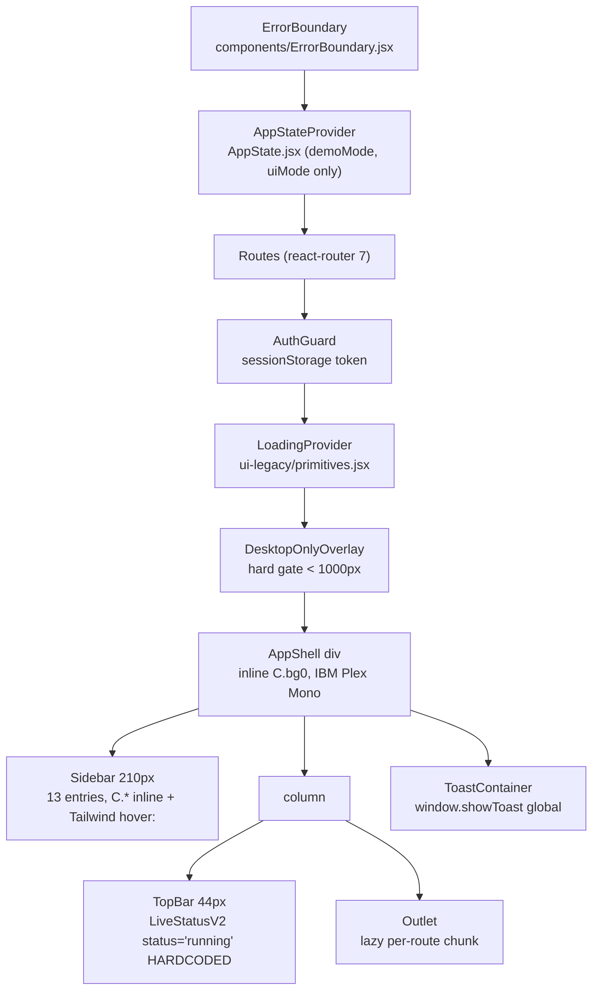
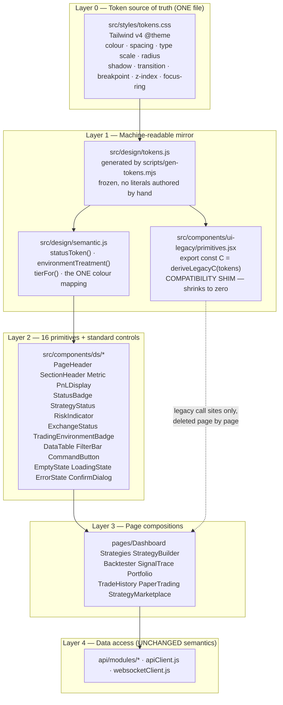
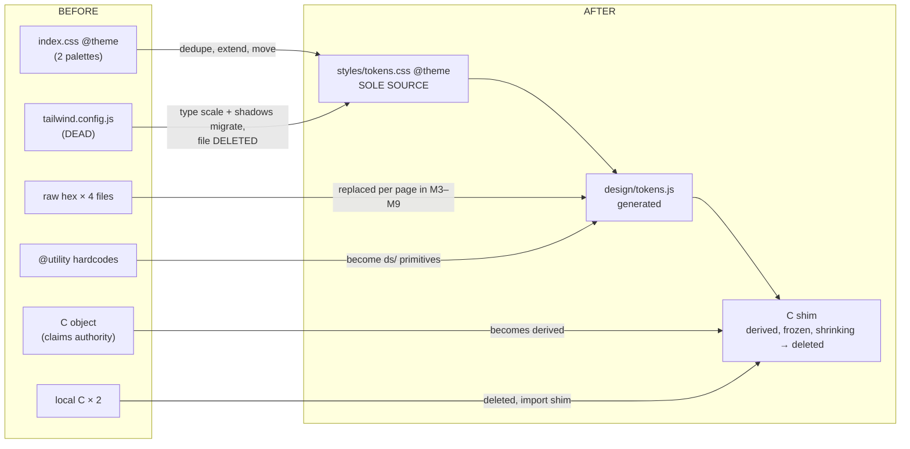
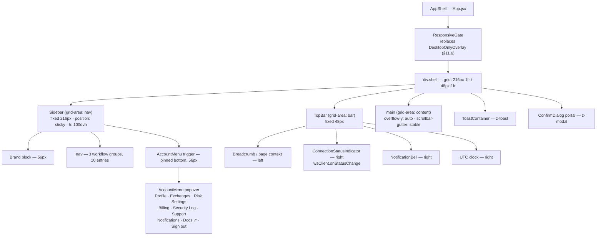
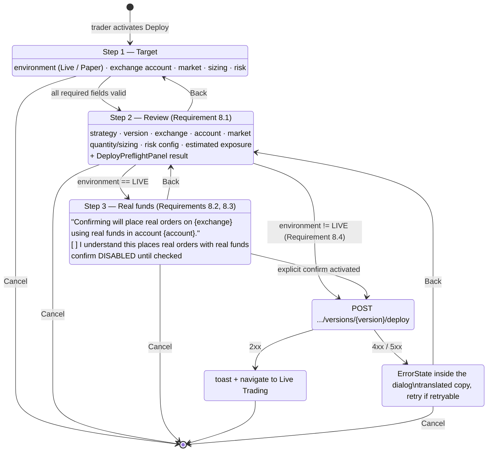
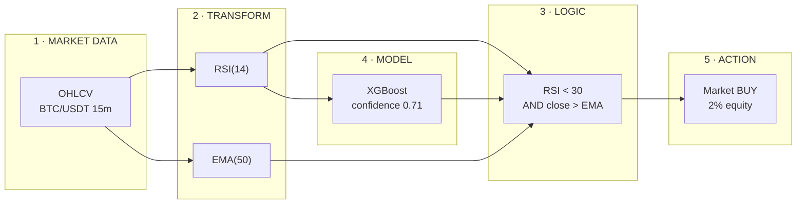
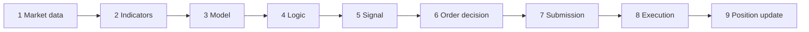
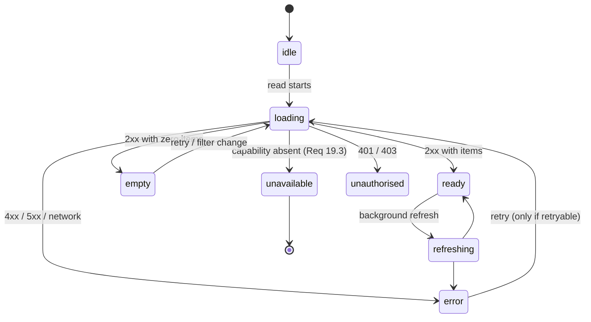
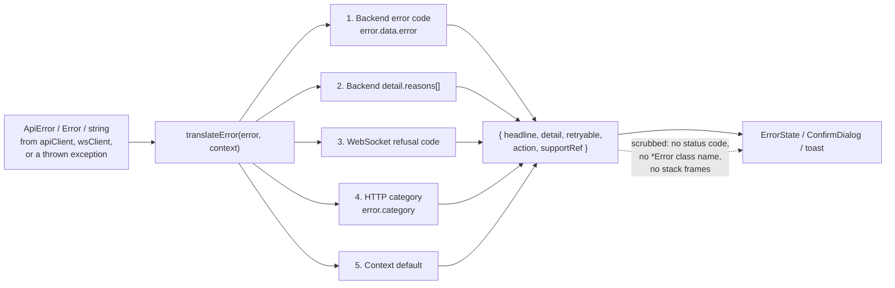
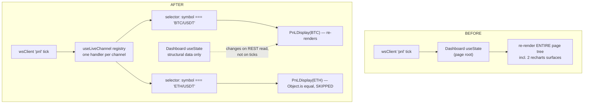

# Design Document — VyomQuant UI Redesign (v1)

## Overview

This design turns the 19 approved requirements into an implementable plan for `algo22-terminal/` (React 18 + Vite + Tailwind CSS v4, deployed by `.github/workflows/06-frontend-deploy.yml` to S3 `vyomquant-frontend` / CloudFront `EEOXECPHQ8SR0`, served at https://d7d88qs4jmch.cloudfront.net).

It is a **brownfield** design. Every decision below is grounded in the code that ships today, and the current-state findings in §1 are the reason each decision takes the shape it does. Nothing here proposes rewriting the app: the migration is incremental (§14) and the app stays shippable at every step.

Implementation language: **JavaScript / JSX** (the frontend's existing language; `types/api.types.ts` and `api/typed-client.ts` are the only TS files and are not in scope).

### What this design is not

It supersedes the direction set by three documents inside `algo22-terminal/`:

| Document | Direction it pushes | Status under this design |
| --- | --- | --- |
| `ALGO22_UX_MASTER_AUDIT.md` | "Retention Score", "Product Addictiveness", gamification, Quant Levels, achievement badges, live-streaming ticker ribbon for "aliveness" | **Superseded** |
| `IMPLEMENTATION_ROADMAP.md` | 12-phase "Ultra-Premium UX Transformation" built on the above | **Superseded** |
| `FINAL_UX_CERTIFICATION.md` | Certifies the gamified direction as complete | **Superseded** |

These are not deleted (they are historical record), but each MUST gain a superseding banner as the first task of the migration, so a future contributor reading them does not reintroduce dopamine loops into a live-trading cockpit:

```markdown
> **SUPERSEDED 2026-xx-xx.** The direction in this document — gamification, dopamine loops,
> leaderboards, achievement tiers, market-ticker "aliveness" — is explicitly rejected by
> `.kiro/specs/vyomquant-ui-redesign/`. VyomQuant is a calm professional trading cockpit.
> Do not implement anything below. Retained as historical record only.
```

`ULTRA_UX_AUDIT.md`, `ONBOARDING_PLAN.md` and `INFORMATION_ARCHITECTURE.md` are not in this initiative's scope and are left untouched; `INFORMATION_ARCHITECTURE.md` should be reconciled with §6's sidebar IA in a later spec.

### Section index

Cross-references in this document use `§N` for a section and `§N.M` for a numbered
subsection inside it. `N` is the number in the left column below.

| N | Section |
| --- | --- |
| 1 | Current-state findings |
| 2 | Architecture |
| 3 | Decision D1 — the token architecture |
| 4 | Semantic colour and the calm-by-default rule |
| 5 | Components and Interfaces |
| 6 | Application shell |
| 7 | Per-page design |
| 8 | Live-trading safety |
| 9 | Strategy Builder (Requirement 5) |
| 10 | Signal Trace (Requirement 9) |
| 11 | Cross-cutting patterns |
| 12 | Error Handling |
| 13 | Performance |
| 14 | Migration and rollout |
| 15 | Testing Strategy |
| 16 | Backend change register (Requirement 19.2) |
| 17 | Non-goals and constraints (Requirement 19) |
| 18 | Data Models |
| 19 | Correctness Properties |
| 20 | Requirements traceability |

### Requirement traceability summary

| Requirement | Design section |
| --- | --- |
| 1 Design system foundation | §3 tokens, §4 semantic colour, §5 primitives |
| 2 Application shell | §6 |
| 3 Dashboard | §7.1 |
| 4 Strategies list | §7.2 |
| 5 Strategy Builder | §9 |
| 6 Backtester | §7.4 |
| 7 Live trading visibility | §7.5, §8 |
| 8 Deploy confirmation | §8 |
| 9 Signal Trace | §10 |
| 10 Portfolio | §7.6 |
| 11 Trade History | §7.7 |
| 12 Paper Trading | §7.8, §8.2 |
| 13 Marketplace subscription clarity | §7.9 |
| 14 Empty / loading / error | §11.1, §12 |
| 15 Forms, tables, charts | §11.2, §11.3, §11.4 |
| 16 Notifications | §11.5 |
| 17 Responsive | §11.6 |
| 18 Accessibility | §11.7 |
| 19 Non-interference | §17, §16 backend change register |

---

## Current-state findings

Every finding below was read out of the shipping code or verified against the built CSS in `algo22-terminal/dist/`. They are stated here because the design decisions are consequences of them.

### 1.1 Five-and-a-half generations of styling coexist

| Generation | Where | Notes |
| --- | --- | --- |
| G1 — inline `C.*` tokens | `src/components/ui-legacy/primitives.jsx` exports `const C` | 178 `C.` references in the module itself; `profit #26A69A`, `loss #EF5350`, `accent #00D4FF`, plus `gold #F59E0B` **and** `warning #FFB74D` (two ambers) |
| G2 — Tailwind v4 `@theme` | `src/index.css` | Declares the palette **twice**: an "existing app palette" (`--color-green: #26A69A`, `--color-red: #EF5350`) and a "landing page design system" palette (`--color-accent-profit: #10B981`, `--color-accent-loss: #EF4444`). Profit and loss therefore have two different values in one file. |
| G3 — dead `tailwind.config.js` | repo root of `algo22-terminal` | See §1.2. Not loaded. |
| G4 — page-local `C` objects | `components/SupportCenter.jsx` (`bg #010608`), `components/NotificationCenter.jsx` (`bg #0a0a0a`) | Divergent backgrounds; both violate `DESIGN_SYSTEM_V2.md`'s own "never define local C objects" rule |
| G5 — raw hex literals | `pages/Dashboard.jsx` (240 inline styles, **zero** `C.` references — Tailwind-default `#ef4444`/`#64748b`), `components/SignalTraceVisualization.jsx` (Material palette `#2196F3 #00BCD4 #FFAB00 #9C27B0 #FF5722 #00C853 #607D8B` + GitHub `#0d1117 #30363d`), `pages/TradeHistory.jsx` (`#0c1017 #1e293b #64748b`), `components/ErrorBoundary.jsx` (`#010608 #6b9bb8 #ff4757 #ff6b81 #4a5568`) | Each is a self-contained palette |
| G5½ — `@utility` hardcodes | `src/index.css` `kpi-card`, `table-container`, `input-institutional` | Introduce a *sixth* surface set (`#0C1017 #1A2332 #0F151F #F0F4F8`) that references none of the `@theme` tokens directly above them |

Inline-style depth by page (in-scope pages only):

| Page | Lines | `style={{` | `C.` | `className="` |
| --- | --- | --- | --- | --- |
| `PaperTrading.jsx` | 3352 | 127 | 191 | 9 |
| `StrategyBuilder.jsx` | 2859 | 112 | 148 | 49 |
| `Dashboard.jsx` | 2012 | 240 | 0 | 0 |
| `Strategies.jsx` | 1476 | 121 | 1 | 3 |
| `StrategyMarketplace.jsx` | 1051 | 0 | 0 | 145 |
| `SignalTrace.jsx` | 993 | 98 | 92 | 5 |
| `Portfolio.jsx` | 837 | 82 | 5 | 28 |
| `Backtester.jsx` | 708 | 86 | 66 | 8 |
| `TradeHistory.jsx` | 345 | 43 | 0 | 3 |

Read that table as: **`StrategyMarketplace.jsx` is already fully Tailwind, `Dashboard.jsx` and `TradeHistory.jsx` use inline styles with no token source at all, and everything else is a hybrid.** There is no single dominant mechanism, which is what makes the token decision in §3 the pivotal one.

### 1.2 `tailwind.config.js` is dead code — 143 typography classes compile to nothing

`package.json` pins `tailwindcss ^4.2.4` with `@tailwindcss/postcss`. `src/index.css` opens with `@import "tailwindcss";` and contains **no `@config` directive**, and `grep` finds `@config` nowhere in `src/`. Under Tailwind v4 the JS config file is therefore never loaded.

Verified against the built stylesheet `dist/assets/index-CO7MvKd_.css` (built 2026-09-08, after `src/index.css`'s 2026-08-30 mtime, and confirmed to be the right artefact because it contains `--color-cyan`, `--color-accent-profit`, `text-gradient-cyan` and `section-container` from `index.css`):

| Class | Declared in | Present in built CSS |
| --- | --- | --- |
| `text-micro`, `text-caption`, `text-caption-sm`, `text-body`, `text-body-sm`, `text-body-lg`, `text-heading*` | `tailwind.config.js` only | **No** |
| `shadow-glow`, `shadow-glow-green` | `tailwind.config.js` only | **No** |
| `--color-cyan`, `--color-accent-profit`, `text-gradient-cyan`, `section-container` | `index.css` `@theme` / `@utility` | Yes |

Usage of the dead typography classes:

| File | Occurrences |
| --- | --- |
| `pages/StrategyBuilder.jsx` | 49 |
| `components/builder/AssetSelector.jsx` | 20 |
| `pages/Portfolio.jsx` | 18 |
| `components/builder/NodeTrace.jsx` | 17 |
| `components/builder/NodePreview.jsx` | 17 |
| `components/builder/ParameterForm.jsx` | 16 |
| `components/builder/TimeframeSelector.jsx` | 6 |
| **Total** | **143** |

Consequence: every one of those 143 elements renders at the inherited font size. `components/ui/Card.jsx`'s `hover:shadow-glow` is likewise inert. This is why §3 makes the typography scale part of the single token source rather than leaving it in a JS config.

### 1.3 The top-bar connection indicator is hardcoded

`components/TopBar.jsx` line 61: `<LiveStatusV2 status="running" />`. The literal string. It never reads `wsClient`. The indicator says LIVE with a pulsing green dot whether or not a socket exists.

This is both a Requirement 2.5/2.6 gap and, today, a Requirement 14.5 fabrication. The fix is cheap because `websocketClient.js` already exposes exactly what is needed:

- `wsClient.getStatus()` → current `connectionStatus`
- `wsClient.onStatusChange(listener)` → push notification on every transition, returns an unsubscribe
- `wsClient.onOpen(listener)` → fires *after* channel resubscription
- `wsClient.isConnected()`

### 1.4 Portfolio's live positions read hits endpoints that do not exist

`pages/Portfolio.jsx` calls `api.portfolio.getOpenPositions()` and, on failure, `api.portfolio.getPositions()`. `backend_app/routers/portfolio.py` registers only: `/summary`, `/equity-curve`, `/allocation`, `/heatmap`, `/recent-transactions`, `/close-all`. Neither positions endpoint exists — both 404.

`api/modules/portfolio.js` declares eight more methods with no backend route: `getPositions`, `getPosition`, `closePosition`, `getPositionHistory`, `getBalance`, `getPnL`, `getPerformance`, `getOpenPositions`.

The only other `GET /positions` is `backend_app/backend/portfolio_management.py`, mounted at `/api/internal/portfolio-mgmt` behind `Depends(get_admin_user)` — unreachable for a trader.

### 1.5 `current_drawdown_pct` is not drawdown

`dashboard_aggregation_service.py:1139`:

```python
"current_drawdown_pct": round(float((portfolio or {}).get("today_return_pct", 0.0)), 2),
```

and the older path at line 397 uses `abs(portfolio.get("pnl_pct", 0))`. `risk.py`'s `/status` returns a literal `"drawdown_pct": 0.0`.

So the field named drawdown carries today's return percentage. A profitable day renders as a positive "drawdown". Requirements 3.1 and 10.2 both name current drawdown as a top-tier metric; neither is honestly satisfiable from this field. See §16.

### 1.6 Two backend read paths swallow failures into zeros or empties

- `dashboard.py::get_dashboard_overview` catches every exception and returns `total_value: 0.0, today_pnl: 0.0, …`. A trader with a broken read sees a zeroed portfolio, not an error. Direct Requirement 14.5 conflict.
- `dashboard_aggregation_service.get_open_positions` catches and returns `[]` on a Redis failure, so an outage is indistinguishable from "no positions".

`GET /api/dashboard` itself is correct — it raises 503 `DASHBOARD_FETCH_FAILED`. The design routes all dashboard reads through it and does not use `/api/dashboard/overview`.

### 1.7 `ErrorBoundary` renders the stack trace to the user

`components/ErrorBoundary.jsx` prints `this.state.error.stack` and `errorInfo.componentStack` into the DOM, plus a "Copy Error" button. Requirement 14.4 forbids stack traces as user-facing content.

### 1.8 Native browser dialogs are used for destructive and live actions

| File | Call |
| --- | --- |
| `pages/Strategies.jsx` | `window.confirm(archiveConfirmMessage(name))`, `window.prompt("Enter new strategy name:", …)` |
| `pages/StrategyDetail.jsx` | 4 × `window.confirm` — deploy, delete, restore version, deploy version |

`window.confirm` cannot be focus-trapped, styled, or given the multi-field review Requirement 8.1 demands, and `window.prompt` cannot carry a label or inline validation (Requirements 15.1, 15.2, 18.3).

Note also that `StrategyDetail.jsx`'s deploy confirmations say "*Deploy to paper trading?*" while `Strategies.jsx` deploys through the real preflight gate — the two pages disagree about what deploy means.

### 1.9 Requirement 19.4 violations present today

- `pages/StrategyDetail.jsx:1179` — `Audit history coming soon`.
- `components/Sidebar.jsx` — `docs` entry opens `https://docs.algo22.io` (stale brand, and an external target presented as primary nav).

### 1.10 Portfolio and Trade History are unreachable from the sidebar

`Sidebar.jsx`'s exported `NAV` has thirteen entries: `dashboard, strategies, backtest, signal-trace, paper-trading, marketplace, builder, exchange, risk, billing, docs, support, notifications`. `portfolio` and `trades` are **absent**, though both routes exist in `App.jsx`. There is also no `live-trading` entry despite the route alias.

Active state is `location.pathname === '/app/${n.id}'`, so `/app/strategies/:id` highlights nothing and the `/app/backtester` alias never highlights `backtest`.

The `handleNavClick` for `docs` calls `window.open`, so the nav mixes navigation with external links.

### 1.11 `DesktopOnlyOverlay` hard-gates below 1000px

`components/DesktopOnlyOverlay.jsx` blurs the app and renders a "Desktop Optimized / Minimum width: 1000px" card whenever `window.innerWidth < 1000`. It wraps the **entire** `AppShell` in `App.jsx`. See §11.6 for the resolution.

### 1.12 `AppState.jsx` is not a data store

Fifteen lines: `demoMode` and `uiMode` only. There is no global trading-data store; each page owns its own `useState` + fetch + `wsClient.subscribe`. `usePolling` in `primitives.jsx` re-creates its `fetch` callback on every `data` change, so it resubscribes its interval on every tick. `store/` contains three near-empty Zustand-shaped files (`useExecutionStore.js` 46 lines, `useWorkspaceStore.js` 64, `useRiskStore.js` **3**). §13 designs around this rather than introducing a store.

### 1.13 What already exists and is sound (reuse, do not rebuild)

- **`lib/connectionLegality.js`** (1037 lines) — a faithful client transcription of the backend's R1–R8 edge rules, reading the *served* registry payload rather than a local table, marking every verdict `provisional`. It **is** wired into `StrategyBuilder.jsx` (`isValidConnection`, `onConnectStart` port dimming, `onConnectEnd`, `onReject → setConnectionIssue`) despite its own stale header comment saying otherwise. Backend `schema.make_issue()` returns `{code, severity, node_id, edge_id, field, message, expected, actual, fix_hint}` — Requirement 5.4's "reason + action needed" is already server-supplied.
- **`lib/graphValidation.js`** (1067 lines) — validation state machine and marker projections.
- **`apiClient.js`'s `ApiError`** — carries `status`, `data`, `requestId`, `category` (`SERVER_ERROR`/`AUTH_ERROR`/`CLIENT_ERROR`/`NETWORK_ERROR`), `isRetryable()`, `getUserMessage()`. A real foundation for §12.
- **`SimulatedIndicator`** — duplicated verbatim in `pages/Portfolio.jsx` and `pages/TradeHistory.jsx`, rendered from the server's own `execution_environment` / `is_simulated` fields, carrying meaning in text + shape not colour alone, with indigo tokens (`#818cf8`, `rgba(99,102,241,·)`) distinct from cyan/green/red. This is the right behaviour in the wrong place — it becomes `TradingEnvironmentBadge`.
- **`pages/paperTradingFormat.js`** (1207 lines) — exact minor-unit money formatting, feed/session/order state vocabularies, an eight-state panel model (`PANEL_STATES`), and server-error→state classification. §11.1's panel contract generalises this rather than replacing it.
- **`components/DeployPreflightPanel.jsx`** + `lib/deployPreflight.js` + `hooks/useDeployPreflight.js` — the existing preflight surface that §8's confirmation flow wraps.
- **`lib/blockRegistry.js`** — presentation-only category → icon/colour, generated from `canonicalGraph.js`'s mirror of the backend enums. Zero block definitions. Correct by construction.

### 1.14 Layering of the current shell



---

## Architecture

### 2.1 Layering



**Rule:** an arrow may only point downward. A primitive never imports a page. A page never imports `tokens.css` directly and never authors a colour literal. `semantic.js` is the only module that knows which token means "profitable".

### 2.2 Directory plan

```
algo22-terminal/src/
  styles/
    tokens.css                # NEW — the single token source (@theme)
  design/
    tokens.js                 # NEW — generated mirror; DO NOT EDIT header
    semantic.js               # NEW — statusToken, environmentTreatment, tier maps
    errorCopy.js              # NEW — error-code → human copy (§12)
    notificationPolicy.js     # NEW — the Req-16 allowlist
  components/
    ds/                       # NEW — the 16 primitives, one file each
      index.js
      PageHeader.jsx  SectionHeader.jsx  Metric.jsx  PnLDisplay.jsx
      StatusBadge.jsx StrategyStatus.jsx RiskIndicator.jsx ExchangeStatus.jsx
      TradingEnvironmentBadge.jsx
      DataTable.jsx   FilterBar.jsx      CommandButton.jsx
      EmptyState.jsx  LoadingState.jsx   ErrorState.jsx    ConfirmDialog.jsx
      Panel.jsx       Field.jsx          Chart.jsx         Tabs.jsx
      Tooltip.jsx     Drawer.jsx         Alert.jsx         Skeleton.jsx
      Breadcrumb.jsx
    ui/                       # EXISTING — Button/Badge/Card/Accordion re-pointed at tokens
    ui-legacy/primitives.jsx  # EXISTING — becomes a shrinking shim
  hooks/
    useConnectionStatus.js    # NEW — wsClient.onStatusChange → React state
    usePanelState.js          # NEW — the idle/loading/ready/empty/error/unavailable machine
    useLiveChannel.js         # NEW — memoised per-channel subscription (§13)
scripts/
  gen-tokens.mjs              # NEW — tokens.css → design/tokens.js
```

`components/ds/` rather than extending `components/ui/`: the existing `ui/` components (`Button`, `Badge`, `Card`, `Accordion`) have hardcoded palettes and prop aliases (`v`/`variant`, `sz`/`size`, `cls`/`className`, `Icon`/`icon`) used across ~150 call sites including the out-of-scope landing page. They are re-pointed at tokens in place (a small change) and kept; `ds/` is where the 16 required primitives live so that "is this a design-system primitive?" is answerable from the import path.

---

## Decision D1 — the token architecture

**Requirement 1.1 demands exactly one source location.** Today there are six (§1.1). Three candidate sources exist: the `C` object, `tailwind.config.js`, and `index.css`'s `@theme`.

### 3.1 The decision

> **Tailwind v4 `@theme` in `src/styles/tokens.css` is the single source of truth.**
> **`tailwind.config.js` is deleted.**
> **`src/design/tokens.js` is *generated* from `tokens.css` and is the only way JavaScript reads a token.**
> **`C` survives only as a derived compatibility shim that shrinks to zero and is then deleted.**

Rationale, in the order it decided the outcome:

1. **`tailwind.config.js` cannot be the source: it is not loaded** (§1.2, verified against built CSS). Choosing it would mean adding `@config` to resurrect a *second* declaration of a palette that `@theme` already declares — reintroducing the exact drift Requirement 1.1 forbids. Deleting it also fixes 143 dead classes and `hover:shadow-glow`.
2. **`C` cannot be the source, despite `DESIGN_SYSTEM_V2.md` naming it as such.** `C` is a JS object consumable only from `style={{}}`. Making it authoritative would mean either abandoning Tailwind (a rewrite of `StrategyMarketplace.jsx`'s 145 class usages and the whole landing page) or generating CSS from JS at build time — strictly more machinery than the reverse. `DESIGN_SYSTEM_V2.md`'s "Token Source of Truth: `primitives.jsx` exports `const C`" line is **withdrawn** by this design; §3.5 records the amendment.
3. **`@theme` is already the live mechanism**, already compiles, and is the direction Tailwind v4 is designed around. CSS custom properties are readable from inline styles too (`style={{ color: 'var(--color-status-profit)' }}`), so it can serve *both* consumption styles during migration — which is what makes the incremental path in §14 possible without a flag day.

### 3.2 `src/styles/tokens.css`

Authored once. `src/index.css` becomes `@import "tailwindcss"; @import "./styles/tokens.css";` plus base resets, with its duplicate palette and its six hardcoded `@utility` blocks removed (those become primitives).

```css
/* src/styles/tokens.css — THE token source of truth. Requirement 1.1.
   No other file in this repository may declare a colour, radius, shadow,
   transition, breakpoint, z-index or type-scale value.
   src/design/tokens.js is GENERATED from this file: run `npm run tokens`. */
@theme {
  /* ── Surface ─────────────────────────────────────────────── */
  --color-surface-canvas:   #080A0E;   /* app background            (was C.bg0)   */
  --color-surface-panel:    #0F1117;   /* cards, panels             (was C.bg1)   */
  --color-surface-raised:   #151821;   /* elevated, hover           (was C.bg2)   */
  --color-surface-inset:    #1A202C;   /* inputs, wells             (was C.bg3)   */
  --color-surface-overlay:  rgba(8, 10, 14, 0.88);

  /* ── Line ────────────────────────────────────────────────── */
  --color-line-subtle:      #141922;
  --color-line-default:     #1E2530;
  --color-line-strong:      #2A3441;

  /* ── Content ─────────────────────────────────────────────── */
  --color-content-primary:   #F0F2F5;  /* 16.8:1 on panel          (was C.t1) */
  --color-content-secondary: #8B95A5;  /*  6.2:1 on panel          (was C.t2) */
  --color-content-muted:     #5A6578;  /*  3.2:1 — NON-TEXT ONLY   (was C.t3) */
  --color-content-inverse:   #080A0E;

  /* ── Brand ───────────────────────────────────────────────── */
  --color-brand:             #00D4FF;  /* 10.7:1 on panel */
  --color-brand-hover:       #33E0FF;
  --color-brand-wash:        rgba(0, 212, 255, 0.10);

  /* ── SEMANTIC STATUS — Requirement 1.4. Exactly one per state. ── */
  --color-status-live:        #26A69A;  --color-status-live-wash:        rgba(38, 166, 154, 0.12);
  --color-status-connected:   #26A69A;  --color-status-connected-wash:   rgba(38, 166, 154, 0.12);
  --color-status-profit:      #26A69A;  --color-status-profit-wash:      rgba(38, 166, 154, 0.12);
  --color-status-loss:        #EF5350;  --color-status-loss-wash:        rgba(239, 83, 80, 0.12);
  --color-status-error:       #EF5350;  --color-status-error-wash:       rgba(239, 83, 80, 0.12);
  --color-status-warning:     #F59E0B;  --color-status-warning-wash:     rgba(245, 158, 11, 0.12);
  --color-status-guidance:    #F59E0B;  --color-status-guidance-wash:    rgba(245, 158, 11, 0.12);
  --color-status-neutral:     #8B95A5;  --color-status-neutral-wash:     rgba(139, 149, 165, 0.10);

  /* ── ENVIRONMENT — Requirements 7.4, 8.5, 12.2, 12.3 ────── */
  --color-env-live:      #EF5350;  --color-env-live-wash:      rgba(239, 83, 80, 0.12);
  --color-env-paper:     #818CF8;  --color-env-paper-wash:     rgba(99, 102, 241, 0.12);
  --color-env-backtest:  #8B95A5;  --color-env-backtest-wash:  rgba(139, 149, 165, 0.10);

  /* ── Typography ──────────────────────────────────────────── */
  --font-sans: 'Inter', system-ui, -apple-system, sans-serif;
  --font-mono: 'JetBrains Mono', 'IBM Plex Mono', 'Fira Code', 'SF Mono', Menlo, Consolas, monospace;

  --text-micro:   0.625rem;  --text-micro--line-height:   1rem;      /* 10px labels, chips */
  --text-small:   0.6875rem; --text-small--line-height:   1.125rem;  /* 11px table body    */
  --text-body:    0.8125rem; --text-body--line-height:    1.25rem;   /* 13px default       */
  --text-title:   0.875rem;  --text-title--line-height:   1.25rem;   /* 14px panel title   */
  --text-section: 1.125rem;  --text-section--line-height: 1.5rem;    /* 18px section head  */
  --text-page:    1.5rem;    --text-page--line-height:    2rem;      /* 24px page title    */
  --text-figure:  1.75rem;   --text-figure--line-height:  2rem;      /* 28px tier-1 metric */

  /* ── Space (4px grid) ────────────────────────────────────── */
  --spacing-1: 0.25rem; --spacing-2: 0.5rem;  --spacing-3: 0.75rem;
  --spacing-4: 1rem;    --spacing-5: 1.25rem; --spacing-6: 1.5rem;
  --spacing-8: 2rem;    --spacing-10: 2.5rem; --spacing-12: 3rem;

  /* ── Radius ──────────────────────────────────────────────── */
  --radius-xs: 2px; --radius-sm: 4px; --radius-md: 6px;
  --radius-lg: 8px; --radius-xl: 12px; --radius-full: 9999px;

  /* ── Elevation — no coloured glows. Calm by default (Req 1.5). ── */
  --shadow-panel:   0 1px 2px rgba(0, 0, 0, 0.30);
  --shadow-raised:  0 4px 12px rgba(0, 0, 0, 0.35);
  --shadow-overlay: 0 16px 48px rgba(0, 0, 0, 0.60);

  /* ── Motion ──────────────────────────────────────────────── */
  --transition-fast: 120ms cubic-bezier(0.4, 0, 0.2, 1);
  --transition-base: 180ms cubic-bezier(0.4, 0, 0.2, 1);

  /* ── Breakpoints ─────────────────────────────────────────── */
  --breakpoint-tablet:  768px;
  --breakpoint-laptop: 1024px;
  --breakpoint-desktop:1440px;
  --breakpoint-wide:   1920px;

  /* ── Z-index ─────────────────────────────────────────────── */
  --z-base: 0; --z-sticky: 10; --z-dropdown: 100; --z-drawer: 200;
  --z-modal: 300; --z-toast: 400; --z-devtool: 500;

  /* ── Focus ring — Requirement 18.2 ───────────────────────── */
  --focus-ring-width:  2px;
  --focus-ring-offset: 2px;
  --focus-ring-color:  #00D4FF;
}

/* Requirement 18.2, applied once, so no control can omit it. */
:where(a, button, input, select, textarea, summary, [tabindex]):focus-visible {
  outline: var(--focus-ring-width) solid var(--focus-ring-color);
  outline-offset: var(--focus-ring-offset);
  border-radius: var(--radius-sm);
}

@media (prefers-reduced-motion: reduce) {
  *, *::before, *::after {
    animation-duration: 0.01ms !important;
    animation-iteration-count: 1 !important;
    transition-duration: 0.01ms !important;
  }
}
```

Notes on specific values:

- **Profit/loss keep `#26A69A` / `#EF5350`** (the `C` and `DESIGN_SYSTEM_V2.md` values), not the landing page's `#10B981` / `#EF4444`. Reason: the trading pages are the ones in scope, the teal/coral pair is the Bloomberg/TradingView convention, and `components/ui/Badge.jsx` (which currently uses `#10B981`) is a smaller change surface than every `C.profit` call site. The landing-page aliases stay as *aliases* in `tokens.css` (`--color-accent-profit: var(--color-status-profit)`) so out-of-scope pages keep compiling while ceasing to diverge.
- **One amber.** `C.gold #F59E0B` and `C.warning #FFB74D` collapse to `#F59E0B`. Both are legible (8.8:1 and 10.9:1 on panel), so this is not a contrast fix — it is that the two carried no semantic distinction and were used interchangeably. `#F59E0B` wins because it already has the widest footprint: it is `--color-gold` / `--color-accent-gold` in `index.css`, `gold` in `tailwind.config.js`, `warning`/`gold` in `ui/Badge.jsx`, and the colour of every guidance banner in `StrategyBuilder.jsx`.
- **`--color-content-muted` is annotated NON-TEXT ONLY** at 3.2:1. Requirement 18 sets no contrast criterion, but shipping a token that cannot carry body text at AA is a trap; the annotation is the guard. Body text currently on `C.t3`/`C.t4` moves to `--color-content-secondary` (6.2:1). `content-muted` remains valid for icons, rules, disabled glyphs and the not-available em-dash, which always sits beside a labelled element.
- **`--color-env-live` is red, not cyan.** Live is the state a trader must never mistake, so it takes the most alarming hue in the palette. This deliberately reuses the loss hue; §4.2 explains why that is safe (the environment badge always carries text and an icon, never colour alone, and it never sits inside a P&L figure).

### 3.3 `src/design/tokens.js` — generated, never hand-authored

```js
// AUTO-GENERATED by scripts/gen-tokens.mjs from src/styles/tokens.css.
// DO NOT EDIT. Run `npm run tokens` after changing tokens.css.
// CI fails if this file is stale (see §15).
export const token = Object.freeze({
  surface: Object.freeze({ canvas: '#080A0E', panel: '#0F1117', raised: '#151821', inset: '#1A202C', overlay: 'rgba(8, 10, 14, 0.88)' }),
  line:    Object.freeze({ subtle: '#141922', default: '#1E2530', strong: '#2A3441' }),
  content: Object.freeze({ primary: '#F0F2F5', secondary: '#8B95A5', muted: '#5A6578', inverse: '#080A0E' }),
  brand:   Object.freeze({ base: '#00D4FF', hover: '#33E0FF', wash: 'rgba(0, 212, 255, 0.10)' }),
  status:  Object.freeze({ /* live, connected, profit, loss, error, warning, guidance, neutral — each { fg, wash } */ }),
  env:     Object.freeze({ live: { /* … */ }, paper: { /* … */ }, backtest: { /* … */ } }),
  // space, radius, shadow, transition, zIndex, text, breakpoint …
});

/** CSS custom-property reference, for inline styles during migration. */
export const cssVar = (path) => `var(--${path.replace(/\./g, '-')})`;
```

`scripts/gen-tokens.mjs` parses the `@theme` block with a regex over `--name: value;` pairs and groups by prefix. It is ~60 lines with no dependencies. It runs in `prebuild` and in CI with `--check`.

### 3.4 How `C` is reconciled — the shim, and its removal

`C` has 1,296 references across 30 files. Deleting it in one change would touch every in-scope page at once, which is precisely the flag-day this design avoids. Instead:

```js
// src/components/ui-legacy/primitives.jsx  (after step M1)
import { token } from '../../design/tokens';

/**
 * COMPATIBILITY SHIM — Requirement 1.1.
 *
 * `C` is no longer a token source. Every value below is DERIVED from
 * `src/design/tokens.js`, which is generated from `src/styles/tokens.css`.
 * There is not one literal in this object, so `C.profit` and
 * `var(--color-status-profit)` cannot disagree.
 *
 * This object is FROZEN and CLOSED: adding a key is a lint error
 * (see eslint rule `vyom/no-new-legacy-token`). It shrinks as pages
 * migrate to `components/ds/*` and is deleted at the end of step M9.
 *
 * DO NOT import `C` into any new component. Import `token` or use a
 * Tailwind utility.
 */
export const C = Object.freeze({
  bg: token.surface.canvas,  bg0: token.surface.canvas,
  bg1: token.surface.panel,  bg2: token.surface.raised,
  bg3: token.surface.inset,  bg4: token.surface.inset,
  border: token.line.default, borderLight: token.line.strong, borderHover: token.line.strong,
  cyan: token.brand.base, accent: token.brand.base, accentHover: token.brand.hover,
  cyanDim: token.brand.wash, accentMuted: token.brand.base, cyanL: token.brand.hover,
  cyanD: token.brand.base, blue: token.brand.base,          // #2962FF retired
  profit: token.status.profit.fg, green: token.status.profit.fg, greenD: token.status.profit.fg,
  profitDark: token.status.profit.fg, profitBg: token.status.profit.wash,
  loss: token.status.loss.fg, red: token.status.loss.fg, lossDark: token.status.loss.fg,
  lossBg: token.status.loss.wash,
  t1: token.content.primary, t2: token.content.secondary,
  t3: token.content.muted,   t4: token.content.muted,
  warning: token.status.warning.fg, gold: token.status.warning.fg,   // one amber now
  purple: token.status.neutral.fg,  orange: token.status.warning.fg, // decorative hues retired
  shadow: token.shadow.panel, shadowMd: token.shadow.raised, shadowLg: token.shadow.overlay,
  glow: Object.freeze({ profit: 'none', loss: 'none', accent: 'none',
                        warning: 'none', gold: 'none', purple: 'none' }), // Req 1.5
  gradient: Object.freeze({ profit: 'none', loss: 'none', accent: 'none',
                            card: 'none', shine: 'none' }),              // Req 1.5
  space: token.space, radius: token.radius,
});
```

Three things this buys immediately, before a single page is rewritten:

1. Every `C.*` call site becomes token-backed. `C.gold` and `C.warning` stop being different colours. `C.blue`, `C.purple` and `C.orange` stop introducing off-palette hues.
2. Setting `C.glow.*` and `C.gradient.*` to `'none'` **satisfies Requirement 1.5 globally on the first commit** — the decorative glows and shine gradients disappear everywhere at once, which is the single largest visual step toward "calm by default", with no per-page edits.
3. `Object.freeze` plus the lint rule makes the shim closed, so it can only shrink.

The two page-local `C` objects (`SupportCenter.jsx`, `NotificationCenter.jsx`) are replaced with an import of the shim in step M1. Those pages are out of scope for redesign, but leaving a competing token object in the tree would fail Requirement 1.1's "exactly one source location", so the *import* is corrected even though the layout is not.

The three-generation reconciliation:



### 3.5 Amendment to `DESIGN_SYSTEM_V2.md`

`DESIGN_SYSTEM_V2.md` is **kept and amended**, not superseded — its palette, typography and accessibility findings are sound and this design carries them forward. Two edits, made in step M1:

1. Replace the "Token Source of Truth" directive with: *"`src/styles/tokens.css` (Tailwind v4 `@theme`) is the sole source of truth. `src/design/tokens.js` is generated from it. `C` in `ui-legacy/primitives.jsx` is a derived compatibility shim scheduled for deletion — never import it into new code."*
2. Replace the "Hover states add glow" / "Subtle micro-animations" directives with the calm-by-default rule (§4.3), and note that `C.glow`/`C.gradient` are retired.
3. Correct the Accessibility section's contrast figures. The document states 7.94:1 for `#00D4FF` on `#080A0E` and 14.2:1 for `#F0F2F5` on `#0F1117`; the measured values are **11.2:1** and **16.8:1**. Both still pass AAA, so no colour changes — but a figure a future contributor might rely on should be right. Add `#5A6578` at 3.2:1 with its non-text-only annotation, which the document omits entirely.

---

## Semantic colour and the calm-by-default rule

### 4.1 The one status mapping (Requirement 1.4)

`src/design/semantic.js` is the **only** module that maps a state to a colour. Requirement 1.4 names six semantic groups; a neutral is added because an unknown or idle state must resolve to something rather than to `undefined`.

| Semantic group | Token | Vocabulary that resolves to it (server values, lowercased) |
| --- | --- | --- |
| live / running | `status.live` | `live` `running` `active` `started` `deployed` `HEALTHY` |
| connected / paired | `status.connected` | `connected` `paired` `open` `ok` |
| profitable / buy | `status.profit` | `profit` `buy` `long` `up` `filled` `gain` |
| loss / sell | `status.loss` | `loss` `sell` `short` `down` |
| error / disconnected | `status.error` | `error` `failed` `disconnected` `rejected` `closed` `BLOCKED` `CRITICAL` `STALE` |
| warning | `status.warning` | `warning` `paused` `pending` `degraded` `connecting` `reconnecting` `partially_filled` `DEGRADED` |
| *(neutral — not a Req 1.4 group)* | `status.neutral` | `idle` `stopped` `draft` `cancelled` `unknown`, and **anything unrecognised** |

Guidance is a *separate* token (`status.guidance`) that shares amber's hex but is a distinct name, because Requirement 5.5 needs invalid-connection feedback to be distinguishable from an error on saved data. Sharing the value while separating the name means a future decision to split them is a one-line change in `tokens.css`.

```js
// src/design/semantic.js — the ONE semantic mapping. Requirement 1.4.
import { token } from './tokens';

const GROUP = Object.freeze({
  live:      token.status.live,       connected: token.status.connected,
  profit:    token.status.profit,     loss:      token.status.loss,
  error:     token.status.error,      warning:   token.status.warning,
  guidance:  token.status.guidance,   neutral:   token.status.neutral,
});

/** state string → group name. Total: an unrecognised value is `neutral`, never undefined. */
const VOCABULARY = Object.freeze({ /* the table above, flattened, keyed lowercase */ });

/**
 * The only way a colour is chosen from a state anywhere in the app.
 * @param {unknown} state
 * @returns {{ group: string, fg: string, wash: string, border: string }}
 */
export function statusToken(state) {
  const key = typeof state === 'string' ? state.trim().toLowerCase() : '';
  const group = VOCABULARY[key] ?? 'neutral';
  return { group, ...GROUP[group] };
}

/** A signed number → profit/loss/neutral. Zero is NEUTRAL, not profit. */
export function pnlToken(value) {
  if (!Number.isFinite(value) || value === 0) return { group: 'neutral', ...GROUP.neutral };
  return value > 0 ? { group: 'profit', ...GROUP.profit } : { group: 'loss', ...GROUP.loss };
}
```

`pnlToken` treating zero as neutral is a deliberate correction: `primitives.jsx`'s `PnLBadge` uses `value >= 0`, so a flat position renders in profit green today.

### 4.2 Environment treatment (Requirements 7.4, 8.5, 12.2, 12.3)

```js
// src/design/semantic.js (continued)
export const ENVIRONMENT = Object.freeze({
  LIVE:     { id: 'LIVE',     label: 'LIVE',           long: 'Live — real funds, real orders',                   ...token.env.live,     icon: 'Radio',        border: 'solid'  },
  PAPER:    { id: 'PAPER',    label: 'PAPER TRADING',  long: 'Simulated — no live order is ever placed',         ...token.env.paper,    icon: 'FlaskConical', border: 'dashed' },
  BACKTEST: { id: 'BACKTEST', label: 'BACKTEST',       long: 'Simulated on historical data',                     ...token.env.backtest, icon: 'History',      border: 'dotted' },
});

/** @returns {typeof ENVIRONMENT.LIVE | null} `null` when the server did not say. */
export function environmentTreatment(value) {
  const key = typeof value === 'string' ? value.trim().toUpperCase() : '';
  return ENVIRONMENT[key] ?? null;
}
```

The three environments differ on **four independent axes** — hue, label text, icon, and border style — so they are distinguishable without colour perception (Requirement 12.3 read strictly, plus Requirement 18's spirit). `environmentTreatment` returning `null` for an unrecognised value is what makes the "server label unavailable" state possible instead of guessing; `TradeHistory.jsx`'s existing `SIMULATED · SERVER LABEL UNAVAILABLE` copy already does this and is preserved.

`--color-env-live` sharing loss's hex is safe because the environment badge never appears *inside* a numeric figure — it sits in a panel's title row or as a full-width strip — and always carries text plus an icon. A P&L figure and an environment badge are never adjacent in a way that could be misread as "this number is negative".

### 4.3 Calm by default (Requirement 1.5)

The rule, enforced by review and by the shim:

> Colour, border emphasis and elevation are spent **only** on elements that represent (a) current state, (b) risk, or (c) an action the trader can take. Everything else is `content-primary` / `content-secondary` on `surface-panel`.

Concretely, what leaves the product:

| Removed | Where it lives today | Replacement |
| --- | --- | --- |
| Coloured glows on P&L text, cards, status dots | `C.glow.*`, `PnLBadge` `textShadow`, `PremiumCard` `glowOnHover`, `RiskMeter` box-shadow | Nothing. `C.glow.* = 'none'` |
| Gradient card washes and shine sweeps | `C.gradient.*`, `PremiumCard` header | Nothing. `C.gradient.* = 'none'` |
| `pulseGlow` animation on every non-zero P&L | `PnLBadge` | Nothing — a value that changes does not need to breathe |
| `float` animation on empty-state icons | `EmptyState` in `primitives.jsx` | Static icon |
| `translateY(-2px)` card lift on hover | `PremiumCard`, `Card` `hover`, `Button` | Border colour change only |
| `scale(1.02)` on tag hover | `Tag2` | Border colour change only |
| Decorative hues `purple`, `orange`, `blue #2962FF` | `C` | Retired; mapped to neutral/warning in the shim |
| `💡` and `⚠` emoji in UI copy | `EmptyState` hint, `StrategyBuilder` node error | lucide icons |

What **keeps** motion, because it communicates state rather than decorating it: the connection-status dot's slow pulse while `connected` (2s, opacity only), skeleton shimmer while loading, and the 120–180ms colour/opacity transitions on interactive elements.

---

## Components and Interfaces

The 16 primitives, all in `src/components/ds/`, exported from `ds/index.js`. Every one is a function component; every one takes `className` for composition and forwards unrecognised props to its root. None reads `C`. None accepts a colour prop — colour is always derived from a *state* prop through `semantic.js`, which is how Requirement 1.4's "exclusively through that mapping" is made structural rather than a rule people remember.

### 5.1 API sketches

**`PageHeader`** — replaces `SectionH` from `primitives.jsx` (used in `Portfolio`, `TradeHistory`, `Strategies`) and every page's hand-rolled title row.
```jsx
<PageHeader
  title="Portfolio"                      // required, renders <h1>, --text-page
  subtitle="Live account · Binance"      // optional, content-secondary
  environment="LIVE"                     // optional → renders TradingEnvironmentBadge inline
  breadcrumb={[{ label: 'Strategies', to: '/app/strategies' }, { label: 'RSI Reversion' }]}
  actions={<CommandButton …/>}           // right-aligned action cluster
  meta={<span>Updated 12:04:31 UTC</span>}
/>
```
Reserves a fixed 64px block height whether or not `subtitle`/`meta` are present, so switching routes cannot shift the content region (supports Requirement 2.2).

**`SectionHeader`** — replaces `PanelTitle`. `{ title, subtitle, right, level = 2 }`. Renders `h2`/`h3` per `level`; `--text-section` / `--text-title`.

**`Metric`** — the tier-aware figure. Replaces `AnimatedNumber` and every page's metric card.
```jsx
<Metric
  label="Total P&L"          // required — always a visible label (Req 15.1 spirit)
  value={12843.55}           // number | string | null | undefined
  unit="USDT"
  tier={1}                   // 1 | 2 | 3 → --text-figure / --text-title / --text-body
  format="currency"          // 'currency' | 'percent' | 'number' | 'integer' | 'duration' | 'raw'
  precision={2}
  state="profit"             // optional → statusToken(); omit for a calm figure
  unavailable={false}        // true → renders the not-available marker (Req 19.3)
  unavailableReason="Not reported by the exchange connector"
  hint="Realised + unrealised since account open"   // → Tooltip
/>
```
`value == null` and `unavailable` both render the **not-available marker**: an em-dash in `content-muted` with an `aria-label` of `"{label}: not available"` and the reason in a tooltip. It never renders `0`. This one behaviour is what makes Requirements 14.5 and 19.3 enforceable at the leaf rather than at every call site.

**`PnLDisplay`** — replaces `PnLBadge`. `{ value, currency, showSign = true, showPercent, percentValue, tier, unavailable }`. Mono font, tabular numerals (`font-variant-numeric: tabular-nums`), sign always explicit, colour from `pnlToken` (zero → neutral), no glow, no animation.

**`StatusBadge`** — replaces `Tag2` and `components/ui/Badge.jsx`'s status variants. `{ state, label, dot = false, size = 'sm' }`. `state` goes through `statusToken`; `label` defaults to a humanised `state`. Never accepts a colour.

**`StrategyStatus`** — `{ status, isRunning, health, environment, compact }`. Composes `StatusBadge` + optional `TradingEnvironmentBadge`. Absorbs `_normalizeStatus` from `Strategies.jsx` and `computeStrategyHealth` from `lib/strategyHealth.js` (the latter is imported, not reimplemented — it correctly returns `undetermined` for a row carrying neither a deployment nor a backtest record, and that must be preserved).

**`ExchangeStatus`** — `{ exchange, connectionState, latencyMs, canTrade, accountLabel }`. Absorbs the exchange-health blocks in `Dashboard.jsx`. `latencyMs == null` renders not-available, never `0 ms` — `get_health_status` genuinely returns `null` when it has not measured.

**`RiskIndicator`** — replaces `RiskMeter` and `ProgressBar`'s risk usage. `{ level, utilizationPct, limitLabel, currentLabel, thresholds = { warn: 0.6, critical: 0.85 } }`. Prefers the server's `risk_level` when present (`risk.py` computes `SAFE`/`WARNING`/`CRITICAL`/`BLOCKED`) and only derives from `utilizationPct` when it is absent. No glow.

**`TradingEnvironmentBadge`** — absorbs the two duplicate `SimulatedIndicator` definitions.
```jsx
<TradingEnvironmentBadge
  environment="PAPER"      // 'LIVE' | 'PAPER' | 'BACKTEST' | null
  isSimulated={true}       // server's is_simulated
  variant="chip"           // 'chip' | 'strip' | 'inline'
  announce={false}         // true → role="status" for the first instance on a page
/>
```
`environment == null && !isSimulated` renders `SIMULATED · SERVER LABEL UNAVAILABLE` in the neutral treatment — never nothing, and never a guessed environment.

**`DataTable`** — the one table. See §11.3 for the full contract.

**`FilterBar`** — `{ filters, values, onChange, search, onSearchChange, searchPlaceholder, resultCount, totalCount, actions }`. Renders segmented filters + a labelled search input + a live `resultCount of totalCount` region (`role="status"`), which is what lets `EmptyState` distinguish Requirement 11.5's two cases.

**`CommandButton`** — wraps `components/ui/Button` and adds what trading actions need.
```jsx
<CommandButton
  intent="primary"          // 'primary' | 'secondary' | 'ghost' | 'destructive' | 'live'
  loading={false} loadingLabel="Deploying…"
  disabled={true}
  disabledReason="Connect an exchange account first"   // REQUIRED when disabled (Req 15.3)
  confirm={{ … }}           // optional ConfirmDialog spec (Req 7.6)
  icon={Play} onClick={fn}
>Deploy</CommandButton>
```
`disabled && !disabledReason` **throws in development** and logs an error in production. That is how Requirement 15.3 becomes impossible to forget. `intent="destructive"` and `intent="live"` render in `status.error` / `env.live` and are the only intents `ConfirmDialog` will accept without an explicit `confirm` spec.

**`EmptyState`** — replaces the `EmptyState` in `primitives.jsx` and every `<td colSpan>No trades found</td>`.
```jsx
<EmptyState
  icon={Layers}
  headline="No strategies yet"                       // what is missing      (Req 14.1)
  body="Strategies are what place orders for you. Nothing trades until one is deployed."
                                                     // why it matters       (Req 14.1)
  action={{ label: 'Create a strategy', to: '/app/builder' }}   // next action (Req 14.1)
  variant="no-data"                                  // 'no-data' | 'no-match' (Req 11.5)
  clearFiltersAction={…}                             // required when 'no-match'
/>
```
All three of `headline`, `body`, `action` are required. `variant="no-match"` swaps the copy to name the filter and requires a clear-filters action.

**`LoadingState`** — `{ kind, rows, columns, label }` where `kind ∈ 'skeleton-table' | 'skeleton-cards' | 'skeleton-chart' | 'skeleton-metric' | 'inline' | 'button' | 'page'`. Every skeleton matches the dimensions of the content it replaces, so arrival causes no shift. Absorbs `SkeletonLine`/`SkeletonCard`/`SkeletonTable`/`Spinner`/`LoadingOverlay`. **`LoadingProvider`'s full-screen blocking overlay is removed** — it currently covers the whole app whenever any keyed loading state is true, which is the opposite of per-element loading (Requirement 14.2). `LoadingProvider` itself stays (removing it would touch out-of-scope pages) but its overlay render is deleted.

**`ErrorState`** — replaces the `ErrorState` in `primitives.jsx`.
```jsx
<ErrorState
  error={apiError}     // ApiError | Error | { code, message } | string
  context="dashboard"  // selects the copy family in errorCopy.js
  onRetry={fn}         // rendered only when the translation says retryable
  compact={false}
/>
```
It never renders `error.message` directly. It calls `translateError(error, context)` (§12) and renders only the translated fields.

**`ConfirmDialog`** — the only confirmation surface; replaces all six `window.confirm`/`window.prompt` call sites.
```jsx
<ConfirmDialog
  open={open} onCancel={fn} onConfirm={fn}
  title="Stop live deployment"
  intent="destructive"                 // 'destructive' | 'live' | 'neutral'
  environment="LIVE"                   // → TradingEnvironmentBadge in the header (Req 8.5)
  review={[{ label: 'Strategy', value: 'RSI Reversion' }, …]}   // the review grid (Req 8.1)
  acknowledgement={{                   // Req 8.2/8.3 — Live only
    statement: 'Confirming will place real orders on Binance using real funds in account …4821.',
    control: 'checkbox',
    label: 'I understand this places real orders with real funds',
  }}
  confirmLabel="Stop deployment" cancelLabel="Keep running"
  busy={false} error={apiError}
/>
```
Focus trap, `Escape` to cancel, initial focus on **cancel**, focus restored to the trigger on close, `aria-modal="true"`, `role="dialog"`, `aria-labelledby`/`aria-describedby` wired (Requirements 18.1–18.4). Confirm is disabled until `acknowledgement` is satisfied. Only one dialog may be open — the component asserts against a module-level open registry (Requirement 17.3).

### 5.2 Standard controls (Requirement 1.2's "and standard … controls")

`Panel` (the card shell, with a `state` prop that dispatches to Loading/Empty/Error/Unavailable — see §11.1), `Field` (label + control + hint + error + disabled-reason, the form atom for Requirements 15.1–15.3), `Chart` (the recharts wrapper for Requirement 15.5), `Tabs`, `Tooltip`, `Drawer`, `Alert`, `Skeleton`, `Breadcrumb`.

### 5.3 Provenance: what each primitive replaces

| Primitive | Replaces / absorbs | Verdict |
| --- | --- | --- |
| `PageHeader` | `SectionH` (primitives.jsx); per-page title rows in all 10 pages | Rewrite |
| `SectionHeader` | `PanelTitle` (primitives.jsx) | Rename + retoken |
| `Metric` | `AnimatedNumber`; metric cards in `Dashboard` `Portfolio` `Backtester` `TradeHistory` `PaperTrading` | Rewrite |
| `PnLDisplay` | `PnLBadge` | Rewrite (drop glow, fix zero) |
| `StatusBadge` | `Tag2`; `ui/Badge.jsx` status variants; `StatusDot` | Consolidate 3 → 1 |
| `StrategyStatus` | `LiveStatus`, `LiveStatusV2`; `_normalizeStatus` in `Strategies.jsx` | Consolidate |
| `ExchangeStatus` | inline exchange-health blocks in `Dashboard.jsx` | New |
| `RiskIndicator` | `RiskMeter`, `ProgressBar` (risk uses) | Retoken |
| `TradingEnvironmentBadge` | `SimulatedIndicator` × 2 (`Portfolio`, `TradeHistory`); Paper labels in `PaperTrading` | **Exists ×2 — deduplicate** |
| `DataTable` | `Table`/`TableHead`/`TableHeader`/`TableRow`/`TableCell`; raw `<table>` in `TradeHistory` `Strategies` `Portfolio` `PaperTrading`; `@utility table-container` | Rewrite |
| `FilterBar` | filter chips in `TradeHistory`, `Strategies`, `SignalTrace` | New |
| `CommandButton` | `AsyncBtn`; direct `ui/Button` usage for trading actions | Wrap |
| `EmptyState` | `EmptyState` (primitives.jsx); `<td colSpan>` empties | Rewrite (3 required props) |
| `LoadingState` | `Spinner` `LoadingOverlay` `SkeletonLine` `SkeletonCard` `SkeletonTable`; `LoadingProvider`'s overlay | Consolidate 6 → 1 |
| `ErrorState` | `ErrorState` (primitives.jsx); `extractErrorMessage`/`getErrorType` | Rewrite via `translateError` |
| `ConfirmDialog` | `window.confirm` × 5, `window.prompt` × 1 | **New — none exists** |

Deleted outright as decorative (Requirement 1.5): `PremiumCard`, `MiniSparkline`'s gradient fill (the polyline stays), `LiveLogStream`'s auto-scroll chrome is kept but retokened.

---

## Application shell

### 6.1 Composition



### 6.2 Zero layout shift (Requirement 2.2)

Four mechanisms, all structural:

1. **CSS Grid with fixed track sizes.** `grid-template: 48px 1fr / 216px 1fr` on the shell. The sidebar and top bar can only be the size of their track; nothing a page renders can change them. This replaces the current nested flexbox where `Sidebar`'s `minHeight: 100vh` and the content column's `overflow: hidden` interact.
2. **`scrollbar-gutter: stable`** on `main`. Today, navigating from a short page to a long one adds a 6px scrollbar and moves the entire content column left. This is the single most visible shift in the app.
3. **`h: 100dvh`** rather than `100vh` on the shell, so mobile-browser chrome does not resize the grid.
4. **`PageHeader` reserves a fixed 64px block.** Route-level `Suspense` fallback renders `<PageHeader title={routeTitle} /><LoadingState kind="page" />` instead of `App.jsx`'s current bare `<div style={{background:'#080A0E',minHeight:'100vh'}} />`, so the lazy chunk boundary does not produce a blank-then-populate jump. `routeTitle` comes from the route table in §6.3.

### 6.3 Sidebar information architecture (Requirements 2.1, 2.3, 2.4)

Requirement 2.1 fixes the set to exactly ten entries. Grouped by trading workflow:

| Group | Entries | Route |
| --- | --- | --- |
| **Monitor** | Dashboard | `/app/dashboard` |
| | Live Trading | `/app/live-trading` |
| | Portfolio | `/app/portfolio` |
| **Build & Test** | Strategies | `/app/strategies` |
| | Strategy Builder | `/app/builder` |
| | Backtester | `/app/backtest` |
| **Review** | Signal Trace | `/app/signal-trace` |
| | Trade History | `/app/trades` |
| **Practise & Discover** | Paper Trading | `/app/paper-trading` |
| | Marketplace | `/app/marketplace` |

Group order follows the trader's loop: *is everything OK → build and validate → understand what happened → rehearse and find more.* `Portfolio` sits under Monitor rather than Review because Requirement 10 frames it as current exposure, not history.

Changes from today's thirteen-entry nav (§1.10):

- **Added:** `Live Trading`, `Portfolio`, `Trade History` — all three have working routes and none was reachable.
- **Removed from primary nav** (still reachable, see §6.4): `Exchanges`, `Risk Settings`, `Billing`, `Support`, `Notifications`, `Docs`.
- **`Docs` is removed from nav entirely** as a primary entry. It is an external link, and `https://docs.algo22.io` is a stale brand. It moves to the account menu with an explicit external-link icon and `rel="noopener noreferrer"`. If the URL is not live, the entry is omitted rather than shipped broken (Requirement 19.4).

```js
// src/components/shell/navigation.js — the single route/nav table.
// `matches` is what makes Requirement 2.3 work for aliases and child routes.
export const NAV_GROUPS = Object.freeze([
  { id: 'monitor',  label: 'Monitor', entries: [
    { id: 'dashboard',     label: 'Dashboard',       icon: LayoutDashboard, path: '/app/dashboard',     matches: [/^\/app\/dashboard(\/|$)/] },
    { id: 'live-trading',  label: 'Live Trading',    icon: Radio,           path: '/app/live-trading',  matches: [/^\/app\/live-trading(\/|$)/] },
    { id: 'portfolio',     label: 'Portfolio',       icon: Wallet,          path: '/app/portfolio',     matches: [/^\/app\/portfolio(\/|$)/] },
  ]},
  { id: 'build',    label: 'Build & Test', entries: [
    { id: 'strategies',    label: 'Strategies',      icon: Layers,          path: '/app/strategies',    matches: [/^\/app\/strategies(\/|$)/] },
    { id: 'builder',       label: 'Strategy Builder',icon: Workflow,        path: '/app/builder',       matches: [/^\/app\/builder(\/|$)/] },
    { id: 'backtest',      label: 'Backtester',      icon: BarChart2,       path: '/app/backtest',      matches: [/^\/app\/backtest(er)?(\/|$)/] },
  ]},
  { id: 'review',   label: 'Review', entries: [
    { id: 'signal-trace',  label: 'Signal Trace',    icon: Activity,        path: '/app/signal-trace',  matches: [/^\/app\/signal-trace(\/|$)/] },
    { id: 'trades',        label: 'Trade History',   icon: Receipt,         path: '/app/trades',        matches: [/^\/app\/trades(\/|$)/] },
  ]},
  { id: 'practise', label: 'Practise & Discover', entries: [
    { id: 'paper-trading', label: 'Paper Trading',   icon: FlaskConical,    path: '/app/paper-trading', matches: [/^\/app\/paper-trading(\/|$)/] },
    { id: 'marketplace',   label: 'Marketplace',     icon: Store,           path: '/app/marketplace',   matches: [/^\/app\/marketplace(\/|$)/] },
  ]},
]);

/** At most one id, for any pathname. Requirement 2.3. */
export function activeNavId(pathname) {
  for (const group of NAV_GROUPS)
    for (const entry of group.entries)
      if (entry.matches.some((re) => re.test(pathname))) return entry.id;
  return null;
}
```

Active state treatment: 2px left rail in `--color-brand`, `--color-brand-wash` background, label in `--color-brand`, `aria-current="page"`. Icon and label are both always present (Requirement 2.4) and the label is never truncated at 216px — that width was chosen so "Strategy Builder" fits at `--text-small` without ellipsis.

Every entry is a real `<a>` produced by react-router's `NavLink`, not a `<button>` calling `navigate()`. This is what makes middle-click, Ctrl-click and the browser's own focus/hover semantics work (Requirement 18.1) and it removes one use of the imperative navigation path.

### 6.4 Deferred pages stay reachable — the account menu

Billing, Profile, Security Log, Exchanges, Risk Settings, Support and the Notification Center are **out of scope for redesign** (their layouts are untouched) but must not become unreachable. They move into an `AccountMenu` popover anchored to the sidebar's bottom user card:

```
┌──────────────────────────────┐
│ Account                      │
│   Profile                    │  /app/profile
│   Security log               │  /app/security-logs
│   Billing & plan             │  /app/billing
├──────────────────────────────┤
│ Trading setup                │
│   Exchange accounts          │  /app/exchange
│   Risk settings              │  /app/risk
├──────────────────────────────┤
│   Notifications         (3)  │  /app/notifications
│   Support                    │  /app/support
│   Documentation           ↗  │  external, omitted if not live
├──────────────────────────────┤
│   Sign out                   │
└──────────────────────────────┘
```

The popover is a `ds/Drawer`-family component with the same focus trap and `Escape` handling as `ConfirmDialog`. The unread notification count appears both here and on the top-bar bell; both read the same `api.notifications.getUnreadCount()` result through one hook rather than the two independent fetches `Sidebar.jsx` and `TopBar.jsx` currently make.

These routes keep their existing `AppShell` wrapper, so they inherit the new sidebar and top bar. That is an unavoidable shell-level touch on out-of-scope pages: they will *look* framed by the new shell while their interiors remain old. §14 accepts this explicitly.

### 6.5 Connection status (Requirements 2.5, 2.6)

```js
// src/hooks/useConnectionStatus.js
import { useEffect, useState } from 'react';
import wsClient from '../websocketClient';

/**
 * The live socket status, from the client's own transitions.
 *
 * Push-based via `wsClient.onStatusChange`, so Requirement 2.6's 5-second bound is
 * satisfied by the transition itself rather than by a polling interval — there is no
 * interval here to be slower than the bound. `getStatus()` seeds the initial value so
 * a component mounting after a transition is not briefly wrong.
 */
export function useConnectionStatus() {
  const [status, setStatus] = useState(() => wsClient.getStatus());
  useEffect(() => {
    setStatus(wsClient.getStatus());          // re-seed: a transition may have raced mount
    return wsClient.onStatusChange(setStatus); // returns the unsubscribe
  }, []);
  return status;
}
```

`ConnectionStatusIndicator` renders `statusToken(status)` plus the mapped label. The mapping is total (§4.1), so an unrecognised status renders neutral with the raw value as its label — never "LIVE".

Two states get extra treatment:

- **`disconnected` / `error`** — the indicator turns `status.error`, and the shell renders a full-width `Alert` strip below the top bar reading *"Not connected to the trading engine. Live positions, orders and P&L below may be out of date."* with a retry action calling `wsClient.connect()`. This is what stops a stale figure from silently reading as current (Requirement 14.5).
- **`reconnecting`** — `status.warning`, indicator only, no strip. Reconnection is expected and self-healing; a strip for it would be the noise Requirement 16.2 is about.

This deletes the hardcoded `<LiveStatusV2 status="running" />` (§1.3).

### 6.6 Other shell corrections

| Item | Today | Change |
| --- | --- | --- |
| Shell font | `fontFamily: "'IBM Plex Mono', 'Fira Code', monospace"` on the whole shell — **every page renders in monospace** | `--font-sans` (Inter) as the shell default; `--font-mono` applied only to numeric cells, identifiers, timestamps and code. This is the second-largest visual change after removing glows, and it is what `DESIGN_SYSTEM_V2.md` already specified. |
| Font loading | `@import` of IBM Plex Mono inside a `<style>` tag in `AppShell`'s render | `<link rel="preconnect">` + `<link rel="stylesheet">` in `index.html` for Inter + JetBrains Mono. An `@import` inside a rendered `<style>` blocks and re-evaluates on every shell render. |
| `* { box-sizing }` reset | inline `<style>` in `AppShell` | `styles/tokens.css` |
| `window.showToast` global | set by `AppShell` in an effect, deleted on unmount | **Kept.** It is called from ~40 sites across in-scope and out-of-scope pages; replacing it is a separate refactor. The design constrains *what* may be toasted (§11.5), not the transport. `ToastContainer` is retokened and made `aria-live="polite"`. |
| `'navigate'` DOM-event bridge | `AppShell` listens and maps ids → paths | **Kept but narrowed.** The `PATH_MAP` is deleted and replaced by a lookup into `navigation.js`, so nav paths are declared once. New code uses `useNavigate`/`NavLink`; the bridge exists only for the legacy call sites in out-of-scope components. |
| `TENANT_ID = "default"` unused const in `App.jsx` | dead | Delete. |

---

## Per-page design

Each page below is expressed as **priority tiers** matching the requirements' primary/secondary/tertiary language, with an explicit per-field data-availability verdict. The verdict vocabulary:

- **✅ available** — a real backend field exists and carries the meaning the requirement asks for.
- **⚠️ derived** — computable in the frontend from available fields, with the derivation stated. Not fabrication: the inputs are real.
- **🔶 backend change** — needs the minimal documented change registered in §16 (Requirement 19.2).
- **❌ not available** — renders the `Metric` not-available marker with a reason (Requirement 19.3).

### 7.1 Dashboard (Requirement 3) — `/app/dashboard`

**Data source:** `dashboardApi.getDashboard({ environment, equity_days })` → `GET /api/dashboard`, single aggregated read, 503 on failure. Plus `wsClient` channels `positions`, `pnl`, `orders`, `STRATEGY_STATUS` for tick updates. **`/api/dashboard/overview` is not used** (§1.6 — it returns zeros on failure).

```
┌─ PageHeader "Command Center" ── [environment switch Live|Paper] ── [Refresh] ─┐
├─ Alert strip (conditional, Req 3.3) ─────────────────────────────────────────┤
│  ▲ 1 exchange disconnected · 1 strategy stopped on error       [Review]      │
├─ TIER 1 — one row, four figures (Req 3.1, 3.4) ──────────────────────────────┤
│  Portfolio value      Today's P&L        Total P&L        Current drawdown    │
│  --text-figure        --text-figure      --text-figure    --text-figure       │
├─ TIER 2 — three panels (Req 3.2) ────────────────────────────────────────────┤
│  ┌ Active strategies ─┐ ┌ Open positions ──────┐ ┌ System & exchange health ┐│
│  │ n running / m total│ │ DataTable, top 5     │ │ ExchangeStatus × n       ││
│  │ StrategyStatus list│ │ + "View all" →       │ │ + engine sync state      ││
│  └────────────────────┘ └──────────────────────┘ └──────────────────────────┘│
├─ TIER 2 (cont.) ─────────────────────────────────────────────────────────────┤
│  ┌ Recent signals & orders ──────────────┐ ┌ Equity curve ─────────────────┐ │
│  │ DataTable, 10 rows, → Signal Trace    │ │ Chart, period selector        │ │
│  └───────────────────────────────────────┘ └───────────────────────────────┘ │
└──────────────────────────────────────────────────────────────────────────────┘
```

Requirement 3.4 is satisfied structurally: tier 1 is a single `grid-template-columns: repeat(4, 1fr)` container and `Metric tier={1}` is only ever used inside it.

| Field | Source | Verdict |
| --- | --- | --- |
| Portfolio value | `overview.total_value` (= `total_equity`) | ✅ |
| Today's P&L | `overview.today_pnl` (= `today_realized_pnl + unrealized_pnl`) | ✅ |
| Total P&L | `overview.cumulative_pnl` | ✅ |
| **Current drawdown** | `risk.current_drawdown_pct` — **is today's return %, not drawdown** (§1.5) | **🔶 backend change BC-1.** Until BC-1 ships: `Metric unavailable` with reason *"Drawdown is not yet computed by the risk engine."* The field is **not** rendered from `current_drawdown_pct`. |
| Active strategy count | `strategies.active` / `strategies.total` | ✅ |
| Live position summary | `positions[]` (NormalizedPosition: `symbol side contracts entry_price mark_price notional leverage unrealized_pnl unrealized_pnl_pct liquidation_price margin margin_type exchange_id environment timestamp`) | ✅ but see 🔶 BC-2 — a Redis failure returns `[]`, indistinguishable from empty |
| Recent signals | `recent_activity.signals` | ✅ |
| Recent orders / executions | `executions[]` | ✅ |
| Exchange health | `exchange.exchanges[]`, `exchange.connected_exchanges`, `exchange.can_trade` | ✅ |
| Exchange API latency | `health.exchange_api_latency_ms` — genuinely `null` when unmeasured | ✅ (`null` → not-available, never `0 ms`) |
| Order-state sync | `health.order_state_sync_status` | ✅ |
| Equity curve | `equity_curve[]` | ✅ |
| Alert condition (Req 3.3) | `exchange.exchanges[].status`, `strategies.items[].status`, `executions[].status` | ⚠️ derived — the disjunction over three real field sets |

**States.** Loading: `Panel state="loading"` per panel with kind-matched skeletons (Req 3.5). Error: the whole page renders one `ErrorState` with retry when `/api/dashboard` 503s — a single read means a single failure, and per-panel error states would imply independent reads that do not exist (Req 3.6). No panel falls back to a cached value (Req 14.5).

**Live Trading alias.** `/app/live-trading` currently renders the same `Dashboard` component. §7.5 replaces that.

**Removed from this page:** `components/DashboardUpgrades.jsx` (786 lines, 135 `C.` refs, gamified upgrade prompts), the layout-density toggle (`localStorage vyomquant_dashboard_density` — a preference with no requirement behind it, adding a second layout to maintain), and the kill-switch modal's `window`-level styling. The kill switch itself is a `ConfirmDialog` with `intent="destructive"` and stays — it is a risk control and Requirement 19.1 forbids touching its logic.

### 7.2 Strategies (Requirement 4) — `/app/strategies`

**Data source:** `endpoints.strategies.list()` → `GET /api/strategies`, and `api.library.myStrategies()` → `GET /api/library/my-strategies` for the server-computed ownership/subscription/`allowed_actions` view. Both reads are kept as-is; the design changes presentation only.

```
┌─ PageHeader "Strategies" ─────────────────── [+ New strategy] ─┐
├─ FilterBar: [All|Running|Paused|Draft|Failed] [Environment ▾]  │
│             [search…]              showing 12 of 34            │
├─ DataTable ───────────────────────────────────────────────────┤
│ Name↕ │Status│Ver│Market│Deployment│Perf│Risk│LastSig│LastExec│Updated↕│⋯│
└───────────────────────────────────────────────────────────────┘
```

Requirement 4.5 (no oversized cards) is satisfied by construction: `DataTable` rows, not cards. This replaces `Strategies.jsx`'s current card grid.

| Req 4.1 field | Source | Verdict |
| --- | --- | --- |
| Name | `row.name` | ✅ |
| Status | `row.status` → `StrategyStatus` | ✅ |
| Version | `row.current_version` | ✅ |
| Market / exchange | `row.symbol`, `row.exchange_status` | ✅ |
| Deployment state | `row.is_running`, `row.most_recent_deployment` | ✅ |
| Performance summary | `row.pnl`, `row.win_rate`, `row.max_dd` | ✅ (null → not-available; **not** 0) |
| Risk state | `computeStrategyHealth(row)` from `lib/strategyHealth.js` | ✅ — returns `undetermined` for a row with neither record, which renders as not-available. The current `row.health ?? "healthy"` default is already fixed in that module and must not regress. |
| **Last signal time** | `row.last_signal_at` — present on the *dashboard* projection (`dashboard_aggregation_service.py:954`), **not** on `GET /api/strategies` | **🔶 BC-3** — add `last_signal_at` to the strategies list projection. Until then: not-available. |
| **Last execution time** | **no such field anywhere in the backend** (verified: no `last_execution*` on any strategy projection) | **🔶 BC-4** — add `last_execution_at`. Until then: not-available with reason *"Not yet reported by the execution engine."* |
| Updated time | `row.updated_at` | ✅ |

**Actions (Requirement 4.2, 4.3).** Rendered by mapping `entry.allowed_actions` through `ACTION_CATALOG` — the existing pattern in `Strategies.jsx`, which is structurally incapable of offering an action the server did not return. That pattern is preserved verbatim; only the visual grouping changes:

```
[ Backtest ] [ Edit ] [ Duplicate ] [ View ] [ Signal Trace ]    ⋮  ← overflow menu
                                                                    ├─ ─────────────
                                                                    ├─ Deploy live   (intent="live")
                                                                    └─ Delete        (intent="destructive")
```

Non-destructive actions are inline. `Deploy live` and `Delete` sit below a divider inside the row's overflow menu, rendered in `env.live` / `status.error`, each requiring a `ConfirmDialog` (Requirement 4.3 "visually separated"). `Deploy paper` is *not* separated — it is not a live transition.

`window.confirm(archiveConfirmMessage(name))` → `ConfirmDialog intent="destructive"`. `window.prompt("Enter new strategy name:")` → a `ConfirmDialog` containing a labelled `Field` with inline validation (Requirements 15.1, 15.2).

**Empty state (4.4):** `EmptyState` headline *"No strategies yet"*, body explaining nothing trades until one is deployed, action → `/app/builder`.

### 7.3 Strategy Detail — `/app/strategies/:strategyId`

Not named in the requirements' page list but reachable from Strategies and covered by Requirements 14, 15, 18, 19.4. Minimum work:

- Replace 4 × `window.confirm` with `ConfirmDialog`; the two deploy confirmations must go through §8's flow and must stop claiming "Deploy to paper trading?" when the target is chosen elsewhere.
- Delete the `Audit history coming soon` panel (Requirement 19.4) — either wire it to `GET /api/signal-trace/signals?strategy_id=` or remove the tab. **Decision: remove the tab** and link to Signal Trace, which is the page that owns that data.
- Route through `PageHeader` with a breadcrumb and the primitives; retoken.

### 7.4 Backtester (Requirement 6) — `/app/backtest`, `/app/backtester`

**Data source:** `endpoints.strategies.*` backtest run + `mapBacktestExecutionToUI` from `api/modules/strategies.js`.

Configuration order (Requirement 6.1), as four `Panel`s in a single column then the run action:

```
1. Strategy      — select from owned + entitled strategies, version pinned
2. Market & data — AssetSelector + TimeframeSelector (existing builder components, reused)
3. Period        — start / end, with the data-availability note from dataQualityApi
4. Capital & risk— initial capital, risk per trade, max drawdown, daily loss limit
                   ↳ advanced (slippage, commission, fill model) COLLAPSED (Req 15.6)
─────────────────────────────────────────────────────────────────────
[ Run backtest ]   ← disabled while running, disabledReason states why (Req 6.5, 15.3)
```

Results:

```
├─ TIER 1 — six figures, one row (Req 6.2) ────────────────────────────────────┤
│  Total return  Net P&L  Max drawdown  Sharpe  Win rate  Trades              │
├─ TIER 2 — two charts (Req 6.3) ──────────────────────────────────────────────┤
│  Equity curve                       │  Drawdown curve                        │
├─ TIER 3 — Tabs, collapsed by default (Req 6.4) ──────────────────────────────┤
│  [ Trades ] [ Monthly returns ] [ Extended statistics ]                      │
└──────────────────────────────────────────────────────────────────────────────┘
```

| Field | Source (`strategies.py` backtest result) | Verdict |
| --- | --- | --- |
| Total return | `total_return_pct` | ✅ |
| Net P&L | `total_pnl` | ✅ |
| Max drawdown | `max_drawdown_pct` / `max_drawdown` | ✅ |
| Sharpe | `sharpe_ratio` | ✅ |
| Win rate | `win_rate_pct` | ✅ |
| Trade count | `total_trades` / `trades_count` | ✅ |
| Equity curve | built by the router | ✅ |
| **Drawdown curve** | not returned as a series | ⚠️ derived from the equity curve (running peak minus current, per point). Derivation from a real series, computed in `lib/` with a unit test, not a fabricated shape. |
| Trade list | backtest trades array | ✅ |
| Fees | `total_fees` / `total_fees_paid` | ✅ |

**Run state (Requirement 6.5).** `Panel state="loading"` over the whole result region with `kind="skeleton-metric"` + `skeleton-chart`; run button `loading` with `loadingLabel="Running backtest…"` and `disabled`. Re-enabled exactly when the run reaches a terminal state. **Failure (6.6):** `ErrorState` in the result region; the tier-1 figures are not rendered at all rather than rendered as zeros.

### 7.5 Live Trading (Requirement 7) — `/app/live-trading`

Today this route renders `Dashboard`. It becomes its own page: a per-deployment operational view, not a portfolio summary.

**Data source:** `dashboardApi.getDashboard({ environment: 'live' })` for `deployments.items`, `positions`, `executions`, `exchange`, `risk`; `api.orders.getOpen()` → `GET /api/orders/open`; `wsClient` channels `positions`, `pnl`, `orders`, `STRATEGY_STATUS`.

Layout: a deployment selector, then three tiers **per deployment**.

```
┌─ PageHeader "Live Trading" ── TradingEnvironmentBadge LIVE (strip) ──────────┐
├─ Deployment selector — DataTable of active deployments, one selectable ──────┤
├─ TIER 1 (Req 7.1) — the "is it actually running?" row ───────────────────────┤
│  Connection   Exchange   Account   Strategy (v)   Market   Environment       │
│  ● Connected  Binance    …4821     RSI Rev (v7)   BTC/USDT [LIVE]            │
├─ TIER 2 (Req 7.2) — position & risk ─────────────────────────────────────────┤
│  Position  Entry  Mark  Unrealised P&L  Realised P&L  Exposure  Risk        │
│  ⤷ TradingEnvironmentBadge LIVE in this panel's title row (Req 7.4)          │
├─ TIER 3 (Req 7.3) — latest activity ─────────────────────────────────────────┤
│  Latest signal │ Latest order │ Execution status                             │
│  ⤷ TradingEnvironmentBadge LIVE (Req 7.4)                                    │
├─ Signal & order history — DataTable, → Signal Trace ────────────────────────┤
└─ [ Stop deployment ] intent=destructive, ConfirmDialog required (Req 7.6) ───┘
```

| Field | Source | Verdict |
| --- | --- | --- |
| Connection state | `useConnectionStatus()` + `exchange.exchanges[].status` | ✅ |
| Exchange, account | `deployments.items[].exchange_id`, account label from `exchange.exchanges[]` | ✅ |
| Strategy, version, market | `deployments.items[]` | ✅ |
| Trading environment | `positions[].environment` / the deployment's mode | ✅ |
| Position, entry, mark | `positions[].contracts / entry_price / mark_price` | ✅ |
| Unrealised P&L | `positions[].unrealized_pnl`, `unrealized_pnl_pct` | ✅ |
| **Realised P&L (per deployment)** | `overview.today_realized_pnl` is account-wide, not per deployment | **❌** for per-deployment; ✅ for account-wide. Rendered as account-wide with an explicit label *"Realised P&L (account, today)"*, plus a per-deployment not-available marker. Mislabelling account-wide as per-deployment would be the fabrication Requirement 14.5 forbids. |
| Exposure | `positions[].notional`, `overview.total_exposure` | ✅ |
| Risk state | `risk.risk_level`, `risk.daily_loss_utilized` | ✅ |
| Latest signal | `recent_activity.signals[0]` | ✅ |
| Latest order | `api.orders.getOpen()` | ✅ |
| Execution status | `executions[0].status` | ✅ |
| Deployment stop/error (7.5) | `wsClient.subscribe('STRATEGY_STATUS')` — push, so the 5s bound holds without polling | ✅ |
| Liquidation distance | `positions[].liquidation_price` + `computeLiquidationDistance` (already in `Dashboard.jsx`) | ⚠️ derived; `null` liq price → not-available (spot positions legitimately have none) |

**Requirement 7.4 is enforced by `Panel`,** not by remembering: `Panel` accepts an `environment` prop and any panel declaring `money` content without one throws in development. Panels showing position/order/P&L data therefore cannot ship without a badge.

**Requirement 7.6:** `Stop deployment` uses `ConfirmDialog intent="destructive" environment="LIVE"` with a review grid naming the strategy, market and current position, and copy stating what happens to the open position. No acknowledgement checkbox — stopping is a risk-*reducing* action; only Requirement 8's real-funds step needs one.

### 7.6 Portfolio (Requirement 10) — `/app/portfolio`

**This page has the largest data gap in the initiative.** §1.4 established that `api.portfolio.getOpenPositions()` and `getPositions()` both 404, and §1.5 that drawdown is not computed.

**Data source decision:** the live-positions read is re-pointed from the non-existent `/api/portfolio/positions*` to **`dashboardApi.getDashboard({ environment: 'live' })`**, which returns a real normalised `positions[]` array (§7.1). This is not a new backend endpoint and not a workaround — it is the endpoint that actually serves positions to a trader. `/summary`, `/equity-curve`, `/allocation`, `/heatmap` are kept as-is. Paper positions keep `api.paper.getPositions()` and `api.paper.getSummary()`, which do exist.

```
┌─ PageHeader "Portfolio" ── [Live | Paper] ──────────────────────────────────┐
├─ TIER 1 (Req 10.1 + 10.2 — drawdown IS in this row, not below) ────────────┤
│  Total value │ Available │ Invested │ Unrealised P&L │ Realised P&L │       │
│  Total exposure │ Current drawdown                                          │
├─ Open positions — summary (Req 10.3) ──────────────────────────────────────┤
│  n positions · long m / short k · net exposure X · largest Y                │
├─ Open positions — detail ──────────────────────────────────────────────────┤
│  DataTable: Market Side Size Entry Mark Notional Lev Unreal P&L Liq Margin  │
├─ Allocation │ Equity curve │ P&L heatmap ─────────────────────────────────┤
└────────────────────────────────────────────────────────────────────────────┘
```

| Req 10.1/10.2 field | Source | Verdict |
| --- | --- | --- |
| Total value | `/summary.total_equity`, or `dashboard.overview.total_value` | ✅ |
| **Available balance** | **not on `/api/portfolio/summary`** (which returns only `total_equity total_pnl pnl_pct total_exposure`). Present as `dashboard.overview.available_balance`. | ✅ **via the dashboard read.** Do not read it from `/summary` — it is not there. |
| **Invested capital** | no field of that name. `dashboard.overview.used_balance` is `total_equity − free_balance`. | ⚠️ derived — rendered as **"Invested (capital in use)"** from `used_balance`, with a tooltip stating the derivation. Labelling `used_balance` as "invested capital" without saying so would misrepresent it. |
| Unrealised P&L | `dashboard.overview.unrealized_pnl` (summed from Redis position `unrealized_pnl`) | ✅ |
| **Realised P&L** | `dashboard.overview.today_realized_pnl` is **today only**; `cumulative_pnl` is lifetime total P&L, not realised | **🔶 BC-5** — expose `realized_pnl` (lifetime). Until then: render *"Realised P&L (today)"* from `today_realized_pnl`, explicitly scoped, plus a lifetime-realised not-available marker. |
| Total exposure | `/summary.total_exposure` or `dashboard.overview.total_exposure` | ✅ |
| **Current drawdown** | see §1.5 | **🔶 BC-1.** Not-available until then. |
| Open positions (10.3) | `dashboard.positions[]` (live) / `api.paper.getPositions()` (paper) | ✅ |
| Allocation | `/api/portfolio/allocation` | ✅ |
| Equity curve | `/api/portfolio/equity-curve` | ✅ |
| Heatmap | `/api/portfolio/heatmap` | ✅ |

**Cleanup required by Requirement 19.4:** the eight dead methods in `api/modules/portfolio.js` (`getPositions`, `getPosition`, `closePosition`, `getPositionHistory`, `getBalance`, `getPnL`, `getPerformance`, `getOpenPositions`) have no backend route. They are removed from the module — a documented client method that always 404s is a non-functional API surface, and leaving `closePosition` in particular is dangerous because it looks like a working position-close.

**Empty state (10.4):** `EmptyState` distinguishing zero positions from a failed read; the failed read is `ErrorState`, never an empty table (Requirement 14.5).

### 7.7 Trade History (Requirement 11) — `/app/trades`

**Data source:** `api.orders.getHistory()` → `GET /api/orders/history` (live) / `api.paper.getTrades(100)` (paper). Both exist.

```
┌─ PageHeader "Trade History" ── [Live | Paper] ─── [Export CSV] ────────────┐
├─ TradingEnvironmentBadge strip when Paper (Req 12.2 applies here too) ─────┤
├─ Summary: Trades │ Win rate │ Total P&L │ Total fees ──────────────────────┤
├─ FilterBar: [All|Buy|Sell|Profit|Loss] [Market ▾] [Strategy ▾] [search…]  │
│             showing 47 of 312                                              │
├─ DataTable, sticky header, paginated ─────────────────────────────────────┤
│ Time↕ │Market│Side│Qty→│Price→│P&L→│Fees→│Slippage→│Strategy│Status│       │
│                       └──── right-aligned, tabular-nums (Req 11.3) ────┘   │
└───────────────────────────────────────────────────────────────────────────┘
```

Changes from today's table (columns `# Time Pair Venue Side Entry Exit Size P&L Fees Slippage Strategy`, all `textAlign: "left"`, no pagination):

| Requirement | Today | Change |
| --- | --- | --- |
| 11.1 columns | **`status` missing** | Add `status` from `row.status` / `order_lifecycle_state` |
| 11.2 filter + search | filter chips only, no search | `FilterBar` with search over market + strategy |
| 11.3 numeric alignment | all left | Numeric columns right-aligned via `DataTable`'s `align: 'numeric'` column flag |
| 11.4 pagination | fetches 100, renders all | `DataTable` pagination, 50 rows/page, server `limit`/`offset` when supported and client-side otherwise |
| 11.5 empty state | one message for both cases | `EmptyState variant="no-data"` vs `variant="no-match"` decided from `totalCount === 0` vs `resultCount === 0 && totalCount > 0` |
| 11.6 no cards | already a table | Unchanged |

The `#` column is dropped — a row index is not information, and it was the only reason the table needed twelve columns.

### 7.8 Paper Trading (Requirement 12) — `/app/paper-trading`

`PaperTrading.jsx` is the largest page (3352 lines) and, behaviourally, the **most correct** one in the app: `paperTradingFormat.js` already implements exact minor-unit money handling, an eight-state panel model, server-error→state classification, and per-figure simulated labelling with a passing test suite asserting the label is inside each figure's region rather than only in the header.

**The design does not restructure this page.** It:

1. Replaces the two duplicate `SimulatedIndicator` definitions and this page's own labels with `TradingEnvironmentBadge environment="PAPER"` (Requirement 12.2). The indigo treatment and the text+shape (not colour alone) behaviour are preserved because they are already right — they become the `env.paper` token.
2. Generalises `PANEL_STATES` into `usePanelState` (§11.1) so the other nine pages get the same eight-state rigour, rather than this page getting a different one.
3. Retokens and re-points at `ds/` primitives (191 `C.` refs, 127 inline styles).
4. Ensures the position/order/execution panels are **the same components** the Live Trading page uses (Requirement 12.1) — one `PositionsPanel`, `OrdersPanel`, `ExecutionsPanel` in `components/trading/`, parameterised by environment. This is the structural reading of "same visual language".

**Requirement 12.3** — Paper is `env.paper` (indigo, dashed border, `FlaskConical`), Live is `env.live` (red, solid border, `Radio`). Four axes of difference (§4.2).

**Requirement 12.4** — no control on this page may carry a real-order label. Two safeguards: the copy on every control names the simulation (`Start a simulated paper session`, `Initial simulated capital` — already the case and asserted by the existing tests), and `backend_app/routers/orders.py` blocks manual execution outright (`POST /api/orders/execute` → refused by an algo-only guard), so there is no real-order endpoint for this page to reach even by accident.

### 7.9 Marketplace — subscription state only (Requirement 13) — `/app/marketplace`

Scope is subscription-state clarity, not a marketplace redesign. `StrategyMarketplace.jsx` is already fully Tailwind (145 `className`, zero inline styles), so this is the smallest change of the ten.

**The 7→4 state mapping.** The backend's `SubscriptionState` enum has **seven** values (`backend_app/backend/marketplace/subscription_state.py`); Requirement 13.1 names **four** UI states. The collapse is declared once and driven by the server's value — never inferred from other fields:

| Server state | UI StatusBadge | Semantic token | Entitles? |
| --- | --- | --- | --- |
| *(no subscription row)* | **Available** | `neutral` | n/a |
| `ACTIVE` | **Subscribed** | `live` | yes |
| `CANCELLED` | **Subscribed** | `warning` | yes — entitlement runs to the unchanged expiry (backend Req 11.9); badge shows the expiry date |
| `PENDING` | **Pending Verification** | `warning` | no |
| `PAYMENT_FAILED` | **Pending Verification** | `warning` | no |
| `EXPIRED` | **Expired** | `error` | no |
| `SUSPENDED` | **Expired** | `error` | no |
| `REFUNDED` | **Expired** | `neutral` | no |
| *(unrecognised)* | **Expired** | `neutral` | no — fail closed |

`CANCELLED` mapping to *Subscribed* is the one non-obvious row: the backend explicitly keeps the entitlement alive to the unchanged expiry, so showing *Expired* would tell the trader they cannot use something they can. The `warning` token plus the expiry date carries "ending soon" without lying about current access.

Implementation notes:

- The badge is rendered from `entry.subscription.state` (the server's `subscription_view()` triple `{state, period_expiry, renewal_state}`) and the entitling decision from `entry.entitling` / `entry.unavailable_reason`. The frontend computes neither.
- **Requirement 13.2** is already structurally satisfied: `project_subscribed_listing` builds an allow-listed projection key by key with two runtime subset assertions, and non-entitling entries never receive graph or parameter fields. The frontend's obligation is only to not render a protected field if one appears — enforced by a property test (§19 P12) rather than by trust.
- **Requirement 13.3** — the badge re-renders from the next `api.library.browse()` / `myStrategies()` result. No polling is added; the requirement's bound is "the next page data refresh".
- **Requirement 19.4** — `StrategyMarketplace.test.jsx` already asserts zero `window.alert` calls on every outcome path. Preserve that test.

---

## Live-trading safety

### 8.1 The `Trading_Environment` model

Exactly three values, `LIVE | PAPER | BACKTEST`, resolved **only** from a server field — `positions[].environment`, `execution_environment`, the deployment's mode, or a backtest context. Never inferred from a route, a toggle position, or the absence of a field.

```js
// Resolution order. Each step reads a real server field; there is no default.
export function resolveEnvironment({ serverEnvironment, isSimulated, backtestContext }) {
  if (backtestContext) return ENVIRONMENT.BACKTEST;
  const named = environmentTreatment(serverEnvironment);
  if (named) return named;
  if (isSimulated === true) return ENVIRONMENT.PAPER;   // server said simulated but not which
  return null;                                          // → "SERVER LABEL UNAVAILABLE"
}
```

`null` is a real state, not an error: it renders the neutral badge reading `SIMULATED · SERVER LABEL UNAVAILABLE` when `isSimulated` was true, or `ENVIRONMENT UNCONFIRMED` when nothing was said. Defaulting to `LIVE` would be alarmist; defaulting to `PAPER` would be dangerous. Saying "unconfirmed" is the only honest option and it matches what `TradeHistory.jsx` already does.

### 8.2 `TradingEnvironmentBadge` treatment matrix

| | LIVE | PAPER | BACKTEST | null |
| --- | --- | --- | --- | --- |
| Token | `env.live` (#EF5350) | `env.paper` (#818CF8) | `env.backtest` (#8B95A5) | `status.neutral` |
| Label | `LIVE` | `PAPER TRADING` | `BACKTEST` | `ENVIRONMENT UNCONFIRMED` |
| Icon | `Radio` | `FlaskConical` | `History` | `HelpCircle` |
| Border | solid | dashed | dotted | dashed |
| Long form | *Live — real funds, real orders* | *Simulated — no live order is ever placed* | *Simulated on historical data* | *The server did not report an execution environment* |

`variant="strip"` renders a full-width bar under the `PageHeader`; `variant="chip"` sits in a `Panel`'s title row; `variant="inline"` sits beside a figure. Requirements 7.4 and 12.2 both require the badge on **every** panel showing position/order/P&L data, which §7.5 makes structural via `Panel`'s dev-time assertion.

### 8.3 `Deploy_Confirmation_Flow` (Requirement 8)

A three-step flow inside one `ConfirmDialog`, wrapping the existing `DeployPreflightPanel` + `lib/deployPreflight.js` + `hooks/useDeployPreflight.js` rather than replacing them. The deploy request goes to `POST /api/strategy-operations/strategies/{id}/versions/{version}/deploy` — the gated route `Strategies.jsx` already uses. **No deployment or gating logic changes** (Requirement 19.1); this is the review surface in front of it.



The state machine is the requirement:

- **8.1** — `Review` cannot be left toward `Submitting` without rendering all eight fields. A field the configuration does not carry renders the not-available marker; the flow is not blocked by it, but it is never silently defaulted.
- **8.2 / 8.3** — `AckLive` exists only on the Live path and `Submitting` is unreachable from it without the explicit acknowledgement. The `POST` is issued in the `Submitting` transition, so there is no code path that submits earlier.
- **8.4** — `Review → Submitting` is the direct edge for Paper and Backtest. `AckLive` is never entered, so the real-funds statement is not merely hidden, it is not constructed.
- **8.5** — `ConfirmDialog`'s `environment` prop renders `TradingEnvironmentBadge variant="strip"` in the dialog header on every step, so a Live confirmation is red/solid/`Radio` and a Paper one is indigo/dashed/`FlaskConical` throughout.

The dialog title also differs by environment (*"Deploy to live trading"* vs *"Start paper session"*), and the confirm button is `intent="live"` vs `intent="primary"`.

### 8.4 Destructive-action inventory (Requirement 7.6)

Every one of these routes through `ConfirmDialog intent="destructive"` (or `"live"`), with a review grid and no acknowledgement checkbox except where noted:

| Action | Page | Current mechanism | Acknowledgement |
| --- | --- | --- | --- |
| Deploy to live | Strategies, Strategy Detail, Builder | `window.confirm` / preflight panel | **Yes** (Req 8.2) |
| Stop live deployment | Live Trading, Dashboard | varies | No |
| Cancel live order | Live Trading | none today | No |
| Cancel all orders | Live Trading | `POST /api/orders/cancel-all` | **Yes** — it is bulk and irreversible |
| Delete / archive strategy | Strategies, Strategy Detail | `window.confirm` | No — reversible via archive |
| Activate kill switch | Dashboard | modal, retained | **Yes** — halts all trading |
| Close position | Portfolio | `closePosition` (dead endpoint, removed §7.6) | n/a — not offered |
| Reset paper session | Paper Trading | in-page | No — simulated |

---

## Strategy Builder (Requirement 5)

`StrategyBuilder.jsx` is 2859 lines with 148 `C.` refs, 112 inline styles, 49 dead typography classes, and a substantial amount of *correct* validation machinery (§1.13). The design keeps the machinery and changes the visual grammar.

### 9.1 Stage-based visual grammar (Requirement 5.1)

The backend serves **seven** `BlockCategory` values (`DATA INDICATOR MATH LOGIC FEATURE_ENGINEERING ML_DL ACTION`); Requirement 5.1 names **five** data-flow stages. `lib/blockRegistry.js` already maps category → icon/colour but has no stage concept. The design adds a stage band on top of the seven categories rather than changing them:

| Stage band | Categories | Icon set | Token |
| --- | --- | --- | --- |
| 1 · **Market data** | `DATA` | `Database` | `content.secondary` |
| 2 · **Transform** | `INDICATOR`, `MATH`, `FEATURE_ENGINEERING` | `Activity`, `Sigma`, `Cpu` | `brand` |
| 3 · **Logic** | `LOGIC` | `GitBranch` | `status.warning` |
| 4 · **Model** | `ML_DL` | `Brain` | `status.neutral` (a distinct border, not a new hue) |
| 5 · **Action** | `ACTION` | `Zap` | `status.live` |

Requirement 5.1's five stages therefore stay authoritative for *layout*, while the seven categories stay authoritative for *identity*. Rendering:



Visual mechanics on the canvas: a fixed left-to-right stage lane order with a persistent lane header strip above the canvas; each node carries its stage number, its category name, and its stage icon; edges are `line.strong` at rest, `brand` when their source or target is selected. Nodes keep their existing port chips (`data-testid="port-chip"`) and validation markers. Colour is spent on the stage band edge and on validation markers only — the node body is `surface.raised` for every stage (Requirement 1.5).

An unknown category resolves to a neutral sixth "Unresolved" band rather than being hidden, matching `blockRegistry.js`'s `FALLBACK_PRESENTATION` philosophy: a block the backend says exists must be drawable.

### 9.2 Selection-driven config panel (Requirements 5.2, 5.3)

```
┌ Palette (240px) ┬ Canvas (flex) ─────────────────┬ Inspector (320px) ┐
│ search          │ ── stage lane headers ──       │  (only when a     │
│ ▸ Market data   │  [1]→[2]→[3]→[4]→[5]           │   node is selected)│
│ ▸ Transform     │                                │  Block · category  │
│ ▸ Logic         │        (React Flow)            │  ParameterForm     │
│ ▸ Model         │                                │  ▸ Advanced (⌄)    │
│ ▸ Action        │                                │  NodePreview       │
│                 │                                │  NodeTrace         │
└─────────────────┴────────────────────────────────┴────────────────────┘
                    ↑ validation issue list, collapsible, below canvas
```

- **5.3** — the inspector column has width `0` and is `display: none` when `selectedNode === null`. The canvas grid track is `1fr`, so it simply occupies the space. Nothing overlays the canvas.
- **5.2** — the inspector is a **sibling grid track**, never an overlay and never a canvas transform. Selecting a node cannot move, hide or resize a canvas node because the canvas's own `nodes` array is untouched by selection. React Flow's viewport is preserved across selection changes by not calling `fitView` on selection. This is the structural guarantee behind property P8 (§19).
- **15.6** — `ParameterForm`'s `BEHAVIOUR_CHANGING_PARAMS` are shown; everything else goes in a collapsed `Advanced` accordion.

### 9.3 Invalid connections (Requirements 5.4, 5.5)

The mechanism already exists and works (§1.13): `lib/connectionLegality.js` implements R1–R8 in the backend's own evaluation order (`R1 → R2 → R6 → R5 → R3 → R4 → R7 → R8`), reads the served registry rather than a local table, and is wired to React Flow via `isValidConnection`, `onConnectStart` (dims illegal target ports before the drop) and `onReject → setConnectionIssue`. Backend `make_issue()` supplies `message` **and** `fix_hint`, so "the specific reason … and the action needed to make it valid" is server-authored.

What the design changes:

1. **Where the reason appears.** Today it is a full-width banner at the top of the page (`data-testid="connection-issue"`), far from the drop. It moves to a transient inline callout anchored at the refused drop point, plus a persistent entry in the validation issue list. The banner position is why a trader currently has to look away from their cursor to read why a drag failed.
2. **The copy structure.** Two lines, both verbatim from the server:
   ```
   ● Cannot connect: {issue.message}
     → {issue.fix_hint}
   ```
   The frontend authors no rule text. When `fix_hint` is absent it is omitted rather than substituted.
3. **Requirement 5.5's distinctness.** Three surfaces, three tokens, spelled once:

| Surface | Token | Border | Icon | `role` |
| --- | --- | --- | --- | --- |
| Invalid-connection attempt (transient, user is mid-action) | `status.guidance` | dashed | `Info` | `status` |
| Validation warning on saved graph data | `status.warning` | solid | `AlertTriangle` | `status` |
| Validation error / serializer error on saved graph data | `status.error` | solid | `AlertOctagon` | `alert` |
| Destructive action (delete node, delete strategy) | `status.error` + `ConfirmDialog` | solid | `Trash2` | `dialog` |

Today the connection issue, the validation summary, the deployed-lock notice, the canvas notice and the channel-refusal notice **all** render as `C.gold` banners with `fontFamily: monospace` — five different meanings in one treatment. The dashed border + `Info` icon + `role="status"` on the guidance surface is what makes an invalid-connection attempt readable as "not yet" rather than "broken".

4. **Provisional verdicts stay provisional.** `connectionLegality.js` marks every local verdict `provisional: true / authority: 'client-provisional'`, and `reconcileWithBackend()` lets the backend override. The current local-error banner already says *"(local check — the backend has not validated this version yet)"*. That distinction is preserved and given a visual form: provisional issues render with a dashed left rail, backend-confirmed issues with a solid one.

### 9.4 Save, version, and in-builder actions (Requirements 5.6, 5.7)

- **5.6** — save calls the existing versioning route. Requirement 19.1 forbids touching versioning logic, so the frontend change is presentation only: on success, a toast *"Saved as version {v}"* using the version label **returned by the server**, plus the header's version chip updating. If the response does not carry a version label, the toast says *"Saved"* rather than guessing a number.
- **5.7** — the builder header carries `[ Save ] [ Backtest this version ] [ Deploy ]`. `Backtest` navigates to `/app/backtest?strategy={id}&version={v}` with the version pre-selected. `Deploy` opens §8.3's `ConfirmDialog`. Both are `disabled` with a `disabledReason` when the graph is unsaved or invalid — *"Save this strategy before backtesting"* / *"Fix 2 validation errors before deploying"* (Requirement 15.3).
- The `deployedLock` notice (a deployed version's frozen fields) keeps its behaviour and moves to the `status.warning` surface with a `Lock` icon replacing the `🔒` emoji.

---

## Signal Trace (Requirement 9)

### 10.1 The nine stages and what actually backs each one

Requirement 9.1 names nine stages. The backend's `GET /api/signal-trace/signals/{id}` returns `{signal, trace, lifecycle_transitions, timeline, lifecycle_state_source, degraded}`, where `trace` carries four labelled sections (`dag_nodes`, `ml_inference`, `risk_validation`, `execution`) each tagged with its `source` (`signal_trace_engine` or `signals_row`), and `timeline` carries **five** event types: `SIGNAL_GENERATED`, `RISK_EVALUATED`, `ORDER_CREATED`, `EXCHANGE_RESPONSE`, `EXECUTED`.

`components/SignalTraceVisualization.jsx` currently renders **seven** stages (`MARKET_DATA INDICATORS DAG_NODES ML_INFERENCE RISK_VALIDATION EXECUTION EXCHANGE`) from a `trace.pipeline` array, with a Material-design palette (§1.1 G5).

The honest mapping:

| # | Req 9.1 stage | Backing | Verdict |
| --- | --- | --- | --- |
| 1 | Market data input | `signal.market_info` (required field on `SignalCreateRequest`) | ✅ |
| 2 | Indicator / feature evaluation | `signal.indicators` (required) + `trace.dag_nodes` | ✅ |
| 3 | Model output | `trace.ml_inference` — carries `applicable: false` (not `null`) when the strategy version has no ML node | ✅ — and the `applicable` flag gives a genuine "not applicable" state distinct from "pending" |
| 4 | Logic evaluation | **no dedicated record.** Derivable from `trace.dag_nodes` filtered to `LOGIC`-category nodes plus `signal.decision` | ⚠️ derived from real node records. When `dag_nodes` is empty (the trace engine has ~1h retention, so an older signal legitimately has none), the stage renders **not-available with the retention reason**, not pending. |
| 5 | Signal | `timeline` event `SIGNAL_GENERATED` + `signal.decision` | ✅ |
| 6 | Order decision | `timeline` `RISK_EVALUATED` + `ORDER_CREATED` + `trace.risk_validation` | ✅ |
| 7 | Submission | `timeline` `EXCHANGE_RESPONSE` | ✅ |
| 8 | Execution | `timeline` `EXECUTED` + `trace.execution` | ✅ |
| 9 | **Position update** | **nothing in the signal-trace domain records it.** `PUT /signals/{id}/execution` accepts `trade_id`, `pnl`, `realized_pnl` — a P&L outcome, not a position transition. | **🔶 BC-6** — either record a `POSITION_UPDATED` timeline event or expose the resulting position snapshot on the trace. Until then the stage renders **not-available** with reason *"The engine does not yet record the resulting position change for a signal."* It is **not omitted** (Requirement 9.2 requires all nine to be present) and it is **not** rendered as pending (that would claim it is coming). |

This is the one place where the requirement asks for something the backend does not track at all, and it is registered as BC-6 rather than approximated.

### 10.2 Stage flow and state model



Every stage renders in exactly one of five states, and the state is a **function of the payload**, never of a loop over present events:

| State | Meaning | Treatment |
| --- | --- | --- |
| `complete` | a backing record exists and reports success | `status.live` marker, solid rail, timestamp + latency |
| `blocked` | a backing record exists and reports rejection (`risk_validation.blocked`, `order_status: REJECTED`) | `status.error` marker, solid rail, the server's reason |
| `pending` | no backing record, and an **earlier** stage is `complete` while no stage is `blocked` — i.e. genuinely not yet reached (Requirement 9.2) | `status.neutral` outline marker, dashed rail, label *"Not yet reached"* |
| `not-applicable` | the server said so — `ml_inference.applicable === false` | `content.muted` marker, dotted rail, label *"Not applicable to this strategy"* |
| `not-available` | the capability or the retained record does not exist (stage 9 always; stage 4 when `dag_nodes` is empty) | `content.muted` marker, dotted rail, the reason in the summary line |

The renderer builds the nine stages from the canonical list first and *then* attaches whatever the payload provides. This inversion — canonical list outward rather than payload inward — is what makes Requirement 9.1's "in order" and 9.2's "rather than omitting it" structural, and it is why an unknown event type in the payload cannot add or remove a row (property P9, §19).

### 10.3 Collapsed by default (Requirement 9.3)

```
┌ PageHeader "Signal Trace" ── [strategy ▾] [environment ▾] ── TradingEnvironmentBadge ┐
├ FilterBar + signal list (DataTable) — Time · Strategy · Market · Decision · Outcome  │
├ Selected signal ────────────────────────────────────────────────────────────────────┤
│  ● 1 Market data          BTC/USDT 15m · 12:04:00Z            2ms        ⌄          │
│  ● 2 Indicators           RSI 28.4 · EMA50 63,120            11ms        ⌄          │
│  ○ 3 Model                Not applicable to this strategy               ⌄          │
│  ● 4 Logic                RSI < 30 AND close > EMA → true     1ms        ⌄          │
│  ● 5 Signal               BUY · strength 0.68                            ⌄          │
│  ● 6 Order decision       Risk passed · size 0.014 BTC        4ms        ⌄          │
│  ● 7 Submission           Binance accepted · order …9F2      86ms        ⌄          │
│  ● 8 Execution            Filled 0.014 @ 63,118 · fee 0.88   12ms        ⌄          │
│  ◌ 9 Position update      Not recorded by the engine yet                 —          │
└─────────────────────────────────────────────────────────────────────────────────────┘
```

Every row is collapsed on first render. Each row is an independent `<button aria-expanded>` controlling its own region — expanding one does not collapse or affect another (property P10, §19). The one-line summary carries stage number, stage name, the human summary, and latency; the expanded body carries the technical detail (raw indicator values, `dag_nodes` per-node inputs/outputs, ML confidence and model id, each risk check with its verdict, exchange response fields, fill detail).

`degraded` and `lifecycle_state_source` from the response are surfaced as a `status.warning` note above the timeline when degraded — *"Part of this trace is reconstructed from the signal record because the trace store no longer retains it."* That is a real server signal and hiding it would misrepresent the trace's completeness.

**Requirement 9.4 empty state:** `EmptyState` headline *"No signal traces for this strategy"*, body explaining that traces are produced when a deployed strategy evaluates market data, action → deploy the strategy (or start a paper session, which also produces traces).

**Retokening:** `SignalTraceVisualization.jsx`'s Material and GitHub palettes are replaced with `semantic.js` tokens. The `PIPELINE_STAGES` map's seven entries become the canonical nine.

---

## Cross-cutting patterns

### 11.1 The panel state contract (Requirement 14)

One state machine, one component, applied to every panel on every in-scope page. It generalises `paperTradingFormat.js`'s `PANEL_STATES` (which already has eight states and a passing test suite) so the rigour spreads outward rather than the other nine pages inventing their own.



```jsx
// Every panel is written this way. Nothing else decides what a panel shows.
<Panel
  title="Open positions"
  environment="LIVE"              // required when the panel shows money (§7.5)
  state={positions.state}         // 'idle'|'loading'|'ready'|'refreshing'|'empty'|'error'|'unavailable'|'unauthorised'
  loading={{ kind: 'skeleton-table', rows: 5, columns: 8 }}
  empty={{ headline: 'No open positions',
           body: 'Positions appear here when a deployed strategy fills an order.',
           action: { label: 'View strategies', to: '/app/strategies' } }}
  error={{ error: positions.error, context: 'positions', onRetry: positions.refetch }}
  unavailable={{ reason: 'Position data is not reported for this exchange connector.' }}
>
  <DataTable … />
</Panel>
```

Rules the contract enforces:

- **14.1** — `empty` requires `headline`, `body` and `action`. A missing one throws in development.
- **14.2** — `loading.kind` is required and must match the child's shape; the skeleton is sized from the same column/row config the table uses, so arrival shifts nothing.
- **14.3 / 14.4** — `error` renders only `translateError()` output (§12). `Panel` never receives a raw message string.
- **14.5** — the children are **not rendered** in `error`, `empty` or `unavailable`. There is no code path that renders a stale `data` array under an error banner. `refreshing` is the only state where previous data stays on screen, and it is entered only from `ready` (a successful read), with a subtle inline progress affordance — never from `error`.
- **19.3** — `unavailable` is a first-class state with a required human reason.

`usePanelState` is the hook that produces the state from a read:

```js
// src/hooks/usePanelState.js
export function usePanelState(reader, { deps = [], enabled = true, unavailable = null } = {}) {
  // → { state, data, error, refetch, lastUpdated }
  // `unavailable`: a string reason short-circuits to state 'unavailable' without a request,
  // which is how a capability gap (Req 19.3) is expressed rather than by an empty render.
  // On failure `data` is set to null — the stale value is dropped, not kept (Req 14.5).
}
```

Dropping `data` on failure is the deliberate opposite of `usePolling`'s current behaviour in `primitives.jsx`, which keeps the last `data` and merely sets `error`, so a page renders the previous tick's P&L with an error indicator. That is exactly the cached-as-live rendering Requirement 14.5 forbids.

### 11.2 Form conventions (Requirements 15.1, 15.2, 15.3, 15.6)

`ds/Field` is the only way a form control is rendered on an in-scope page.

```jsx
<Field
  id="initial-capital"
  label="Initial simulated capital"     // REQUIRED. Renders <label htmlFor>. (Req 15.1)
  placeholder="100000.00"               // optional, never the label      (Req 15.1)
  hint="Exact whole minor units, e.g. 100000.00"
  value={value} onChange={fn}
  invalid={!parse.ok}
  error={parse.message}                 // aria-describedby + aria-invalid (Req 15.2)
  disabled={locked}
  disabledReason="Stop the running session before changing capital"  // required if disabled (Req 15.3)
  required
  unit="USD"
/>
```

- **15.1** — `label` is a required prop; the component throws in development without it. `Inp` in `primitives.jsx` derives its label from `lbl` and falls back to `aria-label: ph` (the placeholder), which is what Requirement 15.1 forbids as a substitute. `Field` never does that.
- **15.2** — `error` renders inline below the control, linked by `aria-describedby`, with `aria-invalid="true"` on the input. Only the offending field carries it. Validation runs on blur and on submit, not on every keystroke (a trader typing `100000` should not see three errors on the way).
- **15.3** — `disabled && !disabledReason` throws in development. The reason renders as visible help text *and* is in the accessible description, so it is available whether the trader is reading or listening.
- **15.6** — advanced settings go in `ds/Accordion` with `defaultOpen={false}`. The set of advanced fields is declared per form as data, so the collapsed set is checkable (property P17, §19).

Numeric inputs use `inputMode="decimal"` and preserve the exact string the trader typed until parse — `paperTradingFormat.js`'s `parseCapitalToMinor` is the model, and money fields on other pages adopt the same never-round discipline.

### 11.3 `DataTable` (Requirements 11.1–11.6, 15.4, 17.2)

```jsx
<DataTable
  columns={[
    { key: 'time',     header: 'Time',     align: 'text',    sortable: true, width: 132, format: 'timestamp', priority: 1 },
    { key: 'market',   header: 'Market',   align: 'text',    sortable: true,            format: 'symbol',    priority: 1 },
    { key: 'side',     header: 'Side',     align: 'text',                               render: SideBadge,   priority: 1 },
    { key: 'quantity', header: 'Qty',      align: 'numeric', sortable: true,            format: 'number',    priority: 2 },
    { key: 'price',    header: 'Price',    align: 'numeric', sortable: true,            format: 'currency',  priority: 2 },
    { key: 'pnl',      header: 'P&L',      align: 'numeric', sortable: true,            render: PnLDisplay,  priority: 1 },
    { key: 'strategy', header: 'Strategy', align: 'text',    sortable: true,                                 priority: 3 },
    { key: 'status',   header: 'Status',   align: 'text',                               render: StatusBadge, priority: 2 },
  ]}
  rows={rows} getRowId={(r) => r.id}
  sort={sort} onSortChange={setSort}       // controlled; multi-column not supported by design
  page={page} pageSize={50} onPageChange={setPage} totalCount={totalCount}
  stickyHeader
  density="compact"                        // 'compact' | 'comfortable'
  onRowClick={fn} rowHref={(r) => `/app/signal-trace/${r.signalId}`}
  caption="Trade history, live account"    // required — the table's accessible name
/>
```

| Capability | Requirement | Mechanism |
| --- | --- | --- |
| Sortable columns | 15.4 | `sortable: true`; comparator chosen by `format` (numeric, timestamp, string with `localeCompare`); stable sort; header is a `<button>` with `aria-sort` |
| Numeric alignment | 11.3, 15.4 | `align: 'numeric'` → `text-align: right`, `font-variant-numeric: tabular-nums`, `--font-mono`. **Alignment is a column property, not a per-cell decision**, which is what makes it consistent by construction |
| Sticky header | 15.4 | `position: sticky; top: 0; z-index: var(--z-sticky)` on `thead th`, with `--color-surface-panel` background |
| Pagination | 11.4 | Page controls when `totalCount > pageSize`. Server `limit`/`offset` when the endpoint supports it, client-side slice otherwise. Row-count text is `role="status"` |
| Tablet behaviour | 17.2 | `priority` drives it: below `--breakpoint-laptop`, columns with `priority: 3` are hidden and surfaced in a per-row expand; the remaining table sits in a `overflow-x: auto` wrapper with `scrollbar-gutter: stable`. Never clipped |
| Empty | 11.5, 14.1 | The parent `Panel` renders `EmptyState`; `DataTable` renders no rows region at all. `variant` is chosen from `totalCount === 0` vs `rows.length === 0 && totalCount > 0` |
| No cards | 11.6 | It is a `<table>`. There is no card mode |
| Keyboard | 18.1 | `rowHref` renders the first cell as a link so rows are reachable by Tab; `onRowClick` without `rowHref` makes the row a `<tr>` with `tabindex="0"` and Enter/Space handlers |

Virtualization is deliberately **not** in v1. Requirement 11.4 says "pagination **or** virtualization"; pagination is simpler, keeps the sticky header trivially correct, works with Ctrl-F, and avoids adding a dependency. `ag-grid-community` and `react-grid-layout` are in `package.json` but imported nowhere in `src/` — they should be removed from dependencies as part of this work (a ~1.4MB bundle saving that costs nothing), though that is bundle hygiene, not a requirement.

### 11.4 Chart conventions (Requirement 15.5)

`ds/Chart` wraps recharts (already the dependency; `lightweight-charts` is also installed but unused in `src/` and should be removed).

```jsx
<Chart
  kind="area"                                     // 'area' | 'line' | 'bar'
  data={equityCurve}
  xAxis={{ key: 'timestamp', label: 'Date',   format: 'date' }}    // label REQUIRED
  yAxis={{ key: 'equity',    label: 'Equity (USDT)', format: 'currency' }}  // label REQUIRED
  series={[{ key: 'equity', name: 'Equity', token: 'brand' }]}
  legend="auto"                                   // 'auto' → shown iff series.length > 1
  tooltip                                         // on hover AND on keyboard focus
  emptyMessage="No equity history for this period"
/>
```

- Axis `label` is a required prop on both axes — a chart cannot be rendered without them.
- `legend="auto"` renders the legend exactly when `series.length > 1`, which is Requirement 15.5's condition expressed as code rather than as a habit.
- The tooltip is reachable by keyboard: the chart container is focusable and Arrow keys move a cursor across data points, announcing the focused point via an `aria-live` region. Recharts' default tooltip is hover-only, which would fail Requirement 15.5's "hover/focus" and Requirement 18.1.
- Colours come from `semantic.js`: `brand` for a neutral series, `status.profit`/`status.loss` for signed series, `status.error` for the drawdown curve. No gradients (Requirement 1.5) — `CustomTooltip` in `primitives.jsx` is retokened and reused.
- A single-series chart never shows a legend, and a chart with no data renders the parent `Panel`'s `empty` state, not empty axes.

### 11.5 Notification policy (Requirement 16)

The allowlist is declared as data, in one file, and it is the **only** thing that may raise a notification on an in-scope page:

```js
// src/design/notificationPolicy.js — Requirement 16.1 and 16.2 in one table.
export const NOTIFIABLE = Object.freeze({
  DEPLOYMENT_SUCCEEDED: { severity: 'success', copy: (e) => `${e.strategy_name} is now deployed to ${e.environment}.` },
  DEPLOYMENT_FAILED:    { severity: 'error',   copy: (e) => `${e.strategy_name} could not be deployed.` },
  EXCHANGE_DISCONNECTED:{ severity: 'error',   copy: (e) => `${e.exchange} disconnected. Live strategies are not trading.` },
  ORDER_REJECTED:       { severity: 'error',   copy: (e) => `${e.exchange} rejected an order for ${e.symbol}.` },
  STRATEGY_STOPPED:     { severity: 'warning', copy: (e) => `${e.strategy_name} stopped.` },
  BACKTEST_COMPLETED:   { severity: 'info',    copy: (e) => `Backtest finished for ${e.strategy_name}.` },
  SUBSCRIPTION_EXPIRED: { severity: 'warning', copy: (e) => `Your subscription to ${e.listing_name} has expired.` },
});

/** @returns {{severity: string, message: string} | null} `null` means: do not notify. */
export function notificationFor(event) {
  const entry = NOTIFIABLE[normaliseEventKey(event)];
  return entry ? { severity: entry.severity, message: entry.copy(event) } : null;
}
```

`normaliseEventKey` maps the backend's `notifications.category` + `type` pair (categories: `trade strategy risk security billing system support exchange`; severities: `info warning critical emergency`) and the WebSocket event types onto these seven keys. Anything that does not map returns `null`.

Then, structurally: **the toast transport is called from exactly one place.** A single `useNotificationStream` hook subscribes to `wsClient.subscribe('notification')` and the seven relevant channels, passes every event through `notificationFor`, and calls `window.showToast` only on a non-null result. Pages do not call `window.showToast` for backend events; they may still call it for *their own* action outcomes ("Saved as version 7"), which are not backend events and are not what Requirement 16.2 is about.

Requirement 16.2 is therefore satisfied by a default-closed allowlist rather than by removing individual noisy toasts — an event type added to the backend tomorrow cannot start toasting without being added to `NOTIFIABLE` first.

The `NotificationCenter` page (out of scope for redesign) keeps showing the full history; the allowlist governs *interruption*, not the record.

### 11.6 Responsive strategy — resolving the `DesktopOnlyOverlay` tension (Requirement 17)

**The conflict.** `DesktopOnlyOverlay` blurs the entire app and shows "Minimum width: 1000px" below 1000px (§1.11). Requirement 17.1 demands every in-scope page render without horizontal overflow at **tablet** width, and 17.4 demands a *defined* Strategy Builder behaviour at tablet width. A blanket blur is not a defined behaviour for one page — it is the absence of behaviour for all of them.

**The resolution: replace the global gate with a per-route capability gate.**

```js
// src/components/shell/ResponsiveGate.jsx  (replaces DesktopOnlyOverlay)
export const VIEWPORT = Object.freeze({
  TABLET:  { min:  768, max: 1023 },
  LAPTOP:  { min: 1024, max: 1439 },
  DESKTOP: { min: 1440, max: Infinity },
  BELOW:   { min:    0, max:  767 },   // narrower than tablet portrait
});

/** Per-route minimum. Only the Builder needs more than tablet. */
export const ROUTE_MIN_VIEWPORT = Object.freeze({
  '/app/builder': 'LAPTOP',
  // every other in-scope route: 'TABLET'
});
```

Three tiers of behaviour:

| Viewport | Behaviour |
| --- | --- |
| **≥ 1024px (laptop, desktop, wide)** | Everything fully available. Sidebar expanded at 216px. |
| **768–1023px (tablet)** | The shell collapses the sidebar to a 56px icon rail with labels in tooltips *and* in the accessible name — icon and label are both still present per Requirement 2.4, the label is just not always visible. `DataTable` applies its `priority`-based column reduction (§11.3). Nine of the ten in-scope pages are fully usable. The Strategy Builder shows the restricted surface below. |
| **< 768px** | The app is not supported. A single, honest `ResponsiveGate` screen — no blur, no partially-rendered app behind it — stating the minimum width and what the trader can do (open on a larger screen; the terminal is a dense multi-panel environment). This keeps the spirit of `DesktopOnlyOverlay` for genuinely unusable widths while lowering the threshold from 1000px to 768px. |

**Strategy Builder at tablet width (Requirement 17.4)** — the defined behaviour is **read-only review mode**, not a gate:

- The canvas renders with pan and pinch/scroll zoom, `fitView` on mount, and a zoom control cluster. It is scrollable and zoomable, never clipped.
- The palette collapses into a disabled trigger and node creation, connection drawing, deletion and parameter editing are turned off.
- A persistent `status.guidance` strip reads: *"Review mode. Editing a strategy graph needs a screen at least 1024px wide. You can pan, zoom and inspect nodes here."*
- The inspector opens as a bottom `Drawer` instead of a side track, so a tapped node's parameters are readable (read-only).
- Save, Backtest and Deploy are `disabled` with `disabledReason` naming the width requirement (Requirement 15.3).

This is the resolution of the tension: the requirement asks for a *defined* behaviour and explicitly offers "restricted editing with a message" as an acceptable answer. Read-only review is that, and it is strictly better than a blur because a trader on a tablet can still check what a strategy does.

**Requirement 17.1 mechanics.** No page may set a `min-width` wider than the tablet breakpoint on its root. Wide content lives in `overflow-x: auto` wrappers (tables, the builder canvas, wide charts), never on the page container. `main` gets `min-width: 0` — a flex/grid child without it refuses to shrink and is the usual cause of shell-level horizontal overflow. `TradeHistory.jsx`'s current `minWidth: 780` on the table is fine because it already sits in an `overflowX: auto` wrapper; that is the pattern to generalise.

**Requirement 17.3 mechanics.** `ConfirmDialog` and `Drawer` share one overlay registry module that permits **one** open overlay. A second `open` while one is open is a development-time error and a no-op in production. Dialogs are `max-height: calc(100dvh - 2 * var(--spacing-8))` with an internal scroll region, and `max-width: min(560px, calc(100vw - 2 * var(--spacing-4)))`, so they cannot exceed the viewport at any supported width.

### 11.7 Accessibility (Requirement 18)

| Criterion | Mechanism |
| --- | --- |
| **18.1** every trading-critical action keyboard-operable | `CommandButton` renders a real `<button>`; nav entries are `NavLink` anchors; `DataTable` rows are links or `tabindex="0"` with Enter/Space; the chart cursor is arrow-key driven. No `div onClick` on any interactive element — enforced by `eslint-plugin-jsx-a11y-x`, which is **already a devDependency** and needs its rules turned from warn to error for `src/pages` and `src/components/ds`. |
| **18.2** visible focus indicator | One `:focus-visible` rule in `tokens.css` (§3.2) covering `a, button, input, select, textarea, summary, [tabindex]`. Applied once, so a control cannot omit it. The existing scattered `focus:ring-1 focus:ring-cyan-400` / `focus:outline-none` class pairs are removed — several currently set `outline: none` with no replacement. |
| **18.3** focus trapped in modals | `ConfirmDialog`/`Drawer` share a `useFocusTrap` hook: it collects focusable descendants, cycles Tab and Shift+Tab within them, sets initial focus on the cancel action, restores focus to the trigger on close, and marks the rest of the app `aria-hidden`. Escape cancels. This is impossible with `window.confirm`, which is the other reason §1.8's six call sites must go. |
| **18.4** accessible name on every control | `CommandButton` derives its name from children or a required `aria-label` when icon-only; `Field` requires `label`; `DataTable` requires `caption`; `Chart` requires axis labels; icon-only buttons throw in development without `aria-label`. A vitest sweep over rendered in-scope pages asserts every `button/input/select/textarea/[role=button]` has a non-empty computed accessible name (property P26, §19). |

Additional (not required, but cheap and consistent with the above): `role="status"` on row counts and connection state, `aria-live="polite"` on the toast container, `aria-sort` on sortable headers, `aria-expanded` on every collapsible, and a skip-to-content link as the shell's first focusable element.

Contrast, measured against `--color-surface-panel` (#0F1117): `content-primary` 16.8:1, `content-secondary` 6.2:1, `brand` 10.7:1, `status.profit` 6.3:1, `status.loss` 5.4:1, `status.warning` 8.8:1, `env.paper` 6.3:1 — all above 4.5:1. `content-muted` is 3.2:1 and is documented non-text-only (§3.2); body text currently on `C.t3`/`C.t4` moves up to `content-secondary`.

Note that `DESIGN_SYSTEM_V2.md`'s stated figures (7.94:1 for cyan on canvas, 14.2:1 for #F0F2F5 on panel) are **understated** — the measured values are 11.2:1 and 16.8:1. The amendment in §3.5 corrects them. Requirement 18 sets no contrast criterion, so none of this is a compliance claim: full WCAG conformance would need manual testing with assistive technology and expert accessibility review, which is outside this spec's scope.

---

## Error Handling

Requirements 14.3 and 14.4. `Panel`'s `error` state and `ErrorState` (§11.1) render nothing but the output of the translation function defined here.



```js
// src/design/errorCopy.js
/** Backend error codes → human copy. Codes are the backend's own; copy is ours. */
export const CODE_COPY = Object.freeze({
  DASHBOARD_FETCH_FAILED:        { headline: 'Could not load your dashboard',      detail: 'The trading engine did not answer in time.',                    retryable: true },
  PORTFOLIO_FETCH_FAILED:        { headline: 'Could not load your portfolio',      detail: 'Live balance and position data is temporarily unreadable.',     retryable: true },
  EQUITY_CURVE_FETCH_FAILED:     { headline: 'Could not load the equity curve',    detail: 'Historical equity data is temporarily unreadable.',             retryable: true },
  PAPER_PERSISTENCE_UNAVAILABLE: { headline: 'Paper trading is not available',     detail: 'The paper-trading store is not ready on this environment.',      retryable: false },
  PAPER_READ_FAILED:             { headline: 'Could not read your paper account',  detail: 'The paper-trading store did not answer.',                       retryable: true },
  PAPER_START_REFUSED:           { headline: 'This session cannot start',          detail: null, /* filled from details.reason */                            retryable: false },
  REGISTRY_UNAVAILABLE:          { headline: 'Block palette is unavailable',       detail: 'The block registry could not be loaded, so no blocks are shown.', retryable: true },
  SIGNAL_NOT_FOUND:              { headline: 'Signal not found',                   detail: 'This trace does not exist, or it is not on your account.',      retryable: false },
  TIMELINE_GET_FAILED:           { headline: 'Could not load the trace timeline',  detail: 'The signal record was read, but its timeline was not.',         retryable: true },
  MARKETPLACE_STRATEGY_UNAVAILABLE: { headline: 'This strategy cannot run',        detail: 'Its published version is no longer available from the creator.', retryable: false },
  STRATEGY_ARCHIVED:             { headline: 'This strategy is archived',          detail: 'Restore it before making changes.',                            retryable: false },
  // … one entry per code the in-scope pages can receive
});

/** HTTP category → copy, when no code matched. Never mentions the status number. */
export const CATEGORY_COPY = Object.freeze({
  NETWORK_ERROR: { headline: 'No connection to VyomQuant', detail: 'Check your internet connection and try again.', retryable: true },
  SERVER_ERROR:  { headline: 'Something went wrong on our side', detail: 'This is not caused by anything you did. Please try again in a moment.', retryable: true },
  AUTH_ERROR:    { headline: 'Your session has expired', detail: 'Sign in again to continue.', retryable: false, action: { label: 'Sign in', to: '/signin' } },
  CLIENT_ERROR:  { headline: 'That request could not be completed', detail: 'Check the values you entered and try again.', retryable: false },
  RATE_LIMIT:    { headline: 'Too many requests', detail: 'You are refreshing faster than we can answer. Wait a few seconds.', retryable: true },
});
```

```js
// The scrubber. Requirement 14.4 — enforced by a pure function, not by discipline.
const FORBIDDEN = [
  /\b[1-5]\d{2}\b/,                       // bare HTTP status
  /\b\w*(Error|Exception)\b/,             // AxiosError, ApiError, KeyError, TypeError…
  /\bat\s+\S+\s*\([^)]*:\d+:\d+\)/,       // V8 stack frame
  /\n\s+at\s/,                            // stack frame, minimal form
  /\b(Traceback|File\s+"[^"]+",\s+line)/, // Python traceback
  /https?:\/\/\S+\/api\//,                // internal endpoint URL
];

/**
 * @returns {{headline: string, detail: string|null, retryable: boolean,
 *            action: object|null, supportRef: string|null}}
 */
export function translateError(error, context) {
  const chosen = /* code → detail.reasons → ws refusal → category → context default */;
  const out = { ...chosen, supportRef: error?.requestId ?? null };
  // Copy is authored above, so it is already clean; the scrub is the guard that stops a
  // future `detail: err.message` from shipping. In dev it throws; in prod it degrades to
  // the category copy rather than leaking.
  for (const pattern of FORBIDDEN) {
    if (pattern.test(`${out.headline} ${out.detail ?? ''}`)) {
      if (import.meta.env.DEV) throw new Error(`translateError produced forbidden content for ${context}`);
      return { ...CATEGORY_COPY[error?.category ?? 'SERVER_ERROR'], supportRef: out.supportRef };
    }
  }
  return out;
}
```

`supportRef` is `error.requestId` (already generated by `apiClient.js` per request) rendered as `Reference: 8f2c…` — a correlation id, not a status code or class name. It is what makes "contact support" actionable without leaking internals.

`extractErrorMessage` and `getErrorType` in `primitives.jsx` are **deleted**: `extractErrorMessage` falls back to `JSON.stringify(detail)` and then `err.message`, which is precisely how an axios message or a backend traceback reaches the screen today.

**`ErrorBoundary` (§1.7)** is rewritten to render `translateError`'s output plus the Sentry event id, with the stack and component stack sent to Sentry only. The "Copy Error" button is kept but copies `{ eventId, timestamp, route }` rather than the stack — enough for a support ticket, nothing an attacker can use to map the bundle. Its hardcoded palette moves to tokens.

**WebSocket failures** are translated too: `subscription_refused` messages (already delivered to the requesting channel's handlers with a `code`) map through `CODE_COPY`, and a `disconnected` status produces the shell strip in §6.5. A refused channel renders a panel-level `unavailable` state, not a silent quiet channel.

---

## Performance

### 13.1 The problem, precisely

There is no global store (§1.12). Each page holds its trading data in page-level `useState` and subscribes to `wsClient` channels in a `useEffect`. Because the state lives at the page root, **one tick on one channel re-renders the entire page tree** — on `Dashboard.jsx` that is 2012 lines of JSX including two recharts surfaces; on `PaperTrading.jsx` 3352 lines. `usePolling` compounds it: its `fetch` callback lists `data` in its dependency array, so every successful poll recreates the callback, tears down the interval and starts a new one.

### 13.2 Design: subscribe low, not high

Three mechanisms, none of which requires introducing a store:

**(a) `useLiveChannel` — one subscription per channel, memoised, with a selector.**

```js
// src/hooks/useLiveChannel.js
/**
 * Subscribe to one wsClient channel and return only the selected slice.
 *
 * The component re-renders only when `selector(message)` produces a value that is not
 * `Object.is`-equal to the previous one, so a `pnl` tick for BTC/USDT does not re-render
 * a component watching ETH/USDT. `selector` must be referentially stable (useCallback)
 * or declared at module scope.
 *
 * One `wsClient.subscribe` per (channel, selector) pair regardless of how many components
 * ask for it: the hook shares a module-level registry keyed on channel, so N components
 * watching `positions` produce one handler, not N.
 */
export function useLiveChannel(channel, selector, initial) { /* … */ }
```

**(b) Subscription lives in the leaf that renders the value.** `PnLDisplay` for a position subscribes to `pnl` filtered to that position's symbol. `ConnectionStatusIndicator` subscribes to status. `StrategyStatus` subscribes to `STRATEGY_STATUS` filtered to its strategy id. The page root holds only the *structural* data (which positions exist, which strategies exist) — a set that changes on a REST read, not on every tick. A price tick therefore re-renders one text node.

**(c) `React.memo` on every primitive that receives a live value,** with primitive props only. `Metric`, `PnLDisplay`, `StatusBadge`, `StrategyStatus`, `ExchangeStatus`, `RiskIndicator` and `DataTable`'s row component are all memoised. `DataTable` memoises rows on `getRowId(row)` + a shallow compare of the projected cell values, so a tick affecting one row re-renders one `<tr>`.



**Charts are excluded from tick updates entirely.** `equity_curve` and the backtest curves are historical series; they refresh on the page's REST read or on an explicit period change, never on a WebSocket tick. Recharts re-renders are the single most expensive thing on the dashboard and there is no requirement that an equity curve be tick-live.

**`usePolling` is replaced** by `usePanelState`, whose `refetch` is stable (`useCallback` with no `data` dependency) and whose interval is set once. Where a page genuinely needs polling (Marketplace subscription refresh, Requirement 13.3), the interval is declared explicitly and paused when `document.visibilityState === 'hidden'`.

### 13.3 Bundle and lazy loading

Already sound: `App.jsx` lazy-loads one chunk per route, and `vite.config.js` manually chunks `reactflow`, `recharts`, `lightweight-charts` and `ag-grid`. Changes:

- **Remove `ag-grid-community`, `ag-grid-react`, `react-grid-layout` and `lightweight-charts` from `package.json`** — `grep` finds zero imports of any of them in `src/`. Their `manualChunks` entries go with them. This is the largest single bundle win available and it carries no risk.
- `components/ds/index.js` is a barrel, so a page importing one primitive pulls the module graph of all of them. Since every page imports several and the total is small (no heavy dependencies in `ds/`), the barrel stays for ergonomics. `Chart` is the exception: it is lazy so that recharts stays out of the chunk of pages that do not chart (Strategies, Trade History, Signal Trace).
- Route `Suspense` fallbacks become `PageHeader` + `LoadingState kind="page"` (§6.2) instead of a bare dark div, which removes the blank-flash on first navigation to each route.
- `bundle-analysis.html` (1.4MB, committed) and the 17 `fix_*.cjs` / `rescue.cjs` / `simple_direct_fix.cjs` one-off repair scripts at the `algo22-terminal` root are build detritus and should be deleted or gitignored. Not a requirement — but they are the kind of thing that makes a contributor unsure what the build actually runs.

---

## Migration and rollout

### 14.1 The constraint

This touches ten pages plus the shell in a live production app deployed on merge to `main` by `.github/workflows/06-frontend-deploy.yml`. There is no staging gate between merge and CloudFront. So the ordering rule is:

> **Every step must be independently shippable, and the app must never be visibly half-migrated in a way a trader would read as broken.**

The reason the token architecture in §3 was chosen is that it makes this possible. Because `C` becomes *derived* from the same tokens the Tailwind utilities compile from, a page still written in `style={{ color: C.t1 }}` and a page written in `className="text-content-primary"` render **identical colours**. The two mechanisms coexist without visual divergence, so pages can migrate one at a time.

### 14.2 Steps

| Step | Scope | Shippable outcome | Visible change |
| --- | --- | --- | --- |
| **M1** Token foundation | Create `styles/tokens.css`, `design/tokens.js`, `scripts/gen-tokens.mjs`. Rewrite `C` as the derived frozen shim. Delete `tailwind.config.js`. Dedupe `index.css`'s two palettes. Delete the two page-local `C` objects. Add the `:focus-visible` rule. Amend `DESIGN_SYSTEM_V2.md`. Add superseding banners to the three gamification docs. | Requirements 1.1, 1.4, 1.5, 18.2 all satisfied app-wide. | **Large and immediate:** all glows and gradient washes disappear, two ambers become one, off-palette hues (purple/orange/#2962FF) go, focus rings appear everywhere. The app looks calmer with zero page edits. |
| **M2** Type scale + shell font | Add the type scale to `tokens.css`; replace the 143 dead classes with live token classes; move fonts to `index.html`; switch the shell default from monospace to Inter with mono reserved for numerics. | §1.2 fixed. | **Large:** 143 elements gain their intended size; the app stops being entirely monospace. |
| **M3** Primitives + hooks | Build all of `components/ds/*`, `design/semantic.js`, `design/errorCopy.js`, `design/notificationPolicy.js`, `hooks/useConnectionStatus.js`, `usePanelState.js`, `useLiveChannel.js`. Retoken `components/ui/{Button,Badge,Card,Accordion}`. Rewrite `ErrorBoundary`. | Requirements 1.2, 14.4 (boundary) done; primitives unit- and a11y-tested before any page depends on them. | **Small:** only `ui/Badge`'s green/red shift to the trading palette, and the error boundary stops showing stacks. |
| **M4** Shell | `ResponsiveGate` replaces `DesktopOnlyOverlay`. New grid shell, `navigation.js`, sidebar IA, `AccountMenu`, real `ConnectionStatusIndicator`, `PageHeader` route fallbacks, `scrollbar-gutter`. | Requirements 2.1–2.6, 6.4, 17.1 (shell), 17.3 done. | **Large:** the nav reorganises, Portfolio and Trade History become reachable, the connection light becomes real. |
| **M5** Cross-cutting wiring | `useNotificationStream` + the allowlist; replace all six `window.confirm`/`prompt` with `ConfirmDialog`; §8.3's deploy flow; delete `extractErrorMessage`/`getErrorType`; delete `LoadingProvider`'s overlay; remove the dead `portfolio.js` methods; delete the `coming soon` panel. | Requirements 7.6, 8.1–8.5, 16.1, 16.2, 18.3, 19.4 done. | **Medium:** deploy and delete gain proper dialogs; routine toasts stop. |
| **M6** Data-honesty pass | Re-point Portfolio's positions read at `/api/dashboard`; stop reading `/api/dashboard/overview`; replace every field in the 🔶/❌ rows of §7 with `Metric unavailable`; ship the BC-1…BC-6 backend changes if approved (§16). | Requirements 14.5, 19.3 done. | **Medium and deliberate:** several figures that read `0.00` today become "—". This is the point of the requirement, and the release note must say so explicitly so it is not mistaken for a regression. |
| **M7** Dense pages | `TradeHistory` → `Portfolio` → `Strategies`. All three are table-led and reuse `DataTable` immediately. | Requirements 4, 10, 11 done. | Per-page. |
| **M8** Monitoring pages | `Dashboard` → new `LiveTrading` page → `SignalTrace`. Apply §13's tick isolation here (these are the pages that need it). | Requirements 3, 7, 9 done. | Per-page. |
| **M9** Research & practice | `Backtester` → `StrategyBuilder` (stage grammar, inspector track, guidance surfaces, tablet review mode) → `PaperTrading` (retoken + dedupe indicator) → `StrategyMarketplace` (subscription mapping) → `StrategyDetail`. Then **delete the `C` shim** and `ui-legacy/primitives.jsx`. | Requirements 5, 6, 12, 13 done. Requirement 1.3 fully done. | Per-page. |

### 14.3 Why this order

M1–M2 are **app-wide and page-agnostic**, so they land the largest share of the visual change (calm palette, real typography, no glows) before any page is restructured. That inverts the usual page-by-page order deliberately: it means the app never looks like "three redesigned pages and seven old ones" — it looks like one consistently calmer app whose *layouts* are progressively improving.

M3 before any page so pages consume tested primitives.

M4 (shell) before pages because the shell frames all of them, including the out-of-scope ones, and because it is the step that makes Portfolio and Trade History reachable — shipping page work for an unreachable page is wasted.

M6 (data honesty) before the page-layout steps so that a page is restructured **once**, with the correct not-available states already in place, rather than restructured and then corrected.

M7 before M8 because the table pages exercise `DataTable` hardest and will find its bugs before the more complex monitoring pages depend on it.

M9 last because the Builder and Paper Trading are the two largest files and the most behaviourally sensitive; they benefit from every primitive being battle-tested.

### 14.4 Avoiding a half-migrated look

| Risk | Mitigation |
| --- | --- |
| Two greens on screen at once | Impossible after M1: `C.profit` and `--color-status-profit` are the same value by construction. |
| Two typographic systems | M2 lands the scale app-wide before any page migrates, and the shell font switch is one change. |
| Mixed density (old `p-6` cards next to new compact panels) | `components/ui/Card.jsx`'s hardcoded `p-6` is parameterised in M3, and `ds/Panel` and `ui/Card` share the same padding tokens. |
| A page restructured on top of a still-fabricated figure | M6 precedes M7–M9. |
| A new nav pointing at old pages | Accepted and explicit: after M4 the deferred pages (Billing, Profile, Exchanges, Risk, Security Log, Support, Notification Center) sit inside the new shell with old interiors. They are retokened by M1 so they are not *jarring*, but their layouts are visibly older. The release note says so. |
| Requirement 1.3 partially true mid-migration | Accepted: 1.3 is only fully satisfiable at the end of M9. Every step in between strictly increases primitive coverage; the CI check in §15 asserts monotonic progress (the count of raw `<table>`/hex literals in in-scope pages may only decrease). |

### 14.5 Rollback

Each step is one PR. `.github/workflows/06-frontend-deploy.yml` deploys `dist/` to S3 and invalidates CloudFront, so a rollback is a revert commit plus a re-deploy — the same path forward as backward. No step introduces a schema change or a persisted-state migration, and the only `localStorage` key touched is `vyomquant_dashboard_density` (removed, harmlessly ignored if present).

---

## Testing Strategy

### 15.1 What is automated

**Token and structure guards (vitest, source-scanning).** These are the tests that keep Requirement 1.1 true over time rather than only on the day it ships:

| Guard | Assertion |
| --- | --- |
| `tokens.generated.test.js` | `design/tokens.js` matches a fresh generation from `tokens.css`. Fails CI if stale. |
| `no-colour-literals.test.js` | Zero hex/`rgb()`/`hsl()` literals in `src/pages/**` and `src/components/**`, excluding `styles/tokens.css`, `design/tokens.js`, and an explicit allowlist of out-of-scope files that shrinks per migration step (a **decreasing** budget, asserted). |
| `no-local-tokens.test.js` | No `const C =` / `const COLORS =` / `const THEME =` outside the shim. |
| `legacy-c-budget.test.js` | The count of `C.` references per in-scope page is `<=` a checked-in budget, which each migration step lowers. Reaches zero at M9, after which the file is deleted. |
| `no-native-dialogs.test.js` | Zero `window.confirm` / `window.alert` / `window.prompt` in `src/pages/**` and `src/components/**`. |
| `no-placeholders.test.js` | Zero `TODO` / `FIXME` / `coming soon` in in-scope page files (Requirement 19.4). |
| `nav-contract.test.js` | `NAV_GROUPS` contains exactly the ten Requirement 2.1 ids, each with an icon and a label (Requirements 2.1, 2.4). |
| `dead-tailwind.test.js` | Every `className` token used in `src/` resolves in the built CSS. This is the test that would have caught §1.2. Run against `dist/assets/*.css` after build. |

**Property-based tests (vitest + `fast-check`).** The 37 properties in §19. `fast-check` is a new devDependency; the backend already uses Hypothesis for the same purpose, so the practice is established in this repo.

**Component and integration tests (vitest + `@testing-library/react` + `jsdom`).** Already the stack (`vitest.config.js`, `pages/__tests__/`, `api/modules/__tests__/`). Existing suites that must keep passing unchanged: `PaperTrading.test.jsx` (the per-figure simulated-label assertions and the "does not rely on the page header" control) and `StrategyMarketplace.test.jsx` (zero `window.alert` on every path). Both encode requirements this design carries forward.

**Accessibility (automated portion).** `eslint-plugin-jsx-a11y-x` rules raised from warn to error for `src/pages/**` and `src/components/ds/**`. Plus a vitest sweep that renders each in-scope page with mocked reads and asserts: every interactive element has a non-empty accessible name; every ``/icon is either labelled or `aria-hidden`; every form control has an associated label; opening each `ConfirmDialog` traps focus across a generated Tab sequence.

**Responsive (automated portion).** A vitest sweep setting `window.innerWidth` across the supported range for each in-scope page and asserting `container.scrollWidth <= container.clientWidth`. jsdom does not lay out, so this catches explicit `min-width`/fixed-px regressions but **not** genuine reflow overflow — which is why §15.2 exists. A Playwright pass (`playwright.config.ts` already exists) takes each in-scope route at 768 / 1024 / 1440 / 1920 and asserts no document-level horizontal scrollbar; that one does lay out.

**Visual regression.** Playwright screenshots of each in-scope route at 1440px, plus each primitive's states in a fixture page. Baselines are re-approved deliberately at each migration step — the point is to catch *unintended* change while the intended change is large.

### 15.2 What requires manual browser QA

Automation cannot answer these, and each migration step's PR checklist includes them:

1. **Clean console across all routes.** Navigate every in-scope route plus the account-menu routes, in both `live` and `paper` where applicable, with the console open at "Verbose". Zero errors, zero React warnings (keys, `act`, unknown props), zero unhandled rejections, zero 404s in the network panel. §7.6's dead `portfolio.js` methods are a current source of exactly this.
2. **Layout-shift observation (Requirement 2.2).** Chrome DevTools Performance panel with "Layout Shift Regions" enabled; walk every route transition and confirm no shift region intersects the sidebar or top bar. Automated CLS thresholds are too coarse to prove the shell specifically did not move.
3. **Requirement 1.5's calm judgement.** Whether emphasis is reduced to state/risk/action elements is a design review, not an assertion.
4. **Requirement 4.5's density judgement.**
5. **Live-trading safety walkthrough.** With a paper account and (in a controlled account) a live one: run §8.3's flow end to end and confirm the real-funds step cannot be skipped, that Paper never shows it, and that the environment badge is unmistakable on every panel. This is the one flow where a passing unit test is not sufficient confidence.
6. **Keyboard-only pass.** Complete deploy, stop-deployment, cancel-order and confirm-live-deployment using only the keyboard on each relevant page.
7. **Screen-reader spot check** with NVDA or VoiceOver on the Dashboard, a `ConfirmDialog`, and the Signal Trace timeline. Note: full WCAG conformance cannot be established by any of this — it needs manual assistive-technology testing and expert accessibility review, which is outside this spec's scope.
8. **Strategy Builder at 800px** — confirm review mode engages, the canvas pans and zooms without clipping, and the edit affordances are genuinely disabled with reasons.

### 15.3 Production verification

After each deploy to `main`:

1. Confirm the workflow completed and the CloudFront invalidation for `EEOXECPHQ8SR0` finished.
2. Load **https://d7d88qs4jmch.cloudfront.net** in a fresh private window. Confirm the served bundle hash matches the build (compare `dist/assets/index-*.js` against the deployed `index.html`); a stale CloudFront object is the failure mode this catches.
3. Sign in and walk the ten in-scope routes with the console open — same clean-console bar as §15.2.1.
4. Confirm `styles/tokens.css` actually shipped: `getComputedStyle(document.documentElement).getPropertyValue('--color-status-profit')` returns `#26A69A`.
5. Confirm the connection indicator responds to reality: disable the network in DevTools, confirm the indicator goes to disconnected and the shell strip appears within 5 seconds, re-enable, confirm recovery.
6. Confirm Sentry receives no new error types from the release (the DSN is already wired via `@sentry/react` and `@sentry/vite-plugin`).
7. Spot-check one figure per page against the backend response in the network panel — specifically that no figure marked 🔶/❌ in §7 renders a number.

---

## Backend change register (Requirement 19.2)

Requirement 19.2 permits the **minimal necessary** backend change where a required UX behaviour has no field, and requires it to be documented explicitly. Six are registered. **All six are additive read-projection changes. None touches order execution, risk-control, strategy-versioning, auth or billing logic** (Requirement 19.1).

Each has a "until then" behaviour, so **no change is a blocker**: the frontend ships the explicit not-available state (Requirement 19.3) and the field lights up when the backend change lands.

| ID | Requirement | Gap | Minimal change | Files | Until then |
| --- | --- | --- | --- | --- | --- |
| **BC-1** | 3.1, 10.2 | `current_drawdown_pct` is today's return %, not drawdown (§1.5) | Compute current drawdown as `(peak_equity − current_equity) / peak_equity` from the existing `equity_curve` series and publish it as a **new** field `current_drawdown_pct_v2` (or rename with a deprecation window). `risk.py::/status`'s literal `"drawdown_pct": 0.0` becomes `null` until computed — `null` is honest, `0.0` is not. | `backend_app/backend/dashboard_aggregation_service.py::get_risk_data`, `backend_app/routers/risk.py::get_risk_status` | `Metric unavailable`, reason *"Drawdown is not yet computed by the risk engine."* Do **not** render `current_drawdown_pct`. |
| **BC-2** | 14.5 | `get_open_positions` and `get_dashboard_overview` swallow failures into `[]` / zeros (§1.6) | Let the exception propagate to the existing 503 (`DASHBOARD_FETCH_FAILED`), or add a `degraded: {positions: 'unreadable'}` marker to the response so the client can tell an outage from an empty account. The `signal_trace` router already uses exactly this `degraded` pattern, so it is an established convention here. | `dashboard_aggregation_service.py::get_open_positions`, `routers/dashboard.py::get_dashboard_overview` | Frontend does not call `/api/dashboard/overview` at all; an empty `positions[]` renders the empty state, which is wrong only during an outage. Accepted risk, recorded. |
| **BC-3** | 4.1 | `last_signal_at` exists on the dashboard strategy projection but not on `GET /api/strategies` | Add `last_signal_at` to the strategies list projection (the column is already read elsewhere) | `backend_app/routers/strategies.py` list projection | Not-available marker |
| **BC-4** | 4.1 | No `last_execution_at` anywhere on a strategy projection (verified) | Add `last_execution_at`, sourced from the existing per-strategy max execution timestamp (`execution_records` already computes `MAX(created_at) as last_execution_at` for its own summary) | `backend_app/routers/strategies.py`, sourced from `core/models/execution_record.py` | Not-available, reason *"Not yet reported by the execution engine."* |
| **BC-5** | 10.1 | `today_realized_pnl` is today-only; `cumulative_pnl` is total, not realised | Add lifetime `realized_pnl` to the portfolio overview projection (the QuestDB `executions.pnl` sum without the day filter — the same query already runs with one) | `dashboard_aggregation_service.py::get_portfolio_overview` | Render *"Realised P&L (today)"*, explicitly scoped, plus a lifetime not-available marker |
| **BC-6** | 9.1 stage 9 | Nothing records the position change resulting from a signal | Add a `POSITION_UPDATED` timeline event (or a `resulting_position` snapshot on the trace) written at the same point the execution update is written | `backend_app/routers/signal_trace.py`, `signal_service` | Stage 9 renders not-available with the reason. **Not omitted** (Requirement 9.2) and **not** pending. |

Also registered, as **frontend-only** cleanups of dead surface (no backend change, listed here so they are not mistaken for one): removing the eight non-existent methods from `api/modules/portfolio.js` (§7.6), and dropping `ag-grid-*`, `react-grid-layout`, `lightweight-charts` from `package.json` (§13.3).

---

## Non-goals and constraints (Requirement 19)

### 17.1 Explicitly out of bounds

Per Requirement 19.1, this initiative does not modify:

- **Order execution logic.** No change to `backend_app/routers/orders.py`, the execution router, `dag_event_loop.py`, or any fill/routing path. The algo-only guard on `POST /api/orders/execute` stays — the frontend gains no manual-order affordance (which is also how Requirement 12.4 is structurally safe).
- **Risk-control logic.** No change to `backend_app/routers/risk.py`'s limits, kill switch, or circuit breakers, beyond BC-1's honest `null` in place of a hardcoded `0.0` in one read projection.
- **Strategy-versioning logic.** No change to how a save becomes a version, to immutability, or to deployed-version locking. Requirement 5.6's obligation is presentation only.
- **Authentication / authorization.** No change to `AuthGuard`, `GuestGuard`, `AdminGuard`, the Supabase flows, `get_current_user`, RLS policies, or the subscriber allow-list machinery in `library_entries.py`. Auth/2FA/Wizard pages are untouched.
- **Billing logic.** No change to `backend_app/routers/billing.py`, checkout, entitlements, or the Billing page.

### 17.2 Deferred pages (not redesigned)

Billing, Profile, Security Log, Exchange Manager, Risk Settings, Support Center, the Notification Center page, the Landing page, the Download page, Legal pages, the Admin dashboard, and Auth/2FA/Wizard.

They are affected in exactly three ways, all unavoidable and all shell-level:

1. They inherit the new `AppShell` (sidebar, top bar, `ResponsiveGate`) because they render inside it.
2. Their `C.*` colours become token-derived by M1, so glows/gradients/off-palette hues disappear from them too. This is a *net improvement* and it is the price of Requirement 1.1's single source.
3. `SupportCenter.jsx` and `NotificationCenter.jsx` lose their local `C` objects (replaced with an import of the shim), which changes their background from `#010608` / `#0a0a0a` to `#080A0E`. Their layouts are unchanged.

The full dead-code and component-duplication audit is deferred, with the exception of the specific dead surfaces named in §16 (which are removed because leaving them would violate Requirement 19.4's non-functional-control rule).

### 17.3 Constraints carried into implementation

- **No fabricated data (14.5, 19.3).** `Metric`'s not-available marker is the mechanism, `usePanelState` dropping `data` on failure is the enforcement, and property P14 (§19) is the test.
- **No TODO / FIXME / "coming soon" / dead controls (19.4).** `CommandButton`'s required `disabledReason` and the `no-placeholders` guard are the mechanisms.
- **No new dependency except `fast-check`** (devDependency, for §19's property tests). Four existing dependencies are removed.
- **No global store, no state-management library.** §13 achieves tick isolation with hooks and memoisation.
- **No design-token value invented without provenance.** Every hex in §3.2 traces to `DESIGN_SYSTEM_V2.md`, the existing `C` object, or the existing `index.css` `@theme`. The only genuinely new values are `--color-env-paper` (`#818CF8`, lifted from the existing `SimulatedIndicator`) and the elevation/motion/z-index scales, which had no prior declaration.

---

## Data Models

These are **frontend view models** only. Every field maps to a real backend field named in §7, or is explicitly marked derived or unavailable. No view model invents a value.

```js
/** @typedef {'LIVE'|'PAPER'|'BACKTEST'} EnvironmentId */
/** @typedef {'idle'|'loading'|'ready'|'refreshing'|'empty'|'error'|'unavailable'|'unauthorised'} PanelStateId */

/**
 * A field that may or may not be backed by the backend today. Requirement 19.3's
 * "not available" state as a value rather than as a per-call-site condition.
 * @template T
 * @typedef {{ available: true, value: T } | { available: false, reason: string }} Reported
 */

/** A priority tier declaration. §7's layout contract, as data, so it is assertable. */
/** @typedef {{ tier: 1|2|3, key: string, label: string }} TierField */

/** Requirement 7.1/7.2/7.3, 10.1, 3.1, 6.2 — one shape, per-page tier lists. */
/** @typedef {{ page: string, tiers: TierField[] }} PageHierarchy */

/**
 * A row of the nine-stage Signal Trace timeline. Built from the canonical nine outward
 * (§10.2), so `id` and `ordinal` are never derived from the payload.
 * @typedef {{
 *   ordinal: 1|2|3|4|5|6|7|8|9,
 *   id: string,
 *   label: string,
 *   state: 'complete'|'blocked'|'pending'|'not-applicable'|'not-available',
 *   stateReason: string|null,
 *   summary: string|null,
 *   latencyMs: number|null,
 *   detail: object|null,
 *   source: 'signal_trace_engine'|'signals_row'|null,
 *   provisional: boolean
 * }} TraceStage
 */

/** §7.9's 7→4 collapse, resolved server-side-first. */
/** @typedef {{
 *   badge: 'available'|'subscribed'|'expired'|'pending-verification',
 *   serverState: string|null,
 *   periodExpiry: string|null,
 *   renewalState: string|null,
 *   entitling: boolean,
 *   unavailableReason: string|null
 * }} SubscriptionView
 */

/** §8.3 step 2's review grid. All eight Requirement 8.1 fields, each Reported. */
/** @typedef {{
 *   strategyName: Reported<string>, version: Reported<string>,
 *   exchange: Reported<string>,     account: Reported<string>,
 *   market: Reported<string>,       sizing: Reported<string>,
 *   riskConfig: Reported<object>,   estimatedExposure: Reported<number>,
 *   environment: EnvironmentId
 * }} DeployReview
 */

/** §12's output. The only thing an ErrorState may render. */
/** @typedef {{
 *   headline: string, detail: string|null, retryable: boolean,
 *   action: { label: string, to?: string, onClick?: Function }|null,
 *   supportRef: string|null
 * }} TranslatedError
 */
```

The `Reported<T>` union is the load-bearing type. A page cannot render a value without first destructuring `available`, which is how Requirements 14.5 and 19.3 become a type-shape obligation rather than a convention. `Metric` accepts either a raw value or a `Reported<T>`, and renders the not-available marker with the reason for the unavailable arm.

---

## Correctness Properties

*A property is a characteristic or behavior that should hold true across all valid executions of a system — essentially, a formal statement about what the system should do. Properties serve as the bridge between human-readable specifications and machine-verifiable correctness guarantees.*

Thirty-seven properties, derived from the prework analysis with its consolidations applied: the nine per-page tier-ordering criteria collapse into **P4**, the three field-completeness criteria into **P5**, the per-panel environment-indicator and pairwise-distinctness criteria into **P12** and **P22**, the two notification halves into **P32**, and the three no-fabrication sites into **P26**. Criteria classified `no` (1.5, 4.5, 19.2) or `SMOKE`/`EXAMPLE` are covered by the tests in §15, not here.

Runner: `vitest` + `fast-check`, minimum **100 iterations** per property. Each test carries the tag `Feature: vyomquant-ui-redesign, Property {n}: {property text}`.

### Property 1: The status colour mapping is total and its semantic groups are distinct

*For any* value — including every member of the declared status vocabulary and any arbitrary string, empty string, `null` or non-string — `statusToken(value)` returns a defined `{group, fg, wash}` whose tokens exist in the generated token set; a value outside the vocabulary always resolves to the `neutral` group; and the six semantic groups named by the requirement (live/running, connected/paired, profitable/buy, loss/sell, error/disconnected, warning) resolve to six tokens that are pairwise distinct in at least one of `fg` or `wash`.

**Validates: Requirements 1.4**

### Property 2: Shell geometry is invariant across route changes

*For any* ordered pair of in-scope routes, rendering the application shell at the first route and then at the second leaves the sidebar's and top bar's measured width, height and grid position identical, and leaves the content region's declared scrollbar gutter unchanged.

**Validates: Requirements 2.2**

### Property 3: At most one navigation entry is ever active

*For any* pathname — every in-scope route, every declared alias, every child route with arbitrary path segments appended, and any arbitrary string — `activeNavId` returns at most one navigation id; and for any pathname matching an in-scope route or one of its aliases or children it returns exactly one.

**Validates: Requirements 2.3**

### Property 4: Declared priority tier determines document order

*For any* page with a declared tier hierarchy and *for any* payload for that page — including payloads with arbitrary absent, `null`, zero or wrongly-typed fields — every rendered element belonging to tier *n* precedes every rendered element belonging to tier *n+1* in document order, and no tier-1 element is rendered outside the page's single tier-1 container.

**Validates: Requirements 3.1, 3.2, 3.4, 6.2, 6.3, 7.1, 7.2, 7.3, 10.1, 10.2**

### Property 5: Every declared field renders, and an unsupplied field renders as not available

*For any* row, result payload or deploy configuration, and *for any* declared field list for it, the rendered output contains exactly one cell or figure per declared field; and a field the payload does not supply renders the not-available marker with a non-empty reason, never a zero, never an empty string, and never a default such as "healthy".

**Validates: Requirements 4.1, 8.1, 11.1, 19.3**

### Property 6: The rendered action set never exceeds what the server permitted

*For any* `allowed_actions` list — including lists containing unknown members, duplicates, and the empty list — the set of action ids rendered is a subset of both the input list and the client action catalogue, so an action the server did not return can never be offered.

**Validates: Requirements 4.2**

### Property 7: Destructive and live-transition actions are partitioned into the separated group

*For any* rendered action set, every action the destructive-or-live classifier accepts appears in the separated action group and no action it rejects appears there, so the partition of rendered actions exactly matches the classification.

**Validates: Requirements 4.3**

### Property 8: Node selection never alters the canvas

*For any* strategy graph and *for any* node in it, selecting that node leaves the set of canvas node ids, each node's position, and the canvas viewport transform identical to their values before selection.

**Validates: Requirements 5.2**

### Property 9: A refused connection is not created, and its reason names the fix

*For any* strategy graph and *for any* candidate edge over its nodes and ports, if the legality checker rejects the edge then the graph's edge set is unchanged and the surfaced reason is non-empty and contains the rejecting issue's `fix_hint` when the issue carries one, or its `message` when it does not.

**Validates: Requirements 5.4**

### Property 10: Connection guidance is never styled as a destructive or saved-data error

*For any* validation issue across every rule code and severity, the treatment resolved for the invalid-connection-attempt surface is the guidance token and is never the destructive or error token; and the treatment resolved for a saved-data error surface is never the guidance token.

**Validates: Requirements 5.5**

### Property 11: A non-terminal run disables its trigger and shows a loading state

*For any* backtest run state — every declared lifecycle value plus any arbitrary string — the run control is disabled and a loading state is present if and only if the state is non-terminal, so the control is re-enabled exactly when the run completes or fails.

**Validates: Requirements 6.5**

### Property 12: Every money-bearing panel carries an environment indicator

*For any* payload producing any set of panels, every panel whose contents include position, order or profit-and-loss data contains an environment indicator whose accessible text names its environment; and where the server reported no environment, the indicator states that the environment is unconfirmed rather than naming one.

**Validates: Requirements 7.4, 12.2**

### Property 13: A destructive action reaches the backend only after explicit confirmation

*For any* invocation sequence over a destructive or live action, the backend mutation is not called at any point before the confirmation step's explicit action is satisfied, and is called exactly once after it.

**Validates: Requirements 7.6, 8.3**

### Property 14: The real-funds statement appears exactly on the Live path

*For any* target environment value — `LIVE`, `PAPER`, `BACKTEST`, `null`, and any arbitrary string — the deploy confirmation's real-funds acknowledgement step is constructed if and only if the resolved environment is Live.

**Validates: Requirements 8.2, 8.4**

### Property 15: The nine trace stages are always all present, in order

*For any* signal trace payload — including one with no events, events in reversed or arbitrary order, duplicated events, unknown event types, and absent trace sections — the rendered stage sequence equals the canonical nine stage ids in canonical order, exactly once each.

**Validates: Requirements 9.1**

### Property 16: A stage's state is a function of its own backing record

*For any* signal trace payload, each stage's state is `complete` or `blocked` exactly when a backing record for that stage exists (and its verdict decides which), `not-applicable` exactly when the server reported the stage inapplicable, `not-available` exactly when the capability or retained record does not exist, and `pending` otherwise — so no stage with a backing record is ever pending and no stage without one is ever complete.

**Validates: Requirements 9.2**

### Property 17: Every trace stage starts collapsed and expands independently

*For any* signal trace payload, all nine stages are collapsed on first render; and *for any* sequence of expand and collapse activations, each stage's expanded state equals the parity of its own activations and is unaffected by activations on any other stage.

**Validates: Requirements 9.3**

### Property 18: Filtering and search yield exactly the predicate-satisfying rows

*For any* row set and *for any* combination of filter selections and search query — including the empty query, a query matching nothing, and a query matching everything — the set of rendered row ids equals the set of row ids satisfying the combined predicate.

**Validates: Requirements 11.2**

### Property 19: Column alignment is determined solely by the column declaration

*For any* row set and *for any* column configuration, every rendered cell in a column declared numeric carries the numeric alignment and tabular numerals, and no cell in a column not so declared carries them.

**Validates: Requirements 11.3, 15.4**

### Property 20: Pagination partitions the row set exactly once

*For any* row set of any size and *for any* page size, the number of rendered row nodes on any page never exceeds the page size, and walking every page yields each row id exactly once with none lost and none duplicated.

**Validates: Requirements 11.4**

### Property 21: The empty-state variant discriminates no-data from no-match

*For any* pair of unfiltered row set and filter selection, the rendered empty state is the no-data variant if and only if the unfiltered set is empty, and the no-match variant if and only if the unfiltered set is non-empty while the filtered set is empty; and the no-match variant always offers a clear-filters action.

**Validates: Requirements 11.5**

### Property 22: The three environment treatments are pairwise distinct on multiple axes

*For any* pair of distinct environments drawn from Live, Paper and Backtest, their resolved treatments differ in hue, in label text, in icon, and in border style — so no two environments are distinguishable by colour alone or indistinguishable to a reader who cannot perceive colour.

**Validates: Requirements 8.5, 12.3**

### Property 23: No control on the Paper Trading page can be read as placing a real order

*For any* page state, no rendered control's action identifier or accessible name matches the real-order vocabulary, and no rendered figure region omits its simulated label.

**Validates: Requirements 12.4**

### Property 24: The subscription-state mapping is total and yields exactly one badge

*For any* server subscription state — each of the seven enum values, the absent-row case, `null`, and any arbitrary string — the mapping yields exactly one of the four UI badge states, unknown values fail closed to a non-entitling badge, and each listing renders exactly one badge.

**Validates: Requirements 13.1**

### Property 25: A non-entitling listing discloses no protected field

*For any* listing payload — including payloads that carry node graphs, parameter values and other protected fields — no protected field value appears anywhere in the rendered output of an entry whose server-reported entitlement is false.

**Validates: Requirements 13.2**

### Property 26: A panel's state fully determines what it renders, and a failure discards prior data

*For any* panel descriptor and *for any* sequence of read outcomes, a panel in the empty state renders a non-empty explanation, significance and next action; a panel in the loading state renders the loading variant declared for its kind; a panel in the error state renders a retry affordance if and only if the translation reports the failure retryable; and *for any* successful read followed by a failed read, no figure from the successful payload and no zero-as-value remains in the panel's output.

**Validates: Requirements 3.5, 3.6, 6.6, 10.4, 14.1, 14.2, 14.3, 14.5**

### Property 27: Translated error copy never leaks internals

*For any* error input — `ApiError` instances across every status and backend error code, network failures, WebSocket refusals, and thrown `Error` objects carrying stacks, Python tracebacks and internal endpoint URLs — the user-facing headline and detail contain no bare HTTP status code, no identifier ending in `Error` or `Exception`, no stack frame, no traceback marker, and no internal API URL.

**Validates: Requirements 14.4**

### Property 28: Every form field is labelled, and every disabled control states why

*For any* field descriptor, the rendered control has an associated label element whose text is non-empty and differs from the placeholder; *for any* invalid value, a non-empty validation message is linked to that field alone; and *for any* control state, a non-empty accessible reason exists if and only if the control is disabled.

**Validates: Requirements 15.1, 15.2, 15.3**

### Property 29: Sorting is a stable, reversible ordering of the same rows

*For any* row set and *for any* sortable column and direction, the rendered order is a permutation of the input ordered by that column's comparator, equal keys retain their input relative order, and toggling the direction twice restores the original order.

**Validates: Requirements 15.4**

### Property 30: Charts label both axes and show a legend exactly when multi-series

*For any* series configuration, both axis labels are rendered non-empty, a tooltip is reachable by both hover and keyboard focus, and a legend is present if and only if the series count exceeds one.

**Validates: Requirements 15.5**

### Property 31: Advanced fields, and only advanced fields, start collapsed

*For any* form descriptor, the set of fields collapsed on first render equals exactly the set of fields declared advanced.

**Validates: Requirements 15.6**

### Property 32: A notification is raised exactly for allowlisted event categories

*For any* backend event — every allowlisted category, every non-allowlisted category the backend can emit, and any arbitrary category string — a notification is raised if and only if the event maps onto a member of the allowlist.

**Validates: Requirements 16.1, 16.2**

### Property 33: No in-scope page overflows horizontally at any supported width

*For any* in-scope page and *for any* viewport width in the supported range, the page container's scroll width does not exceed its client width; and *for any* column set rendered below the laptop breakpoint, the table either exposes a horizontal scroll container or reduces its visible column count, never clipping content.

**Validates: Requirements 17.1, 17.2**

### Property 34: At most one overlay is open and it fits the viewport

*For any* sequence of modal and drawer open and close requests, at most one overlay is open at any point, and the open overlay's bounding box lies entirely within the viewport at every supported width.

**Validates: Requirements 17.3**

### Property 35: Keyboard focus cannot leave an open modal

*For any* sequence of Tab and Shift+Tab of any length while a modal is open, the active element is always a descendant of that modal; initial focus is on its cancel action; and on close, focus returns to the element that opened it.

**Validates: Requirements 18.3**

### Property 36: Every interactive control is keyboard-operable, focus-visible and named

*For any* in-scope page payload, every rendered button, link, input, select, textarea and `role="button"` element has a non-empty computed accessible name, is reachable in tab order unless disabled, produces a computed style delta on focus, and — for every trading-critical action — fires its handler on both Enter and Space.

**Validates: Requirements 18.1, 18.2, 18.4**

### Property 37: No enabled control is inert

*For any* in-scope page payload, every rendered enabled interactive control has either a bound activation handler or a navigation target; a control with neither is disabled and carries a non-empty reason.

**Validates: Requirements 19.4**

---

## Requirements traceability

| AC | Mechanism | Verified by |
| --- | --- | --- |
| 1.1 | `styles/tokens.css` sole `@theme`; `tailwind.config.js` deleted; `C` derived (§3) | `no-colour-literals`, `no-local-tokens`, `tokens.generated`, `legacy-c-budget` |
| 1.2 | `components/ds/index.js` (§5) | smoke test |
| 1.3 | Pages consume `ds/*` only (§5.3, §14) | `no-colour-literals` allowlist budget; per-page source scan |
| 1.4 | `semantic.js::statusToken` (§4.1) | **P1** |
| 1.5 | Shim `glow`/`gradient` → `none`; no-lift/no-scale/no-pulse (§4.3) | manual review (§15.2.3) |
| 2.1 | `NAV_GROUPS` ten entries (§6.3) | `nav-contract` |
| 2.2 | Fixed grid tracks + `scrollbar-gutter` + reserved `PageHeader` (§6.2) | **P2**, manual layout-shift (§15.2.2) |
| 2.3 | `activeNavId` regex `matches` (§6.3) | **P3** |
| 2.4 | Icon + label required per entry (§6.3) | `nav-contract` |
| 2.5 | `useConnectionStatus` → `wsClient.getStatus` (§6.5) | integration test |
| 2.6 | `wsClient.onStatusChange` push, no interval (§6.5) | integration test with fake timers |
| 3.1–3.4 | Tier hierarchy, single tier-1 grid (§7.1) | **P4**, snapshot |
| 3.5, 3.6 | `Panel` state contract (§11.1) | **P26** |
| 4.1 | Column declaration + `Reported<T>` (§7.2) | **P5** |
| 4.2 | `allowed_actions` × catalogue (§7.2) | **P6** |
| 4.3 | Overflow menu partition (§7.2) | **P7** |
| 4.4 | `EmptyState` (§7.2) | example test |
| 4.5 | `DataTable` rows, not cards (§7.2) | manual review |
| 5.1 | Five stage bands over seven categories (§9.1) | example test per category |
| 5.2, 5.3 | Inspector as a sibling grid track (§9.2) | **P8** |
| 5.4 | `connectionLegality` + `fix_hint` verbatim (§9.3) | **P9** |
| 5.5 | Four distinct issue surfaces (§9.3) | **P10** |
| 5.6, 5.7 | Server version label; header actions (§9.4) | example tests |
| 6.1 | Four-panel configuration order (§7.4) | DOM-order test |
| 6.2, 6.3 | Tier hierarchy (§7.4) | **P4** |
| 6.4 | `Tabs` collapsed by default (§7.4) | example test |
| 6.5 | `CommandButton loading/disabled` (§7.4) | **P11** |
| 6.6 | `Panel state="error"` (§11.1) | **P26** |
| 7.1–7.3 | Three-tier deployment view (§7.5) | **P4** |
| 7.4 | `Panel environment` dev assertion (§7.5, §8.2) | **P12** |
| 7.5 | `STRATEGY_STATUS` push (§7.5) | integration test |
| 7.6 | `ConfirmDialog` on all destructive actions (§8.4) | **P13** |
| 8.1 | `DeployReview` eight `Reported` fields (§8.3) | **P5** |
| 8.2–8.4 | `AckLive` state, Live-only edge (§8.3) | **P14**, **P13** |
| 8.5 | `environmentTreatment` four axes (§4.2, §8.2) | **P22** |
| 9.1 | Canonical nine built outward (§10.2) | **P15** |
| 9.2 | Five-state stage model (§10.2) | **P16** |
| 9.3 | Independent `aria-expanded` rows (§10.3) | **P17** |
| 9.4 | `EmptyState` (§10.3) | example test |
| 10.1, 10.2 | Tier 1 includes drawdown; BC-1/BC-5 gaps as not-available (§7.6) | **P4**, **P5** |
| 10.3 | Summary region precedes detail (§7.6) | DOM-order test |
| 10.4 | `Panel` empty (§11.1) | **P26** |
| 11.1 | `status` column added (§7.7) | **P5** |
| 11.2 | `FilterBar` + search (§7.7, §11.3) | **P18** |
| 11.3 | `align: 'numeric'` column flag (§11.3) | **P19** |
| 11.4 | `DataTable` pagination (§11.3) | **P20** |
| 11.5 | `EmptyState variant` (§11.3) | **P21** |
| 11.6 | `<table>` only (§7.7) | source scan |
| 12.1 | Shared `components/trading/*` panels (§7.8) | import-graph test |
| 12.2, 12.3 | `TradingEnvironmentBadge` (§7.8, §8.2) | **P12**, **P22** |
| 12.4 | Simulated copy + backend algo-only guard (§7.8) | **P23** |
| 13.1 | 7→4 server-driven mapping (§7.9) | **P24** |
| 13.2 | Backend allow-list projection (§7.9) | **P25** |
| 13.3 | Badge from next refresh (§7.9) | fake-timer test |
| 14.1–14.3, 14.5 | `Panel` contract + `usePanelState` dropping data (§11.1) | **P26** |
| 14.4 | `translateError` + `FORBIDDEN` scrubber (§12) | **P27** |
| 15.1–15.3 | `ds/Field` required props (§11.2) | **P28** |
| 15.4 | `DataTable` sort/align/sticky (§11.3) | **P19**, **P29** |
| 15.5 | `ds/Chart` required axis labels, `legend="auto"` (§11.4) | **P30** |
| 15.6 | Advanced accordion (§11.2) | **P31** |
| 16.1, 16.2 | `NOTIFIABLE` allowlist, one transport call site (§11.5) | **P32** |
| 17.1, 17.2 | `min-width: 0`, overflow wrappers, `priority` columns (§11.6) | **P33**, Playwright |
| 17.3 | Single-overlay registry + viewport clamps (§11.6) | **P34** |
| 17.4 | Builder review mode below laptop (§11.6) | example test |
| 18.1, 18.2, 18.4 | Real elements, one `:focus-visible` rule, required names (§11.7) | **P36**, eslint-a11y |
| 18.3 | `useFocusTrap` (§11.7) | **P35** |
| 19.1 | No protected backend path touched (§17.1) | CI path guard |
| 19.2 | BC-1…BC-6 register (§16) | design review |
| 19.3 | `Reported<T>` unavailable arm (§18) | **P5**, **P26** |
| 19.4 | Required `disabledReason`; dead surfaces removed (§17.3) | **P37**, `no-placeholders`, `no-native-dialogs` |
