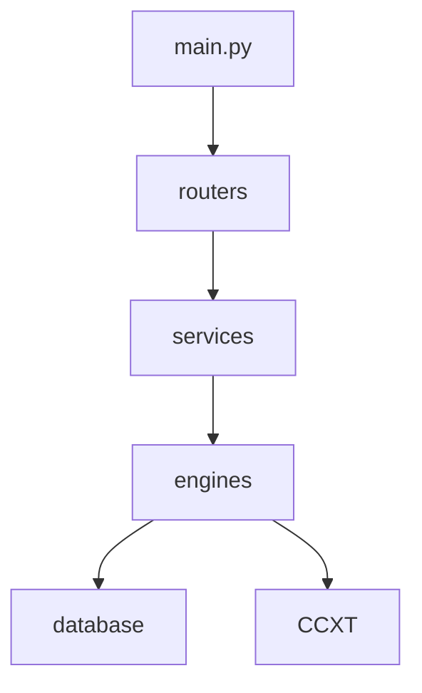

# Dependency Graph

## Identified Architecture Duplications
- **Duplicate execution paths**: backend.execution_engine vs core.execution_engine
- **Duplicate websocket paths**: api_ws vs backend.ws
- **Duplicate auth flows**: backend.auth vs routers.auth
- **Duplicate strategy engines**: core.strategy vs backend.strategy
- **Duplicate execution engines**: backend.execution vs core.execution
