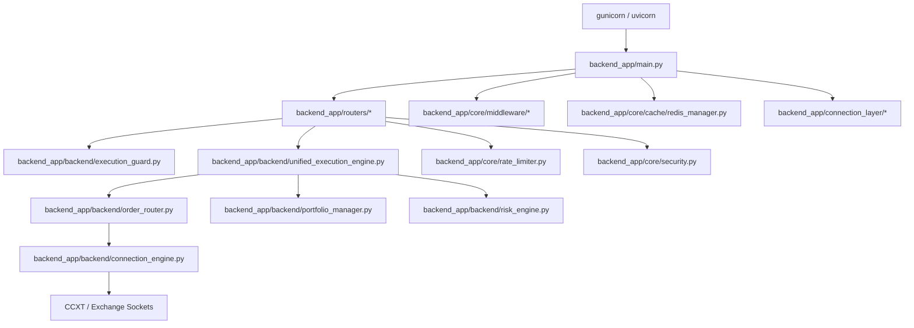
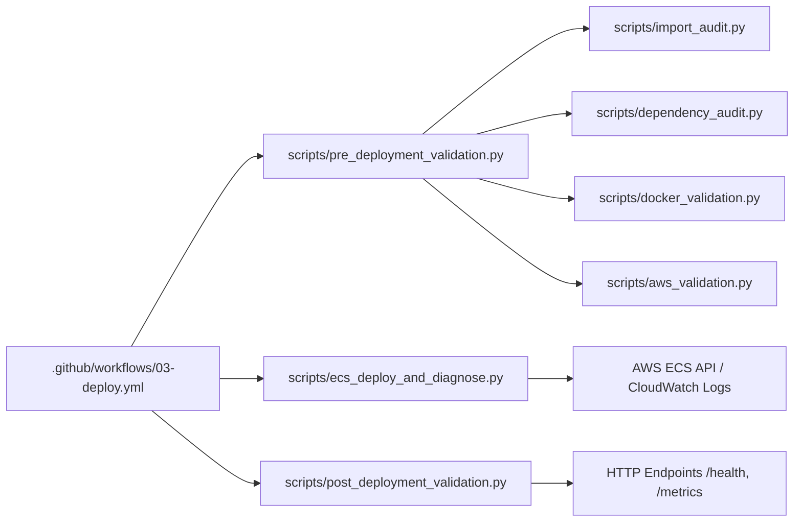

# Repository Module & Service Dependency Graph

This document details the architectural module dependency graph of the `vyomquant` backend repository.

---

## 1. Top-Level Entrypoint Hierarchy

---

## 2. Inbound & Outbound Dependency Mapping

### A. FastAPI Application Core (`backend_app/main.py`)
- **Inbound Dependents** (Invoked by):
  - `gunicorn` / `uvicorn` startup command (`CMD ["./startup.sh"]`)
  - `scripts/pre_deployment_validation.py` (`test_fastapi_startup()`)
  - `tests/test_full_system.py`
- **Outbound Dependencies** (Imports):
  - `backend_app.routers` (15 modules: `health`, `auth`, `orders`, `strategies`, `library`, `market_data`, `risk`, `backtest`, `copilot`, `telemetry`, `tenant`, `webhooks`, `analytics`, `portfolio`, `dag_tasks`)
  - `backend_app.core.cache.redis_manager`
  - `backend_app.core.rate_limit`
  - `backend_app.core.middleware`

---

### B. Execution Engine (`backend_app/backend/unified_execution_engine.py`)
- **Inbound Dependents**:
  - `backend_app/routers/orders.py`
  - `backend_app/routers/strategies.py`
  - `backend_app/routers/dag_tasks.py`
  - `tests/test_execution_correctness.py`
- **Outbound Dependencies**:
  - `backend_app.backend.execution_guard`
  - `backend_app.backend.order_router`
  - `backend_app.backend.risk_engine`
  - `backend_app.core.cache.redis_manager`
  - `backend_app.connection_layer.database`

---

### C. Automated Deployment & Diagnostics Engine (`scripts/`)

---

## 3. Storage & Cache Dependency Reachability

- **PostgreSQL / Supabase Database**:
  - Reached via `backend_app/connection_layer/database.py` and SQLAlchemy ORM.
  - Required secrets: `/vyomquant/production/DATABASE_URL`, `/vyomquant/production/SUPABASE_SERVICE_ROLE_KEY`.
- **Redis Cache & Cluster**:
  - Reached via `backend_app/core/cache/redis_manager.py` shared connection pool.
  - Used for rate limiting, portfolio cache, order idempotency keys, and pub/sub streaming.
